# API Authorization

Last Modified: 2025-05-02 | Code: APIAUT

## Introduction to API Authorization

Shopmetrics utilizes oAuth 2.0 to secure API resources. For integration with 3rd party applications, we use the Client Credentials Grant Flow, which is the oAuth 2.0 best practice for that scenario. In this document we explain the following:

- Client Credentials Grant Flow Basics
- Generating API Access Token
- Creating and Managing API Client Credentials (Create, Activate, Deactivate, List)

## Client Credentials Grant Flow Basics

The **Client Credentials Grant Flow** authorization requires the retrieval of the access token from the Authorization API. This access token will be used for authentication when calling the Query API resources.

To create API Client Credentials and implement a Client Credentials Grant Flow, you need to do the following:

1. Create a client user account in Shopmetrics and assign the appropriate client data access permissions. Alternatively, you can use an existing user account. However, we strongly recommend creating a new user account.
2. Register new API Client Credentials with the Client ID and Secret. For more details see the section below: “Creating and Managing API Client Credentials”.

Once you have API Client Credentials, you can use the Authorization API to retrieve your access token and use it to authenticate and make requests to the Shopmetrics Query API endpoint:

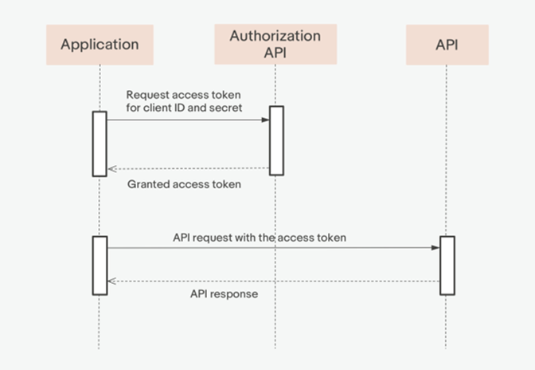

Source: <https://developer.ebay.com/api-docs/static/oauth-client-credentials-grant.html>

## Generate API Access Token

The API access token is needed to authorize the subsequent API calls. To generate the API access token, you need to send a request to the oAuth Authorization API with the following parameters:

- client\_id
- client\_secret
- grant\_type - the value for this parameter should always be "**client\_credentials**"

And to the following API endpoint: /oauth/connect/token

**NOTE: More information about the "client\_id" and "client\_secret" parameters can be found in the section "Create API Client Credentials".**

**Postman API Client:**

*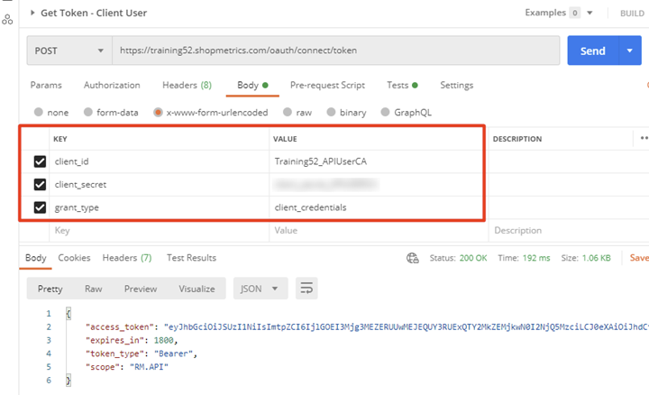*

Once the request is executed, the access token is generated, as seen below:

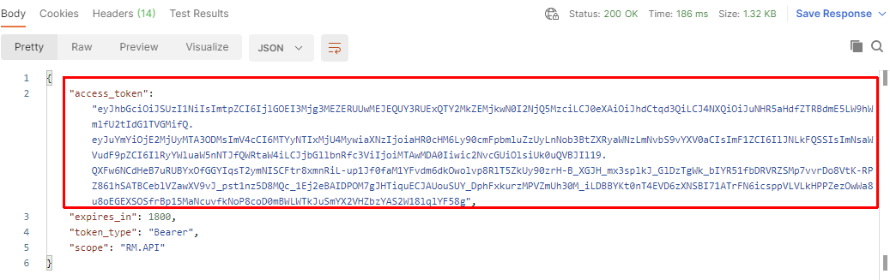

**NOTE: The access token has an expiration time. By default the expiration time is set to 1800 seconds. You can see the expiry time in the result of the request in JSON format, as show below:**

**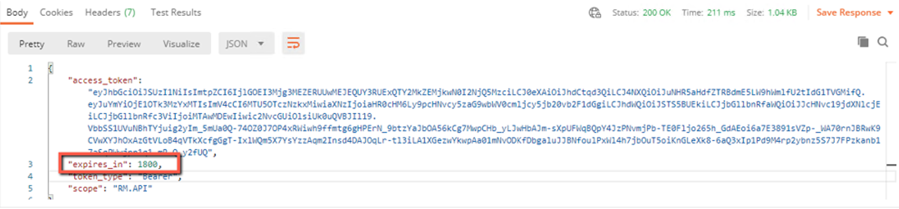**

**PowerShell code:**

```
#Request Object to be used by the REST Request:
$GetTokenRequestObject = @{
    Uri         = "https://training52.shopmetrics.com/oauth/connect/token";
    Method      = "POST";
    Body        = @{client_id="Training52_APIUserCA"; client_secret="client_secret"; grant_type="client_credentials"};
};

#REST Request to get the Access Token and assigned to a variable:
$GetTokenResponse= Invoke-RestMethod @GetTokenRequestObject;
$AccessToken = $GetTokenResponse."access_token";

#Print Access Token to check if it is successfully retrieved:
Write-Host $AccessToken;
```

## Using the API Access Token

In order to make a request to the Shopmetrics Query API endpoint you have to use the API Access Token for authentication. In Postman API Client go to the Authorization tab of the request and select "Bearer Token" for the Type. Then copy the generated token and paste it in the Token field of the request's Authorization tab as shown below.

API v3 example:

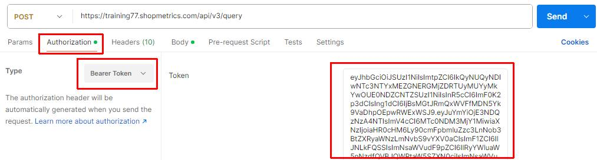

API v2 example:

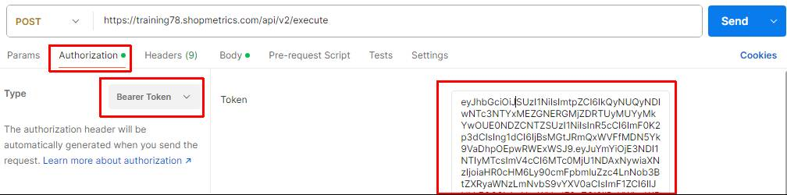

## Creating and Managing API Client Credentials

**NOTE: The instructions below are intended for administrator users only. The Shopmetrics API v2 Authorization — Client Credentials interface is designed to only manage client credentials required for using the API. Once set up by an administrative user in the Shopmetrics application, API credentials can be provided to the technical staff in charge of the API implementation.**

You need API Client Credentials to implement the Client Credentials Authorization Grant Flow.

To create API Client Credentials, you need to do the following:

1. Create a user account in Shopmetrics and assign the appropriate data access permissions.  
   **NOTE: The user account should have a Restricted security role. For more information about the security roles and granting restricted access to the system refer to the article "Grant Restricted Access to the System" (short code: GRAS).**
2. Create new API Client Credentials, associated with the Shopmetrics user account.

You can manage the API Client Credentials in Shopmetrics via the **Shopmetrics API v2 Authorization — Client Credentials** interface, located in Administration -> Tools and Settings -> Site Settings -> Other.

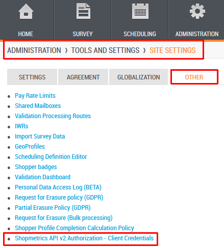

### List All API Client Credentials

Once opened, the Shopmetrics API v2 Authorization — Client Credentials interface lists all API Client Credentials required for using the API:

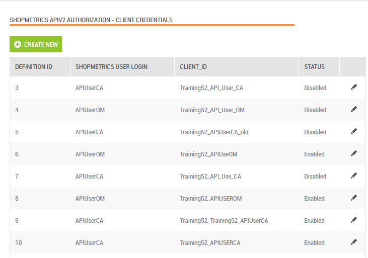

### Create API Client Credentials

Create new API Client Credentials by using the **"Create New"** button of the Shopmetrics API v2 Authorization — Client Credentials interface.

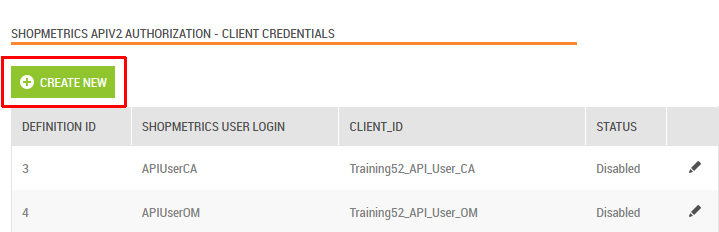

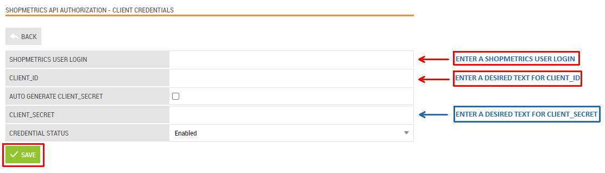

1. In the input field "**Shopmetrics User Login**", enter the Login of the Shopmetrics user account that will be associated with the new API Client Credentials.
2. In the input field "**Client\_Id**", enter your desired text for the Client\_ID.
3. In the input field "**Client\_Secret**", enter your desired text for the Client\_Secret.  
   **NOTE: To auto-generate a client’s Secret, check the checkbox for the option “Auto Generate Client\_Secret”.**

After filling in the input fields, save the changes with the "**Save**" button.

**NOTE: The API Client Credentials are created after you click on the Save button. Note that t****he "Client\_Id" is automatically generated by adding your Shopmetrics Application Name as a prefix to the value you have entered in the field.**

After the new Client Credentials are successfully created you can use them in the authorization request to generate an API access token as follows:

- The value from the input field "**Client\_Id**" should be used as the value for the parameter "**client\_id**" of the request.
- The value from the input field "**Client\_Secret**" should be used as the value for the parameter "**client\_secret**" of the request.

### Activate/Deactivate API Client Credentials

Activate or Deactivate API Client Credentials by using the **“Modify”** function of the Shopmetrics API v2 Authorization — Client Credentials interface.

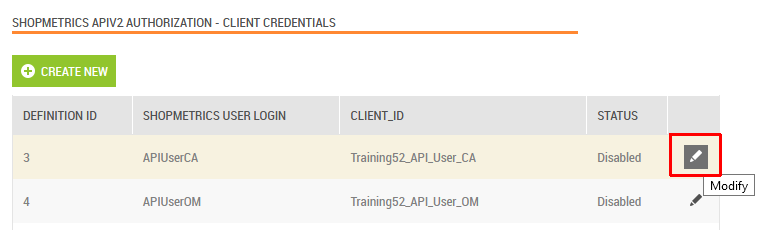

To Activate or Deactivate API Client Credentials choose **Enable** or **Disable** for the “Credential Status” option and save the changes with the "Save" button, as shown below.

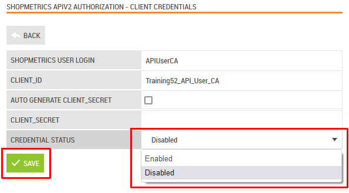
