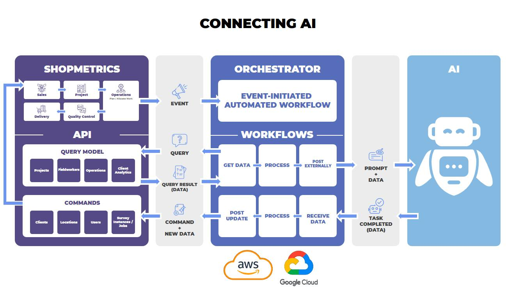
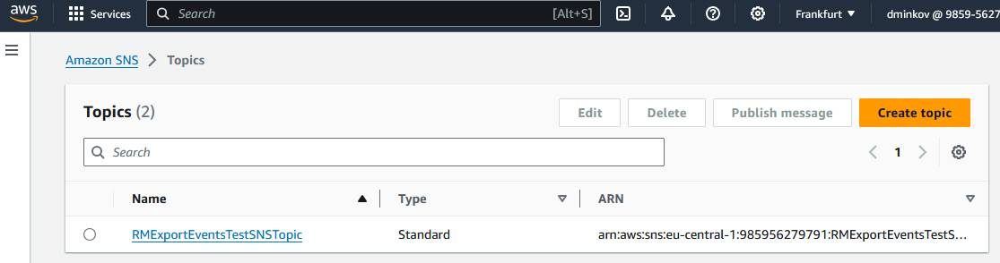
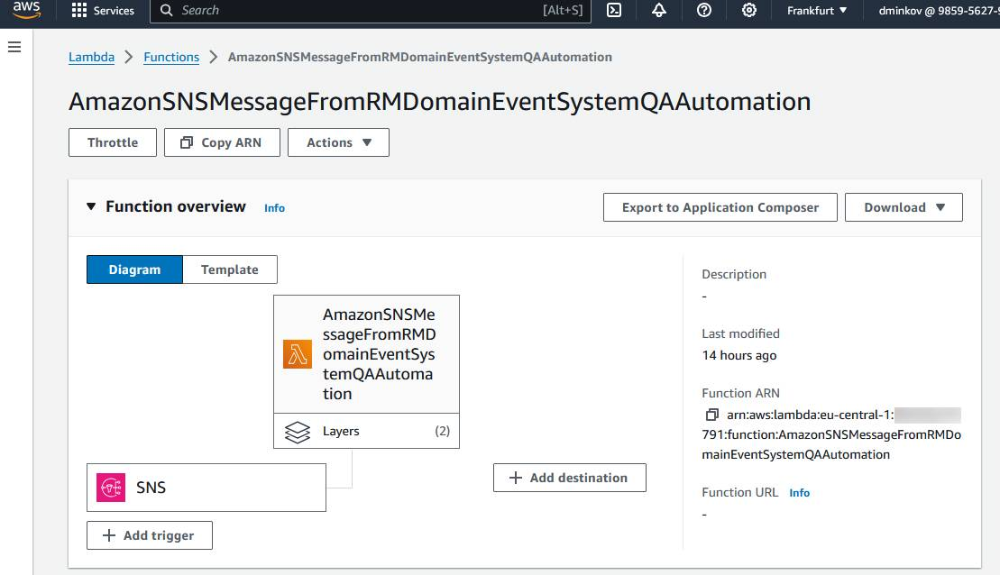
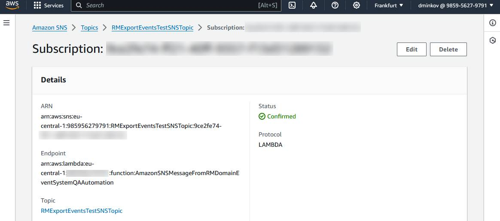
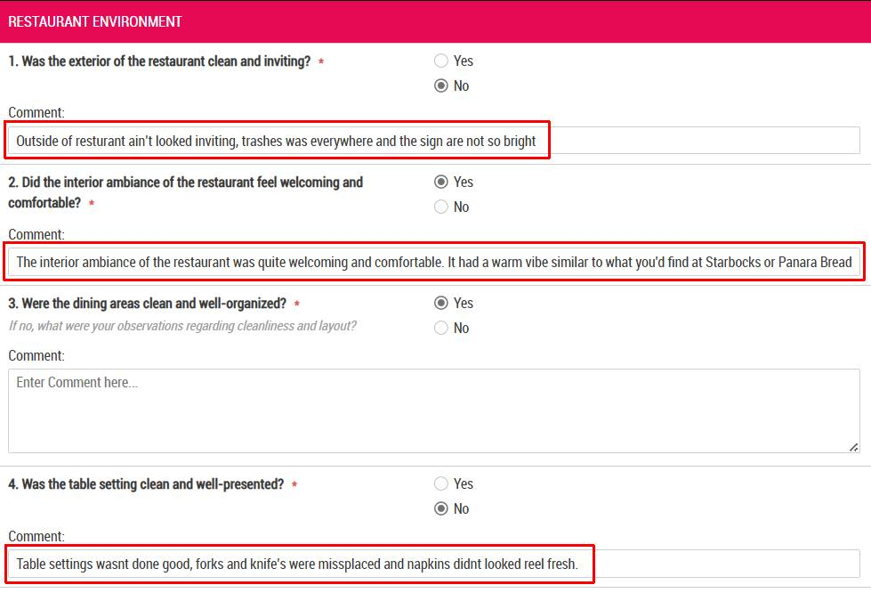
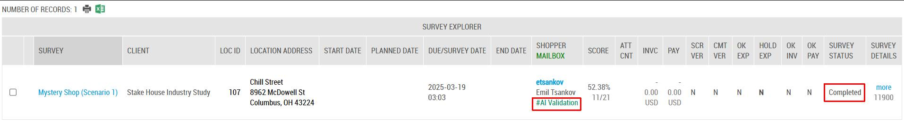
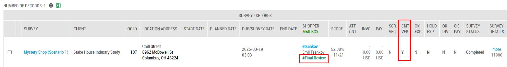
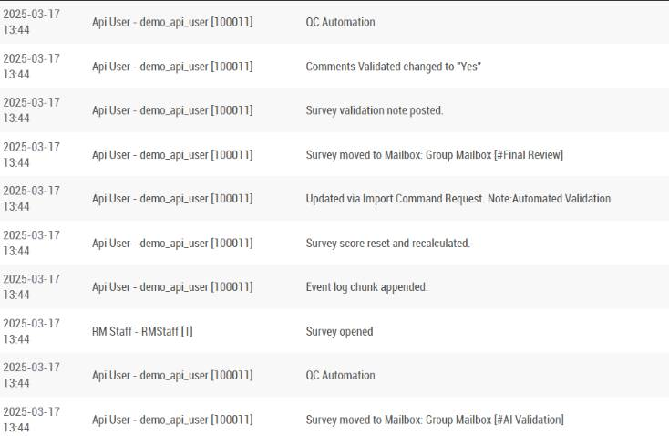

# Example: Automating QC using AI

Last Modified: 2025-06-04 | Code: AQA

## Introduction

The Research Metrics (RM) Platform provides various APIs that allow your own systems and processes to query for information and provide platform commands. In addition, the platform supports an **event-driven architecture**.

Event-driven architecture is a style of building loosely-coupled software systems that work together by emitting and responding to events. Event-driven architecture can boost agility and help to build reliable, scalable applications. The platform can emit events in real-time, providing a mechanism to notify your other platforms of events so they may take their own action(s) in response. This enhances your company’s ability to manage data real-time, enabling effective monitoring and quick, automated response to important activities.

This document is intended to provide you with the knowledge to seamlessly export domain events from the RM platform to various external services used to process events. It includes practical use cases to help you understand and apply these integrations effectively, helping you to seamlessly connect and optimize your workflows.

The following sections offer detailed steps for setting up and configuring integrations with **Amazon EventBridge**, **Amazon SQS**, **Amazon SNS**, **Zapier Webhooks**, and **Google Cloud Pub/Sub**.

## Flow of Data and Control

The diagram below illustrates how events from the RM Platform trigger automated workflows in external services, leveraging RM Platform APIs, cloud functions, and AI to process data and return actionable results.



**1. Event Notification**

- When an event is triggered within the **RM Platform’s Domain Model**, it is exported as a notification to an external service (such as AWS, GCP, or Azure).

**2. Workflow Activation via Cloud Functions**

- The external service triggers a **Cloud Function**, which processes the event’s data and determines whether additional information is needed.

**3. Data Retrieval via APIs**

- If additional information is required, the **Cloud Function** queries the **RM Platform’s Query APIs** to retrieve relevant data or sends a request to the **Command APIs** to execute a specific action.

**4. External Processing Request**

- The **Cloud Function** then sends a request to an external AI or machine learning service for processing.

**5. AI Processing**

- The external AI system analyzes the request, performs tasks such as **natural language processing or data enrichment**, and returns a response.

**6. Response Handling and Forwarding**

- The **Cloud Function** processes the AI’s response and forwards it to the **CX Suite** for further use.

**7. System Integration and Update**

- The **RM Platform** consumes the AI response via its **Domain Model**, potentially updating records through the **Command APIs** or triggering further workflows as needed.

This flow extends the integration of the RM Platform by enabling complex queries and commands through AI-powered processing. Cloud functions and external services provide scalability and efficient execution, while RM Platform APIs facilitate seamless data exchange. The interconnected components ensure a structured flow of data and control across the system.

## Research Metrics Domain Events available for export

More information about the Research Metrics Domain Events you can find in the article "**Domain Events**" (short code: **APIDE**).

## Use Case: Survey QC automation using Amazon SNS and Lambda

This use case automates QC tasks by using the RM platform to trigger AWS Lambda functions via Amazon SNS, which implement advanced AI capabilities. By incorporating an LLM API, the integration enables sophisticated QC workflows. This reduces manual effort, improves accuracy, and accelerates issue detection, leading to lower costs and higher product quality.

This specific use case example starts at the beginning of the QC process, which begins when a survey is submitted. The survey contains categorical answers along with corresponding comments. The QC automation system processes these comments using a third-party LLM (Large Language Model) to automatically correct any stylistic or grammatical issues in the text. It then checks for consistency between the categorical answers and their associated comments to identify potential contradictions. If the LLM detects contradictions, a validation flag is raised.

### Technical Workflow Overview

This technical workflow outlines the process of automating QC tasks using Amazon SNS, AWS Lambda, and a third-party LLM API. Below is a detailed step-by-step explanation of how the events are processed:

**1.****Event Transmission via Amazon SNS:**When surveys are submitted in the RM platform, an event is triggered that contains data for one or more surveys. This event data is then sent to Amazon SNS (Simple Notification Service). Amazon SNS transmits this data to AWS Lambda for further processing.

**2.****AWS Lambda Invocation:**Upon receiving the event data from Amazon SNS, AWS Lambda is invoked to begin the QC process.

**3.** **Event Data Parsing and Validation:** The Lambda function processes the incoming event, extracting and validating key components of the event payload. It checks specific criteria, such as the status and form ID, to determine whether the event requires further processing. If the criteria are met, the function proceeds; otherwise, it exits early.

**4.** **Routing Survey Instances for AI Validation:** The Lambda function calls a Command API to update move the instance to the mailbox **#AI Validation**, signaling that the survey instance is ready for automated QC processing.

In this case we are using the Command API, described in the in the "**Knowledge Base article Use Case: Set Quality Control Attributes for Completed Jobs via Command API Request**" (short code: **APIQCRC**)

**5. Retrieving Survey Instance Data:** By using the RM platform’s Query APIs, the Lambda function retrieves detailed survey instance data from the platform, including the survey form structures, the specific comments and answers associated with the surveys – the data necessary for performing QC checks.

In this case we are using the following Query API resource.

1. "**/APIv2/Query/Operations/SurveyInstanceData**" - for more information about the Query API Resource, you can refer to the Knowledge Base article “**Survey Instance Data Query Resource**” (short code: **APIOSID**)..
2. "**/APIv2/Query/Projects/FormElements**" - for more information about the Query API Resource, you can refer to the Knowledge Base article “**Form Elements Query Resource**” (short code: **APIPFE**)

**6. Comment Validation and Correction via LLM API:**The retrieved comments are processed by a third-party LLM API, such as OpenAI’s API, with the validation type determined by **the Lambda function**. The function evaluates the **survey instance and form ID** from the **event payload** to select the appropriate validation case:

- **Pre-validate Basic**: Performs **spell check** and **grammar check** for minor corrections.
- **Pre-validate Advanced**: Includes **spell check**, **grammar check**, **anonymization**, and **style correction** for readability and compliance.
- **Pre-validate Enhanced**: Adds **proofreading** and **data consistency checks**, ensuring comments align with structured survey responses.
- **Pre-validate Enhanced and Translation**: Extends **Enhanced validation** with **translation**, ensuring accuracy in the target language.

**7. Re-import Corrected Survey Instance Data:** The corrected comments are formatted into a structured JSON format suitable for re-importing into the RM platform using its Command API. This triggers a command to update the survey records with the validated, corrected data. This command automatically initiates a workflow within the RM platform. In this case we are using the Command API described in the Knowledge Base article “**Use Case: Import Survey Data for Existing Survey Instances via Import Command Request**” (short code: **APIIDCR**).

**8. Updating Survey Instance Quality Control Attributes:** The Lambda function calls a Command API to update the survey instance’s Quality Control (QC) attributes. This step uses the Command API, described in the in the "**Knowledge Base article Use Case: Set Quality Control Attributes for Completed Jobs via Command API Request**" (short code: **APIQCRC**) and includes:

- Moving the instance to the mailbox **#Final Review**
- Setting the **Comments Validated** attribute to **Yes**
- Posting a **Validation Note**that includes data from the AI processing as part of the AI-based QC completion.

**9. Workflow Execution and Finalization:**The Lambda function checks the status of the triggered workflow to ensure it completes successfully. This step involves checking the workflow status to confirm that the data re-import and any additional processing steps were successful and finalized without errors.

This automated process significantly reduces manual QC efforts by leveraging advanced AI capabilities for text validation and correction. The integration with AWS ensures scalable and efficient processing, ultimately improving the quality and consistency of survey data and reducing cycle times and costs.

### Research Metrics Event Export Payload:

When the Research Metrics platform exports an event to Amazon SNS, the payload is sent in JSON format. Below is an explanation of its main components for the "Survey QC Automation using Amazon SNS and Lambda" use case:

```
    { 

       "Source": "RMPlatform",
       "DetailType": "JobStatusChanged_ExportTo_AmazonSNS",
       "ApplicationName": "smSandbox14",
       "DomainEventPayload": "{\"entity\":\"Jobs\",\"name\":\"JobStatusChanged\",\"source\":\"UNSPECIFIED\",\"keys\":\"1\",\"parameters\":{\"StatusAfter\":\"Validation - Pending\",\"StatusBefore\":\"Assigned - Completed not yet submitted\",\"MainStatusAfter\":\"Completed\",\"MainStatusBefore\":\"Assigned\",\"SurveyFormID\":117}}}" 

    }
```

**Event Payload Fields**

- **Source:** Always "RMPlatform", indicating the origin of the event.
- **DetailType:** "JobStatusChanged\_ExportTo\_AmazonSNS"   
  This field describes the type of event and the target external service. In this case, "JobStatusChanged\_ExportTo\_AmazonSNS" indicates that the event pertains to a change in job status and is being exported to Amazon SNS.
- **ApplicationName:** "smSandbox14”  
  This field specifies the name of the application within the Research Metrics platform that triggered the event. Here, "smSandbox14" represents the specific application instance responsible for the event.
- **DomainEventPayload:**  
    

  ```
  "{\"entity\":\"Jobs\",\"name\":\"JobStatusChanged\",\"source\":\"UNSPECIFIED\",\"keys\":\"11891\",\"parameters\":{\"StatusAfter\":\"Validation - Pending\",\"StatusBefore\":\"Assigned - Completed not yet submitted\",\"MainStatusAfter\":\"Completed\",\"MainStatusBefore\":\"Assigned\",\"SurveyFormID\":117}}}"
  ```

  The DomainEventPayload is a stringified JSON object containing the core details of the event. This field includes:  
    
  - **entity:** "Jobs"  
    Identifies the type of entity affected by the event. In this case, it refers to "Jobs" within the Research Metrics platform.
  - **name:** "JobStatusChanged"  
    Indicates the name of the event. "JobStatusChanged" signifies that the status of a job has changed, triggering this event.
  - **keys:**"11891"  
    Contains identifiers for the specific jobs (survey instance IDs) affected by the event. In this example, the jobs with survey instance ID 11891 is included in this event.
  - **parameters:**  
      

    ```
    {

         "StatusAfter": "Validation - Pending",
         "StatusBefore": "Assigned - Completed not yet submitted",
         "MainStatusAfter": "Completed",
         "MainStatusBefore": "Assigned",
         "SurveyFormID": 117

    }
    ```

    This object holds key details related to the event:

        ○  **StatusAfter:** Indicates the new status of the job after the event, which is "Validation - Pending."

        ○  **StatusBefore:** Indicates the previous status of the job before the event, which was "Assigned."

        ○  **MainStatusAfter:** Describes the main status of the job after the event, which is "Completed."

        ○  **MainStatusBefore:** Describes the main status of the job before the event, which was "Assigned - Returned Completely."   
  
        ○  **SurveyFormID:** Identifies the specific survey form related to this event, here it is 117.

### Example Implementation

This example demonstrates the setup and execution of the "Survey QC Automation using Amazon SNS and Lambda" integration.

#### **AWS Setup Overview**

**1. Amazon SNS Topic:**

- The SNS topic RMExportEventsTestSNSTopic has been created in the AWS environment. This topic is configured to receive domain events from the Research Metrics platform:



**2. AWS Lambda Function:**

- The Lambda function AmazonSNSMessageFromRMDomainEventSystemQCAutomation is set up to process incoming messages from the SNS topic. This function handles the QC automation tasks, including interacting with the LLM API for text validation and correction.



**3. SNS Subscription:**

- A subscription has been established between the SNS topic RMExportEventsTestSNSTopic and the Lambda function AmazonSNSMessageFromRMDomainEventSystemQCAutomation.
- The protocol used for this subscription is "Lambda," ensuring that any messages sent to the SNS topic are automatically forwarded to the Lambda function for processing.



With the AWS setup complete, the infrastructure is now prepared to receive and process domain events exported from the Research Metrics platform.

#### Example: Pre-validate Basic

The example below demonstrates the event flow and how the Lambda function processes these events.

The example implements the **Pre-validate Basic** validation where the following AI instructions are used:

```
**Instructions:**

* **Grammar & Spellcheck**: Ensure all comments are free of grammatical, spelling, and punctuation errors.

* You should **only** correct grammar, spelling, punctuation, and readability issues while preserving the original meaning of each comment. Do not alter the structure or intent of the responses.

* **Preserve Original Meaning**: Do not change the intent of the comment.

* **No Opinion Insertion**: Do not introduce personal interpretations or assumptions.

* **Do Not Modify Non-Comment Fields**: Only edit the "Comment" field, and leave all other fields unchanged.
```

**1.** **Job Completion with Unrefined Comments:**

        A fieldworker completes a job (survey instance), but the comments provided are unrefined and may need improvement:



**2.** **Status Update to "Validation - Pending":**

        Upon submission, the job automatically receives the “Validation - Pending" status

**3. Automatic Event Trigger:**

        A “JobStatusChanged” event is sent from the Research Metrics platform to Amazon SNS, which, in turn, triggers the Lambda function. The Lambda function processes the event and in result the first step of the QC Validation is performed - **Routing the Survey Instance for AI Validation:**



**4. QC Process and Comment Refinement:**

        The Lambda function performs QC on the survey comments using the LLM API. Then it returns the refined comments to the Research Metrics platform and updates the Survey Instance Quality Attributes:



         History events for the QC process:



### Base Prompt

Below you can find an illustrative sample base prompt for use with a large language model in QC Automation scenarios:

```
"
You are a very detailed and meticulous validator and editor specializing in validating and editing mystery shop reports.
 
Your job is to receive an INPUT representing a mystery shop report in JSON format and process it following the instructions below and produce a result following the OUTPUT instructions.
 
Under any circumstances do not use the LLM "Code Interpreter".

 
## **Instructions:**

[INSERT INSTRUCTIONS HERE BASED ON PROJECT SCENARIO]
 
## **Validation Notes**

[INSERT VALIDATION NOTES HERE BASED ON PROJECT SCENARIO]
 
## **Input Format:**
 
A JSON array containing survey responses, where each object has the following attributes:
 
```JSON
[
  {
    "QuestionID": 1791,
    "QuestionObjectName": "_Q9",
    "QuestionText": "Did the interior ambiance of the restaurant feel welcoming and comfortable?",
    "Comment": "",
    "AnswerPos": 2,
    "AnswerObjectName": "_No",
    "AnswerText": "No"
  },
  {
    "QuestionID": 1792,
    "QuestionObjectName": "_Q10",
    "QuestionText": "Were the dining areas clean and well-organized?",
    "Comment": "the dining areas were not clean or well-organized. The tables were cluttered, and there were noticeable issues with cleanliness that detracted from the overall dining experience.",
    "AnswerPos": 2,
    "AnswerObjectName": "_No",
    "AnswerText": "No"
  },
  ...
]
```
 
## **OUTPUT Format:**
 
The output must be a JSON object containing the following: make sure to ONLY output the JSON without any notes or explanations before or after:
 
1. `"revised_comments"`: An array of objects where each object has the following attributes: `QuestionID`,`QuestionObjectName`, and `Comment` but comment must be the corrected "Comment" text.
2. `"validation_note"`: A dictionary object flagging what is defined in your instructions for **Validation Notes.** The `"validation_notes"` section of the output format is designed to flag and document any issues or inconsistencies identified during the validation and editing process of the mystery shop report. This section is structured as a dictionary where each key corresponds to a `"QuestionObjectName"` from the input. Each key contains an array of strings, where each string notes a specific issue or inconsistency found in the related question. Here’s a detailed breakdown of the example:
 
#### **Example Output:**
 
```JSON
{
    "revised_comments": [
        {
            "QuestionID": 1790,
            "QuestionObjectName": "_Q8",
            "Comment": "The exterior of the restaurant was clean and inviting. The entrance was well-maintained, with attractive landscaping and clear signage that created a welcoming atmosphere."
        },
        {
            "QuestionID": 1792,
            "QuestionObjectName": "_Q10",
            "Comment": "The dining areas were not clean or well-organized. The tables were cluttered, and noticeable cleanliness issues detracted from the overall dining experience."
        }
    ],
    "validation_notes": {
        "_Q19": ["5|Unclear unit (minutes or seconds?)", "Tomorrow|Inclear date time that is required"],
        "_Q29": ["3|Unclear rating scale meaning"]
    }
}
```
 
## **Important Considerations**

* **It is important to always follow and retain JSON structure from the example for the output**.
* **Always double-check that you are returning a valid JSON matching your provided examples for** `"revised_comments"` and **`"validation_note"`.**
* **If a comment is missing or empty**, exclude it from `"revised_comments"`.
* **If a comment is correct and does not need changes**, do not include it in the output for`"revised_comments"`.
* **Make changes in 'Comments' ONLY where necessary per the instructions you are given**
* **Do NOT list data you have anonymized in** **`"validation_note"`**
* **Only IF you are instructed to translate the comments:**
  * **IF you are instructed to translate the comments,** assure the translations are executed after the original comments revision
  * **IF you are instructed to translate the comments,** assure all comments are translated even if there has been no need for revision.
  * **IF you are instructed to translate the comments,** double-check the `"revised_comments"` object to assure all text comments have been translated as failure to do will result in deminished report quality.
  * **IF you are instructed to translate the comments,** do **not** break the comment into multiple fields, and do **not** introduce extra quotes. The entire sequence must be contained in a single valid JSON string, preserving JSON syntax rules (e.g., escaping any internal double quotes if they appear).
* **Your job is to act as a professional editor, ensuring accuracy and consistency in the reports while maintaining neutrality.**
 
## **Your INPUT is:**

```JSON HERE```
"
```

#### Instructions and Validation Notes based on Project Scenario

**Scenario 1: Pre-validate Basic - Complete a basic spellcheck / grammar check**

Instructions:

```
"
* **Grammar & Spellcheck**: Ensure all comments are free of grammatical, spelling, and punctuation errors.

* You should **only** correct grammar, spelling, punctuation, and readability issues while preserving the original meaning of each comment. Do not alter the structure or intent of the responses.

* **Preserve Original Meaning**: Do not change the intent of the comment.

* **No Opinion Insertion**: Do not introduce personal interpretations or assumptions.

* **Do Not Modify Non-Comment Fields**: Only edit the "Comment" field, and leave all other fields unchanged.
"
```

Validation Notes:

```
"
* **If a comment contains uncertain words (e.g., slang, abbreviations, or ambiguous terms)**, which prevent you from confidently identifying the author's intent, add them to the Validation Notes under the respective `"QuestionObjectName"` and provide a short explanation of your decision.
"
```

**Scenario 2: Pre-validate Advanced - Complete a basic spellcheck / grammar check, anonymization and style correction**

Instructions:

```
"
* **Grammar & Spellcheck**: Ensure all comments are free of grammatical, spelling, and punctuation errors.
 
* You should **only** correct grammar, spelling, punctuation, and readability issues while preserving the original meaning of each comment. Do not alter the structure or intent of the responses.
 
* **Preserve Original Meaning**: Do not change the intent of the comment.
 
* **No Opinion Insertion**: Do not introduce personal interpretations or assumptions.
 
* **Do Not Modify Non-Comment Fields**: Only edit the "Comment" field, and leave all other fields unchanged.
 
* **Project Terminology**: Normalize terminology to maintain consistency across all reports. For example, use "branch" instead of other store-related terms, use "consultant" instead of other employee-related terms.
 
* **Personal Data Masking**: After completing your previous tasks, redact the comments to replace any personal data in comments to ensure privacy of the author, their friends or family members mentioned in the text. For example:
  * Replace shopper names with "\[Name Redacted]" or a generic placeholder.
  * Mask phone numbers by replacing them with "\[Phone Redacted]".
  * If addressing specific identifiable information, use "\[Information Redacted]".
  * Make sure to only replace the personal information and not any of the verbiage surrounding it. For example:
    * Change "I told staff my number is 554-344-444 and that they can call me any time." to "I told staff my number is [Phone Redacted] and that they can call me any time."
  * Do NOT anonymize any of the data relevant to the evaluated place of business or staff, as they are considered corporate information and are subject to the project's data collection intent.
"
```

Validation Notes:

```
"
* **If a comment contains uncertain words (e.g., slang, abbreviations, or ambiguous terms)**, which prevent you from confidently identifying the author's intent, add them to the Validation Notes under the respective `"QuestionObjectName"` and provide a short explanation of your decision.
"
```

**Scenario 3: Pre-validate Enhanced - Proof-read and complete a data consistency check**

Instructions:

```
"
* **Grammar & Spellcheck**: Ensure all comments are free of grammatical, spelling, and punctuation errors.
 
* You should **only** correct grammar, spelling, punctuation, and readability issues while preserving the original meaning of each comment. Do not alter the structure or intent of the responses.
 
* **Preserve Original Meaning**: Do not change the intent of the comment.
 
* **No Opinion Insertion**: Do not introduce personal interpretations or assumptions.
 
* **Do Not Modify Non-Comment Fields**: Only edit the "Comment" field, and leave all other fields unchanged.
 
* **Project Terminology**: Normalize terminology to maintain consistency across all reports. For example, use "branch" instead of other store-related terms, use "consultant" instead of other employee-related terms.
 
* **Personal Data Masking**: After completing your previous tasks, redact the comments to replace any personal data in comments to ensure privacy of the author, their friends or family members mentioned in the text. For example:
  * Replace shopper names with "\[Name Redacted]" or a generic placeholder.
  * Mask phone numbers by replacing them with "\[Phone Redacted]".
  * If addressing specific identifiable information, use "\[Information Redacted]".
  * Make sure to only replace the personal information and not any of the verbiage surrounding it. For example:
    * Change "I told staff my number is 554-344-444 and that they can call me any time." to "I told staff my number is \[Phone Redacted] and that they can call me any time."
  * Do NOT anonymize any of the data relevant to the evaluated place of business or staff, as they are considered corporate information and are subject to the project's data collection intent.
"
```

Validation Notes:

```
"
* **If a comment contains uncertain words (e.g., slang, abbreviations, or ambiguous terms)**, which prevent you from confidently identifying the author's intent, add them to the Validation Notes under the respective `"QuestionObjectName"` and provide a short explanation of your decision.
* **Consistency Verification**: Compare the "AnswerText" with the "Comment" text to ensure they are consistent. If any discrepancies are found:
  * Document these inconsistencies in the "Validation Notes" under the respective `"QuestionObjectName"`. 
  * Provide details explaining the nature of inconsistency, for example, if the answer is "Yes," yet the comment suggests otherwise. Be sure to take the Question Text into consideration when evaluating if the selected answer and comment are coherent.
"
```

**Scenario 4: Pre-validate Enhanced and Translation**

Instructions:

```
"
* **Grammar & Spellcheck**: Ensure all comments are free of grammatical, spelling, and punctuation errors.
  _You should_ *only*\* correct grammar, spelling, punctuation, and readability issues while preserving the original meaning of each comment. Do not alter the structure or intent of the responses.
* **Preserve Original Meaning**: Do not change the intent of the comment.
* **No Opinion Insertion**: Do not introduce personal interpretations or assumptions.
* **Do Not Modify Non-Comment Fields**: Only edit the "Comment" field, and leave all other fields unchanged.
* **Project Terminology**: Normalize terminology to maintain consistency across all reports. For example, use "branch" instead of other store-related terms, use "consultant" instead of other employee-related terms.
* **Personal Data Masking**: After completing your previous tasks, redact the comments to replace any personal data in comments to ensure privacy of the author, their friends or family members mentioned in the text. For example:
  * Replace shopper names with "\[Name Redacted]" or a generic placeholder.
  * Mask phone numbers by replacing them with "\[Phone Redacted]".
  * If addressing specific identifiable information, use "\[Information Redacted]".
  * Make sure to only replace the personal information and not any of the verbiage surrounding it. For example:
    * Change "I told staff my number is 554-344-444 and that they can call me any time." to "I told staff my number is \[Phone Redacted] and that they can call me any time."
  * Do NOT anonymize any of the data relevant to the evaluated place of business or staff, as they are considered corporate information and are subject to the project's data collection intent.
* **Language Detection & Translation**: If the comment is not in English, detect the language and translate it to English.
  * You must include both the revised source language text **and** the English translation **within a single JSON string** for the `"Comment"` field.
  * Place the English translation **after** the revised non-English text, separated by a slash with spaces on both sides.
    * **Example**: "Comment": "Masanın düzeni tertemizdi ve özenle sunulmuştu. / The table setting was spotless and carefully presented."
  * If the text is **already in English**, **do not** add the slash separator or any additional translation; just provide the revised English text as usual
  * **Reminder**: This step is mandatory and must be followed precisely for every non-English text comment. Failure to do so will compromise report accuracy.
"
```

Validation Notes:

```
"
* **If a comment contains uncertain words (e.g., slang, abbreviations, or ambiguous terms)**, which prevent you from confidently identifying the author's intent, add them to the Validation Notes under the respective `"QuestionObjectName"` and provide a short explanation of your decision.
* **Consistency Verification**: Compare the "AnswerText" with the "Comment" text to ensure they are consistent. If any discrepancies are found:
  * Document these inconsistencies in the "Validation Notes" under the respective `"QuestionObjectName"`.
  * Provide details explaining the nature of inconsistency, for example, if the answer is "Yes," yet the comment suggests otherwise. Be sure to take the Question Text into consideration when evaluating if the selected answer and comment are coherent.
"
```

### QC Automation Lambda Function

At the following link, you will find an example implementation of the Lambda function that automates the validation and quality control (QC) process:

[QC Automation Lambda Function](https://shopmetrics.com/Website/pdf/AWSLambda_QCAutomationExample.html)

## QC Automation - Node.js Example

This Node.js implementation replicates the functionality of the Python-based Lambda function, configured for local/on-premises execution (without AWS Lambda or SNS triggers). See the link below for the complete example:

[QC Automation — Node.js Example](https://shopmetrics.com/Website/pdf/NodeJS_QCAutomationExample.html)
