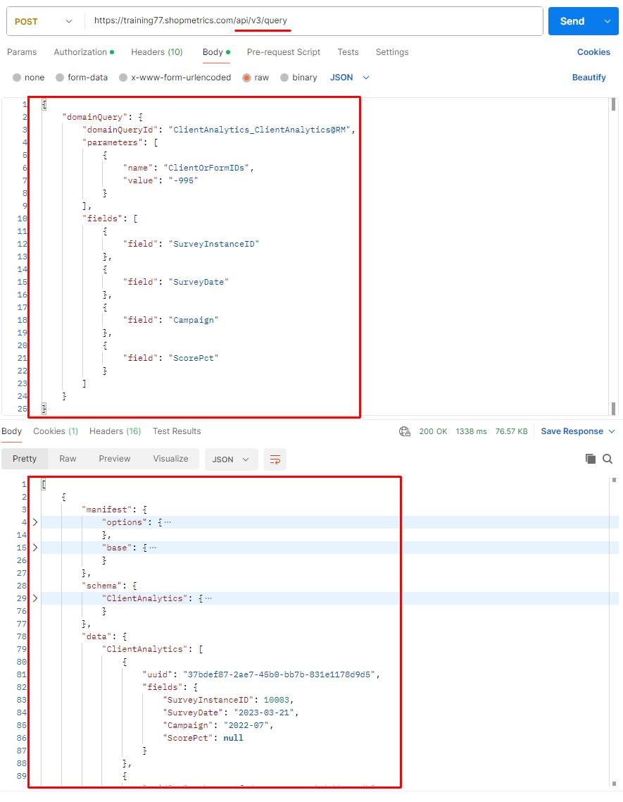

# Introduction to Query APIs

Last Modified: 2025-05-02 | Code: APIQV3

**NOTE: Due to ongoing development of the product, some images in this article may differ slightly from the current production implementation. For the latest list of full capabilities available, please see the "Query API Discovery" article, which explains how to see the latest capabilities available in production.**

Query APIs are designed to return data without modifying its state. In Shopmetrics, Query APIs v3 provide a dedicated endpoint that accepts structured JSON payloads, enabling you to define domain-specific queries, parameters, and fields. This approach allows for flexible, precise data extraction tailored to your analytical needs.

## API Authorization

To make a request to the Query API v3, you need a valid access token. For details on generating and using an access token, refer to the "API Authorization" article (short code: ***APIAUT***).

## Query API Request

The endpoint for Shopmetrics Query API v3 is: **/api/v3/query**

On the screenshot below you can find an example Query API v3 request:

### Query API Request Format

Query API v3 requests are structured as JSON payloads, providing a flexible and intuitive way to specify your query criteria and desired results. The JSON request for Query API v3 is built around a single "domainQuery" object with three main components:

| Property | Description |
| --- | --- |
| **domainQueryId** | A unique identifier specifying which domain query to run. Refer to the "Query API Discovery" article to see how to get the list of all available domain queries. |
| **parameters** | An array of objects with name-value pairs, typically used for filtering data, although it can include other criteria. |
| **fields** | An array of objects listing the specific data fields to be returned. This component gives you fine-grained control over the output, ensuring that only the relevant pieces of information are included in the response. |
| **include** | (**Optional**) An array of objects used to pull additional, related datasets in the query response alongside the primary data requested. |

This structure offers a clear and organized method to specify exactly which data you want to retrieve.

### Query API v3 Response Format

The response from the Query API v3 is returned as a JSON array. Each object within this array represents the result for a single query definition. In the table below you can find a summary of the main components found in each object within the Query API v3 response:

| Property | Description |
| --- | --- |
| **manifest** | Provides metadata about the executed query, including the base entity/aggregation, applied options (like pagination and ordering), included entities/interfaces, and total record counts. |
| **schema** | Describes the structure and data types of the result set. It details the fields returned for each entity/aggregation, their properties (like data type, length, precision) and interface information. |
| **data** | Contains the actual record data requested by the query. The structure mirrors the definition provided in the "schema" property, with records grouped under their respective entity/aggregation keys. |
