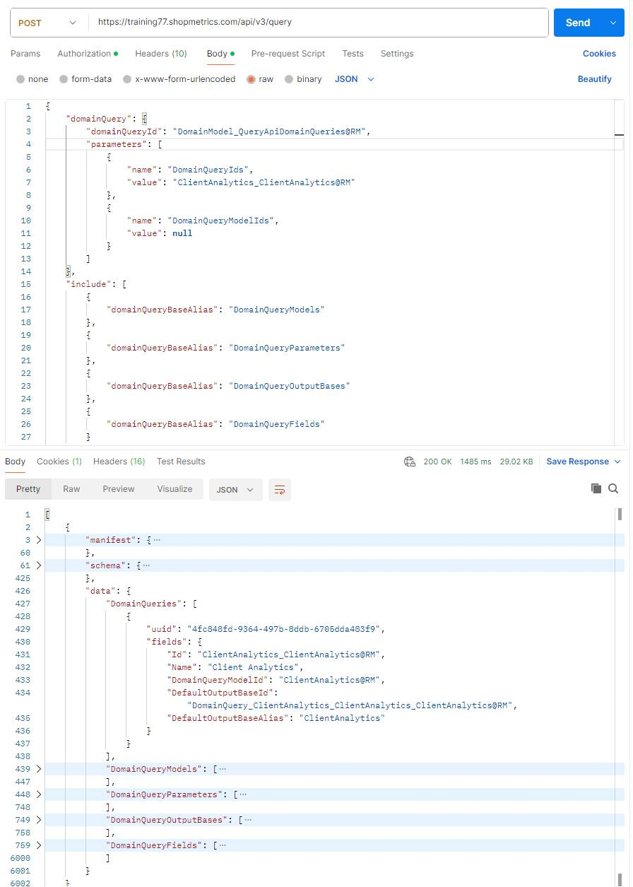

# Query API Discovery

Last Modified: 2025-05-02 | Code: APIQDIS

In API v3, data retrieval uses various predefined Domain Queries. A Domain Query is a predefined and reusable request for specific information contained within the platform. It simplifies data retrieval by allowing you to execute complex data requests using just a simple reference or name. This enables consistent access to structured data tailored for specific business needs without redefining the query each time.

## Domain Query Discovery

To see what domain queries are available in Shopmetrics API v3, you can simply request the **DomainModel\_QueryApiDomainQueries@RM** domain query via the **/api/v3/query** endpoint. It returns a response containing a list of all available domain queries, and detailed information about each.

JSON payload:

```
{
    "domainQuery": {
        "domainQueryId": "DomainModel_QueryApiDomainQueries@RM"
         },
    "include": [
       
        {
            "domainQueryBaseAlias": "DomainQueryModels"
        },
        {
            "domainQueryBaseAlias": "DomainQueryParameters"
        },
        {
            "domainQueryBaseAlias": "DomainQueryOutputBases"
        },
        {
            "domainQueryBaseAlias": "DomainQueryFields"
        }
    ]
}
```

### Request Payload Breakdown

| Property | Description |
| --- | --- |
| **domainQueryId** | Use "**DomainModel\_QueryApiDomainQueries@RM**", which retrieves a list of all discoverable domain queries for the authenticated account. |
| **parameters** | This is an optional instruction for filtering the results. You can specify the following parameters:   - **DomainQueryIds**: use this parameter when you want to filter the results for a specific Domain Query - **DomainQueryModelIds**: use this parameter when you want to filter the results for a specific Domain Model |
| **include** | This is an instruction the Query API to include additional related data collections with the main results. It accepts an array of "domainQueryBaseAlias" objects:   - **DomainQueryModels**: use this when you want to get the data models linked to each domain query. - **DomainQueryParameters**: use this when you want to get the input parameters supported by each domain query. - **DomainQueryOutputBases**: use this when you want to get the result set structures that can be returned by each domain query. - **DomainQueryFields**: use this when you want to get the data fields that can be included in the output of each domain query. |

### 

### Response Breakdown

The request to the DomainModel\_QueryApiDomainQueries@RM domain query returns the following:

| Data Property | Description |
| --- | --- |
| **DomainQueries** | Each object in this array represents a specific Domain Query definition with the following main fields:   - **Id**: The unique identifier for the Domain Query. - **DomainQueryModelId**: The Domain Query Model associated with the Domain Query. - **DefaultOutputBaseAlias**: The default output base for the Domain Query. |
| **DomainQueryModels** | This collection lists the underlying **Data Models** that are associated with the Domain Queries.  The main fields for this collection are:   - **Id**: The unique identifier for the Domain Query Model. This is the primary identifier you would use to reference this specific Domain Query Model. - **Name**: This field holds the human-readable name of the Domain Query Model. |
| **DomainQueryParameters** | This collection lists the **Input Parameters** that each Domain Query is configured to accept, including names, data types, and whether they are required.  The main fields for this collection are:   - **ObjectName**: The programmatic name of the parameter. Use it as a value for the **name** key in the **parameters** array of a Domain Query Request when you want to filter the results by specific value for the parameter. - **DomainQueryId**: The specific Domain Query the parameter belongs to. - **DataType**: Specifies the expected data type for the parameter value. - **Required**: Indicates whether providing a value for this parameter is mandatory when executing the Domain Query. |
| **DomainQueryOutputBases** | This collection describes the different result set structures (Output Bases) that each Domain Query can produce.  **NOTE**: An **Output Base** is a named result set defined within a reusable query. It represents a specific collection of data that the query is designed to return. A single query can include multiple output bases, allowing it to deliver several related datasets in one API call. |
| **DomainQueryFields** | This collection provides a detailed breakdown of the **Data Fields** defined within each Domain Query Output Base. It includes information such as field names, data types, ordering, and potentially source information or aggregation rules.  The main fields for this collection are:   - **ObjectName**: The specific identifier for an output field available from the Domain Query. Use it as a value for the **field** key in the **fields** property of a Domain Query Request to specify that you want data for this field to be returned in the results. - **DomainQueryId**: Identifies the specific Domain Query to which this output field belongs. - **OutputBaseId**: Identifies the specific output base within the Domain Query that this field is part of. - **AggregationType**: Indicates if this field represents an aggregated value or if it is a direct value or grouped field. |

### Example


