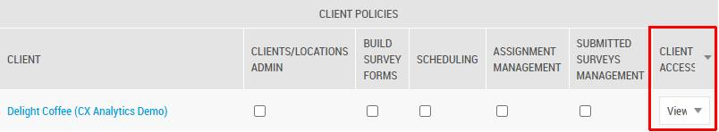
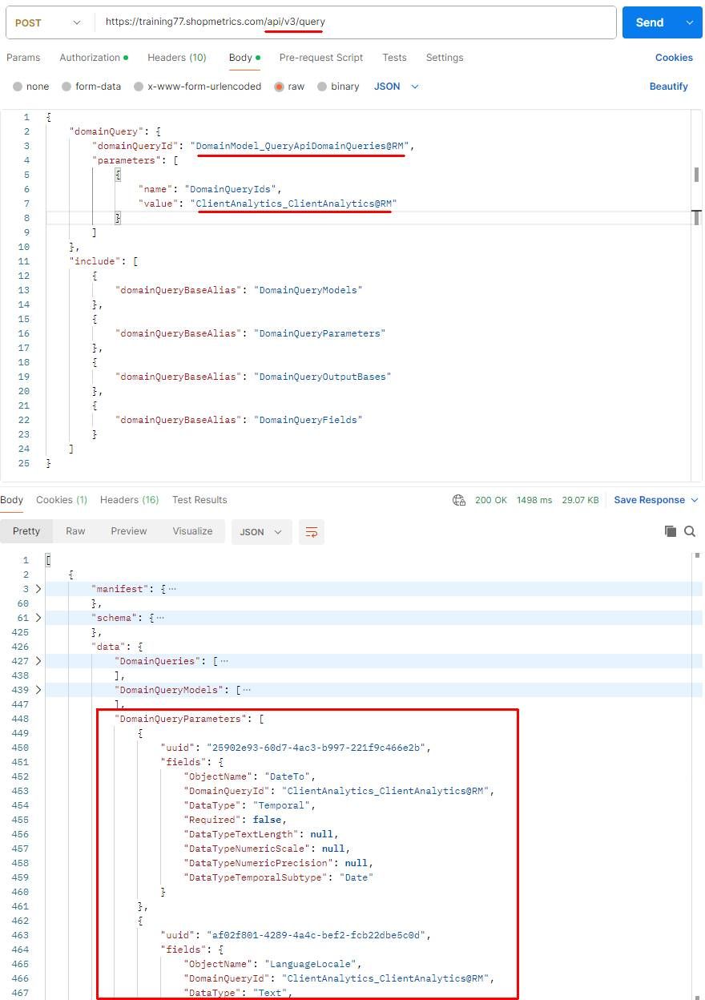
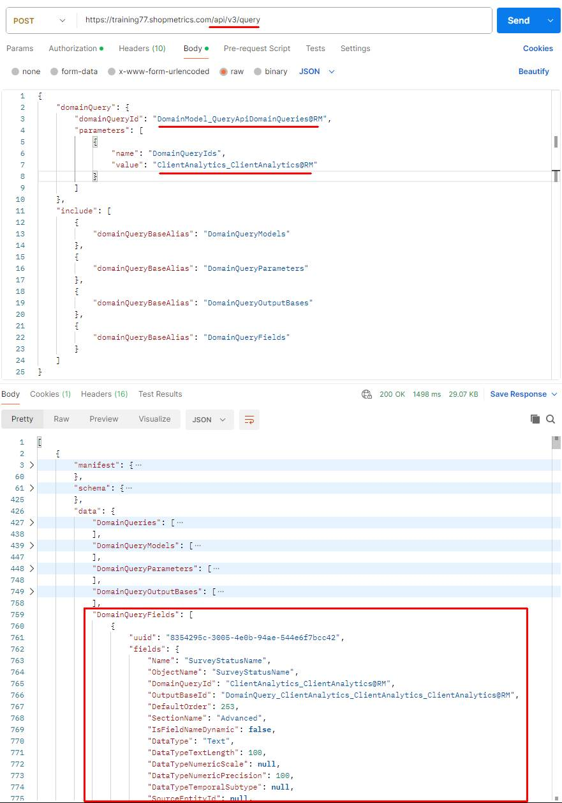
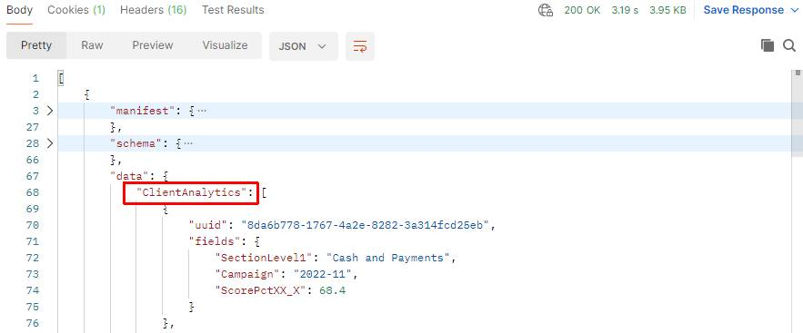
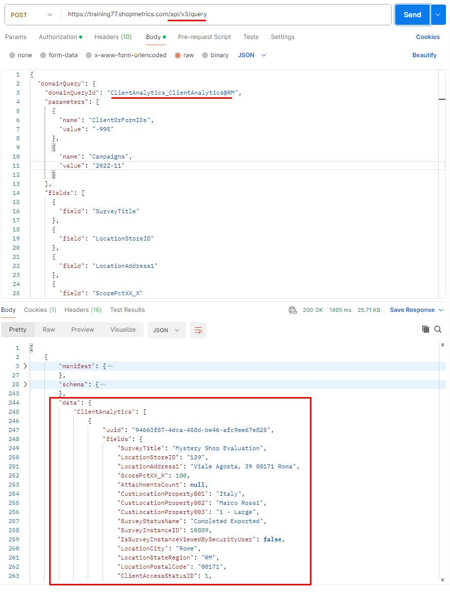
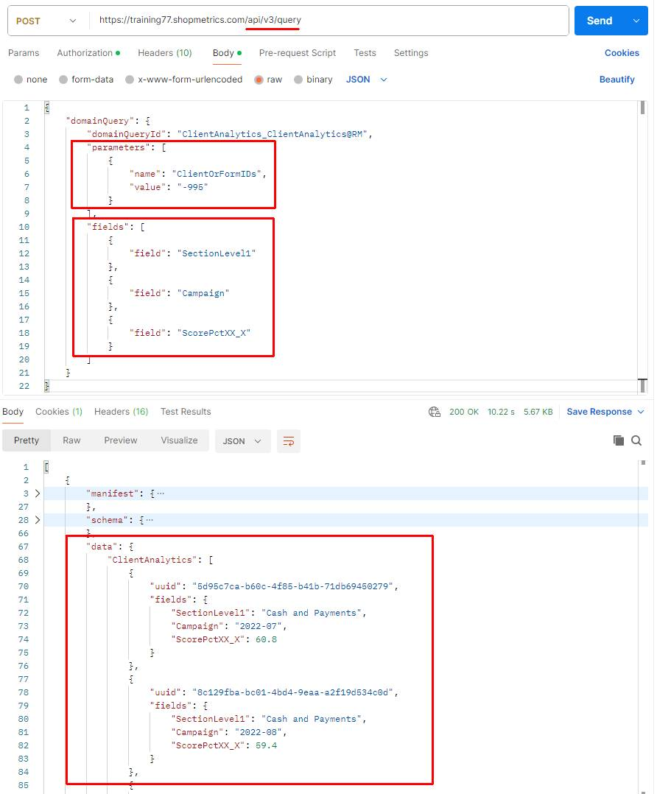

# ClientAnalytics Domain Query

Last Modified: 2025-05-02 | Code: APICADQ

## Introduction

The ClientAnalytics Domain Query is designed to retrieve data related to survey instances with "OK for Client Access" status. It provides flexible data retrieval by dynamically aggregating and/or returning raw data, based on the fields specified in your request:

- **Aggregated Values**:  
  When you request only high-level fields that naturally lend themselves to summarized views—such as Campaign—the API aggregates the data. For these fields, the system automatically computes overall metrics (e.g., totals, averages, minimum, maximum) across the group. This aggregation helps you retrieve overall trends and performance across defined client segments or marketing campaigns.
- **Raw Data Values**:  
  In contrast, when you only request fields that represent unique identifiers or detailed  fine-grained data (for instance, SurveyInstanceID), the API returns the data at a detailed level, without aggregating it. This allows you to retrieve row-level information, providing the precise, underlying data records rather than summary statistics.
- **Automatic Dynamic Aggregation**:  
  When you request both high-level and detail-level fields, the response format is entirely driven by the specified fields. For example, if your query includes Campaign (an aggregated field) and SurveyInstanceID (a detail field), the system will return aggregated values for Campaign, and raw data values for SurveyInstanceID. This ensures that the output is both comprehensive and flexible, giving you aggregated data when needed while preserving the option to inspect detailed records.

This dual functionality allows you to tailor your analytics needs: use aggregation for broad insights, and raw data retrieval for in-depth analysis of individual records.

## User Security

In order to utilize the ClientAnalytics Domain Query you need a User Account in the Shopmetrics platform and Client Credentials associated with that account.

The User Account must have Client Access permissions to "View" or "Edit" the appropriate client in order to retrieve the desired Client Access data:



For more information about the security roles and granting restricted access to the system refer to the article "**Grant Restricted Access to the System**" (short code: **GRAS**).

More information about creating Client Credentials can be found in the article “**API Authorization**” (short code: **APIAUT**).

## Request Format

You can send a request to the ClientsAnalytics Domain Query by using the following endpoint: **/api/v3/query**

The "**domainQueryId**" for executing the ClientAnalytics Domain Query is: "**ClientAnalytics\_ClientAnalytics@RM**".

The payload for the requests is passed as a JSON object in the request body in the following JSON format:

```
{
    "domainQuery": {
        "domainQueryId": "ClientAnalytics_ClientAnalytics@RM",
        "parameters": [
            {
                "name": "Paramater_Name", // Parameter name. Each parameter name-value pair should be specified in a separate object of the "parameters" array.
                "value": "Parameter_Value" // The corresponding value for the parameter
            }
        ],
        "fields": [
            {
                "field": "Field_Name" // Specific field to be returned in the result. Each field to be returned should be specified in a separate object of the "fields" array.
            }
        ]
    }
}
```

### Parameters

All available **parameters** for the ClientAnalytics Domain Query can be obtained by calling the Discovery Domain Query "**DomainModel\_QueryApiDomainQueries@RM**" and filtering for the "**ClientAnalytics\_ClientAnalytics@RM**" Domain Query ID. For more information, see the "Query API Discovery" article.

When you execute the request you will see the available parameters in the "**DomainQueryParameters**" property of the response "data" field:



### Fields

You can retrieve all available **fields** for the ClientAnalytics Domain Query by calling the Discovery Domain Query: "**DomainModel\_QueryApiDomainQueries@RM**" and filtering for the "**ClientAnalytics\_ClientAnalytics@RM**" Domain Query ID.  For additional details, refer to the "Query API Discovery" article.

When you execute the request you will see the available fields in the "**DomainQueryFields**" property of the response "data" field:



## Response

The response from the ClientAnalytics Domain Query includes only one Output Base - ClientAnalytics:



## Example Usage

### Get a Survey Instance from a Specific Campaign

This example demonstrates how to use the "**ClientAnalytics\_ClientAnalytics@RM**" Domain Query to get the same data as the CX Analytics Surveys tool. This is an example of a Raw Data Retrieval.

JSON payload:

```
{
  "domainQuery": {
    "domainQueryId": "ClientAnalytics_ClientAnalytics@RM",
    "parameters": [
      {
        "name": "ClientOrFormIDs",
        "value": "-995"
      },
      {
        "name": "Campaigns",
        "value": "2022-11"
      }
    ],
    "fields": [
      {
        "field": "SurveyTitle"
      },
      {
        "field": "LocationStoreID"
      },
      {
        "field": "LocationAddress1"
      },
      {
        "field": "ScorePctXX_X"
      },
      {
        "field": "AttachmentsCount"
      },
      {
        "field": "CustLocationProperty001"
      },
      {
        "field": "CustLocationProperty002"
      },
      {
        "field": "CustLocationProperty003"
      },
      {
        "field": "SurveyStatusName"
      },
      {
        "field": "SurveyInstanceID"
      },
      {
        "field": "IsSurveyInstanceViewedBySecurityUser"
      },
      {
        "field": "LocationCity"
      },
      {
        "field": "LocationStateRegion"
      },
      {
        "field": "LocationPostalCode"
      },
      {
        "field": "ClientAccessStatusID"
      },
      {
        "field": "SurveyWorkflowStepID"
      },
      {
        "field": "PointsScored"
      },
      {
        "field": "PointsPossible"
      },
      {
        "field": "SurveyDateAndTime"
      },
      {
        "field": "SurveyInstanceScoreColorCode"
      }
    ]
  }
}
```

Result:



### Get Survey Scores by Section and Campaign

The following example demonstrates how to use the "ClientAnalytics\_ClientAnalytics@RM" Domain Query to get a summarized report for survey section scores for specified campaigns. This is an example of Automatic Dynamic Aggregation.

JSON payload:

```
{
  "domainQuery": {
    "domainQueryId": "ClientAnalytics_ClientAnalytics@RM",
    "parameters": [
      {
        "name": "ClientOrFormIDs",
        "value": "-995"
      }
    ],
    "fields": [
      {
        "field": "SectionLevel1"
      },
      {
        "field": "Campaign"
      },
      {
        "field": "ScorePctXX_X"
      }
    ]
  }
}
```

Result:


