# Use Case: Import Attachments via Command API Request

Last Modified: 2025-10-13 | Code: APIIACR

**NOTE: The Shopmetrics Command API described in this document works only with V3 survey forms.**

The Attachment Import Command API allows bulk import of files (attachments) to survey questions or CMS documents. Each request may include multiple attachments.

**For every attachment that needs to be uploaded, the API provides a pre-signed upload URL.** **The** **actual file must then be uploaded to the provided URL** **before the import is considered complete**.

This is an asynchronous command request: the API immediately returns a Request ID, and the actual operation is executed in the background. The Request ID can be passed as a parameter to a query resource that checks and returns the status of the request.

## User Access Setup

To successfully use the command for importing attachments, the user must have the following security settings in the Shopmetrics system:

1. Be a member of the "Administrator - Restricted" security role.
2. Have access to the jobs (survey instances) or the CMS documents where attachments will be managed.
3. Possess valid Client Credentials for API authorization.

For more information about granting restricted access to the system refer to the article "**Grant Restricted Access to the System**" (short code: **GRAS**).

For more information about the Client Credentials and API Authorization you can refer to the article “**API Authorization**” (short code: **APIAUT**)

## Command Request Format

You can import attachments by executing a command request to the following API endpoint:

**/api/v3/entities/AttachmentImportRequests@RM/commandrequests/Import**

The request should be written in the following JSON format:

{  
   "data": {  
                   "ImportData": "*The survey attachments data you want to import. **It should be formatted as an escaped JSON**. More information about the Import Data JSON you can find in the “**Import Data Format**” section.*"  
                   "ImportNote": "*A text, containing information for troubleshooting, tracing, or any additional details related to the import request*."  
               }  
}

## Import Data Format

To ensure seamless data import, the survey data for import should be formatted in JSON (JavaScript Object Notation).

### Import Data JSON

The JSON for importing survey attachments consists of a few top-level nodes. Each node represents one type of operation (create, update, or disable) and contains an array of JSON objects. Each object in the array defines a single attachment and includes the details needed to carry out the operation.

**NOTE: The Import Data JSON should be provided as an escaped JSON string in the "ImportData" field.**

Here is a simple example of a JSON formatted survey attachments data for import:

```
{
  "CreateItems": [
    {
      "ItemType": "survey",
      "ID": "11893",
      "QuestionObjectName": "_Q11",
      "FileName": "front_display.jpg",
      "FileType": "image/jpeg"
    },
    {
      "ItemType": "survey",
      "ID": "11895",
      "QuestionObjectName": "_Q12",
      "FileName": "receipt.pdf",
      "FileType": "application/pdf"
    },
    {
      "ItemType": "CMSDoc",
      "ID": "110375",
      "FileName": "client_logo.png",
      "FileType": "image/png"
    }
  ],
  "UpdateItems": [
    {
      "AttachmentID": "5480",
      "ItemType": "survey",
      "ID": "11896",
      "QuestionObjectName": "_Q13"
    },
    {
      "AttachmentID": "5478",
      "ItemType": "survey",
      "ID": "11896",
      "QuestionObjectName": "_Q10",
      "FileName": "front_display_renamed.jpg"
    }
  ],
  "DisableItems": [
    {
      "AttachmentID": "5479",
      "DisableReason": "Reason for disable."
    }
  ]
}
```

### Import Data JSON Components

In the table below, you can find descriptions of the various JSON components that represent the survey attachments data for import:

#### CreateItems

CreateItems is an array containing JSON objects, each defining a new attachment for upload.

| CreateItems Fields | Description | Is Required |
| --- | --- | --- |
| ItemType | Upload destination type. The possible values for this field are:   - survey - CMSDoc | **Yes** |
| ID | Target ID (survey instance ID or CMS node ID). | **Yes** |
| QuestionObjectName | Object name of the survey form question where the attachment will be uploaded. | **Yes, if ItemType is set to "survey"** |
| FileName | Original file name. | **Yes** |
| FileType | MIME file type. The value of this field should be a standard IANA media type (e.g., image/jpeg, application/pdf). | **Yes** |

#### UpdateItems

UpdateItems is an array containing JSON objects, each defining changes to an existing attachment.

| UpdateItems Fields | Description | Is Required |
| --- | --- | --- |
| AttachmentID | ID of the attachment to be updated. | **Yes** |
| ItemType | The possible values for this field are:   - survey - CMSDoc   **NOTE:**   - If the update involves moving the attachment, set the destination type. - For any other update action, set the item type where the attachment currently resides. | **Yes** |
| ID | Survey instance ID or CMS node ID.  **NOTE:**   - If the update involves moving the attachment, use the destination ID. - For any other update action, use the ID where the attachment currently resides. | **Yes** |
| QuestionObjectName | Object name of the survey form question.  **NOTE:**   - If the update involves moving the attachment, use the destination question object name. - For any other update action, use the question object name where the attachment currently resides. | **Yes, if ItemType is set to "survey"** |
| FileName | New file name for the attachment. | No |

#### DisableItems

DisableItems is an array containing JSON objects, each defining an attachment to be disabled (soft delete).

| DisableItems Fields | Description | Is Required |
| --- | --- | --- |
| AttachmentID | ID of the attachment to be disabled. | **Yes** |
| DisableReason | Text describing the reason for disabling the attachment. | **Yes** |

## Import Attachments

Once the JSON import data is prepared, the request must be executed. The process differs slightly depending on whether you are creating, updating, or disabling attachments.

### Create Items

For create operations, additional steps are required because files must be uploaded after the request is executed:

1. **Execute the request** – The system generates a Request ID.
2. **Retrieve Upload URLs** – Query **AttachmentImportRequests@RM** using the Request ID as a filtering argument to **retrieve the CreateItemsUploadData field**. This field contains the pre-signed upload URLs for each attachment.  
   **NOTE: The pre-signed URLs are time-limited and one-time use.**
3. **Upload the files to the Upload URLs** – Send each file to its corresponding UploadURL using a standard HTTP POST request. The system generates an Attachment ID for the uploaded file.
4. **Check the request status** – Query the **WorkflowExecutions\_WorkflowExecutions@RM** domain query API using the generated in step 1 Request ID as a filtering parameter to confirm that the request and file uploads have been completed successfully.

#### Example - Import Survey Attachments

The following example demonstrates how to import attachments into a survey instance (survey instance ID: 19440). The files will be added to the questions highlighted in the screenshot below:

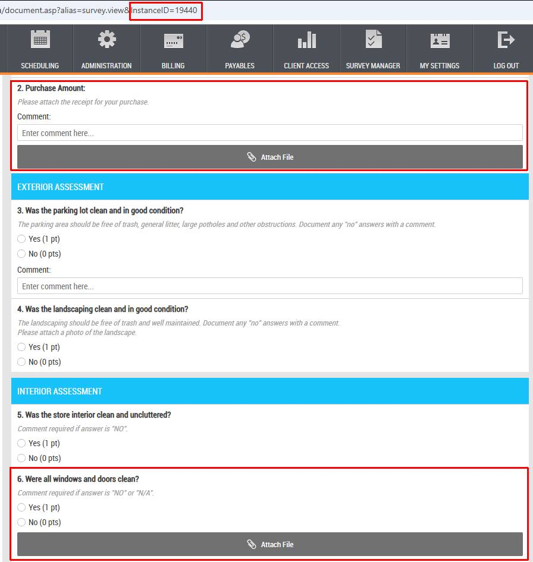

**Step 1** – execute the Import Command Request. The request should be sent **to the following API endpoint**:

**/api/v3/entities/AttachmentImportRequests@RM/commandrequests/Import**

**curl Example:**

```
curl --request POST \
--url https://training78.shopmetrics.com/api/v3/entities/AttachmentImportRequests@RM/commandrequests/Import \
--header 'authorization: Bearer Access Token' \
--header 'content-type: application/json' \
--data '{ "data": { "ImportData": "{\"CreateItems\":[{\"ItemType\":\"survey\",\"ID\":\"19440\",\"QuestionObjectName\":\"_Q2\",\"FileName\":\"Sample Receipt.pdf\",\"FileType\":\"application/pdf\"},{\"ItemType\":\"survey\",\"ID\":\"19440\",\"QuestionObjectName\":\"_Q6\",\"FileName\":\"sample_front_display.jpg\",\"FileType\":\"image/jpeg\"}]}", "ImportNote": "ImportTest - CreateItems" } }'
```

The Import Command Request generates a unique Request ID (requestUuid) which will be used in Step 2 and Step 4:

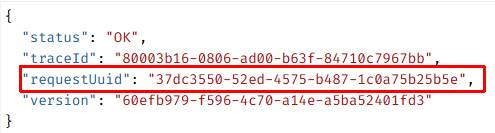

**Step 2** – query the **AttachmentImportRequests@RM** entity **using the generated Request ID** **as a filter** to retrieve the **CreateItemsUploadData** field. CreateItemsUploadData includes the generated upload URLs which will be used in Step 3:

**API endpoint**: /api/v3/query

**curl Example:**

```
curl --request POST \
--url https://training78.shopmetrics.com/api/v3/query \
--header 'authorization: Bearer Access Token' \
--header 'content-type: application/json' \
--data '{ "entity": "AttachmentImportRequests@RM", "options": { "manifest": false, "schema": false }, "fields": { "AttachmentImportRequests@RM": [ { "field": "CreateItemsUploadData" } ] }, "filter": { "name": "isEqualTo", "arguments": [ { "name": "GetFieldValue", "arguments": [ { "value": "CommandRequestUuid" } ] }, { "value": "37dc3550-52ed-4575-b487-1c0a75b25b5e" } ] } }'
```

**Response:**

**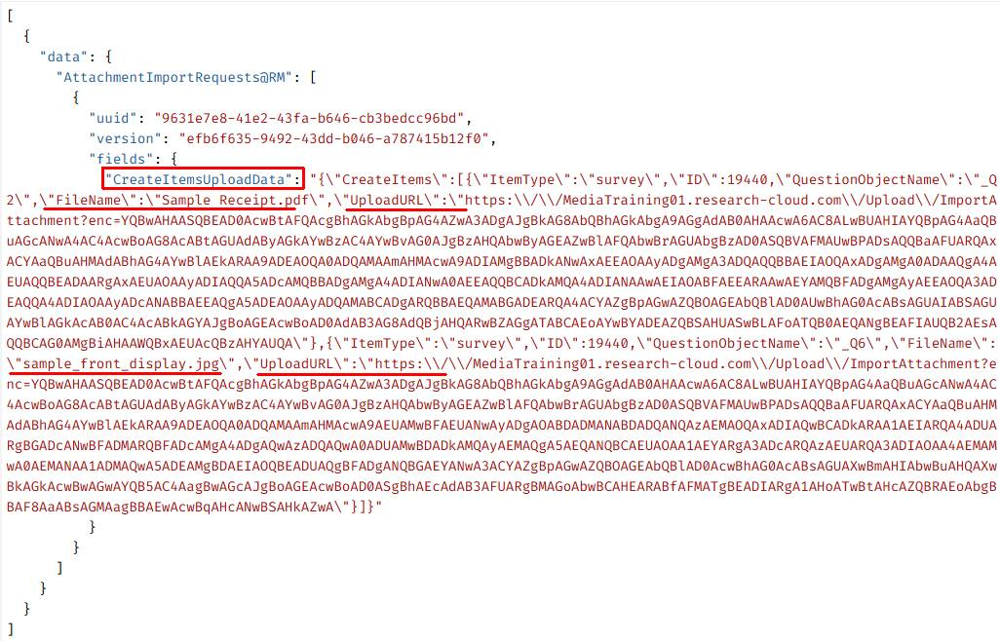**

**Step 3** - use the generated URLs to upload the corresponding files using a POST request:

**curl Example:**

```
curl --request POST \
--url 'https://mediatraining01.research-cloud.com/Upload/ImportAttachment?enc=YQBwAHAASQBEAD0AcwBtAFQAcgBhAGkAbgBpAG4AZwA3ADgAJgBkAG8AbQBhAGkAbgA9AGgAdAB0AHAAcwA6AC8ALwBUAHIAYQBpAG4AaQBuAGcANwA4AC4AcwBoAG8AcABtAGUAdAByAGkAYwBzAC4AYwBvAG0AJgBzAHQAbwByAGEAZwBlAFQAbwBrAGUAbgBzAD0ASQBVAFMAUwBPADsAQQBaAFUARQAxACYAaQBuAHMAdABhAG4AYwBlAEkARAA9ADEAOQA0ADQAMAAmAHMAcwA9ADIAMgBBADkANwAxAEEAOAAyADgAMgA3ADQAQQBBAEIAOQAxADgAMgA0ADAAQgA4AEUAQQBEADAARgAxAEUAOAAyADIAQQA5ADcAMQBBADgAMgA4ADIANwA0AEEAQQBCADkAMQA4ADIANAAwAEIAOABFAEEARAAwAEYAMQBFADgAMgAyAEEAOQA3ADEAQQA4ADIAOAAyADcANABBAEEAQgA5ADEAOAAyADQAMABCADgARQBBAEQAMABGADEARQA4ACYAZgBpAGwAZQBOAGEAbQBlAD0AUwBhAG0AcABsAGUAIABSAGUAYwBlAGkAcAB0AC4AcABkAGYAJgBoAGEAcwBoAD0AdAB3AG8AdQBjAHQARwBZAGgATABCAEoAYwBYADEAZQBSAHUASwBLAFoATQB0AEQANgBEAFIAUQB2AEsAQQBCAG0AMgBiAHAAWQBxAEUAcQBzAHYAUQA' \
--header 'content-type: multipart/form-data' \
--form 'FIle=@sample_front_display.jpg'
```

**Response:**

**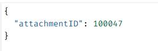**

**curl Example:**

```
curl --request POST \
--url 'https://mediatraining01.research-cloud.com/Upload/ImportAttachment?enc=YQBwAHAASQBEAD0AcwBtAFQAcgBhAGkAbgBpAG4AZwA3ADgAJgBkAG8AbQBhAGkAbgA9AGgAdAB0AHAAcwA6AC8ALwBUAHIAYQBpAG4AaQBuAGcANwA4AC4AcwBoAG8AcABtAGUAdAByAGkAYwBzAC4AYwBvAG0AJgBzAHQAbwByAGEAZwBlAFQAbwBrAGUAbgBzAD0ASQBVAFMAUwBPADsAQQBaAFUARQAxACYAaQBuAHMAdABhAG4AYwBlAEkARAA9ADEAOQA0ADQAMAAmAHMAcwA9ADIAMgBBADkANwAxAEEAOAAyADgAMgA3ADQAQQBBAEIAOQAxADgAMgA0ADAAQgA4AEUAQQBEADAARgAxAEUAOAAyADIAQQA5ADcAMQBBADgAMgA4ADIANwA0AEEAQQBCADkAMQA4ADIANAAwAEIAOABFAEEARAAwAEYAMQBFADgAMgAyAEEAOQA3ADEAQQA4ADIAOAAyADcANABBAEEAQgA5ADEAOAAyADQAMABCADgARQBBAEQAMABGADEARQA4ACYAZgBpAGwAZQBOAGEAbQBlAD0AUwBhAG0AcABsAGUAIABSAGUAYwBlAGkAcAB0AC4AcABkAGYAJgBoAGEAcwBoAD0AdAB3AG8AdQBjAHQARwBZAGgATABCAEoAYwBYADEAZQBSAHUASwBLAFoATQB0AEQANgBEAFIAUQB2AEsAQQBCAG0AMgBiAHAAWQBxAEUAcQBzAHYAUQA' \
--header 'content-type: multipart/form-data' \
--form 'FIle=@Sample Receipt.pdf'
```

**Response:**

**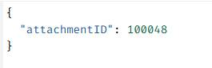**

**Step 4** - pass the generated in Step 1 Request ID as a parameter to the **WorkflowExecutions\_WorkflowExecutions@RM** domain query to check the status of the request.

**NOTE: More information about how to use API v3 domain queries can be found in the following articles: "Introduction to Query APIs" (short code: APIQV3), "Query API Discovery" (short code: APIQDIS).**

**API endpoint:** /api/v3/query

**curl Example:**

```
curl --request POST \
--url https://training78.shopmetrics.com/api/v3/query \
--header 'authorization: Bearer Access Token' \
--header 'content-type: application/json' \
--data '{ "domainQuery": { "domainQueryId": "WorkflowExecutions_WorkflowExecutions@RM", "parameters": [ { "name": "CommandRequestRecordID", "value": "37dc3550-52ed-4575-b487-1c0a75b25b5e" } ] }, "include": [ { "domainQueryBaseAlias": "WorkflowExecutionAffectedRecords" }, { "domainQueryBaseAlias": "WorkflowExecutionFailedItems" } ] }'
```

**Response:**

**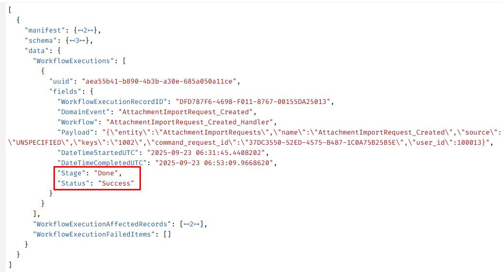**

**The uploaded attachments in the survey:**

**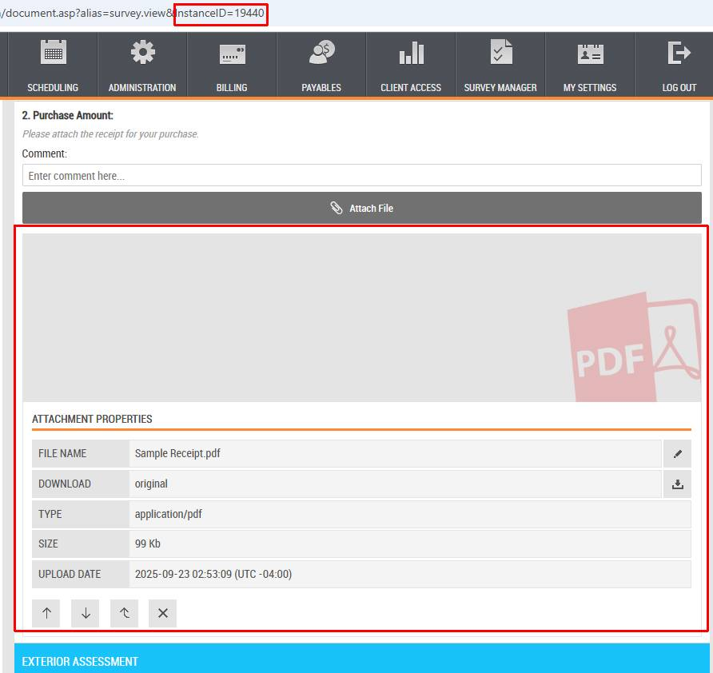**

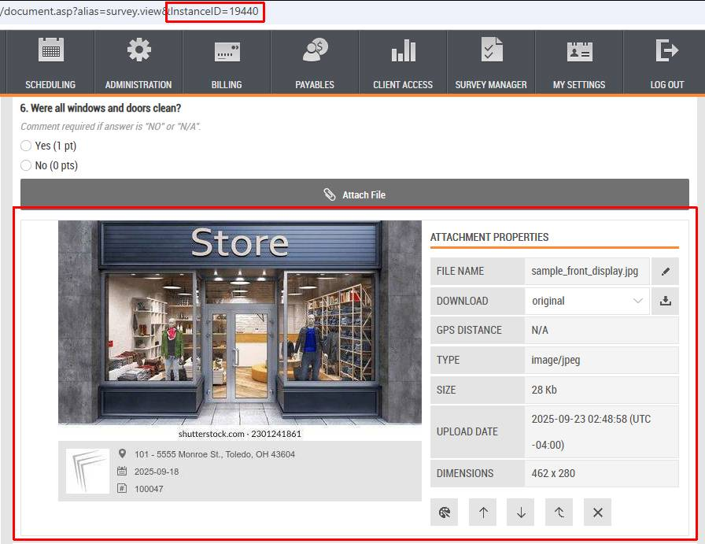

#### Example - Import CMS documents

In the current example we will upload a file to the following CMS folder:

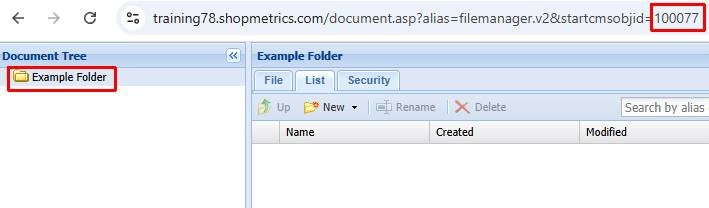

**Step 1** – execute the Import Command Request. The request should be sent **to the following API endpoint**:

**/api/v3/entities/AttachmentImportRequests@RM/commandrequests/Import**

**curl Example:**

```
curl --request POST \
--url https://training78.shopmetrics.com/api/v3/entities/AttachmentImportRequests@RM/commandrequests/Import \
--header 'authorization: Bearer Access Token' \
--header 'content-type: application/json' \
--data '{ "data": { "ImportData": "{\"CreateItems\":[{\"ItemType\":\"CMSDoc\",\"ID\":\"100077\",\"FileName\":\"sample_client_logo.png\",\"FileType\":\"image/png\"}]}", "ImportNote": "ImportTest - CreateItems" } }'
```

The Import Command Request generates a unique Request ID which will be used in Step 2 and Step 4:

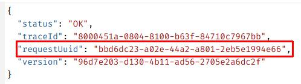

**Step 2** – query the **AttachmentImportRequests@RM** entity **using the generated Request ID as a filter** to retrieve the **CreateItemsUploadData** field. CreateItemsUploadData includes the generated upload URLs which will be used in Step 3:

**API endpoint:**/api/v3/query

**curl Example:**

```
curl --request POST \
--url https://training78.shopmetrics.com/api/v3/query \
--header 'authorization: Bearer Access Token' \
--header 'content-type: application/json' \
--data '{ "entity": "AttachmentImportRequests@RM", "options": { "manifest": false, "schema": false }, "fields": { "AttachmentImportRequests@RM": [ { "field": "CreateItemsUploadData" } ] }, "filter": { "name": "isEqualTo", "arguments": [ { "name": "GetFieldValue", "arguments": [ { "value": "CommandRequestUuid" } ] }, { "value": "bbd6dc23-a02e-44a2-a801-2eb5e1994e66" } ] } }'
```

**Response:**

**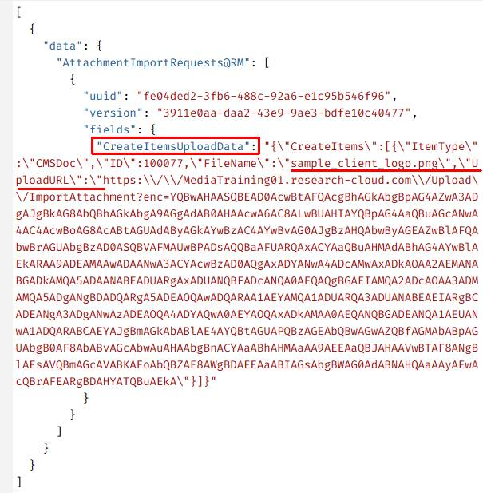**

**Step 3** - use the generated URL to upload the corresponding file using a POST request:

**curl Example:**

```
curl --request POST \ 
--url 'https://mediatraining01.research-cloud.com/Upload/ImportAttachment?enc=YQBwAHAASQBEAD0AcwBtAFQAcgBhAGkAbgBpAG4AZwA3ADgAJgBkAG8AbQBhAGkAbgA9AGgAdAB0AHAAcwA6AC8ALwBUAHIAYQBpAG4AaQBuAGcANwA4AC4AcwBoAG8AcABtAGUAdAByAGkAYwBzAC4AYwBvAG0AJgBzAHQAbwByAGEAZwBlAFQAbwBrAGUAbgBzAD0ASQBVAFMAUwBPADsAQQBaAFUARQAxACYAaQBuAHMAdABhAG4AYwBlAEkARAA9ADEAMAAwADAANwA3ACYAcwBzAD0AQgAxADYANwA4ADcAMwAxADkAOAA2AEMANABGADkAMQA5ADAANABEADUARgAxADUANQBFADcANQA0AEQAQgBGAEIAMQA2ADcAOAA3ADMAMQA5ADgANgBDADQARgA5ADEAOQAwADQARAA1AEYAMQA1ADUARQA3ADUANABEAEIARgBCADEANgA3ADgANwAzADEAOQA4ADYAQwA0AEYAOQAxADkAMAA0AEQANQBGADEANQA1AEUANwA1ADQARABCAEYAJgBmAGkAbABlAE4AYQBtAGUAPQBzAGEAbQBwAGwAZQBfAGMAbABpAGUAbgB0AF8AbABvAGcAbwAuAHAAbgBnACYAaABhAHMAaAA9AEEAaQBJAHAAVwBTAF8ANgBlAEsAVQBmAGcAVABKAEoAbQBZAE8AWgBDAEEAaABIAGsAbgBWAG0AdABNAHQAaAAyAEwAcQBrAFEARgBDAHYATQBuAEkA' \ 
--header 'content-type: multipart/form-data' \ 
--form 'FIle=@sample_client_logo.png'
```

**Response:**

**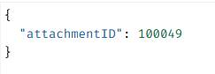**

**Step 4** - pass the generated in Step 1 Request ID as a parameter to the **WorkflowExecutions\_WorkflowExecutions@RM** domain query to check the status of the request.

**NOTE: More information about how to use API v3 domain queries can be found in the following articles: "Introduction to Query APIs" (short code: APIQV3), "Query API Discovery" (short code: APIQDIS).**

**API endpoint:** /api/v3/query

**curl Example:**

```
curl --request POST \
--url https://training78.shopmetrics.com/api/v3/query \
--header 'authorization: Bearer Access Token' \
--header 'content-type: application/json' \
--data '{ "domainQuery": { "domainQueryId": "WorkflowExecutions_WorkflowExecutions@RM", "parameters": [ { "name": "CommandRequestRecordID", "value": "bbd6dc23-a02e-44a2-a801-2eb5e1994e66" } ] }, "include": [ { "domainQueryBaseAlias": "WorkflowExecutionAffectedRecords" }, { "domainQueryBaseAlias": "WorkflowExecutionFailedItems" } ] }'
```

**Response:**

**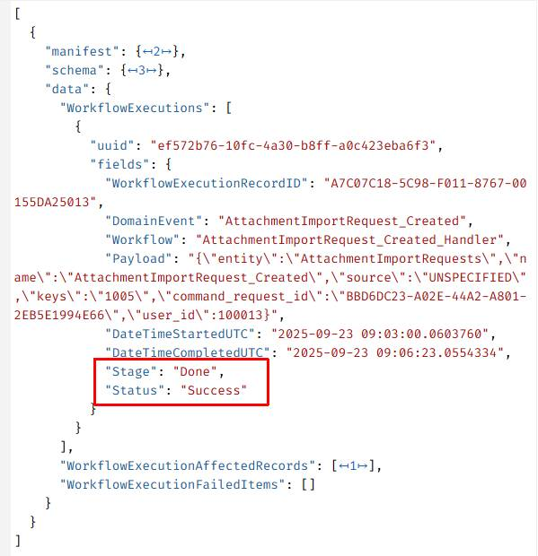**

**The uploaded file in the CMS folder:**

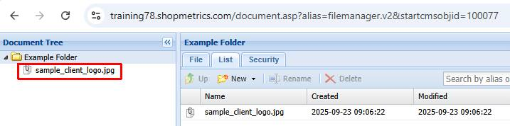

### Update Items and Disable Items

For update and disable operations, the execution flow is straightforward:

1. **Execute the request** – The system generates a Request ID.
2. **Check the request status** – Use the WorkflowExecutions\_WorkflowExecutions@RM domain query with the generated Request ID to verify completion.

#### Example - Update Items

In the following example we will:

- Rename the attachment file below to "**sample\_receipt.pdf**":  
  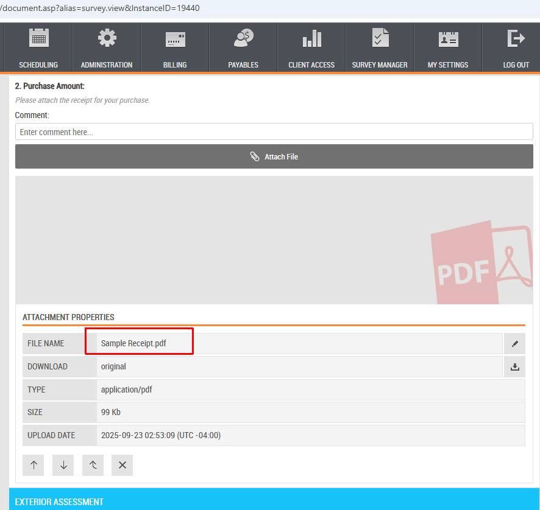
- Move the following attachment to question "**5. Was the store interior clean and uncluttered?**":  
  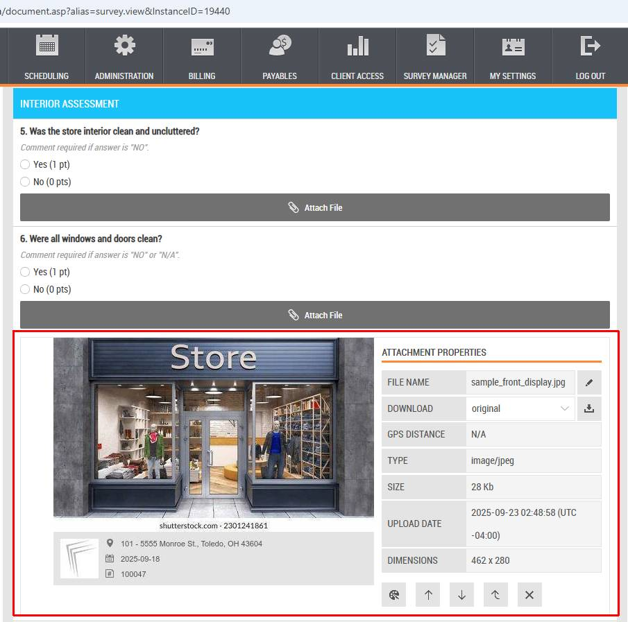

**Step 1** – execute the Import Command Request. The request should be sent to the **following API endpoint**:

**/api/v3/entities/AttachmentImportRequests@RM/commandrequests/Import**

**curl Example:**

```
curl --request POST \
--url https://training78.shopmetrics.com/api/v3/entities/AttachmentImportRequests@RM/commandrequests/Import \
--header 'authorization: Bearer Access Token' \
--header 'content-type: application/json' \
--data '{ "data": { "ImportData": "{\"UpdateItems\":[{\"AttachmentID\":\"100048\",\"ItemType\":\"survey\",\"ID\":\"19440\",\"QuestionObjectName\":\"_Q2\",\"FileName\":\"sample_receipt.pdf\"},{\"AttachmentID\":\"100047\",\"ItemType\":\"survey\",\"ID\":\"19440\",\"QuestionObjectName\":\"_Q5\"}]}", "ImportNote": "ImportTest - UpdateItems" } }'
```

The Import Command Request generates a unique Request ID which will be used in Step 2:

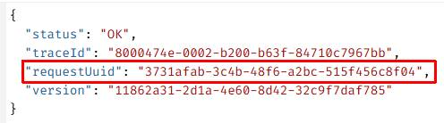

**Step 2** – pass the generated Request ID as a parameter to the **WorkflowExecutions\_WorkflowExecutions@RM** domain query to check the status of the request.

**NOTE: More information about how to use API v3 domain queries can be found in the following set of articles: "Introduction to Query APIs" (short code: APIQV3), "Query API Discovery" (short code: APIQDIS).**

**API endpoint:** /api/v3/query

**curl Example:**

```
curl --request POST \
--url https://training78.shopmetrics.com/api/v3/query \
--header 'authorization: Bearer Access Token' \
--header 'content-type: application/json' \
--data '{ "domainQuery": { "domainQueryId": "WorkflowExecutions_WorkflowExecutions@RM", "parameters": [ { "name": "CommandRequestRecordID", "value": "3731afab-3c4b-48f6-a2bc-515f456c8f04" } ] }, "include": [ { "domainQueryBaseAlias": "WorkflowExecutionAffectedRecords" }, { "domainQueryBaseAlias": "WorkflowExecutionFailedItems" } ] }'
```

**Response:**

**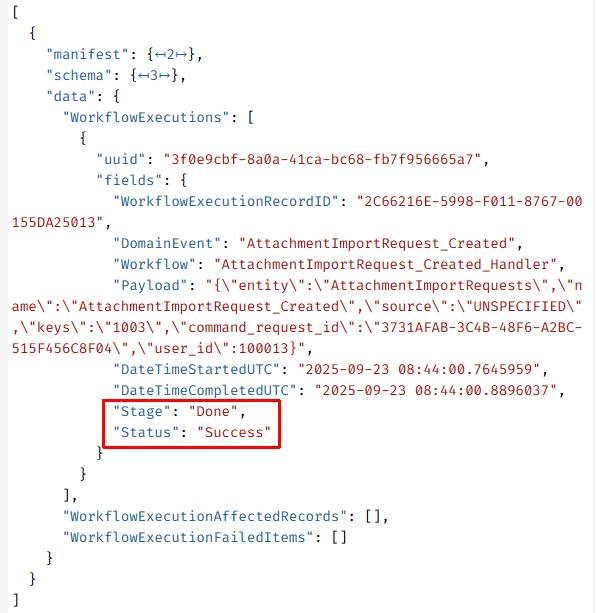**

**Result in the survey:**

**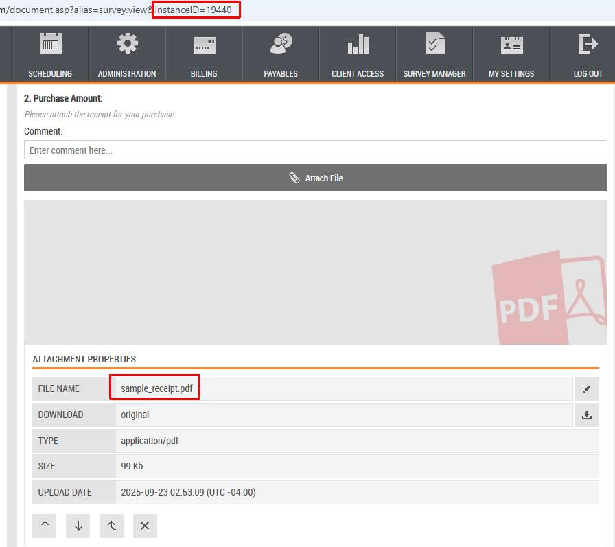**

**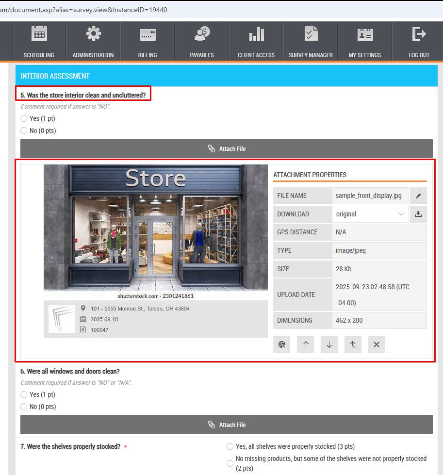**

  

#### Example - Disable Items

In this example we will disable the following attachment:

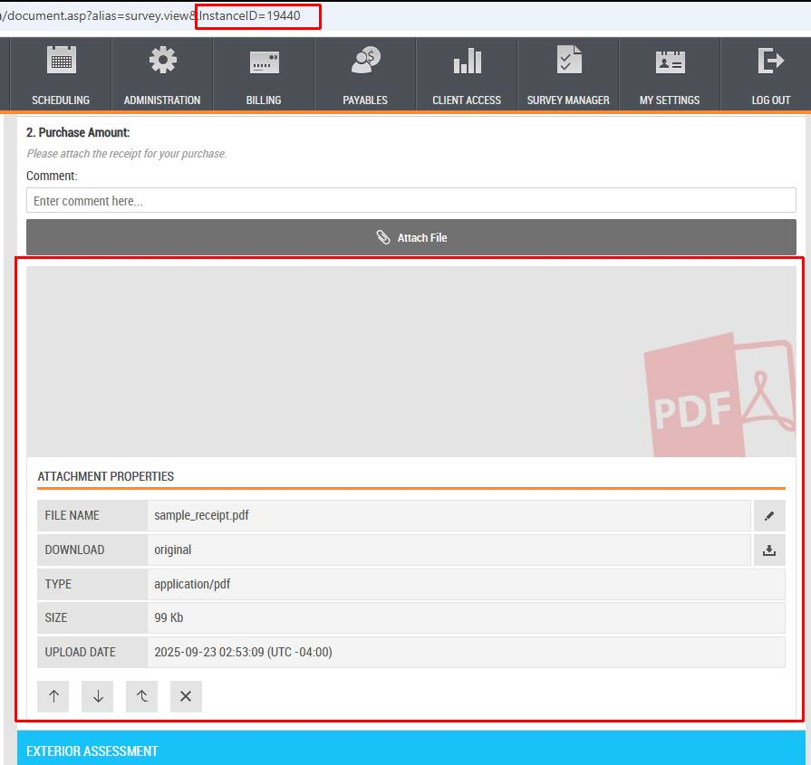

**Step 1** – execute the Import Command Request. The request should be sent to the **following API endpoint:**

**/api/v3/entities/AttachmentImportRequests@RM/commandrequests/Import**

**curl Example:**

```
curl --request POST \
--url https://training78.shopmetrics.com/api/v3/entities/AttachmentImportRequests@RM/commandrequests/Import \
--header 'authorization: Bearer Access Token' \
--header 'content-type: application/json' \
--data '{ "data": { "ImportData": "{\"DisableItems\":[{\"AttachmentID\":\"100048\",\"DisableReason\":\"Example for disabling an attachment\"}]}", "ImportNote": "ImportTest - DisableItems" } }'
```

The Import Command Request generates a unique Request ID which will be used in Step 2:

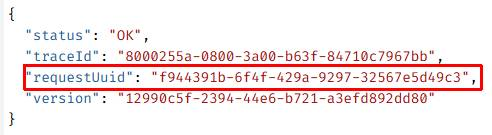

**Step 2** – pass the generated Request ID as a parameter to the **WorkflowExecutions\_WorkflowExecutions@RM** domain query to check the status of the request.

**NOTE: More information about how to use API v3 domain queries can be found in the following set of articles: "Introduction to Query APIs" (short code: APIQV3), "Query API Discovery" (short code: APIQDIS).**

**API endpoint**: /api/v3/query

**curl Example:**

```
curl --request POST \
--url https://training78.shopmetrics.com/api/v3/query \
--header 'authorization: Bearer Access Token' \
--header 'content-type: application/json' \
--data '{ "domainQuery": { "domainQueryId": "WorkflowExecutions_WorkflowExecutions@RM", "parameters": [ { "name": "CommandRequestRecordID", "value": "f944391b-6f4f-429a-9297-32567e5d49c3" } ] }, "include": [ { "domainQueryBaseAlias": "WorkflowExecutionAffectedRecords" }, { "domainQueryBaseAlias": "WorkflowExecutionFailedItems" } ] }'
```

**Response:**

**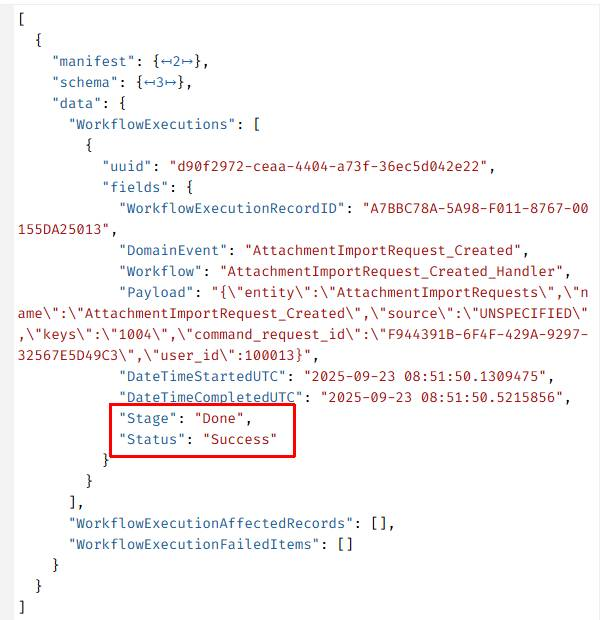**

**Result in the survey:**

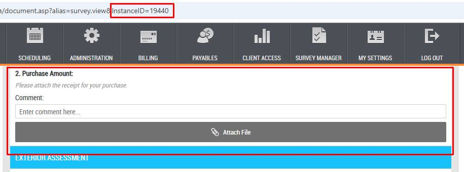
