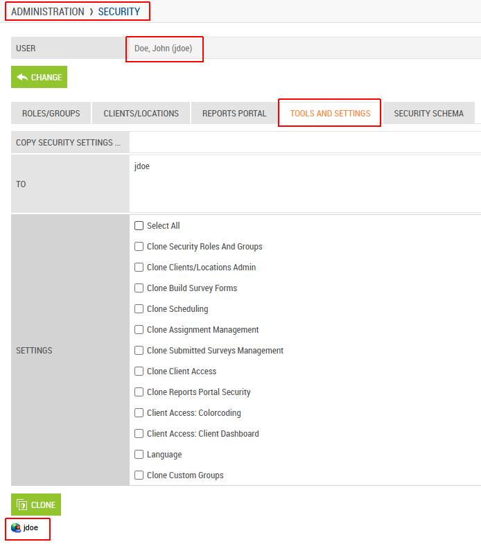
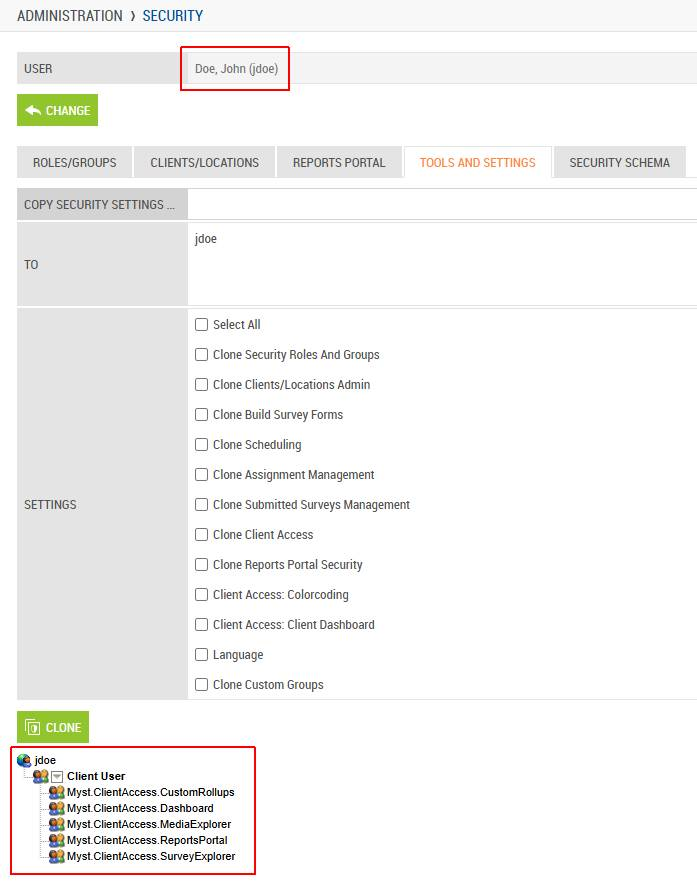

# Use Case: Import User Security Group Membership via Command API Request

Last Modified: 2025-10-22 | Code: APIIUS

The User Security Group Membership Import Command API provides a way to manage user security for multiple users.

This is an asynchronous command request: the API immediately returns a Request ID, and the operation is executed in the background. The Request ID can be passed as a parameter to a query resource to check and return the status of the request.

## User Access Setup

To be able to use the Import Command Request successfully, the user executing the request should have the following security settings in the Shopmetrics system:

- Membership in the "Administrator - Restricted" security role
- Valid Client Credentials for API authorization

For more information about granting restricted access to the system refer to the article "**Grant Restricted Access to the System**" (short code: **GRAS**).

For more information about the Client Credentials and API Authorization you can refer to the article “**API Authorization**” (short code: **APIAUT**).

## Command Request Format

You can import user security group membership by executing a command request to the **following API endpoint**:

**/api/v3/entities/Users@RM/commandrequests/ImportSecurityGroupMemberships**

The request should be written in the following JSON format:

{  
    "data": {  
        "ImportData": "*The user security membership data that you want to import. The data should be formatted in a tab-separated format (for more information see the section "Import Data Format").*",  
       "ImportNote": "*Free-text note for audit, troubleshooting, or additional context related to the import request.*"  
     }  
}

**NOTE: Currently the "ImportNote" content is not displayed in the system.**

## Import Data Format

The user security group membership data for import should be formatted in a tab-separated format. The following separators should be used accordingly:

- A **new line** should be represented with **\n**
- A **tab** should be represented with **\t**

## User Security Group Membership Import Data Fields

The table below lists the field names and brief descriptions of all User Security Group Membership Import Data fields available for use when constructing the data for import:

| Field Object Name | Description | Is Required |
| --- | --- | --- |
| ImportOperation | Operation to perform. Accepted values (case-insensitive):   - **Create** - **Delete** | **Yes** |
| UserID | ID of the user whose membership is being modified. | **Yes, if UserLogin is NOT provided** |
| UserLogin | Login of the user whose membership is being modified. | **Yes, if UserID is NOT provided** |
| MemberOfGroupID | ID of the security group/role the user will be added to. | **Yes, if MemberOfGroupName is NOT provided** |
| MemberOfGroupName | Name of the security group the user will be added to. | **Yes, if MemberOfGroupID  is NOT provided** |

## Import User Security Group Membership

The process of importing user security group membership includes the following steps:

1. **Execute the request** – The system generates a Request ID.
2. **Check the request status** – Use the WorkflowExecutions\_WorkflowExecutions@RM domain query with the generated Request ID to verify completion.

**NOTE: Users assigned to a security group/role automatically inherit membership in all groups/roles included within the assigned group/role.**

### Example - Create User Group Membership

User **jdoe** does not have any security group/role memberships, as can be seen in *Administration-> Security->Tools and Settings*:



**Step 1** - execute the request.

**An example request** for creating a membership in the "**Client User**" security role for user with **UserLogin = "jdoe"** would appear as follows:

```
POST /api/v3/entities/Users@RM/commandrequests/ImportSecurityGroupMemberships
Content-Type: application/json
Authorization: Bearer <YOUR_ACCESS_TOKEN>

{
  "data": {
      "ImportData": "ImportOperation\tUserLogin\tMemberOfGroupName\nCreate\tjdoe\tClient User",
      "ImportNote": "Create user membership"
    }
}
```

**Example Response for successfully created command request** - the Import Command Request generates a unique Request ID which will be used in Step 2:

```
HTTP/1.1 201 Created  
Content-Type: application/json  
{
  "status": "OK",
  "traceId": "80002e77-0800-7e00-b63f-84710c7967bb",
  "requestUuid": "32ac3578-5a5f-44c6-92a4-103b84f13865",
  "version": "184ee9c2-b7cc-4386-93d6-49b084d618ab"
}
```

**Step 2** - pass the generated Request ID as a parameter to the WorkflowExecutions\_WorkflowExecutions@RM domain query to check the status of the request.

**NOTE: More information about how to use API v3 domain queries can be found in the following set of articles: "Introduction to Query APIs" (short code: APIQV3), "Query API Discovery" (short code: APIQDIS).**

**Example request** to the **WorkflowExecutions\_WorkflowExecutions@RM** domain query:

```
POST /api/v3/query
Content-Type: application/json
Authorization: Bearer <YOUR_ACCESS_TOKEN>

{
  "domainQuery": {
    "domainQueryId": "WorkflowExecutions_WorkflowExecutions@RM",
    "parameters": [
      {
        "name": "CommandRequestRecordID",
        "value": "32ac3578-5a5f-44c6-92a4-103b84f13865"
      }
    ]
  },
  "include": [
    {
      "domainQueryBaseAlias": "WorkflowExecutionAffectedRecords"
    },
    {
      "domainQueryBaseAlias": "WorkflowExecutionFailedItems"
    }
  ]
}
```

**Example response** for **successfully executed** command request:

```
HTTP/1.1 200 OK
Content-Type: application/json
[
  {
    "manifest": {...},
    "schema": {...},
    "data": {
      "WorkflowExecutions": [
        {
          "uuid": "34ad68a8-7324-4d24-a469-00b5465c3885",
          "fields": {
            "WorkflowExecutionRecordID": "A56FD4DB-20AF-F011-8767-00155DA25013",
            "DomainEvent": "UserImportSecurityGroupMembershipsRequest_Created",
            "Workflow": "UserImportSecurityGroupMembershipsRequest_Created",
            "Payload": "{\"entity\":\"UserImportSecurityGroupMembershipsRequests\",\"name\":\"UserImportSecurityGroupMembershipsRequest_Created\",\"source\":\"UNSPECIFIED\",\"keys\":\"1030\",\"command_request_id\":\"32AC3578-5A5F-44C6-92A4-103B84F13865\",\"user_id\":102066}",
            "DateTimeStartedUTC": "2025-10-22 08:26:57.2734856",
            "DateTimeCompletedUTC": "2025-10-22 08:26:57.4297414",
            "Stage": "Done",
            "Status": "Success"
          }
        }
      ],
      "WorkflowExecutionAffectedRecords": [...],
      "WorkflowExecutionFailedItems": []
    }
  }
]
```

**Result of the newly imported security role membership** (*Administration-> Security->Tools and Settings)*:


