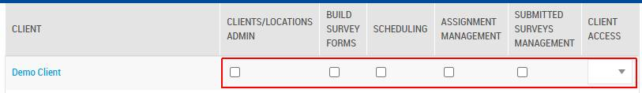
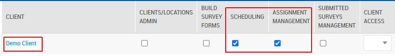
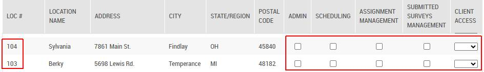
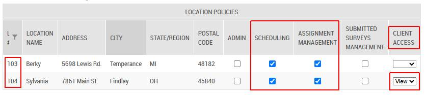
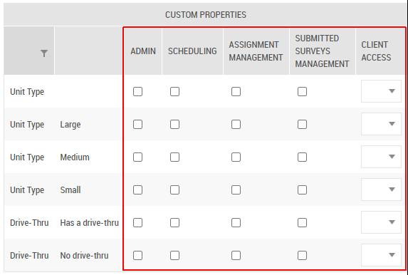
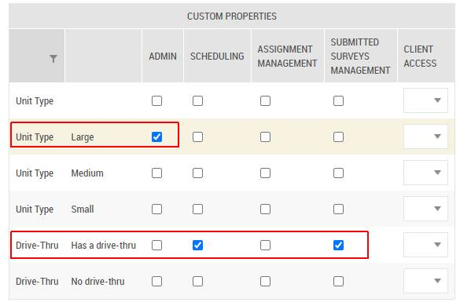

# Use Case: Import Project Access Policies via Command API Requests

Last Modified: 2025-12-08 | Code: APIPAP

This document showcases the following Command APIs for bulk-importing **Project Access Policies** at different project scopes:

- **Import Client Access Policies** — for importing project access policies at a Client level
- **Import Client Location Access Policies** — for importing project access policies at a Client Location level
- **Import Client Custom Properties Access Policies** — for importing project access policies at a Client Custom Properties level

All of the described Command APIs share the same command request format.

Endpoints and command-specific details, including examples for each command are provided in their respective section below.

## User Access Setup

To be able to use the Import Command Request successfully, the user executing the request should have the following security settings in the Shopmetrics system:

- Membership in the "**Administrator - Restricted**" security role
- **Valid Client Credentials** for API authorization

For more information about granting restricted access to the system refer to the article "**Grant Restricted Access to the System**" (short code: **GRAS**).

For more information about the Client Credentials and API Authorization you can refer to the article “**API Authorization**” (short code: **APIAUT**).

## Command Request Format

The request should be written in the following JSON format:

{  
   "data": {  
        "ImportData": "*The project access policies data that you want to import. The data should be formatted in a tab-separated format (for more information see the section "Import Data Format"*).",  
        "ImportNote": "*Free-text note for audit, troubleshooting, or additional context related to the import request.*"  
    }  
}

**NOTE: Currently the "ImportNote" content is not displayed in the system.**

## Import Data Format

The project access policies data for import should be formatted in a tab-separated format. The following separators should be used accordingly:

- A **new line** should be represented with **\n**
- A **tab** should be represented with **\t**

## Import Client Access Policies

### Endpoint

You can import Client Access Policies by executing a command request to the following API endpoint:

/**api/v3/entities/SecurityPrincipalImportRequests@RM/commandrequests/ImportClientPolicies**

### Client Access Policies Import Data Fields

The table below lists the field names and brief descriptions of all Client Access Policies Import Data fields available for use when constructing the data for import:

| **Field Object Name** | Description | Is Required |
| --- | --- | --- |
| UserID | ID of the user whose client access policies are being modified. | **Yes, if UserLogin is NOT provided** |
| UserLogin | Login of the user whose client access policies are being modified. | **Yes, if UserID is NOT provided** |
| ClientID | ClientID existing in the system. | **Yes** |
| IsAdmin | Controls the *Clients/Locations Admin* policy available in the **Client Policies** table under the **Clients/Locations** tab in the **Administration -> Security** interface:  Accepted values for this field are:   - **1**-> **grants**the *Clients/Locations Admin* policy - **0**-> **revokes** the *Clients/Locations Admin* policy | No |
| IsBuildSurveyForms | Controls the *Build Survey Forms* policy available in the **Client Policies** table under the **Clients/Locations** tab in the **Administration -> Security** interface:  Accepted values for this field are:   - **1**-> **grants**the *Build Survey Forms* policy - **0**-> **revokes**    the *Build Survey Forms* policy | No |
| IsScheduling | Controls the *Scheduling* policy available in the **Client Policies** table under the **Clients/Locations** tab in the **Administration -> Security** interface:  Accepted values for this field are:   - **1**-> **grants**the *Scheduling*    policy - **0**-> **revokes**    the *Scheduling*    policy | No |
| IsAssignmentManagement | Controls the *Assignment Management* policy available in the **Client Policies** table under the **Clients/Locations** tab in the **Administration -> Security** interface:  Accepted values for this field are:   - **1**-> **grants**the *Assignment Management*   policy - **0**-> **revokes**    the *Assignment Management*   policy | No |
| IsSubmittedSurveysManagement | Controls the *Submitted Surveys Management* policy available in the **Client Policies** table under the **Clients/Locations** tab in the **Administration -> Security** interface: Accepted values for this field are:   - **1**-> **grants**the *Assignment Management*   policy - **0**-> **revokes** the *Assignment Management*   policy | No |
| ClientAccess | Controls the *Client Access* policy available in the **Client Policies** table under the **Clients/Locations** tab in the **Administration -> Security** interface:  Accepted values for this field are:   - **View** - **Edit** - **NoAccess** | No |

### Import Client Access Policies

The process of importing client access policies includes the following steps:

1. **Execute the request** – The system generates a Request ID.
2. **Check the request status** – Use the **WorkflowExecutions\_WorkflowExecutions@RM** domain query with the generated Request ID to verify completion.

#### Example

User **jdoe**does not have any client policies set for "Demo Client" (ID: 1001) as can be seen in the **Client Policies** table, under **Administration-> Security->Clients/Locations**tab:



**Step 1** - execute the request.

An **example request** for importing client access policies for user with UserLogin = "jdoe" would appear as follows:

```
POST /api/v3/entities/SecurityPrincipalImportRequests@RM/commandrequests/ImportClientPolicies
Content-Type: application/json
Authorization: Bearer <YOUR_ACCESS_TOKEN>

{
  "data": {
      "ImportData": "UserLogin\tClientID\tIsScheduling\tIsAssignmentManagement\njdoe\t1001\t1\t1",
    "ImportNote": "Import Client Policy"
    }
}
```

**Example Response for successfully created command request** - the Import Command Request generates a unique Request ID which will be used in Step 2:

```
HTTP/1.1 201 Created  
Content-Type: application/json

{
  "status": "OK",
  "traceId": "80002f8c-0800-7e00-b63f-84710c7967bb",
  "requestUuid": "fb889065-f8c8-4838-b3cf-798e3e6accde",
  "version": "ac74f75c-d92b-4c4a-8200-fb8b0702531d"
}
```

**Step 2** - pass the generated Request ID as a parameter to the **WorkflowExecutions\_WorkflowExecutions@RM** domain query to check the status of the request.

**Example request** to the **WorkflowExecutions\_WorkflowExecutions@RM** domain query:

```
POST /api/v3/query
Content-Type: application/json
Authorization: Bearer <YOUR_ACCESS_TOKEN>

{
  "domainQuery": {
    "domainQueryId": "WorkflowExecutions_WorkflowExecutions@RM",
    "parameters": [
      {
        "name": "CommandRequestRecordID",
        "value": "fb889065-f8c8-4838-b3cf-798e3e6accde"
      }
    ]
  },
  "include": [
    {
      "domainQueryBaseAlias": "WorkflowExecutionAffectedRecords"
    },
    {
      "domainQueryBaseAlias": "WorkflowExecutionFailedItems"
    }
  ]
}
```

**Example response for successfully executed** command request:

```
HTTP/1.1 200 OK
Content-Type: application/json
[
  {
    "manifest": {...},
    "schema": {...},
    "data": {
      "WorkflowExecutions": [
        {
          "uuid": "e904f8ae-15ad-4c25-ae96-44b544abdfc3",
          "fields": {
            "WorkflowExecutionRecordID": "67326461-36AF-F011-8767-00155DA25013",
            "DomainEvent": "ScrtPrncplImptRqstImportClientPoliciesRequest_Created",
            "Workflow": "ScrtPrncplImptRqstImportClientPoliciesRequest_Created",
            "Payload": "{\"entity\":\"ScrtPrncplImptRqstImportClientPoliciesRequests\",\"name\":\"ScrtPrncplImptRqstImportClientPoliciesRequest_Created\",\"source\":\"UNSPECIFIED\",\"keys\":\"1022\",\"command_request_id\":\"FB889065-F8C8-4838-B3CF-798E3E6ACCDE\",\"user_id\":102066}",
            "DateTimeStartedUTC": "2025-10-22 11:00:59.3525758",
            "DateTimeCompletedUTC": "2025-10-22 11:01:00.7127132",
            "Stage": "Done",
            "Status": "Success"
          }
        }
      ],
      "WorkflowExecutionAffectedRecords": [...],
      "WorkflowExecutionFailedItems": []
    }
  }
]
```

**The newly imported Client Policies** for the user as shown in *Administration-> Security-> Clients/Locations tab*:



## Import Client Location Access Policies

### Endpoint

You can import Client Location Access Policies by executing a command request to the following API endpoint:

**/api/v3/entities/SecurityPrincipalImportRequests@RM/commandrequests/ImportClientLocationPolicies**

### Client Location Access Policies Import Data Fields

The table below lists the field names and brief descriptions of all Client Location Access Policies Import Data fields available for use when constructing the data for import:

| Field Object Name | Description | Is Required |
| --- | --- | --- |
| UserID | ID of the user whose client location access policies are being modified. | **Yes, if UserLogin is NOT provided** |
| UserLogin | Login of the user whose client location access policies are being modified. | **Yes, if UserID is NOT provided** |
| ClientID | ClientID existing in the system. | **Yes** |
| LocationStoreID | ID of a location, belonging to the specified client. | **Yes** |
| IsAdmin | Controls the *Admin* policy available in the **Location Policies** table for the specified client:  Accepted values for this field are:   - **1** -> **grants** the *Admin* policy - **0** -> **revokes** the *Admin* policy | No |
| IsScheduling | Controls the *Scheduling* policy available in the **Location Policies** table for the specified client:  Accepted values for this field are:   - **1** -> **grants**the *Scheduling*    policy - **0**-> **revokes**the *Scheduling*    policy | No |
| IsAssignmentManagement | Controls the *Assignment Management* policy available in the **Location Policies** table for the specified client:  Accepted values for this field are:   - **1** -> **grants**the *Assignment Management*   policy - **0**-> **revokes**the *Assignment Management*   policy | No |
| IsSubmittedSurveysManagement | Controls the *Submitted Surveys Management* policy setting in the Location Policies table for the specified client:  Accepted values for this field are:   - **1** -> **grants**the *Submitted Surveys Management*   policy - **0**-> **revokes**the *Submitted Surveys Management*   policy | No |
| ClientAccess | Controls the *Client Access* policy available in the Location Policies table for the specified client: Accepted values for this field are:  - **View** - **Edit** - **NoAccess** | No |

### Import Client Location Access Policies

The process of importing client location access policies includes the following steps:

1. **Execute the request**– The system generates a Request ID.
2. **Check the request status** – Use the **WorkflowExecutions\_WorkflowExecutions@RM** domain query with the generated Request ID to verify completion.

#### Example

User **jdoe** does not have any location policies set for the following locations under "Demo Client", as can be seen in the **Location Policies** table:



**Step 1** - execute the request.

**Below is an example request** for importing client location access policies (location IDs: 103 and 104) for user with  UserLogin = "jdoe":

```
POST /api/v3/entities/SecurityPrincipalImportRequests@RM/commandrequests/ImportClientLocationPolicies
Content-Type: application/json
Authorization: Bearer <YOUR_ACCESS_TOKEN>

{
  "data": {
      "ImportData": "UserLogin\tClientID\tLocationStoreID\tIsScheduling\tIsAssignmentManagement\tClientAccess\njdoe\t1001\t103\t1\t1\t\njdoe\t1001\t104\t1\t1\tView",
    "ImportNote": "Import Location Policies"
    }
}
```

**Example Response for successfully created command request** - the Import Command Request generates a unique Request ID which will be used in Step 2:

```
HTTP/1.1 201 Created  
Content-Type: application/json

{
  "status": "OK",
  "traceId": "800036e3-0804-0400-b63f-84710c7967bb",
  "requestUuid": "be3eced1-4a27-4221-941d-92b3c230e484",
  "version": "dce6c632-0395-4c2a-8402-425095274f05"
}
```

**Step 2** - pass the generated Request ID as a parameter to the **WorkflowExecutions\_WorkflowExecutions@RM** domain query to check the status of the request.

**Example request**to the **W****orkflowExecutions\_WorkflowExecutions@RM** domain query:

```
POST /api/v3/query
Content-Type: application/json
Authorization: Bearer <YOUR_ACCESS_TOKEN>

{
  "domainQuery": {
    "domainQueryId": "WorkflowExecutions_WorkflowExecutions@RM",
    "parameters": [
      {
        "name": "CommandRequestRecordID",
        "value": "be3eced1-4a27-4221-941d-92b3c230e484"
      }
    ]
  },
  "include": [
    {
      "domainQueryBaseAlias": "WorkflowExecutionAffectedRecords"
    },
    {
      "domainQueryBaseAlias": "WorkflowExecutionFailedItems"
    }
  ]
}
```

**Example response for successfully executed** command request:

```
[
  {
    "manifest": {...},
    "schema": {...},
    "data": {
      "WorkflowExecutions": [
        {
          "uuid": "f56177fd-9f6b-415e-93cd-a84ff0b52560",
          "fields": {
            "WorkflowExecutionRecordID": "A09169C9-3BAF-F011-8767-00155DA25013",
            "DomainEvent": "ScrtPrncplImptRqstImportClientLocationPoliciesRequest_Created",
            "Workflow": "ScrtPrncplImptRqstImportClientLocationPoliciesRequest_Created",
            "Payload": "{\"entity\":\"ScrtPrncplImptRqstImportClientLocationPoliciesRequests\",\"name\":\"ScrtPrncplImptRqstImportClientLocationPoliciesRequest_Created\",\"source\":\"UNSPECIFIED\",\"keys\":\"1011\",\"command_request_id\":\"BE3ECED1-4A27-4221-941D-92B3C230E484\",\"user_id\":102066}",
            "DateTimeStartedUTC": "2025-10-22 11:39:43.8050053",
            "DateTimeCompletedUTC": "2025-10-22 11:39:44.6018819",
            "Stage": "Done",
            "Status": "Success"
          }
        }
      ],
      "WorkflowExecutionAffectedRecords": [...],
      "WorkflowExecutionFailedItems": []
    }
  }
]
```

**Result** in the **Location Policies** table from the Security interface:



## Import Client Custom Properties Access Policies

### Endpoint

You can import Client Custom Properties Access Policies by executing a command request to the following API endpoint:

**/api/v3/entities/SecurityPrincipalImportRequests@RM/commandrequests/ImportClientCustomPropertiesPolicies**

### Client Custom Properties Access Policies Import Data Fields

The table below lists the field names and brief descriptions of all Client Custom Properties Access Policies Import Data fields available for use when constructing the data for import:

| Field Object Name | Description | Is Required |
| --- | --- | --- |
| UserID | ID of the user whose client custom properties access policies are being modified. | **Yes, if UserLogin is NOT provided** |
| UserLogin | Login of the user whose client custom properties access policies are being modified. | **Yes, if UserID is NOT provided** |
| ClientID | ClientID existing in the system. | **Yes** |
| CustomPropertyID | ID of a Custom Property, belonging to the specified client. | **Yes** |
| CustomPropertyValue | Existing value for the specified Custom Property. | **Yes** |
| IsAdmin | Controls the *Admin* policy available in the **Custom Properties** table for the specified client: Accepted values for this field are:   - **1** -> **grants**the *Admin*policy - **0**-> **revokes**the *Admin*policy | No |
| IsScheduling | Controls the *Scheduling* policy available in the **Custom Properties** table for the specified client:  Accepted values for this field are:   - **1** -> **grants**the *Scheduling*   policy - **0**-> **revokes**the *Scheduling*   policy | No |
| IsAssignmentManagement | Controls the *Assignment Management* policy available in the **Custom Properties** table for the specified client:  Accepted values for this field are:   - **1** -> **grants**the *Assignment Management*   policy - **0**-> **revokes**the *Assignment Management*   policy | No |
| IsSubmittedSurveysManagement | Controls the *Submitted Surveys Management* policy in the **Custom Properties** table for the specified client: Accepted values for this field are:   - **1** -> **grants**the *Submitted Surveys Management*   policy - **0**-> **revokes**the *Submitted Surveys Management*   policy | No |
| ClientAccess | Controls the *Client Access* policy available in the **Custom Properties** table for the specified client: Accepted values for this field are:  - **View** - **Edit** - **NoAccess** | No |

### Import Client Custom Properties Access Policies

The process of importing client custom properties access policies includes the following steps:

1. **Execute the request** – The system generates a Request ID.
2. **Check the request status** – Use the **WorkflowExecutions\_WorkflowExecutions@RM** domain query with the generated Request ID to verify completion.

#### Example

User jdoe does not have any custom properties policies set under "Demo Client", as can be seen in the Custom Properties table:



**Step 1** - execute the request.

**Below is an example request** for importing client custom properties access policies for user with  UserLogin = "jdoe":

In the example request we are importing policies for:

- Unit Type (ID: 102): Large
- Drive-Thru (ID: 103): Has a drive-thru

```
POST /api/v3/entities/SecurityPrincipalImportRequests@RM/commandrequests/ImportClientCustomPropertiesPolicies
Content-Type: application/json
Authorization: Bearer <YOUR_ACCESS_TOKEN>

{
  "data": {
      "ImportData": "UserLogin\tClientID\tCustomPropertyID\tCustomPropertyValue\tIsAdmin\tIsScheduling\tIsSubmittedSurveysManagement\njdoe\t1001\t102\tLarge\t1\t\t\njdoe\t1001\t103\tHas a drive-thru\t\t1\t1",
    "ImportNote": "Import CP Policy"
    }
}
```

**Example Response for successfully created command request** - the Import Command Request generates a unique Request ID which will be used in Step 2:

```
HTTP/1.1 201 Created  
Content-Type: application/json

{
  "status": "OK",
  "traceId": "8000854c-0800-a300-b63f-84710c7967bb",
  "requestUuid": "e88ac090-d557-49fa-9996-93eea99224b6",
  "version": "351c24d8-e484-4f40-a6ea-fb1a0cf2be51"
}
```

**Step 2** - pass the generated Request ID as a parameter to the **WorkflowExecutions\_WorkflowExecutions@RM**domain query to check the status of the request.

**Example request** to the **WorkflowExecutions\_WorkflowExecutions@RM** domain query:

```
POST /api/v3/query
Content-Type: application/json
Authorization: Bearer <YOUR_ACCESS_TOKEN>

{
  "domainQuery": {
    "domainQueryId": "WorkflowExecutions_WorkflowExecutions@RM",
    "parameters": [
      {
        "name": "CommandRequestRecordID",
        "value": "e88ac090-d557-49fa-9996-93eea99224b6"
      }
    ]
  },
  "include": [
    {
      "domainQueryBaseAlias": "WorkflowExecutionAffectedRecords"
    },
    {
      "domainQueryBaseAlias": "WorkflowExecutionFailedItems"
    }
  ]
}
```

**Example response for successfully executed** command request:

```
HTTP/1.1 200 OK
Content-Type: application/json
[
  {
    "manifest": {...},
    "schema": {...},
    "data": {
      "WorkflowExecutions": [
        {
          "uuid": "580c731c-663e-4d41-b111-0854997b5b3f",
          "fields": {
            "WorkflowExecutionRecordID": "8215C655-41AF-F011-8767-00155DA25013",
            "DomainEvent": "ScrtPrncplImptRqstImportClientCustomPropertiesPoliciesRequest_Created",
            "Workflow": "ScrtPrncplImptRqstImportClientCustomPropertiesPoliciesRequest_Created",
            "Payload": "{\"entity\":\"ScrtPrncplImptRqstImportClientCustomPropertiesPoliciesRequests\",\"name\":\"ScrtPrncplImptRqstImportClientCustomPropertiesPoliciesRequest_Created\",\"source\":\"UNSPECIFIED\",\"keys\":\"1008\",\"command_request_id\":\"E88AC090-D557-49FA-9996-93EEA99224B6\",\"user_id\":102066}",
            "DateTimeStartedUTC": "2025-10-22 12:19:21.2578591",
            "DateTimeCompletedUTC": "2025-10-22 12:19:21.8828670",
            "Stage": "Done",
            "Status": "Success"
          }
        }
      ],
      "WorkflowExecutionAffectedRecords": [...],
      "WorkflowExecutionFailedItems": []
    }
  }
]
```

**Result**in the **Custom Properties** table from the Security interface:


