# Use case: Manage Job Custom Property Values via Command API request

Last Modified: 2026-02-20 | Code: APIMJCP

This article explains how to use the Shopmetrics Command API to bulk set or delete job custom property values through an asynchronous import command request, making it easier to apply changes across many jobs at once.

## User Access Setup

To be able to use the Import Command Request successfully, the user executing the request should have the following security settings in the Shopmetrics system:

- Membership in the "Administrator - Restricted" security role  
  **Note:** The membership of the role can also be inherited
- Valid Client Credentials for API authorization

For more information about granting restricted access to the system refer to the article "**Grant Restricted Access to the System**" (short code: **GRAS**).

For more information about the Client Credentials and API Authorization you can refer to the article “**API Authorization**” (short code: **APIAUT**).

## Command Request Format

You can manage job custom property values by executing a command request to the following API endpoint:  
**/api/v3/entities/Jobs@RM/commandrequests/ImportCustomPropertyValues**

The request should be written in the following JSON format:

{  
    "data": {  
 "ImportData": "*The job custom property data that you want to import. The data should be formatted in a tab-separated format (for more information see the section "Import Data Format").*",  
 "ImportNote": "*Free-text note for audit, troubleshooting, or additional context related to the import request.*"  
     }  
}

### "ImportNote" field

The "ImportNote" field is a required component of the command request. It allows you to add troubleshooting, tracing, debugging, or other contextual information related to managing job custom property values via Shopmetrics Command API.

**Note that the value of the "ImportNote" field is restricted to 32 characters.**

When a request to bulk process job custom property values is successfully executed, a history event is created for each survey instance included in the "ImportData" field. This history event captures the "ImportNote" content, ensuring that all contextual information is logged and can be referenced later.

## Import Data Format

The job custom property data for import should be formatted in a tab-separated format. The following separators should be used:

- A new line should be represented with **\n**
- A tab should be represented with **\t**

## Job Custom Property Import Data Fields

The table below lists the field names and brief descriptions of all job custom property import data fields available for use when building the data for import:

| Field Object Name | Description | Is Required |
| --- | --- | --- |
| ImportOperation | Operation to perform. Accepted values (case-insensitive):   - Set - Delete - SetLocationLevelValue - SetLocationLevelValuesForAllProperties | **Yes** |
| SurveyInstanceID | A **required** numeric identifier that uniquely identifies a job (survey instance). | **Yes** |
| CustomPropertyID | ID of a custom property associated with the specified SurveyInstanceID. | **Required**, if **ImportOperation has one of the following values**:   - Set - Delete - SetLocationLevelValue |
| CustomPropertyValue | Value for the provided CustomPropertyID. | **Required**, if **ImportOperation** has a value of **Set** |

## Manage Job Custom Property Values

The process of managing job custom property values includes the following steps:

1. **Execute the request** – The system generates a Request ID (requestUuid).
2. **Check the request status** – Use the WorkflowExecutions\_WorkflowExecutions@RM domain query with the generated Request ID to verify completion.

### Example - Set New Job Custom Property Values

This example demonstrates how to set new custom property values for specific jobs.

Jobs (survey instance IDs) 85351 and 85358 do not have any job custom property values as seen in Survey History:

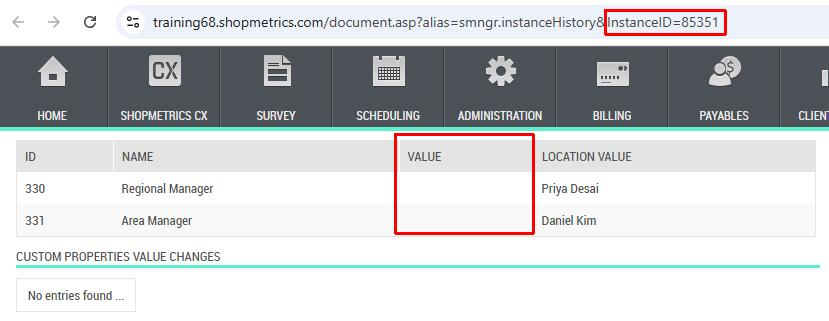

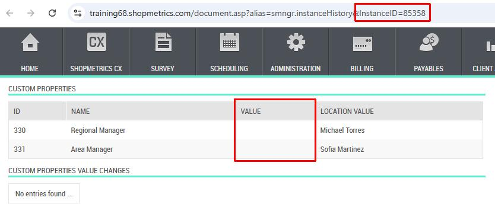

We will **set a new job custom property value** for Regional Manager (**ID: 330**) for **both jobs**.

**Step 1** - execute the request.

An **example request** for **setting new job custom property values** for job IDs **85351** and **85358** would appear as follows:

```
POST <SM_PLATFORM>/api/v3/entities/Jobs@RM/commandrequests/ImportCustomPropertyValues
Content-Type: application/json
Authorization: Bearer <YOUR_ACCESS_TOKEN>

{
  "data": {
      "ImportData": "ImportOperation\tSurveyInstanceID\tCustomPropertyID\tCustomPropertyValue\nSet\t85351\t330\tLucas Bennett\nSet\t85358\t330\tLucas Bennett",
    "ImportNote": "Set new custom property values"
    }
}
```

**Example Response** **for** **successfully created command request** - the Import Command Request generates a unique Request ID which will be used in Step 2:

```
HTTP/1.1 201 Created  
Content-Type: application/json  
{
  "status": "OK",
  "traceId": "8000e3c5-0001-be00-b63f-84710c7967bb",
  "requestUuid": "53a361cd-59fe-4192-824c-febcf183a77c",
  "version": "00548023-5f88-4575-a1b0-2525e288e979"
}
```

**Step 2** - pass the generated Request ID as a parameter to the **WorkflowExecutions\_WorkflowExecutions@RM** domain query to check the status of the request.

**NOTE: More information about how to use API v3 domain queries can be found in the following set of articles: "Introduction to Query APIs" (short code: APIQV3), "Query API Discovery" (short code: APIQDIS).**

**Example request** to the **WorkflowExecutions\_WorkflowExecutions@RM** domain query:

```
POST <SM_PLATFORM>/api/v3/query
Content-Type: application/json
Authorization: Bearer <YOUR_ACCESS_TOKEN>

{
  "domainQuery": {
    "domainQueryId": "WorkflowExecutions_WorkflowExecutions@RM",
    "parameters": [
      {
        "name": "CommandRequestRecordID",
        "value": "53a361cd-59fe-4192-824c-febcf183a77c"
      }
    ]
  },
  "include": [
    {
      "domainQueryBaseAlias": "WorkflowExecutionAffectedRecords"
    },
    {
      "domainQueryBaseAlias": "WorkflowExecutionFailedItems"
    }
  ]
}
```

**Example response** for **successfully executed** command request:

```
HTTP/1.1 200 OK
Content-Type: application/json
[
  {
    "manifest": {...},
    "schema": {...},
    "data": {
      "WorkflowExecutions":[
        {
          "uuid": "4604ca64-4401-43ff-a195-2e5024c85e3e",
          "fields": {
            "WorkflowExecutionRecordID": "9666C76C-5506-F111-8767-00155DA25013",
            "DomainEvent": "JobImportCustomPropertyValuesRequest_Created",
            "Workflow": "JobImportCustomPropertyValuesRequest_Created",
            "Payload": "{\"entity\":\"JobImportCustomPropertyValuesRequests\",\"name\":\"JobImportCustomPropertyValuesRequest_Created\",\"source\":\"UNSPECIFIED\",\"keys\":\"1\",\"command_request_id\":\"53A361CD-59FE-4192-824C-FEBCF183A77C\",\"user_id\":100669}",
            "DateTimeStartedUTC": "2026-02-10 07:52:27.3446882",
            "DateTimeCompletedUTC": "2026-02-10 07:52:27.6734832",
            "Stage": "Done",
            "Status": "Success"
          }
        }
      ],
      "WorkflowExecutionAffectedRecords": [...],
      "WorkflowExecutionFailedItems": []
    }
  }
]
```

The screenshots below show the new job custom property value for Regional Manager successfully set for both jobs:

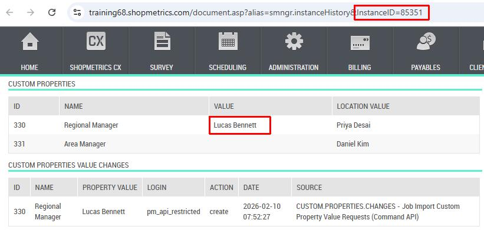

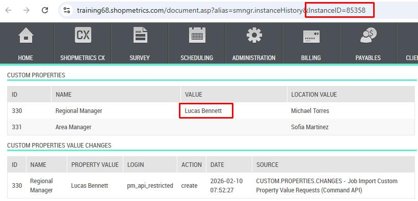

### Example - Delete job custom property values

The current example showcases how to delete a job custom property value.

**Job ID 85351** has the following job custom properties as seen in survey history:

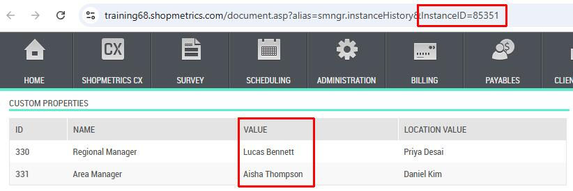

We will **delete** the **job custom property value** for **Regional Manager** (**ID: 330**).

**Step 1** - execute the request.

An **example request** for **deleting a job custom property value for job ID 85351** would appear as follows:

```
POST <SM_PLATFORM>/api/v3/entities/Jobs@RM/commandrequests/ImportCustomPropertyValues
Content-Type: application/json
Authorization: Bearer <YOUR_ACCESS_TOKEN>

{
  "data": {
      "ImportData": "ImportOperation\tSurveyInstanceID\tCustomPropertyID\nDelete\t85351\t330",
    "ImportNote": "Delete job custom property value"
    }
}
```

**Example Response for successfully created command request** - the Import Command Request generates a unique Request ID which will be used in Step 2:

```
HTTP/1.1 201 Created  
Content-Type: application/json
{
  "status": "OK",
  "traceId": "80008098-0001-ec00-b63f-84710c7967bb",
  "requestUuid": "e569162e-5a1c-4694-8350-b9dcac4fe037",
  "version": "d8e553f9-733e-4e50-9822-a5a98f149bc9"
}
```

**Step 2** - pass the generated Request ID as a parameter to the **WorkflowExecutions\_WorkflowExecutions@RM** domain query to check the status of the request.

**Example request** to the **WorkflowExecutions\_WorkflowExecutions@RM** domain query:

```
POST <SM_PLATFORM>/api/v3/query
Content-Type: application/json
Authorization: Bearer <YOUR_ACCESS_TOKEN>

{
  "domainQuery": {
    "domainQueryId": "WorkflowExecutions_WorkflowExecutions@RM",
    "parameters": [
      {
        "name": "CommandRequestRecordID",
        "value": "e569162e-5a1c-4694-8350-b9dcac4fe037"
      }
    ]
  },
  "include": [
    {
      "domainQueryBaseAlias": "WorkflowExecutionAffectedRecords"
    },
    {
      "domainQueryBaseAlias": "WorkflowExecutionFailedItems"
    }
  ]
}
```

**Example response**for **successfully executed** command request:

```
HTTP/1.1 200 OK
Content-Type: application/json
[
  {
    "manifest": {...},
    "schema": {...},
    "data": {
      "WorkflowExecutions":[
        {
          "uuid": "d5f00a79-56f0-4534-9e25-8ebb1c262ac9",
          "fields": {
            "WorkflowExecutionRecordID": "2AE1B7F8-5706-F111-8767-00155DA25013",
            "DomainEvent": "JobImportCustomPropertyValuesRequest_Created",
            "Workflow": "JobImportCustomPropertyValuesRequest_Created",
            "Payload": "{\"entity\":\"JobImportCustomPropertyValuesRequests\",\"name\":\"JobImportCustomPropertyValuesRequest_Created\",\"source\":\"UNSPECIFIED\",\"keys\":\"1\",\"command_request_id\":\"E569162E-5A1C-4694-8350-B9DCAC4FE037\",\"user_id\":100669}",
            "DateTimeStartedUTC": "2026-02-10 08:10:34.9134219",
            "DateTimeCompletedUTC": "2026-02-10 08:10:35.0852957",
            "Stage": "Done",
            "Status": "Success"
          }
        }
      ],
      "WorkflowExecutionAffectedRecords": [...],
      "WorkflowExecutionFailedItems": []
    }
  }
]
```

The screenshot below shows the **deleted job custom property value**:

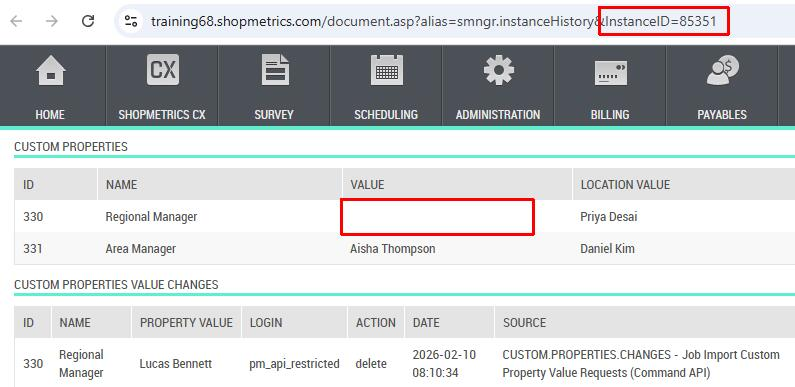

### Example - Set location level values for job custom properties

This example demonstrates how to set the location level for a specific custom property.

**Jobs** (survey instance IDs) **85351** and **85358** have the following job and location level custom property values as seen in Survey History:

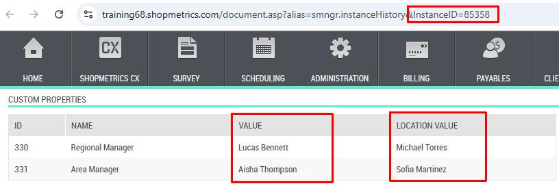

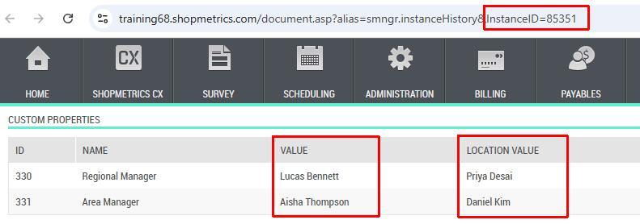

We will **set the location level values** for Area Manager (**ID: 331**) **for both jobs**.

**Step 1** - execute the request.

An **example request** for **setting location level custom property values for jobs** (survey instance IDs) **85351 and 85358** would appear as follows:

```
POST <SM_PLATFORM>/api/v3/entities/Jobs@RM/commandrequests/ImportCustomPropertyValues
Content-Type: application/json
Authorization: Bearer <YOUR_ACCESS_TOKEN>

{
  "data": {
      "ImportData": "ImportOperation\tSurveyInstanceID\tCustomPropertyID\nSetLocationLevelValue\t85351\t331\nSetLocationLevelValue\t85358\t331",
    "ImportNote": "Set location level CP value"
    }
}
```

**Example Response for successfully created command request** - the Import Command Request generates a unique Request ID which will be used in Step 2:

```
HTTP/1.1 201 Created  
Content-Type: application/json
{
  "status": "OK",
  "traceId": "80003da5-0001-5300-b63f-84710c7967bb",
  "requestUuid": "ca268500-7ee0-41d4-b379-5f2138dc844e",
  "version": "866322a6-e7c8-45df-b7cf-6c8c1a5be3d1"
}
```

**Step 2** - pass the generated Request ID as a parameter to the **WorkflowExecutions\_WorkflowExecutions@RM** domain query to check the status of the request.

**Example request** to the **WorkflowExecutions\_WorkflowExecutions@RM** domain query:

```
POST <SM_PLATFORM>/api/v3/query
Content-Type: application/json
Authorization: Bearer <YOUR_ACCESS_TOKEN>

{
  "domainQuery": {
    "domainQueryId": "WorkflowExecutions_WorkflowExecutions@RM",
    "parameters": [
      {
        "name": "CommandRequestRecordID",
        "value": "ca268500-7ee0-41d4-b379-5f2138dc844e"
      }
    ]
  },
  "include": [
    {
      "domainQueryBaseAlias": "WorkflowExecutionAffectedRecords"
    },
    {
      "domainQueryBaseAlias": "WorkflowExecutionFailedItems"
    }
  ]
}
```

**Example response** for **successfully executed** command request:

```
HTTP/1.1 200 OK
Content-Type: application/json
[
  {
    "manifest": {...},
    "schema": {...},
    "data": {
      "WorkflowExecutions":[
        {
          "uuid": "60f28eae-0ec1-4f40-9097-d05d281411fe",
          "fields": {
            "WorkflowExecutionRecordID": "1721AD94-5906-F111-8767-00155DA25013",
            "DomainEvent": "JobImportCustomPropertyValuesRequest_Created",
            "Workflow": "JobImportCustomPropertyValuesRequest_Created",
            "Payload": "{\"entity\":\"JobImportCustomPropertyValuesRequests\",\"name\":\"JobImportCustomPropertyValuesRequest_Created\",\"source\":\"UNSPECIFIED\",\"keys\":\"1\",\"command_request_id\":\"CA268500-7EE0-41D4-B379-5F2138DC844E\",\"user_id\":100669}",
            "DateTimeStartedUTC": "2026-02-10 08:22:05.1582454",
            "DateTimeCompletedUTC": "2026-02-10 08:22:05.2988750",
            "Stage": "Done",
            "Status": "Success"
          }
        }
      ],
      "WorkflowExecutionAffectedRecords": [...],
      "WorkflowExecutionFailedItems": []
    }
  }
]
```

The screenshot below shows the **updated job custom property values for Area Manager** **with the location level values**:

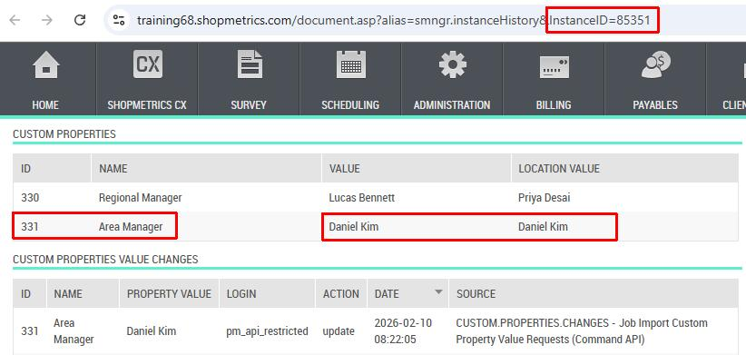

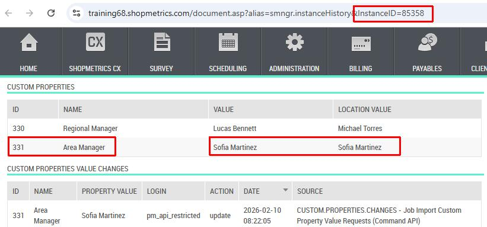

### Example - Set location level values for all job custom properties

This example demonstrates how to set the location level custom property values for all job custom properties.

**Jobs** (survey instance IDs) **85351** and **85358** have the following job and location level custom property values as seen in Survey History:

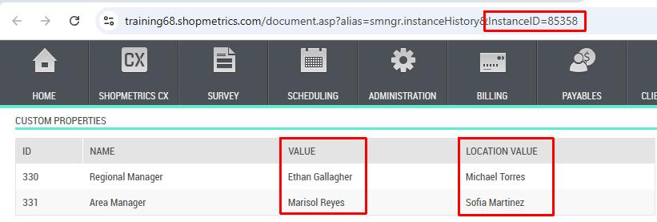

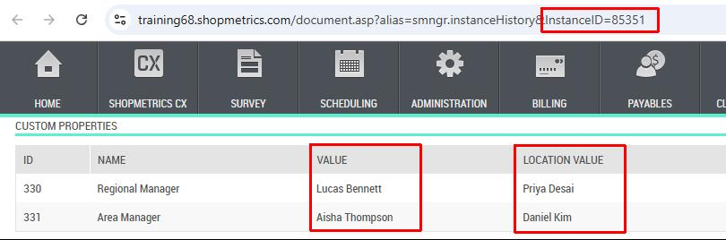

We will **s****et the location level values for all custom properties for both jobs**.

**Step 1** - execute the request.

An **example request** for **setting all location level custom property values** for **job IDs 85351 and 85358** would appear as follows:

```
POST <SM_PLATFORM>/api/v3/entities/Jobs@RM/commandrequests/ImportCustomPropertyValues
Content-Type: application/json
Authorization: Bearer <YOUR_ACCESS_TOKEN>

{
  "data": {
      "ImportData": "ImportOperation\tSurveyInstanceID\nSetLocationLevelValuesForAllProperties\t85351\nSetLocationLevelValuesForAllProperties\t85358",
    "ImportNote": "Set all location level CP values"
    }
}
```

**Example Response for successfully created command request** - the Import Command Request generates a unique Request ID which will be used in Step 2:

```
HTTP/1.1 201 Created  
Content-Type: application/json
{
  "status": "OK",
  "traceId": "80006a8b-0800-f600-b63f-84710c7967bb",
  "requestUuid": "69be4641-182c-4782-b4c6-342c40da2323",
  "version": "b74d2717-54f2-4d2b-a36b-b1aeeef8ce2c"
}
```

**Step 2** - pass the generated Request ID as a parameter to the WorkflowExecutions\_WorkflowExecutions@RM domain query to check the status of the request.

**Example request** to the **WorkflowExecutions\_WorkflowExecutions@RM** domain query:

```
POST <SM_PLATFORM>/api/v3/query
Content-Type: application/json
Authorization: Bearer <YOUR_ACCESS_TOKEN>

{
  "domainQuery": {
    "domainQueryId": "WorkflowExecutions_WorkflowExecutions@RM",
    "parameters": [
      {
        "name": "CommandRequestRecordID",
        "value": "69be4641-182c-4782-b4c6-342c40da2323"
      }
    ]
  },
  "include": [
    {
      "domainQueryBaseAlias": "WorkflowExecutionAffectedRecords"
    },
    {
      "domainQueryBaseAlias": "WorkflowExecutionFailedItems"
    }
  ]
}
```

**Example respons****e** for **successfully executed** command request:

```
HTTP/1.1 200 OK
Content-Type: application/json
[
  {
    "manifest": {...},
    "schema": {...},
    "data": {
      "WorkflowExecutions":[
        {
          "uuid": "6018468f-b395-4bed-a77e-57cce9eb6b14",
          "fields": {
            "WorkflowExecutionRecordID": "63B1799F-5C06-F111-8767-00155DA25013",
            "DomainEvent": "JobImportCustomPropertyValuesRequest_Created",
            "Workflow": "JobImportCustomPropertyValuesRequest_Created",
            "Payload": "{\"entity\":\"JobImportCustomPropertyValuesRequests\",\"name\":\"JobImportCustomPropertyValuesRequest_Created\",\"source\":\"UNSPECIFIED\",\"keys\":\"1\",\"command_request_id\":\"69BE4641-182C-4782-B4C6-342C40DA2323\",\"user_id\":100669}",
            "DateTimeStartedUTC": "2026-02-10 08:44:00.8141319",
            "DateTimeCompletedUTC": "2026-02-10 08:44:00.9980421",
            "Stage": "Done",
            "Status": "Success"
          }
        }
      ],
      "WorkflowExecutionAffectedRecords": [...],
      "WorkflowExecutionFailedItems": []
    }
  }
]
```

The screenshot below shows the **updated job custom property values for all properties with the location level values**:

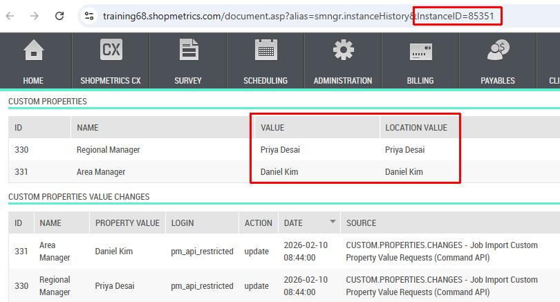

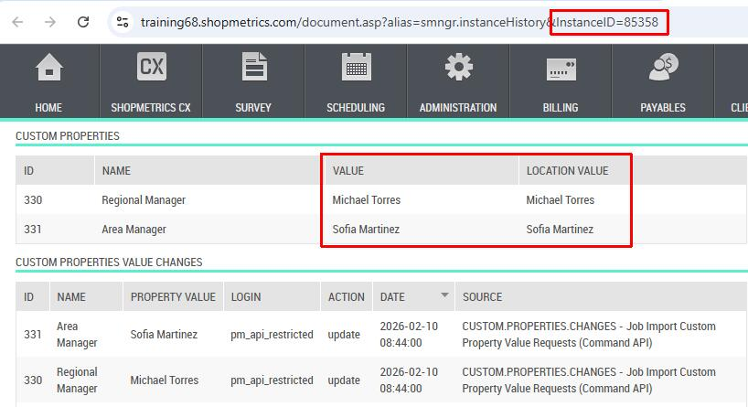
