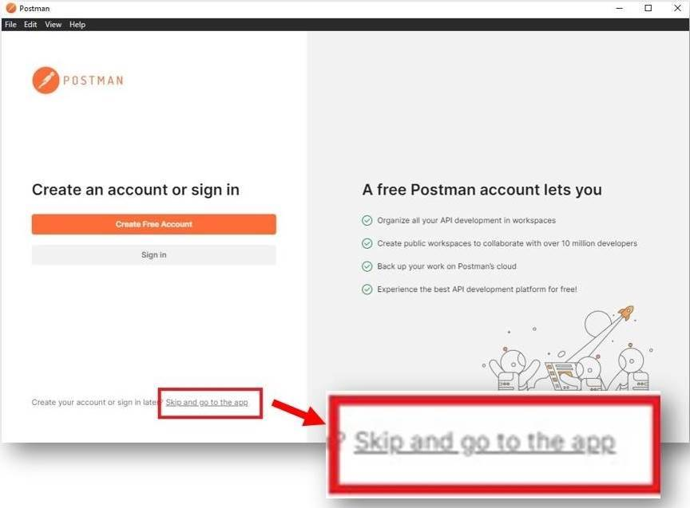

# Introduction to API v2

Last Modified: 2025-04-15 | Code: APIINV2

API v2 offers an efficient method for accessing and managing your data by applying the Command and Query Separation (CQS) design principle.

In API v2, data retrieval is handled through datasets that return data in a specific format. The payload is passed as a JSON object via a "post" parameter of the request.

Data modifications are handled via dedicated command endpoints that invoke predefined Domain Commands. The payload for the requests is passed as a JSON object in the request body.

## API v2 Testing and Consuming

This documentation uses the following tools and technologies to illustrate how the Shopmetrics APIs v2 can be incorporated into your business implementation:

- Shopmetrics CMS — Shopmetrics Platform’s Content Management System
- Postman — a third-party API testing tool
- PowerShell — a scripting language

**NOTE: Instead of using PowerShell, you can consume Shopmetrics API using technologies of your choice like Python, C#, PHP, Ruby, and others. You can also test the API using alternative API Clients such as Insomnia, Paw, Fiddler, and others.**

## Tool Definitions

### Shopmetrics CMS

The Content Management System (CMS) is the software application which allows you to create, manage, and edit digital content in the system. We use Shopmetrics CMS to demonstrate the process of testing the Shopmetrics API by executing datasets through passing it different parameters and examining the result of the execution.

### Postman

Postman is a collaboration platform for API development, testing, and documentation. We use the Postman API Client in the documentation to demonstrate how the Shopmetrics API works in terms of authentication, supplying the values of the input parameters, and examining the returned data.

**NOTE: Postman is a third-party application used to illustrate a process of testing the Shopmetrics API capabilities. It is one of many applications that can be used for this purpose. Data security should be considered while using third-party applications and services.**

**NOTE: If you decide to use Postman to test the API on your Shopmetrics Platform, we recommend you to:**

- **Download and use the Postman Desktop App instead of the web version**
- **Use Postman without creating a Postman account. During the installation of the desktop app, click "Skip and go to the app" as shown below:**

****

### PowerShell

PowerShell is a cross-platform task automation solution made up of a command-line shell, a scripting language, and a configuration management framework. PowerShell runs on Windows, Linux, and macOS. As a scripting language, PowerShell is commonly used for automating the management of systems. It is also used to build, test, and deploy solutions.

We use the PowerShell scripting language in the documentation to demonstrate how the Shopmetrics API can be consumed using a code. The code samples should run on machines that use a Windows Operating System without installing additional tools.
