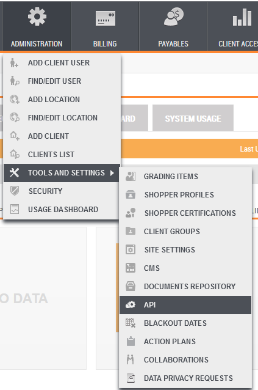
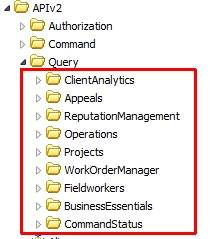
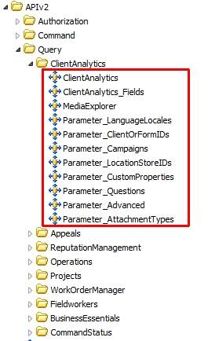
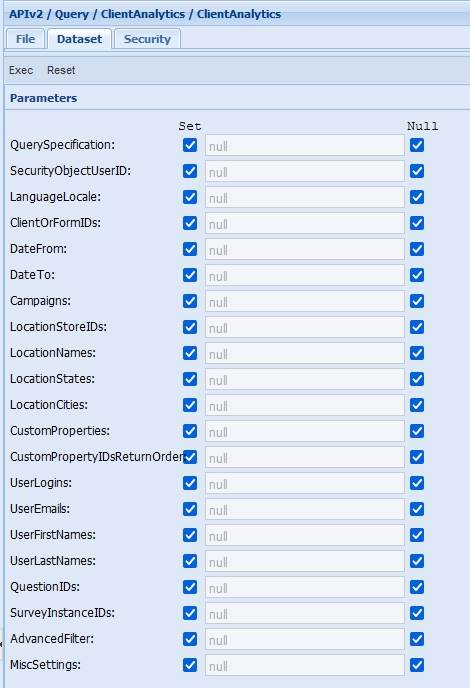
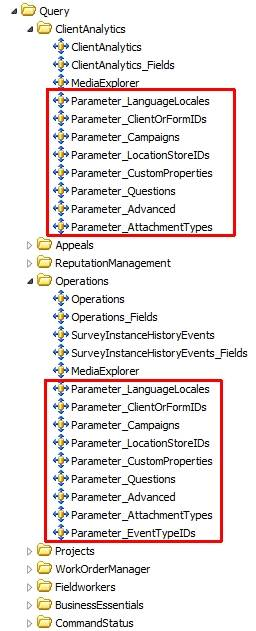
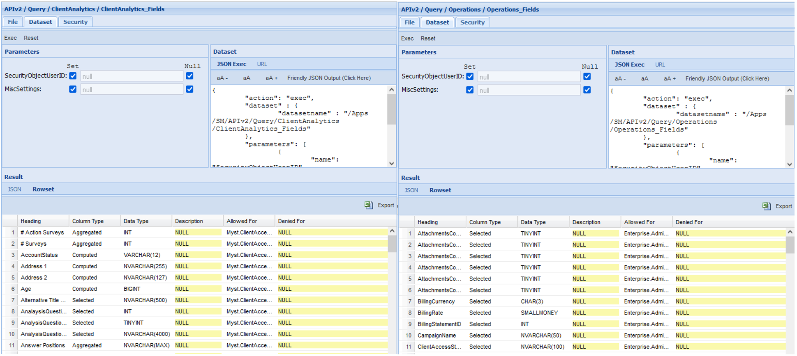

# Introduction to Query APIs

Last Modified: 2023-02-10 | Code: APIQRY

Query APIs are used only to return data to the caller; they do not change the state of the data. In Shopmetrics, the Query API endpoints are datasets that return data in a specific format.

**NOTE: Due to the rapid development of our product, some of the images in this article will differ slightly from the production implementation. However, the Discovery section explains how to check what is available in production.**

The Shopmetrics Query APIs can be accessed via the API CMS Folder, located in Administration -> Tools and Settings -> API, as shown below.

****

## Discovery

Query Resources are located in the “APIv2 / Query” folder in the CMS. The Query folder is organized into folders corresponding to the available Query Data Models.

The individual datasets are Query Resources located within the Query Data Model folders, as shown below.

Most Data Models include several Query Resources (datasets) organized by intent:

- The **base query resource** is a dataset used to extract transactional data which is usually named the same way as the Query Data Model. This dataset has the “QuerySpecification” parameter which defines what columns will be extracted as well as several other parameters that are used to filter the result:  
    
    
  **NOTE: The "QuerySpecification" parameter is a required parameter for all base query resources.**  
    
  **NOTE: All base query resources require providing a value for the "QuerySpecification" parameter and providing a value(s) for at least one more filtering parameter like ClientOrFormIDs, UserIDs, LocationStoreIDs or others.**

- **Parameter resources** are datasets used to extract data used as values to pass to the filter parameters of the base query resource. The names of Parameters datasets usually contain the phrase “Parameter\_”, as shown below.

- The **“Fields” resource** is a dataset that returns all options (columns) of the “QuerySpecification” parameter of the base query resource.  
  
