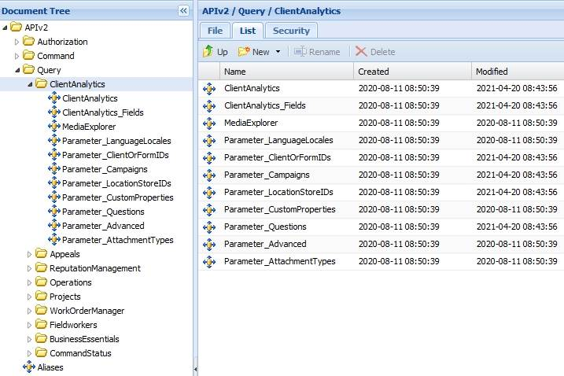

# Introduction to Client Analytics

Last Modified: 2023-02-10 | Code: APIICA

The Shopmetrics API Client Analytics Query Data Model can be used for retrieving data for surveys with "OK for Client Access" status.

**NOTE: Due to the rapid development of our product, some of the images in this set of articles will differ slightly from the production implementation.**

