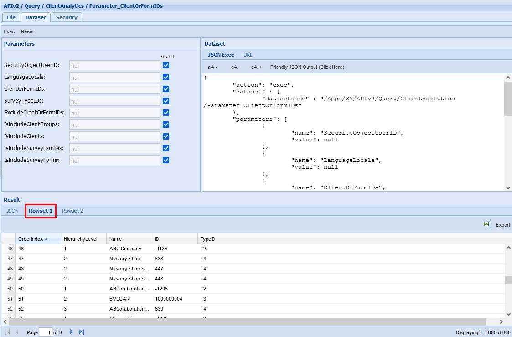
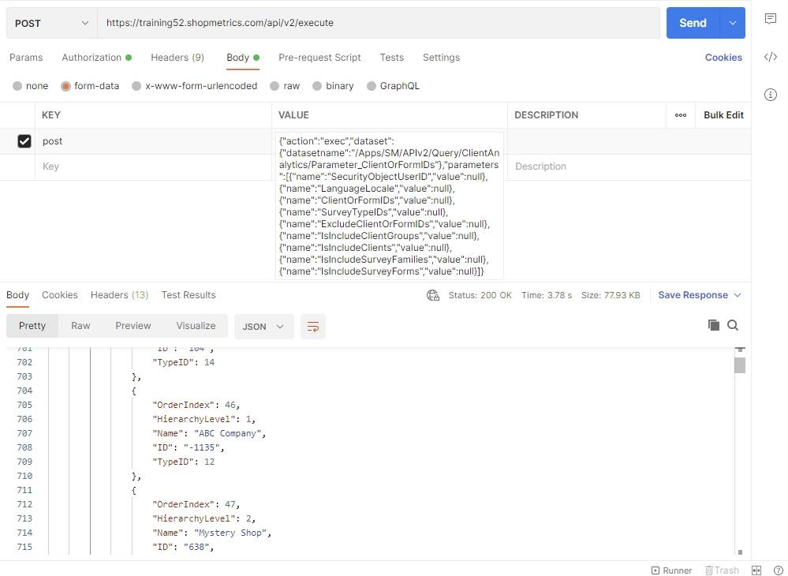
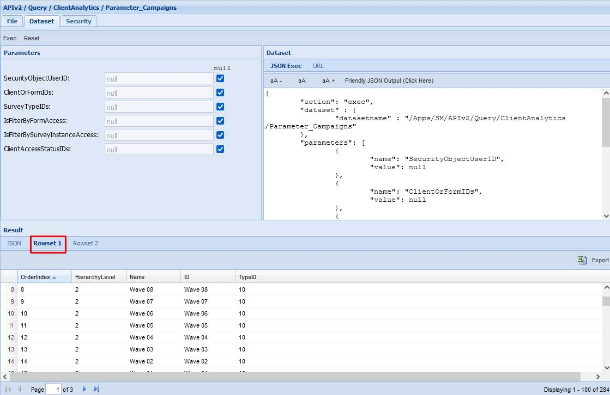
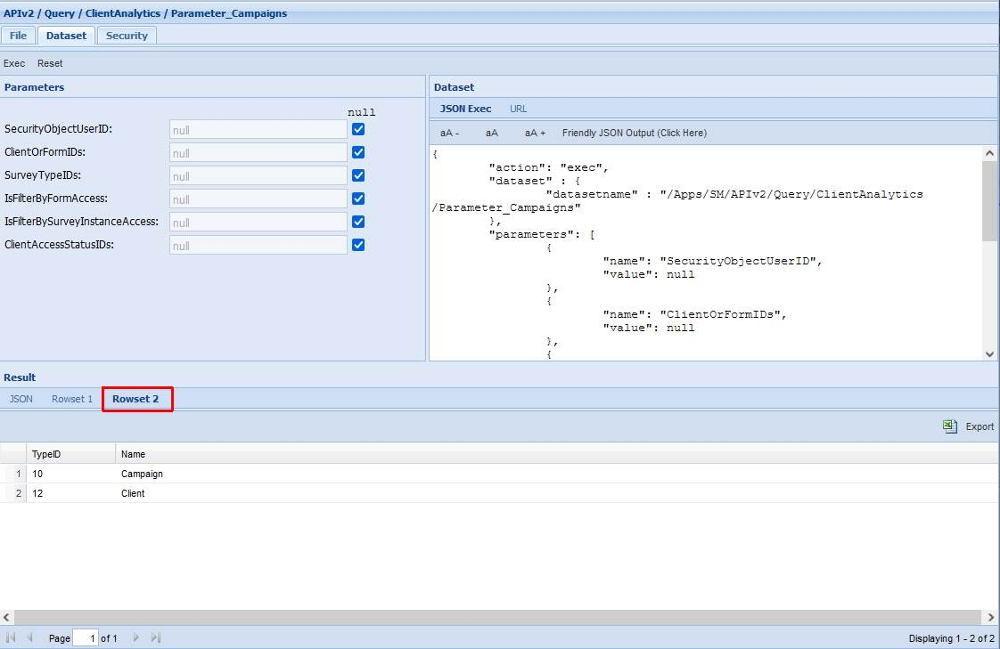
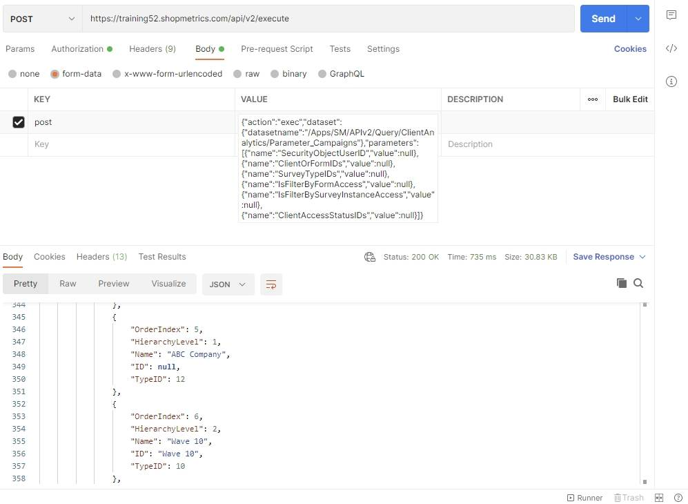
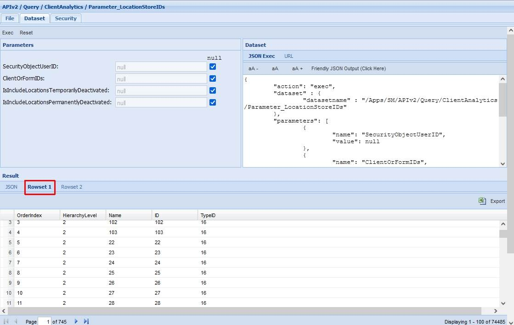
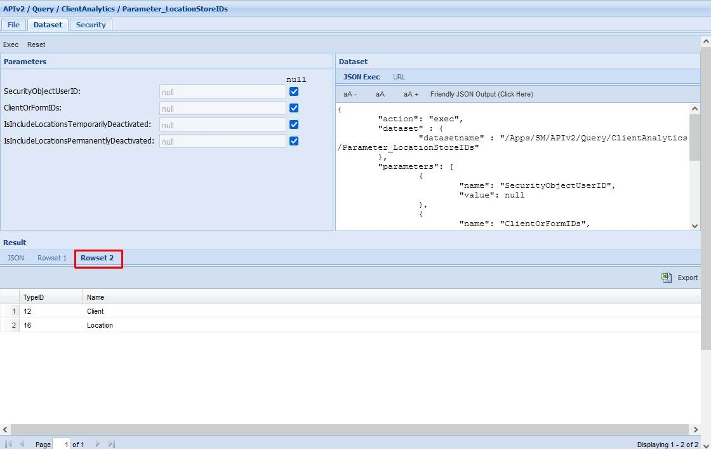
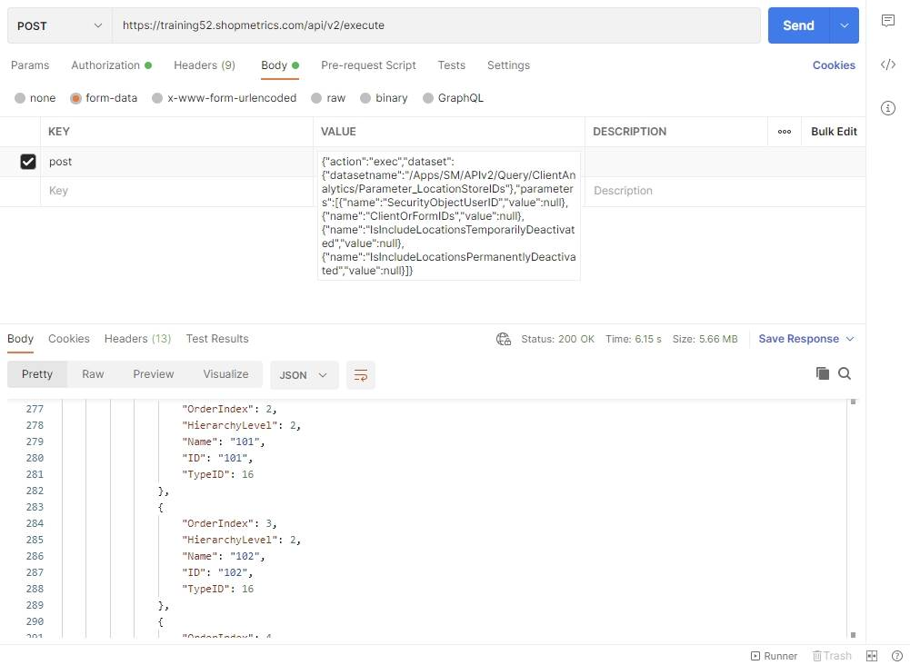

# Client Analytics Parameter Resources

Last Modified: 2023-03-13 | Code: APICAP

Parameter resources are datasets, providing data that is passed to the parameters of the base query resource (base dataset). The names of the Parameter datasets usually begin with “Parameter\_”.

## Parameter\_ClientOrFormIDs

The Parameter\_ClientOrFormIDs dataset returns data that can be passed to the “ClientOrFormsIDs” parameter of the ClientAnalytics query resource. The dataset can be executed without supplying values for the parameters.

The dataset returns 2 rowsets:

- Rowset 1 contains the actual values that the “ClientOrFormsIDs” parameter of the ClientAnalytics query resource accepts.
- Rowset 2 contains information about the parameter value type identifiers. Type Identifiers highlight the aggregation/filtration level associated with the specific value if applied as a query parameter - a Client, Client Group, Form or Survey Family (collection of forms).

**Rowset 1** has the following fields (columns):

- OrderIndex – highlights the parameter’s position in the result.
- HierarchyLevel – highlights the hierarchy structure of the parameters in the Parameter\_ClientOrFormIDs dataset.
- Name – the name of the parameter.
- ID - the values that can be passed to the “ClientOrFormsIDs” parameter of the ClientAnalytics base query resource.
- TypeID – parameter value type identifier.

**Rowset 2** has the following fields (columns):

- TypeID - parameter value type identifier.
- Name – the aggregation/filtration level.

### Shopmetrics CMS UI – Dataset Execution

### Postman

The content for the “post” parameter in Body:

{"action":"exec","dataset":{"datasetname":"/Apps/SM/APIv2/Query/ClientAnalytics/Parameter\_ClientOrFormIDs"},"parameters":[{"name":"SecurityObjectUserID","value":null},{"name":"LanguageLocale","value":null},{"name":"ClientOrFormIDs","value":null},{"name":"SurveyTypeIDs","value":null},{"name":"ExcludeClientOrFormIDs","value":null},{"name":"IsIncludeClientGroups","value":null},{"name":"IsIncludeClients","value":null},{"name":"IsIncludeSurveyFamilies","value":null},{"name":"IsIncludeSurveyForms","value":null}]}

## Parameter\_Campaigns

Similar to the Parameter\_ClientOrFormIDs, the Parameter\_Campaigns dataset returns data that can be passed to the “Campaigns” parameter of the ClientAnalytics base query resource. The dataset can be executed without supplying values for the parameters.

The dataset returns 2 rowsets:

- Rowset 1 contains the actual values that the “Campaigns” parameter of the ClientAnalytics query resource accepts.
- Rowset 2 contains information about the parameter value type identifiers. Type Identifiers highlight the aggregation/filtration level associated with the specific value if applied as a query parameter - a Client or a Campaign.

**Rowset 1** has the following fields (columns):

- OrderIndex – highlights the parameter’s position in the result.
- HierarchyLevel – highlights the hierarchy structure of the parameters in the Parameter\_Campaigns dataset.
- Name – the name of the parameter.
- ID - the values that can be passed to the “Campaigns” parameter of the ClientAnalytics base query resource.
- TypeID – parameter value type identifier.

**Rowset 2** has the following fields (columns):

- TypeID - parameter value type identifier.
- Name – the aggregation/filtration level.

### Shopmetrics CMS UI – Dataset Execution

### Postman

The content for the “post” parameter in Body:

{"action":"exec","dataset":{"datasetname":"/Apps/SM/APIv2/Query/ClientAnalytics/Parameter\_Campaigns"},"parameters":[{"name":"SecurityObjectUserID","value":null},{"name":"ClientOrFormIDs","value":null},{"name":"SurveyTypeIDs","value":null},{"name":"IsFilterByFormAccess","value":null},{"name":"IsFilterBySurveyInstanceAccess","value":null},{"name":"ClientAccessStatusIDs","value":null}]}

## Parameter\_LocationStoreIDs

The Parameter\_LocationStoreIDs dataset returns data that can be passed to the “LocationStoreIDs” parameter of the “Client Analytics” base query resource. The dataset can be executed without supplying values for the parameters.

The dataset returns 2 rowsets:

- Rowset 1 contains the actual values that the “LocationStoreIDs” parameter of the ClientAnalytics query resource accepts.
- Rowset 2 contains information about the parameter value type identifiers. Type Identifiers highlight the aggregation/filtration level associated with the specific value if applied as a query parameter - a Client or a Location.

**Rowset 1** has the following fields (columns):

- OrderIndex – highlights the parameter’s position in the result.
- HierarchyLevel – highlights the hierarchy structure of the parameters in the Parameter\_LocationStoreIDs dataset.
- Name – the name of the parameter.
- ID - the values that can be passed to the “LocationStoreIDs” parameter of the ClientAnalytics base query resource.
- TypeID – parameter value type identifier.

**Rowset 2** has the following fields (columns):

- TypeID - parameter value type identifier.
- Name – the aggregation/filtration level.

### Shopmetrics CMS UI – Dataset Execution

### Postman

The content for the “post” parameter in Body:

{"action":"exec","dataset":{"datasetname":"/Apps/SM/APIv2/Query/ClientAnalytics/Parameter\_LocationStoreIDs"},"parameters":[{"name":"SecurityObjectUserID","value":null},{"name":"ClientOrFormIDs","value":null},{"name":"IsIncludeLocationsTemporarilyDeactivated","value":null},{"name":"IsIncludeLocationsPermanentlyDeactivated","value":null}]

