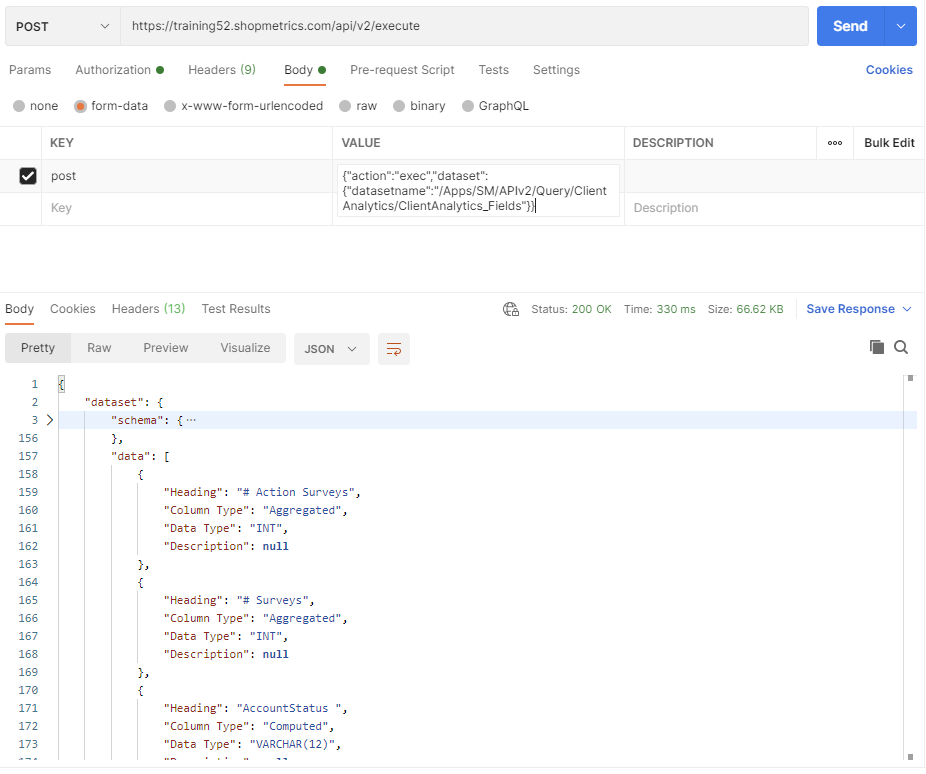
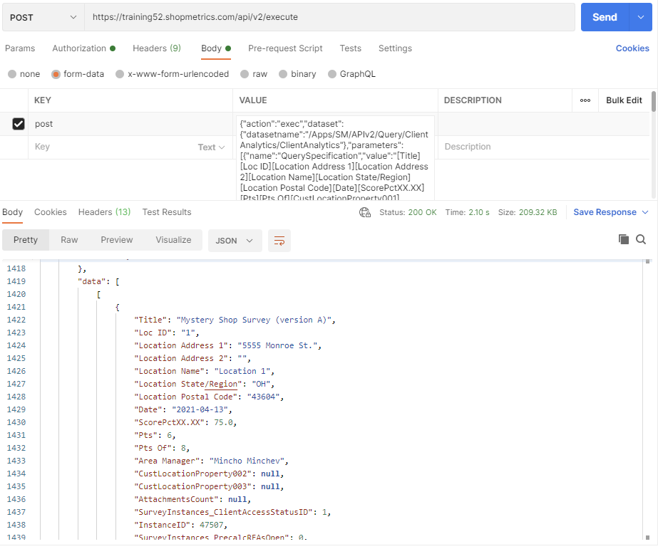
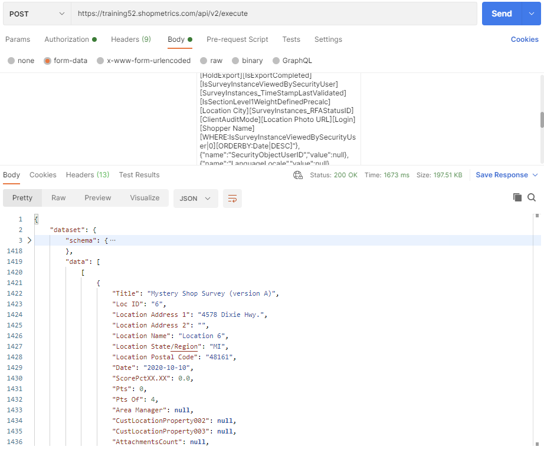

# Client Analytics Query Resources

Last Modified: 2023-02-10 | Code: APICA

## Client Analytics Fields

To see all available options (columns) of the “Query Specification” parameter for the ClientAnalytics Query Resource, use the “/APIv2/Query/ClientAnalytics/ClientAnalytics\_Fields” dataset.

### Shopmetrics CMS UI — Dataset Execution

### Postman

The API endpoint: /api/v2/execute  
  
The content for the “post” parameter in the Body:  
  
{"action":"exec","dataset":{"datasetname":"/Apps/SM/APIv2/Query/ClientAnalytics/ClientAnalytics\_Fields"}}

## List of Survey Instances

The example details how to use the “/APIv2/Query/ClientAnalytics/ClientAnalytics” dataset to get the same data as the Client Analytics Survey Explorer.  
  
**QuerySpecification parameter:** [Title][Loc ID][Location Address 1][Location Address 2][Location Name][Location State/Region][Location Postal Code][Date][ScorePctXX.XX][Pts][Pts Of][CustLocationProperty001][CustLocationProperty002][CustLocationProperty003][AttachmentsCount][SurveyInstances\_ClientAccessStatusID][InstanceID][SurveyInstances\_PrecalcRFAsOpen][SurveyInstances\_PrecalcRFAsClosed][WorkflowStepID][IsBeingExported][IsExportCompletedButFailed][IsOkForExport][HoldExport][IsExportCompleted][IsSurveyInstanceViewedBySecurityUser][SurveyInstances\_TimeStampLastValidated][IsSectionLevel1WeightDefinedPrecalc][Location City][SurveyInstances\_RFAStatusID][ClientAuditMode][Location Photo URL][Login][Shopper Name][ORDERBY:Date|DESC]  
  
**ClientOrFormIDs parameter:** -1135  
  
**Campaigns parameter:** Wave 01

### Shopmetrics CMS UI — Dataset Execution

### Postman

The API endpoint: /api/v2/execute

The content for the “post” parameter in the Body:  
  
{"action":"exec","dataset":{"datasetname":"/Apps/SM/APIv2/Query/ClientAnalytics/ClientAnalytics"},"parameters":[{"name":"QuerySpecification","value":"[Title][Loc ID][Location Address 1][Location Address 2][Location Name][Location State/Region][Location Postal Code][Date][ScorePctXX.XX][Pts][Pts Of][CustLocationProperty001][CustLocationProperty002][CustLocationProperty003][AttachmentsCount][SurveyInstances\_ClientAccessStatusID][InstanceID][SurveyInstances\_PrecalcRFAsOpen][SurveyInstances\_PrecalcRFAsClosed][WorkflowStepID][IsBeingExported][IsExportCompletedButFailed][IsOkForExport][HoldExport][IsExportCompleted][IsSurveyInstanceViewedBySecurityUser][SurveyInstances\_TimeStampLastValidated][IsSectionLevel1WeightDefinedPrecalc][Location City][SurveyInstances\_RFAStatusID][ClientAuditMode][Location Photo URL][Login][Shopper Name][ORDERBY:Date|DESC]"},{"name":"SecurityObjectUserID","value":null},{"name":"LanguageLocale","value":null},{"name":"ClientOrFormIDs","value":"-1135"},{"name":"DateFrom","value":null},{"name":"DateTo","value":null},{"name":"Campaigns","value":"Wave 01"},{"name":"LocationStoreIDs","value":null},{"name":"LocationNames","value":null},{"name":"LocationStates","value":null},{"name":"LocationCities","value":null},{"name":"CustomProperties","value":null},{"name":"CustomPropertyIDsReturnOrder","value":null},{"name":"UserLogins","value":null},{"name":"UserEmails","value":null},{"name":"UserFirstNames","value":null},{"name":"UserLastNames","value":null},{"name":"QuestionIDs","value":null},{"name":"SurveyInstanceIDs","value":null},{"name":"AdvancedFilter","value":null},{"name":"MiscSettings","value":null}]}



### PowerShell Code

```
Clear-Host;
Write-Host "Script Started";

#Url to the Shopmetrics Platform:
$SMPlatformURL = "https://training52.shopmetrics.com";

#Endpoint to get authentication token (Access Token):
$GetTokenEndpoint = "$($SMPlatformURL)/oauth/connect/token";

#Object with credentials to be used as payload for "get access token":
$GetTokenRequestPayload = @{client_id="Training52_ApiUserCA"; client_secret="client_secret"; grant_type="client_credentials"};

#Request Object to be used by the REST Request:
$GetTokenRequestObject = @{
Uri = $GetTokenEndpoint;
Method = "POST";
Body = $GetTokenRequestPayload;
};

#REST Request to get the Access Token and assigned to a variable:
$GetTokenResponse= Invoke-RestMethod @GetTokenRequestObject;
$AccessToken = $GetTokenResponse."access_token";
#Print Access Token to check if it is successfully retrieved:
#Write-Host $AccessToken;

#Endpoint to execute the dataset:
$DatasetsExecuteEndpoint = "$($SMPlatformURL)/api/v2/execute";

#The value of the "post" parameter of the Execute Dataset request. This is a JSON string where all required parameters of the dataset must be provided:
$DatasetExecutePostParam = ' {"action":"exec","dataset":{"datasetname":"/Apps/SM/APIv2/Query/ClientAnalytics/ClientAnalytics"},"parameters":[{"name":"QuerySpecification","value":"[Title][Loc ID][Location Address 1][Location Address 2][Location Name][Location State/Region][Location Postal Code][Date][ScorePctXX.XX][Pts][Pts Of][CustLocationProperty001][CustLocationProperty002][CustLocationProperty003][AttachmentsCount][SurveyInstances_ClientAccessStatusID][InstanceID][SurveyInstances_PrecalcRFAsOpen][SurveyInstances_PrecalcRFAsClosed][WorkflowStepID][IsBeingExported][IsExportCompletedButFailed][IsOkForExport][HoldExport][IsExportCompleted][IsSurveyInstanceViewedBySecurityUser][SurveyInstances_TimeStampLastValidated][IsSectionLevel1WeightDefinedPrecalc][Location City][SurveyInstances_RFAStatusID][ClientAuditMode][Location Photo URL][Login][Shopper Name][ORDERBY:Date|DESC]"},{"name":"SecurityObjectUserID","value":null},{"name":"LanguageLocale","value":null},{"name":"ClientOrFormIDs","value":"-1135"},{"name":"DateFrom","value":null},{"name":"DateTo","value":null},{"name":"Campaigns","value":"Wave 01"},{"name":"LocationStoreIDs","value":null},{"name":"LocationNames","value":null},{"name":"LocationStates","value":null},{"name":"LocationCities","value":null},{"name":"CustomProperties","value":null},{"name":"CustomPropertyIDsReturnOrder","value":null},{"name":"UserLogins","value":null},{"name":"UserEmails","value":null},{"name":"UserFirstNames","value":null},{"name":"UserLastNames","value":null},{"name":"QuestionIDs","value":null},{"name":"SurveyInstanceIDs","value":null},{"name":"AdvancedFilter","value":null},{"name":"MiscSettings","value":null}]}';

#The Body of the Request Object to be used by the Execute Dataset request. It has only 1 parameter: "post" and its "value" is the "JSON string" with the input parameters:
$DatasetExecuteRequestPayload = @{post="$DatasetExecutePostParam"};

#Request Object to be used by the Execute Dataset request:
$DatasetExecuteRequestObject = @{
Uri = $DatasetsExecuteEndpoint;
Headers = @{"Authorization" = "Bearer $AccessToken"};
Method = "POST";
Body = $DatasetExecuteRequestPayload;
};

#REST Request to get the output data and assigned to a variable:
$DatasetExecuteResponse = Invoke-RestMethod @DatasetExecuteRequestObject;

#Write the output data (in JSON format) in a txt file:
$DatasetExecuteResponse | ConvertTo-Json -Depth 20 | Out-String | Out-File -FilePath "$($PSScriptRoot)\SMAPIIntegration_Example_ClientAccess_Surveys_Result.txt"

Write-Host "Script Complete";
```

## List of NEW Survey Instances

The example explains how to use the “/APIv2/Query/ClientAnalytics/ClientAnalytics” dataset to get the same data as the Client Analytics Survey Explorer. The data returned is only for the Survey Instances that are not opened by the current user. In order to do this, we apply a “WHERE” clause in the query specification.

**QuerySpecification parameter:** [Title][Loc ID][Location Address 1][Location Address 2][Location Name][Location State/Region][Location Postal Code][Date][ScorePctXX.XX][Pts][Pts Of][CustLocationProperty001][CustLocationProperty002][CustLocationProperty003][AttachmentsCount][SurveyInstances\_ClientAccessStatusID][InstanceID][SurveyInstances\_PrecalcRFAsOpen][SurveyInstances\_PrecalcRFAsClosed][WorkflowStepID][IsBeingExported][IsExportCompletedButFailed][IsOkForExport][HoldExport][IsExportCompleted][IsSurveyInstanceViewedBySecurityUser][IsSectionLevel1WeightDefinedPrecalc][Location City][SurveyInstances\_RFAStatusID][ClientAuditMode][Location Photo URL][Login][Shopper Name][WHERE:IsSurveyInstanceViewedBySecurityUser|0][ORDERBY:Date|DESC]  
  
**ClientOrFormIDs parameter:** -1135  
  
**Campaigns parameter:** Wave 01

### Shopmetrics CMS UI — Dataset Execution

### Postman

The API endpoint: /api/v2/execute

The content for the “post” parameter in the Body:

{"action":"exec","dataset":{"datasetname":"/Apps/SM/APIv2/Query/ClientAnalytics/ClientAnalytics"},"parameters":[{"name":"QuerySpecification","value":"[Title][Loc ID][Location Address 1][Location Address 2][Location Name][Location State/Region][Location Postal Code][Date][ScorePctXX.XX][Pts][Pts Of][CustLocationProperty001][CustLocationProperty002][CustLocationProperty003][AttachmentsCount][SurveyInstances\_ClientAccessStatusID][InstanceID][SurveyInstances\_PrecalcRFAsOpen][SurveyInstances\_PrecalcRFAsClosed][WorkflowStepID][IsBeingExported][IsExportCompletedButFailed][IsOkForExport][HoldExport][IsExportCompleted][IsSurveyInstanceViewedBySecurityUser][SurveyInstances\_TimeStampLastValidated][IsSectionLevel1WeightDefinedPrecalc][Location City][SurveyInstances\_RFAStatusID][ClientAuditMode][Location Photo URL][Login][Shopper Name][WHERE:IsSurveyInstanceViewedBySecurityUser|0][ORDERBY:Date|DESC]"},{"name":"SecurityObjectUserID","value":null},{"name":"LanguageLocale","value":null},{"name":"ClientOrFormIDs","value":"-1135"},{"name":"DateFrom","value":null},{"name":"DateTo","value":null},{"name":"Campaigns","value":"Wave 01"},{"name":"LocationStoreIDs","value":null},{"name":"LocationNames","value":null},{"name":"LocationStates","value":null},{"name":"LocationCities","value":null},{"name":"CustomProperties","value":null},{"name":"CustomPropertyIDsReturnOrder","value":null},{"name":"UserLogins","value":null},{"name":"UserEmails","value":null},{"name":"UserFirstNames","value":null},{"name":"UserLastNames","value":null},{"name":"QuestionIDs","value":null},{"name":"SurveyInstanceIDs","value":null},{"name":"AdvancedFilter","value":null},{"name":"MiscSettings","value":null}]}  


### PowerShell code

```
Clear-Host;
Write-Host "Script Started";
Write-Host;

#Url to the Shopmetrics Platform:
$SMPlatformURL = "https://training52.shopmetrics.com";

#Endpoint to get authentication token (Access Token):
$GetTokenEndpoint = "$($SMPlatformURL)/oauth/connect/token";

#Object with credentials to be used as payload for "get access token":
$GetTokenRequestPayload = @{client_id="Training52_APIUserCA"; client_secret="client_secret"; grant_type="client_credentials"};

#Request Object to be used by the REST Request:
$GetTokenRequestObject = @{
Uri = $GetTokenEndpoint;
Method = "POST";
Body = $GetTokenRequestPayload;
};

#REST Request to get the Access Token and assigned to a variable:
$GetTokenResponse= Invoke-RestMethod @GetTokenRequestObject;
$AccessToken = $GetTokenResponse."access_token";
#Print Access Token to check if it is successfully retrieved:
#Write-Host $AccessToken;

#Endpoint to execute the dataset:
$DatasetsExecuteEndpoint = "$($SMPlatformURL)/api/v2/execute";

#The value of the "post" parameter of the Execute Dataset request. This is a JSON string where all required parameters of the dataset must be provided:
$DatasetExecutePostParam = ' {"action":"exec","dataset":{"datasetname":"/Apps/SM/APIv2/Query/ClientAnalytics/ClientAnalytics"},"parameters":[{"name":"QuerySpecification","value":"[Title][Loc ID][Location Address 1][Location Address 2][Location Name][Location State/Region][Location Postal Code][Date][ScorePctXX.XX][Pts][Pts Of][CustLocationProperty001][CustLocationProperty002][CustLocationProperty003][AttachmentsCount][SurveyInstances_ClientAccessStatusID][InstanceID][SurveyInstances_PrecalcRFAsOpen][SurveyInstances_PrecalcRFAsClosed][WorkflowStepID][IsBeingExported][IsExportCompletedButFailed][IsOkForExport][HoldExport][IsExportCompleted][IsSurveyInstanceViewedBySecurityUser][SurveyInstances_TimeStampLastValidated][IsSectionLevel1WeightDefinedPrecalc][Location City][SurveyInstances_RFAStatusID][ClientAuditMode][Location Photo URL][Login][Shopper Name][WHERE:IsSurveyInstanceViewedBySecurityUser|0][ORDERBY:Date|DESC]"},{"name":"SecurityObjectUserID","value":null},{"name":"LanguageLocale","value":null},{"name":"ClientOrFormIDs","value":"-1135"},{"name":"DateFrom","value":null},{"name":"DateTo","value":null},{"name":"Campaigns","value":"Wave 01"},{"name":"LocationStoreIDs","value":null},{"name":"LocationNames","value":null},{"name":"LocationStates","value":null},{"name":"LocationCities","value":null},{"name":"CustomProperties","value":null},{"name":"CustomPropertyIDsReturnOrder","value":null},{"name":"UserLogins","value":null},{"name":"UserEmails","value":null},{"name":"UserFirstNames","value":null},{"name":"UserLastNames","value":null},{"name":"QuestionIDs","value":null},{"name":"SurveyInstanceIDs","value":null},{"name":"AdvancedFilter","value":null},{"name":"MiscSettings","value":null}]}';

#The Body of the Request Object to be used by the Execute Dataset request. It has only 1 parameter: "post" and its "value" is the "JSON string" with the input parameters:
$DatasetExecuteRequestPayload = @{post="$DatasetExecutePostParam"};

#Request Object to be used by the Execute Dataset request:
$DatasetExecuteRequestObject = @{
Uri = $DatasetsExecuteEndpoint;
Headers = @{"Authorization" = "Bearer $AccessToken"};
Method = "POST";
Body = $DatasetExecuteRequestPayload;
};

#REST Request to get the output data and assigned to a variable:
$DatasetExecuteResponse = Invoke-RestMethod @DatasetExecuteRequestObject;

#Write the output data (in JSON format) in a txt file:
$DatasetExecuteResponse | ConvertTo-Json -Depth 20 | Out-String | Out-File -FilePath "$($PSScriptRoot)\SMAPIIntegration_Example_ClientAccess_SurveysNew_Result.txt"

Write-Host;
Write-Host "Script Complete";
```
