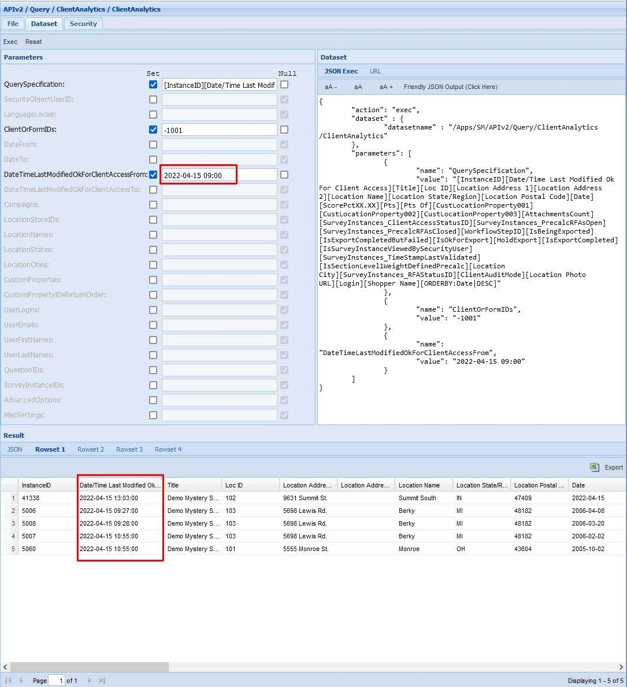
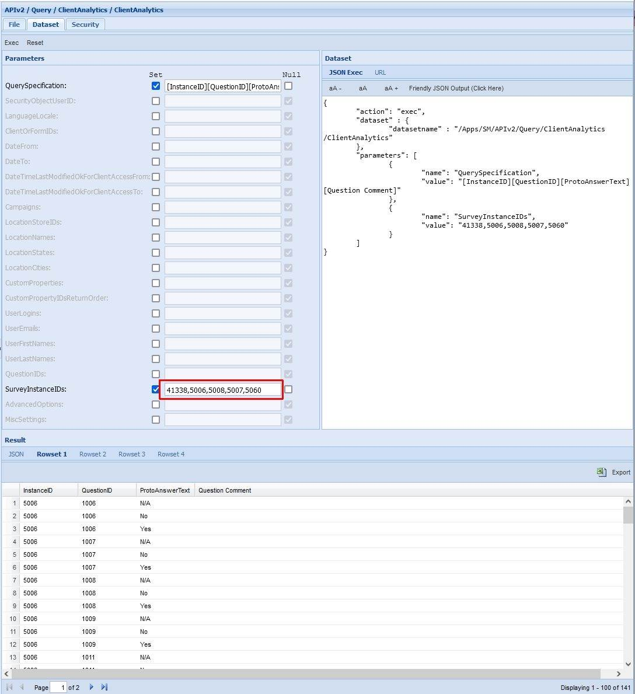

# Use Case: Extract Client Access Survey Data Incrementally

Last Modified: 2024-11-06 | Code: APICAUC

The purpose of this article is to demonstrate how you can use the Shopmetrics Query API to extract client access data incrementally. Every run of the extraction process (job/script/etc.) works only for survey data that has been changed since the last extraction.

Below is a description of the data extraction process that uses the “/APIv2/Query/ClientAnalytics/ClientAnalytics” query resource. The process includes the following steps:

1. Retrieving of the Last Extraction Date/Time

- If you are running the process (script) for the first time you need to manually set Last Extraction Date/Time to a value, relevant to your business case. This value must be before the current date/time

2. Setting the Next Extraction Date/Time to the current date/time

3. Extracting “Survey Explorer” data for the Survey Instances by:

- Using a Query Specification that includes the Survey Instance ID and other relevant fields (example below)
- Using the Last Extraction Date/Time for filtering the result. The Last Extraction Date/Time should be set as a value to the “DateTimeLastModifiedOkForClientAccessFrom” parameter of the “/APIv2/Query/ClientAnalytics/ClientAnalytics” query resource.

4. Creating a CSV list of the Survey Instance IDs for the Survey Instances, extracted on step 3.

- The CSV list will be used in the next step for filtering. Filtering by the dates again is not a good approach as changes may occur in the period between the two requests. This is why we will use the CSV list to filter for the exact same set of survey instances that the first request returned.

5. Extracting the Survey Instance Data by:

- Using the following Query Specification: [InstanceID][QuestionID][ProtoAnswerText][Question Comment]
- Using the previously created CSV list of Survey Instance IDs for filtering the result. The CSV list should be set as a value to the “SurveyInstanceIDs” parameter of the “/APIv2/Query/ClientAnalytics/ClientAnalytics” query resource.

6. Saving the Next Extraction Date/Time as Last Extraction Date/Time to be used by the next run of the process

## List of Modified Survey Instances

The example below shows how to get a list of all survey instances with status “Ok for Client View”, that have been modified since the last data extraction.

**Dataset**: /APIv2/Query/ClientAnalytics/ClientAnalytics

**Last Extraction Date/Time**: 2022-04-15 09:00

**Next Extraction Date/Time**: 2022-04-15 14:00

### Shopmetrics CMS UI — Dataset Execution

**1. Retrieve the Last Extraction Date/Time** - in this example it is 2022-04-15 09:00

**2. Set a Next Extraction Date/Time** - in this example it is 2022-04-15 14:00

**3. Extract Survey Instance data, using the Last Extraction Date/Time for filtering the result:**

**QuerySpecification parameter:**[InstanceID][Date/Time Last Modified Ok For Client Access][Title][Loc ID][Location Address 1][Location Address 2][Location Name][Location State/Region][Location Postal Code][Date][ScorePctXX.XX][Pts][Pts Of][CustLocationProperty001][CustLocationProperty002][CustLocationProperty003][AttachmentsCount][SurveyInstances\_ClientAccessStatusID][SurveyInstances\_PrecalcRFAsOpen][SurveyInstances\_PrecalcRFAsClosed][WorkflowStepID][IsBeingExported][IsExportCompletedButFailed][IsOkForExport][HoldExport][IsExportCompleted][IsSurveyInstanceViewedBySecurityUser][SurveyInstances\_TimeStampLastValidated][IsSectionLevel1WeightDefinedPrecalc][Location City][SurveyInstances\_RFAStatusID][ClientAuditMode][Location Photo URL][ORDERBY:Date|DESC]

**ClientOrFormIDs parameter**: -1001

**DateTimeLastModifiedOkForClientAccessFrom:** 2022-04-15 09:00

**NOTE: The parameters “DateTimeLastModifiedOkForClientAccessFrom” and “DateTimeLastModifiedOkForClientAccessTo” accept date/time values in UTC format**

**NOTE: The column “Date/Time Last Modified Ok For Client Access” returns values in UTC date/time format**

**4. Create s CSV list of the Survey Instance IDs for the extracted instances:**

In this example the CSV list will include the following Survey Instance IDs: 41338,5006,5008,5007,5060

**5. Extract the Survey Instance Data, using the created CSV list for filtering the result:**

**QuerySpecification parameter:** [InstanceID][QuestionID][ProtoAnswerText][Question Comment]

**SurveyInstanceIDs parameter**: 41338,5006,5008,5007,5060

The result will contain data only for the Survey Instances that have been modified since the last data extraction.

**6. Save the Next Extraction Date/Time as Last Extraction Date/Time to be used by the next run of the process:**

In this example the Last Extraction Date/Time will be updated to 2022-04-15 14:00.

**7. If the next run of the process is scheduled for 2022-04-15 20:00, the date/time values will be as follows:**

- **Last Extraction Date/Time:** 2022-04-15 14:00
- **Next Extraction Date/Time:** 2022-04-15 20:00

### PowerShell Code

```
Clear-Host;
Write-Host "Script Started";
Write-Host;

#Url to the Shopmetrics Platform:
$SMPlatformURL = "https://training77.shopmetrics.com";

#Endpoint to get authentication token (Access Token):
$GetTokenEndpoint = "$($SMPlatformURL)/oauth/connect/token";

#Object with credentials to be used as payload for "get access token":
$GetTokenRequestPayload = @{client_id="Training77_ClientUserAPI"; client_secret="client secret"; grant_type="client_credentials"};

#Request Object to be used by the REST Request:
$GetTokenRequestObject = @{
    Uri         = $GetTokenEndpoint;
    Method      = "POST";
    Body        = $GetTokenRequestPayload;
};

#REST Request to get the Access Token and assigning it to a variable:
$GetTokenResponse = Invoke-RestMethod @GetTokenRequestObject;
$AccessToken = $GetTokenResponse."access_token";
#Print Access Token to check if it is successfully retrieved:
#Write-Host $AccessToken;

#During the first script execution the Last Extraction Date/Time can be set manually:
$LastExtractionParamUTC = '2022-04-15 09:00';

#For each subsequent script execution, use the $NextExtractionParamUTC value from the previous execution:
#$LastExtractionParamUTC = $NextExtractionParamUTC

#Set the $NextExtractionParamUTC Value with the current Date/Time in UTC format and save it for the next script execution:
$NextExtractionParamUTC = (Get-Date).ToUniversalTime().ToString("yyyy/MM/dd HH:mm");

#Endpoint to execute the dataset:
$DatasetsExecuteEndpoint = "$($SMPlatformURL)/api/v2/execute";

#The value of the "post" parameter of the Execute Dataset request. This is a JSON string where all required parameters of dataset the must be provided.
#We do a request to the "ClientAnalytics" dataset and check the status of the Survey Instances. The DateTimeLastModifiedOkForClientAccessFrom parameter is used for filtering by Last Extraction Date/Time:
$DatasetExecutePostParam = '{
"action": "exec",
"dataset" : {
"datasetname" : "/Apps/SM/APIv2/Query/ClientAnalytics/ClientAnalytics"
},
"parameters": [
{
"name": "QuerySpecification",
"value": "[InstanceID][Date/Time Last Modified Ok For Client Access][Title][Loc ID][Location Address 1][Location Address 2][Location Name][Location State/Region][Location Postal Code][Date][ScorePctXX.XX][Pts][Pts Of][CustLocationProperty001][CustLocationProperty002][CustLocationProperty003][AttachmentsCount][SurveyInstances_ClientAccessStatusID][SurveyInstances_PrecalcRFAsOpen][SurveyInstances_PrecalcRFAsClosed][WorkflowStepID][IsBeingExported][IsExportCompletedButFailed][IsOkForExport][HoldExport][IsExportCompleted][IsSurveyInstanceViewedBySecurityUser][SurveyInstances_TimeStampLastValidated][IsSectionLevel1WeightDefinedPrecalc][Location City][SurveyInstances_RFAStatusID][ClientAuditMode][Location Photo URL][ORDERBY:Date|DESC]"
},
        {
"name": "ClientOrFormIDs",
"value": "-1001"
},
{
"name": "DateTimeLastModifiedOkForClientAccessFrom",
"value": "'+$LastExtractionParamUTC+'"
},
{
"name": "DateTimeLastModifiedOkForClientAccessTo",
"value": null
}
]
}';

#The Body of the Request Object to be used by the Execute Dataset request. It has only 1 parameter: "post" and its "value" is the "JSON string" with the input parameters:
$DatasetExecuteRequestPayload = @{post="$DatasetExecutePostParam"};

#Request Object to be used by the Execute Dataset request:
$DatasetExecuteRequestObject = @{
    Uri         = $DatasetsExecuteEndpoint;
    Headers     = @{"Authorization" = "Bearer $AccessToken"};
    Method      = "POST";
    Body        = $DatasetExecuteRequestPayload;
};

#REST Request to get the output data and assigning it to a variable: 
$DatasetExecuteResponse = Invoke-RestMethod @DatasetExecuteRequestObject;

#Write-Host $DatasetExecuteResponse.dataset.data[0];
$ResponseData = $DatasetExecuteResponse.dataset.data[0];

$SurveInstanceIDs = "";
#Create a CSV list of Survey Instance IDs from the Response Data
ForEach ($Row in $ResponseData) {
  $SurveInstanceIDs += $Row.InstanceID;
$SurveInstanceIDs += ",";
};

#Write-Host $SurveInstanceIDs 

#Request to get Survey Instance Data using the created CSV List as a value for the SurveyInstanceIDs filtering parameter:
$DatasetExecutePostParam = '{
"action": "exec",
"dataset" : {
"datasetname" : "/Apps/SM/APIv2/Query/ClientAnalytics/ClientAnalytics"
},
"parameters": [
{
"name": "QuerySpecification",
"value": "[InstanceID][QuestionID][ProtoAnswerText][Question Comment]"
},
{
"name": "SurveyInstanceIDs",
"value": "'+ $SurveInstanceIDs +'"
}
]
}';

#The Body of the Request Object to be used by the Execute Dataset request. It has only 1 parameter: "post" and its "value" is the "JSON string" with the input parameters:
$DatasetExecuteRequestPayload = @{post="$DatasetExecutePostParam"};

#Request Object to be used by the Execute Dataset request:
$DatasetExecuteRequestObject = @{
    Uri         = $DatasetsExecuteEndpoint;
    Headers     = @{"Authorization" = "Bearer $AccessToken"};
    Method      = "POST";
    Body        = $DatasetExecuteRequestPayload;
};

#REST Request to get the output data and assigning it to a variable: 
$DatasetExecuteResponse = Invoke-RestMethod @DatasetExecuteRequestObject;
#Write-Host $DatasetExecuteResponse.dataset.data[0];

Write-Host;
Write-Host "Script Complete";
```

## Key Survey Events Modifying Date/Time Last Modified Ok For Client Access

The table below lists the most frequent survey history events that trigger changes to the "Date/Time Last Modified Ok For Client Access" column, thereby influencing the incremental data extraction process.

| EventTypeID | EventType | EventTypeComment |
| --- | --- | --- |
| 105 | SURVEY.ATTACHMENT.DISABLE | Attachment {##EventParam01##} Disabled: {##EventParam02##} |
| 107 | SURVEY.AUDITORSUBMIT | Survey submitted |
| 108 | SURVEY.AUDITORSUBMIT.OFFLINE | Survey submitted |
| 109 | SURVEY.AUDITORSUBMIT.ONLINE | Survey submitted |
| 114 | SURVEY.CLIENTACCESSSTAT.SHOWALL | Client Access status changed: OK for Client Access |
| 116 | SURVEY.EXPORTED | Survey Export Completed Successfully. Export ID: [{##EventParam02##}] |
| 121 | SURVEY.INSTANTIATE.IMPORT | Survey imported |
| 124 | SURVEY.INSTANTIATE.MANUALLY | Survey created manually |
| 135 | SURVEY.RFA.ACCEPT | RFA Accepted |
| 137 | SURVEY.RFA.OPEN | Survey RFA open |
| 139 | SURVEY.SAVED.OFFLINE | Saved from an offline client or mobile device |
| 140 | SURVEY.SAVED.ONLINE | Survey saved on the Web |
| 148 | SURVEY.VERIFICATION | Survey or survey property modified |
| 163 | SURVEY.SCORE.RECALCULATION.OK | Survey score reset and recalculated. |
| 177 | SURVEY.CLIENTACCESSSTAT.SHOWREPORTS | Client Access status changed: OK for Reports; Hide from Client Survey Explorer |
| 205 | SURVEY.ATTACHMENT.DISABLE.REPOSITORY | Delete Attachment from Repository |
| 213 | SURVEY.V3.EVENTLOG.CHUNK.APPENDED | Event log chunk appended. |
| 214 | SURVEY.V3.EVENTLOG.CHUNK.DISCARDED | Event log chunk discarded. |
| 215 | SURVEY.V3.EVENTLOG.RESEQUENCED | Event log resequenced. |
| 232 | SURVEY.CUSTOM.PROPERTIES.UPDATE.USING.LOCATION.VALUES | Custom properties were updated using location custom properties values. |
| 241 | SURVEY.PERSONAL.DATA.CLEARED | Personal data removed from instance by the project archival process. |
| 242 | SURVEY.RFA.AUTO.ACCEPT | RFA Accepted Automatically |
| 252 | SURVEY.BULKPROCESSING.REFERENCECODE.RESET | Project Reference value reset via bulk processing. |
| 266 | SURVEY.CALL.STATUS | Call Status - {##EventParam01##} |
| 300 | SURVEY.ATTACHMENT.ADD | Attachment {##EventParam01##} Added |
| 301 | SURVEY.ATTACHMENT.DELETE | Failed to upload attachment {##EventParam01##}. Attachment removed ! |
| 304 | SURVEY.ATTACHMENT.MOVE.FROM | Attachment ID ({##EventParam01##}) moved to this survey from Survey Instance {##EventParam02##} |
| 305 | SURVEY.ATTACHMENT.MOVE.TO | Attachment ID ({##EventParam01##}) moved to Survey Instance {##EventParam02##} |
| 313 | SURVEY.CAMPAIGN.SET.BULK.OK | Campaign set successfully to: {##EventParam02##} |
| 339 | SURVEY.MAILBOX.MOVE | Survey moved to Mailbox: {##MailBoxID[{##EventParam02##}]##} |
| 353 | SURVEY.SETHOLDSTATUS.BULK.OK | Hold Export Status set to "##HoldStatus[{##EventParam02##}]##}" |
| 398 | COLLABORATIONS.SURVEY.UPDATED | Survey updated by an automated collaboration service. [Secondary InstanceID: {##EventParam01##}] [DefinitionID: {##EventParam02##}] |
| 400 | SURVEY.CUSTOM.PROPERTY.DELETED | Custom Property {##CustomProperty##} Deleted |
| 423 | SURVEY.ATTACHMENT.MODIFIED | Attachment modified. AttachmentID: {##EventParam01##} |
| 425 | SURVEY.OSM.INSTANTIATE.CLONED | Survey data copied from Survey Instance ID: {##EventParam01##} (Source Survey Form Version: {##GUID[{##EventParam02##}]##}) |
| 450 | SURVEY.ATTACHMENT.ENABLE | Attachment {##EventParam01##} enabled. |
| 453 | SURVEY.DATA.ENCRYPT | Personal Data encryption completed due to change in Data Classification: QuestionID {##EventParam01##} |
| 461 | SURVEY.APPEAL.UPDATED | Appeal ID {##EventParam02##} updated |
| 465 | SURVEY.APPEAL.REOPEN | Appeal ID {##EventParam01##} reopened. |
| 474 | SURVEY.BULKPROCESSING.REFERENCECODE.CHANGED | Project Reference value changed to "{##ReferenceCodeID[{##EventParam01##}]##}" via bulk processing. |
| 479 | SURVEY.INSTANTIATE.WORKORDERLINE | Survey create using Work Order Line ID: {##EventParam01##}. |
| 480 | SURVEY.BULKPROCESSING.ADDITIONAL.PAYITEMS.REMOVED | Additional Pay/Reimbursement Items removed |
| 481 | SURVEY.BULKPROCESSING.LOCATION.CHANGED | Survey instance location changed from {##MystLocationID[{##EventParam01##}]##} to {##MystLocationID[{##EventParam02##}]##}. |
| 506 | SURVEY.EXPORTED.MANUALLY | {##EventParam03##} |
| 527 | SURVEY.MANAGE.CUSTOM.PROPERTY | Custom property {##CustomProperty##} value changed via bulk process. |
| 541 | SURVEY.APPEAL.QUESTION.CURED | Question modified via Appeals Question Curing module. |
| 1209 | SURVEY.SETCUSTOMSTATUS | Custom Survey Status set |
| 1215 | SURVEY.ACTIONPLAN.ADMINISTRATIVE.SUBMIT | Survey submitted by action plan process (Administrative submit) |
