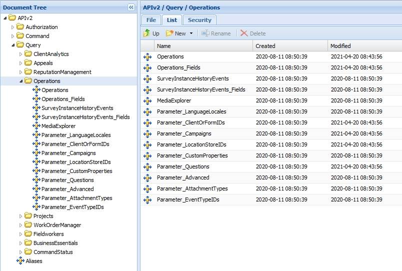

# Introduction to Operations

Last Modified: 2023-02-10 | Code: APIIOP

The Shopmetrics API Operations Query Data Model can be used for retrieving data for surveys with any status.

**NOTE: Due to the rapid development of our product, some of the images in this set of articles will differ slightly from the production implementation.**

