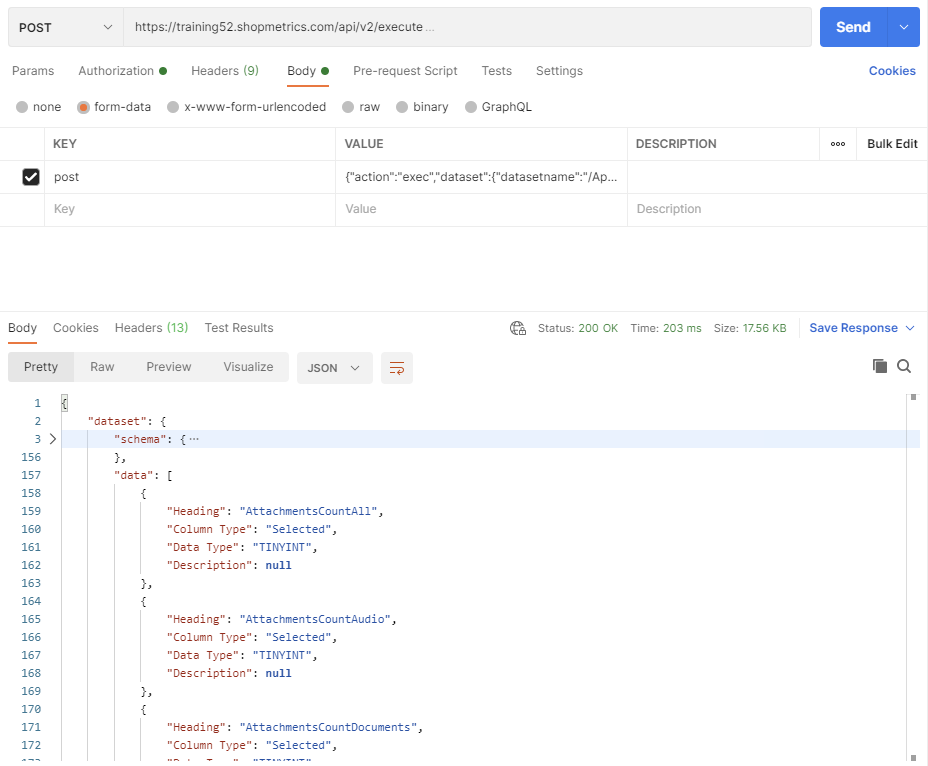
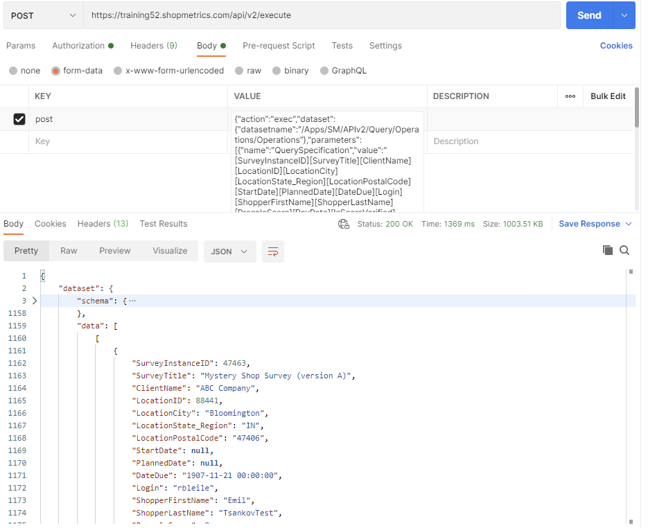

# Operations Query Resources

Last Modified: 2023-02-10 | Code: APIOP

## Operations Fields

To see all available options (columns) of the “Query Specification” parameter for the Operations Query Resource, use the “/Apps/SM/APIv2/Query/Operations/Operations\_Fields” dataset. The dataset can be executed without supplying values for the parameters.

### Shopmetrics CMS UI — Dataset Execution

### Postman

The API endpoint: /api/v2/execute

The content for the “post” parameter in the Body:

{"action":"exec","dataset":{"datasetname":"/Apps/SM/APIv2/Query/Operations/Operations\_Fields"},"parameters":[{"name":"SecurityObjectUserID","value":null},{"name":"MiscSettings","value":null}]}



## List of Survey Instances

The example below shows how to use the “/APIv2/Query/Operations/Operations” dataset to get the same data as the Survey Manager Survey Explorer.

**QuerySpecification parameter**: [SurveyInstanceID][SurveyTitle][ClientName][LocationID][LocationCity][LocationState\_Region][LocationPostalCode][StartDate][PlannedDate][DateDue][Login][ShopperFirstName][ShopperLastName][PrecalcScore][PayRate][IsScoreVerified][IsQuestionsVerified][IsOkForExport][HoldExport][IsOkForInvoice][IsOkForPayroll]

**ClientOrFormIDs parameter:** -1135

### Shopmetrics CMS UI — Dataset Execution

### Postman

The API endpoint: /api/v2/execute

The content for the “post” parameter in the Body:

{"action":"exec","dataset":{"datasetname":"/Apps/SM/APIv2/Query/Operations/Operations"},"parameters":[{"name":"QuerySpecification","value":"[SurveyInstanceID][SurveyTitle][ClientName][LocationID][LocationCity][LocationState\_Region][LocationPostalCode][StartDate][PlannedDate][DateDue][Login][ShopperFirstName][ShopperLastName][PrecalcScore][PayRate][IsScoreVerified][IsQuestionsVerified][IsOkForExport][HoldExport][IsOkForInvoice][IsOkForPayroll]"},{"name":"SecurityObjectUserID","value":null},{"name":"LanguageLocale","value":null},{"name":"ClientOrFormIDs","value":"-1135"},{"name":"DateFrom","value":null},{"name":"DateTo","value":null},{"name":"Campaigns","value":null},{"name":"LocationStoreIDs","value":null},{"name":"LocationNames","value":null},{"name":"LocationStates","value":null},{"name":"LocationCities","value":null},{"name":"CustomProperties","value":null},{"name":"CustomPropertyIDsReturnOrder","value":null},{"name":"UserLogins","value":null},{"name":"UserEmails","value":null},{"name":"UserFirstNames","value":null},{"name":"UserLastNames","value":null},{"name":"QuestionIDs","value":null},{"name":"SurveyInstanceIDs","value":null},{"name":"AdvancedFilter","value":null},{"name":"MiscSettings","value":null}]}



### PowerShell code

```
Clear-Host;
Write-Host "Script Started";
Write-Host;

#Url to the Shopmetrics Platform:
$SMPlatformURL = "https://training52.shopmetrics.com";

#Endpoint to get authentication token (Access Token):
$GetTokenEndpoint = "$($SMPlatformURL)/oauth/connect/token";

#Object with credentials to be used as payload for "get access token":
$GetTokenRequestPayload = @{client_id="Training52_ApiUserOM"; client_secret="client_secret"; grant_type="client_credentials"};

#Request Object to be used by the REST Request:
$GetTokenRequestObject = @{
Uri = $GetTokenEndpoint;
Method = "POST";
Body = $GetTokenRequestPayload;
};

#REST Request to get the Access Token and assigned to a variable:
$GetTokenResponse= Invoke-RestMethod @GetTokenRequestObject;
$AccessToken = $GetTokenResponse."access_token";
#Print Access Token to check if it is successfully retrieved:
#Write-Host $AccessToken;

#Endpoint to execute the dataset:
$DatasetsExecuteEndpoint = "$($SMPlatformURL)/api/v2/execute";

#The value of the "post" parameter of the Execute Dataset request. This is a JSON string where all reqiured parameters of the dataset must be provided:
$DatasetExecutePostParam = ' {"action":"exec","dataset":{"datasetname":"/Apps/SM/APIv2/Query/Operations/Operations"},"parameters":[{"name":"QuerySpecification","value":"[SurveyInstanceID][SurveyTitle][ClientName][LocationID][LocationCity][LocationState_Region][LocationPostalCode][StartDate][PlannedDate][DateDue][Login][ShopperFirstName][ShopperLastName][PrecalcScore][PayRate][IsScoreVerified][IsQuestionsVerified][IsOkForExport][HoldExport][IsOkForInvoice][IsOkForPayroll]"},{"name":"SecurityObjectUserID","value":null},{"name":"LanguageLocale","value":null},{"name":"ClientOrFormIDs","value":"-1135"},{"name":"DateFrom","value":null},{"name":"DateTo","value":null},{"name":"Campaigns","value":null},{"name":"LocationStoreIDs","value":null},{"name":"LocationNames","value":null},{"name":"LocationStates","value":null},{"name":"LocationCities","value":null},{"name":"CustomProperties","value":null},{"name":"CustomPropertyIDsReturnOrder","value":null},{"name":"UserLogins","value":null},{"name":"UserEmails","value":null},{"name":"UserFirstNames","value":null},{"name":"UserLastNames","value":null},{"name":"QuestionIDs","value":null},{"name":"SurveyInstanceIDs","value":null},{"name":"AdvancedFilter","value":null},{"name":"MiscSettings","value":null}]}';

#The Body of the Request Object to be used by the Execute Dataset request. It has only 1 parameter: "post" and its "value" is the "JSON string" with the input parameters:
$DatasetExecuteRequestPayload = @{post="$DatasetExecutePostParam"};

#Request Object to be used by the Execute Dataset request:
$DatasetExecuteRequestObject = @{
Uri = $DatasetsExecuteEndpoint;
Headers = @{"Authorization" = "Bearer $AccessToken"};
Method = "POST";
Body = $DatasetExecuteRequestPayload;
};

#REST Request to get the output data and assigned to a variable:
$DatasetExecuteResponse = Invoke-RestMethod @DatasetExecuteRequestObject;

#Write the output data (in JSON format) in a txt file:
$DatasetExecuteResponse | ConvertTo-Json -Depth 20 | Out-String | Out-File -FilePath "$($PSScriptRoot)\SMAPIIntegration_Example_Operational_Surveys_Result.txt"

Write-Host;
Write-Host "Script Complete";
```
