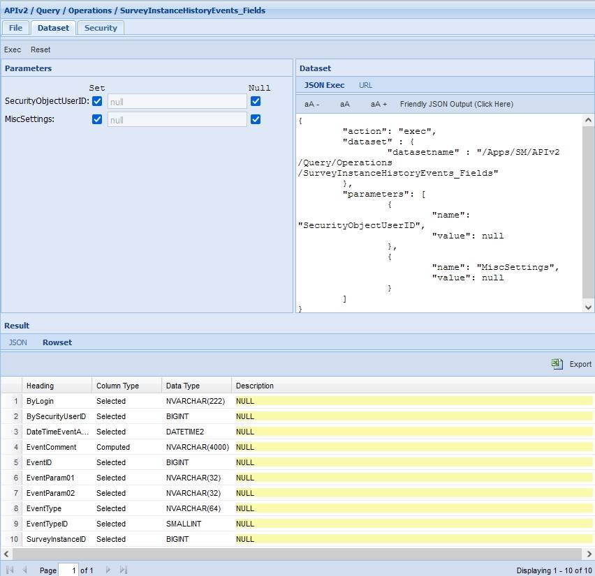
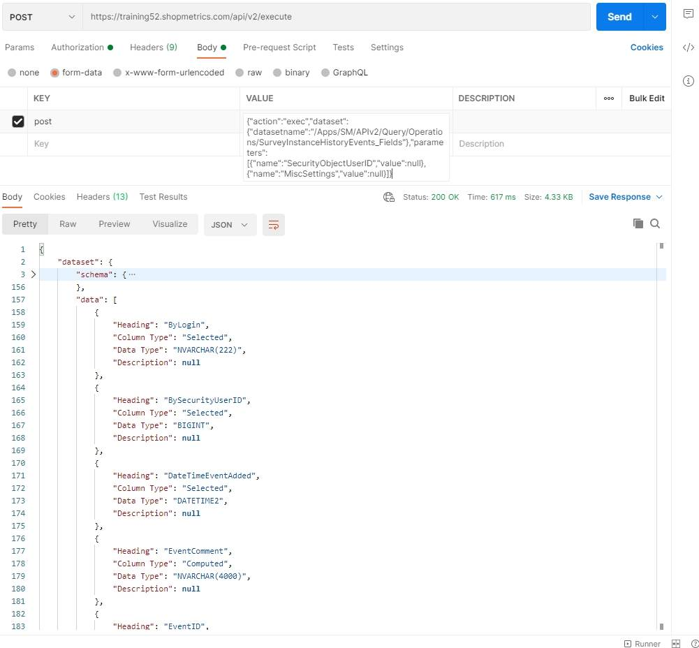
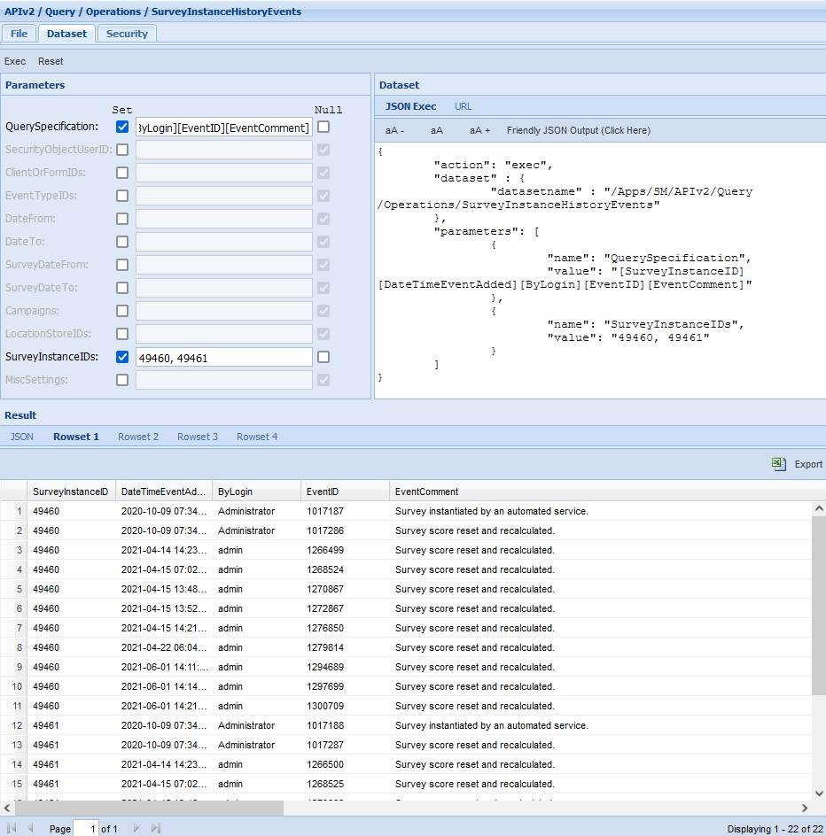
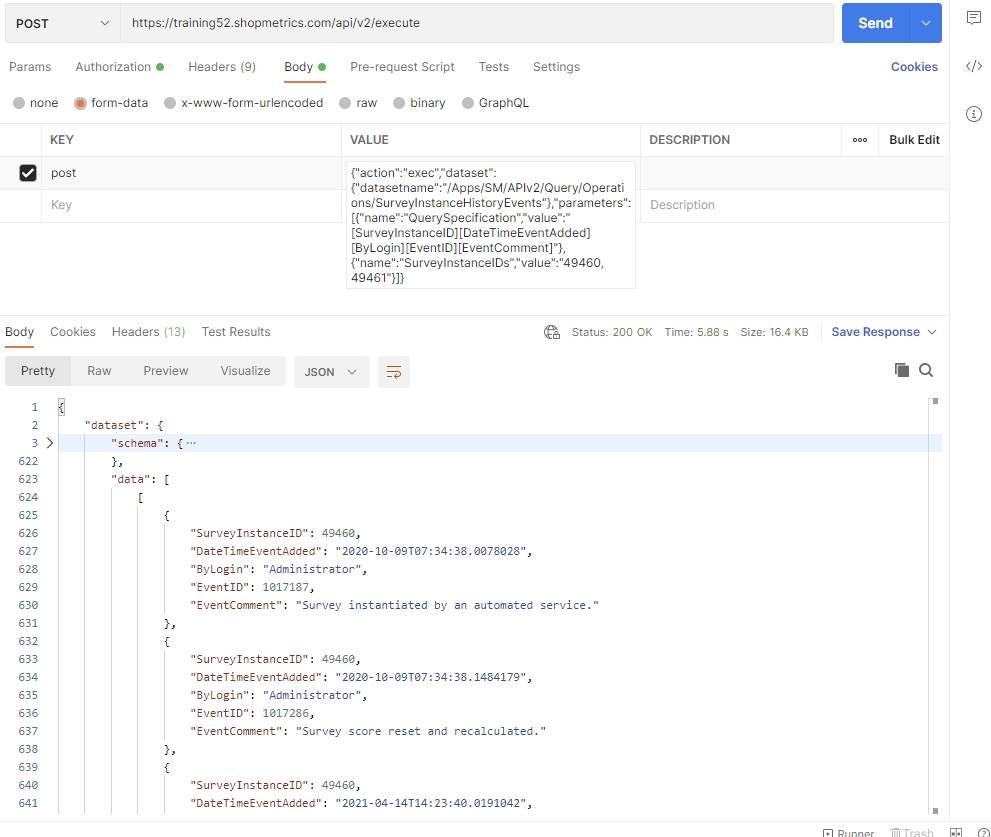

# Survey Instance History Events Query Resources

Last Modified: 2023-02-10 | Code: APIOSIH

## Survey Instance History Events Fields

To see all available options (columns) of the “Query Specification” parameter for the Survey Instance History Events Query Resource, use the “/APIv2/Query/Operations/SurveyInstanceHistoryEvents\_Fields” dataset. The dataset can be executed without supplying values for the parameters.

### Shopmetrics CMS UI – Dataset Execution

### Postman

The content for the “post” parameter in Body:

{"action":"exec","dataset":{"datasetname":"/Apps/SM/APIv2/Query/Operations/SurveyInstanceHistoryEvents\_Fields"},"parameters":[{"name":"SecurityObjectUserID","value":null},{"name":"MiscSettings","value":null}]}

## List of Survey Instance History Events

The example below demonstrates how Survey Instance History events can be queried using the “/APIv2/Query/Operations/SurveyInstanceHistoryEvents” base resource:

**QuerySpecification parameter:** [SurveyInstanceID][DateTimeEventAdded][ByLogin][EventID][EventComment]

**SurveyInstanceIDs parameter:** 49460, 49461

### Shopmetrics CMS UI – Dataset Execution

### Postman

The content for the “post” parameter in Body:

{"action":"exec","dataset":{"datasetname":"/Apps/SM/APIv2/Query/Operations/SurveyInstanceHistoryEvents"},"parameters":[{"name":"QuerySpecification","value":"[SurveyInstanceID][DateTimeEventAdded][ByLogin][EventID][EventComment]"},{"name":"SurveyInstanceIDs","value":"49460, 49461"}]}

