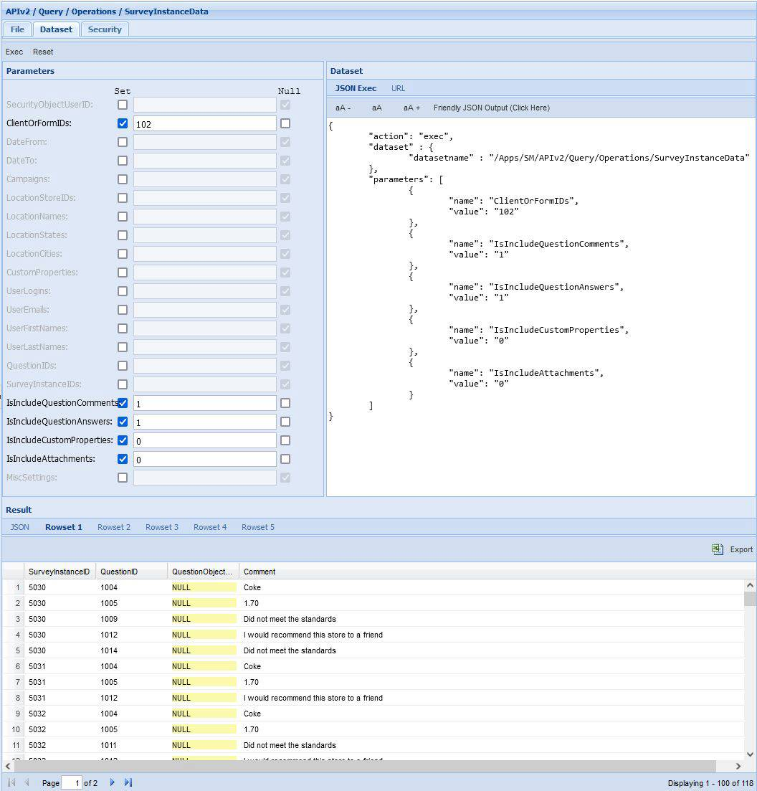
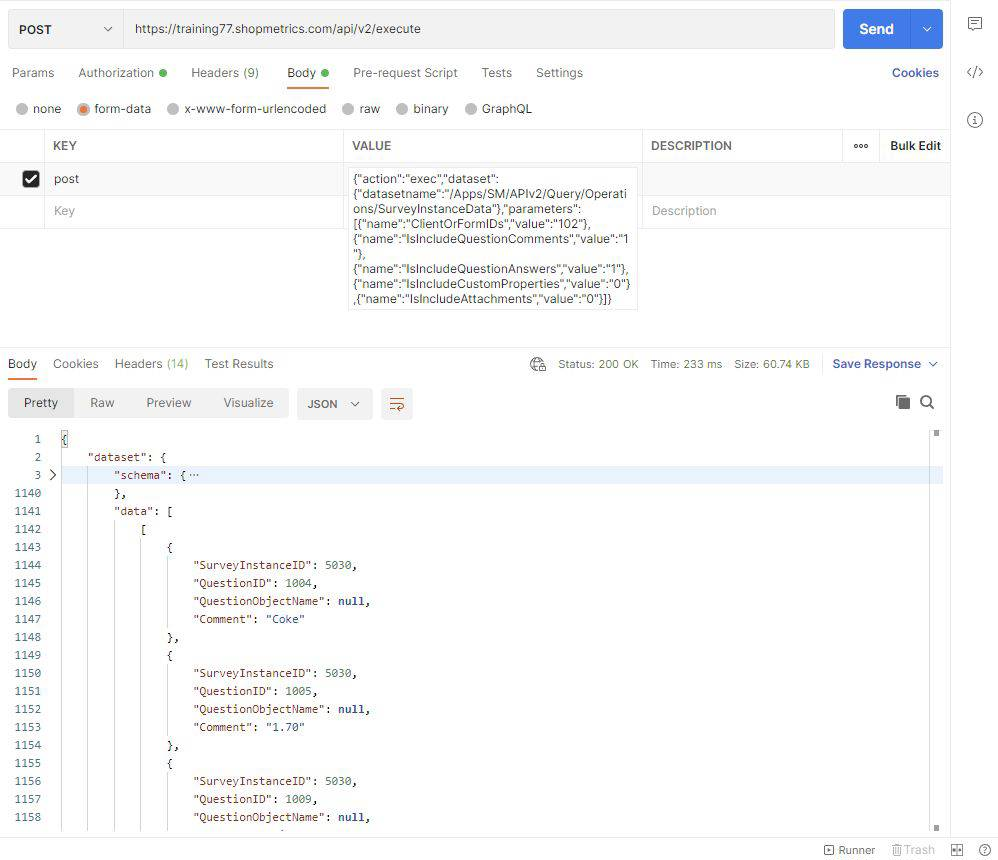

# Survey Instance Data Query Resource

Last Modified: 2022-07-01 | Code: APIOSID

You can use the "/APIv2/Query/Operations/SurveyInstanceData" dataset to retrieve survey data for survey instances in any status.

**NOTE: The dataset requires passing a value to at least one of the following parameters: ClientOrFormIDs and SurveyInstanceIDs.**

The dataset returns 4 rowsets:

- Rowset 1 contains data for the questions with comments. This rowset returns data if the IsIncludeQuestionComments parameter has a value of "1".
- Rowset 2 contains data for the questions with answers. This rowset returns data if the IsIncludeQuestionAnswers parameter has a value of "1".
- Rowset 3 returns data for the custom properties on a survey instance level. For surveys with status "Assigned" the rowset returns data for the custom properties on a location level. This rowset returns data if the IsIncludeCustomProperties parameter has a value of "1".
- Rowset 4 contains data for the attachments on a survey instance and a survey question level. This rowset returns data if the IsIncludeAttachments parameter has a value of "1".
- Rowset 5 contains information for errors in case of a failed execution.

### Shopmetrics CMS UI – Dataset Execution

**ClientOrFormIDs parameter:**102

**IsIncludeQuestionComments parameter:** 1 (default value)

**IsIncludeQuestionAnswers parameter:** 1 (default value)

**IsIncludeCustomProperties parameter:** 0 (default value)

**IsIncludeAttachments:** 0 (default value)  

### Postman

The content for the “post” parameter in the Body:

{"action":"exec","dataset":{"datasetname":"/Apps/SM/APIv2/Query/Operations/SurveyInstanceData"},"parameters":[{"name":"ClientOrFormIDs","value":"102"},{"name":"IsIncludeQuestionComments","value":"1"},{"name":"IsIncludeQuestionAnswers","value":"1"},{"name":"IsIncludeCustomProperties","value":"0"},{"name":"IsIncludeAttachments","value":"0"}]}  

