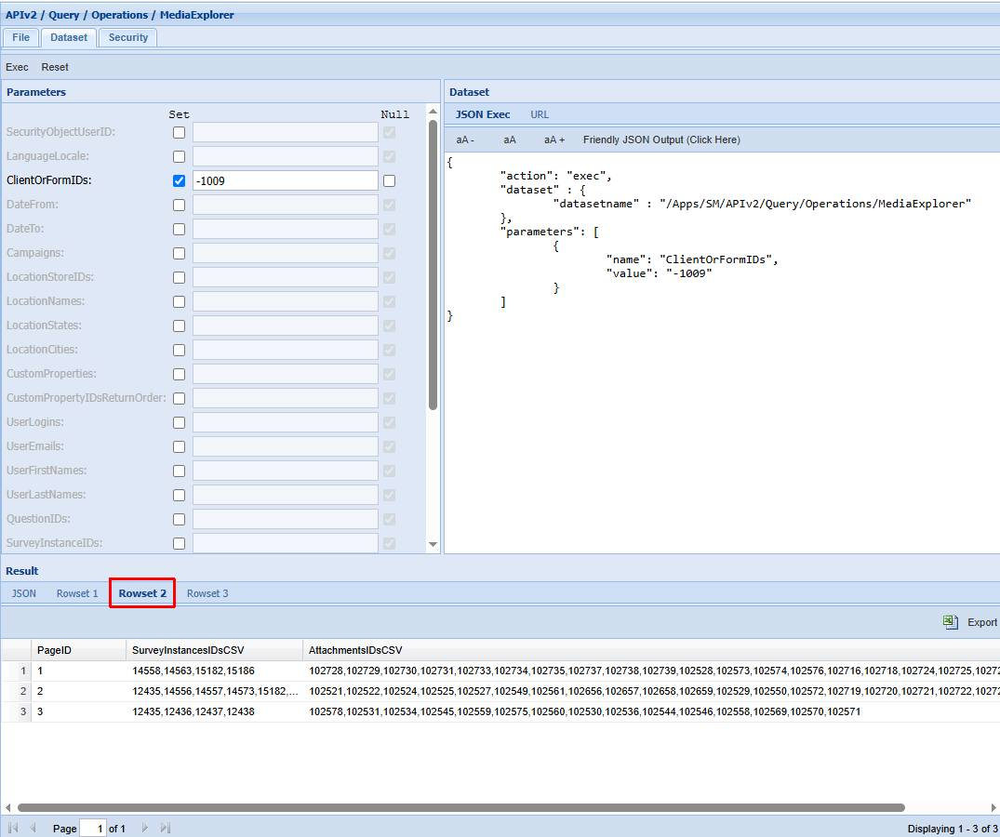
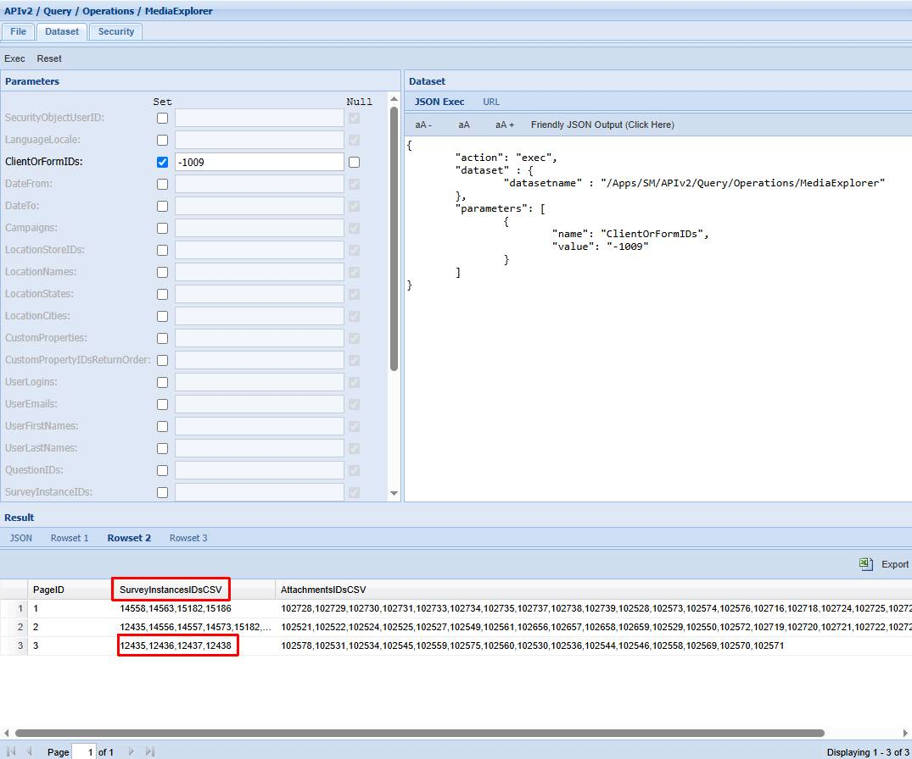
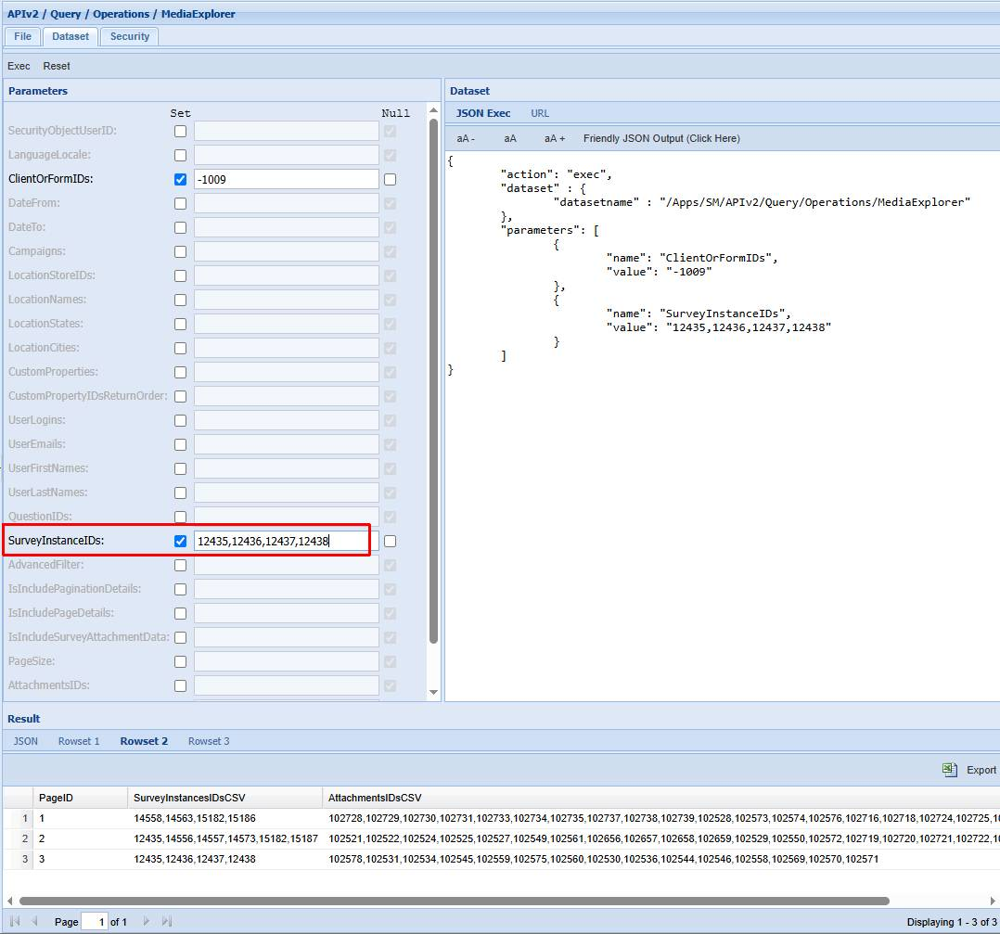
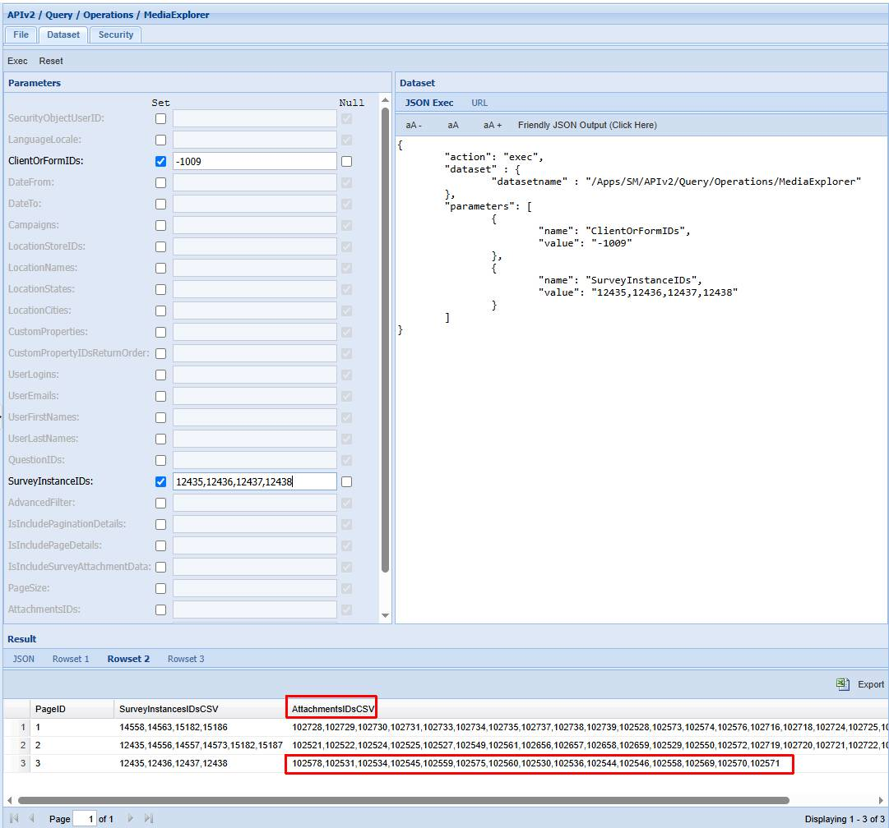
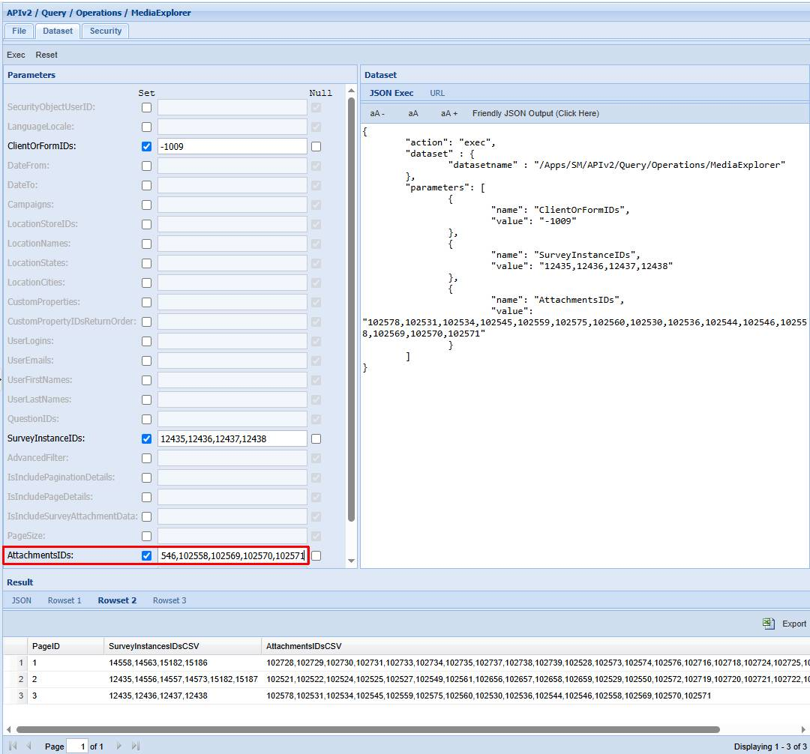
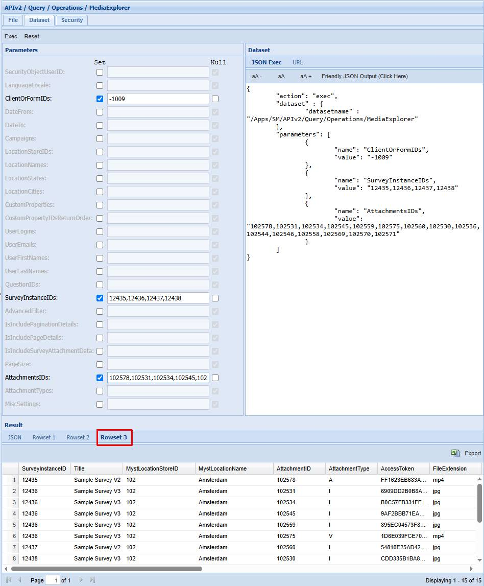
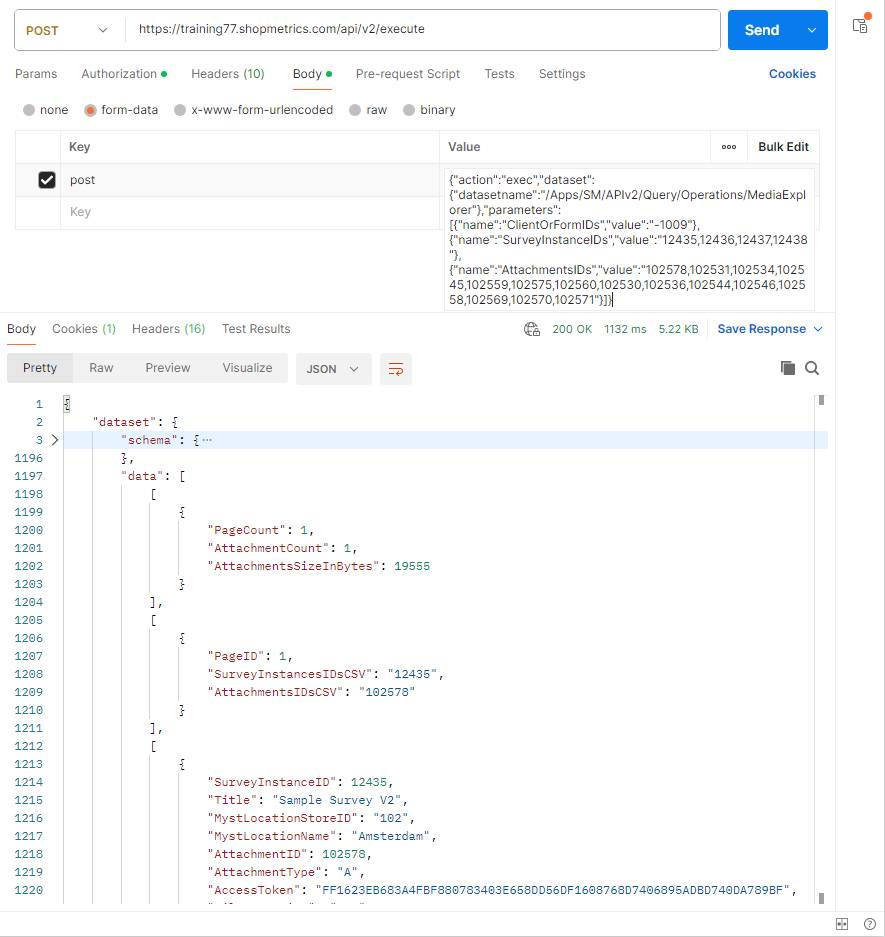
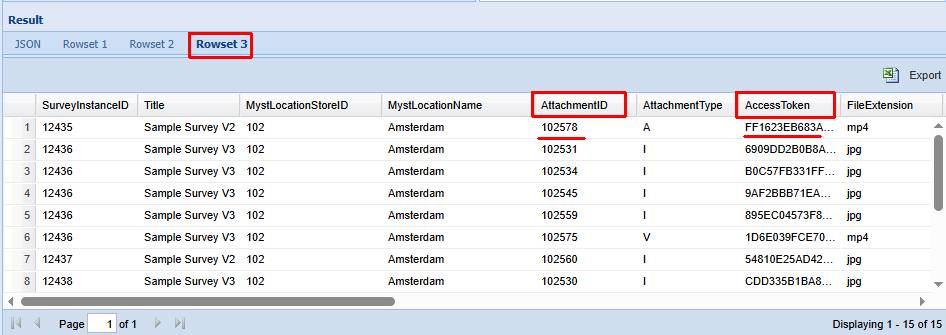
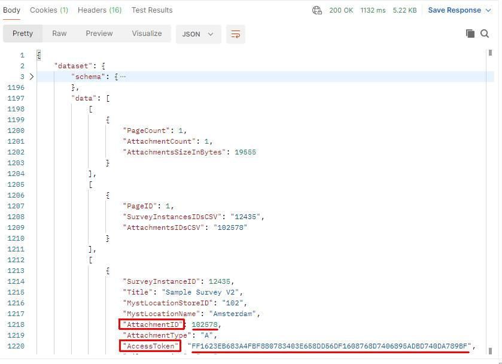

# Media Explorer Query Resource

Last Modified: 2025-03-26 | Code: APIOPME

This article explains the process of retrieving information about media, attached to surveys with any status, using the MediaExplorer Query Resource.

**NOTE: This dataset does not have a QuerySpecification parameter and returns a fixed number of fields.**

The MediaExplorer Query Resource returns 3 rowsets:

- Rowset 1 contains overall information about the dataset result - the total number of pages with attachments, the total number of attachments  and the attachments total size.
- Rowset 2 contains information about the attachments distribution between the pages and their corresponding survey instances.
- Rowset 3 contains information about each attachment and the survey instance it is attached to. By default rowset 3 returns only the attachments from the result's page 1.

There is a default setting about the page size. Currently it is set to 20 attachments per page. You can easily define how many attachments to be contained in each page by using the "PageSize" parameter of the MediaExplorer dataset.

**NOTE: The Page setting in the CMS interface is NOT related  to the Paging functionality of the MediaExplorer Query Resource.**

## List of Survey Attachments

The example details how to use the “/APIv2/Query/Operations/MediaExplorer” dataset to get the same data as the Survey Manager -> Media Explorer.

### Shopmetrics CMS UI — Dataset Execution

**ClientOrFormIDs parameter:** -1009

Step 1 - execute the MediaExplorer dataset and open Rowset 2:

Step 2 - copy the values from the "SurveyInstanceIDsCSV" column for a desired page and paste them in the "SurveyInstanceIDs" parameter of the query resource:

Step 3 - copy the values from the corresponding "AttachmentsIDsCSV" column and paste them in the "AttachmentsIDs" parameter of the query resource:

Step 4 - execute the dataset. In Rowset 3 you will see the data for the desired attachments:

### Postman

The content for the “post” parameter in the Body:

{"action":"exec","dataset":{"datasetname":"/Apps/SM/APIv2/Query/Operations/MediaExplorer"},"parameters":[{"name":"ClientOrFormIDs","value":"-1009"},{"name":"SurveyInstanceIDs","value":"12435,12436,12437,12438"},{"name":"AttachmentsIDs","value":"102578,102531,102534,102545,102559,102575,102560,102530,102536,102544,102546,102558,102569,102570,102571"}]}

## Download Survey Attachments

To download a survey attachment you can use the following link:

https://**SMPlatformURL**/mystservices/Attachments/getAttachment.asp?AttachmentID=**AttachmentID\_value**&AccessToken=**AccessToken\_value**

In the link, you have to replace the following values with values relevant to your specific case:

- **SMPlatformURL** - the URL to the Shopmetrics Platform where the desired attachment is located
- **AttachmentID\_value** - the ID of the desired attachment
- **AccessToken\_value** - the Access Token value of the desired attachment

The **AttachmentID\_value** and the **AccessToken\_value** are located in the columns **AtttachmentID** and **AccessToken** in the **Rowset 3** results of the **MediaExplorer** **Query Resource**:

**Shopmetrics CMS UI:**

****

**Postman:**

****

Once the link is assembled you can use it to download the attachment.
