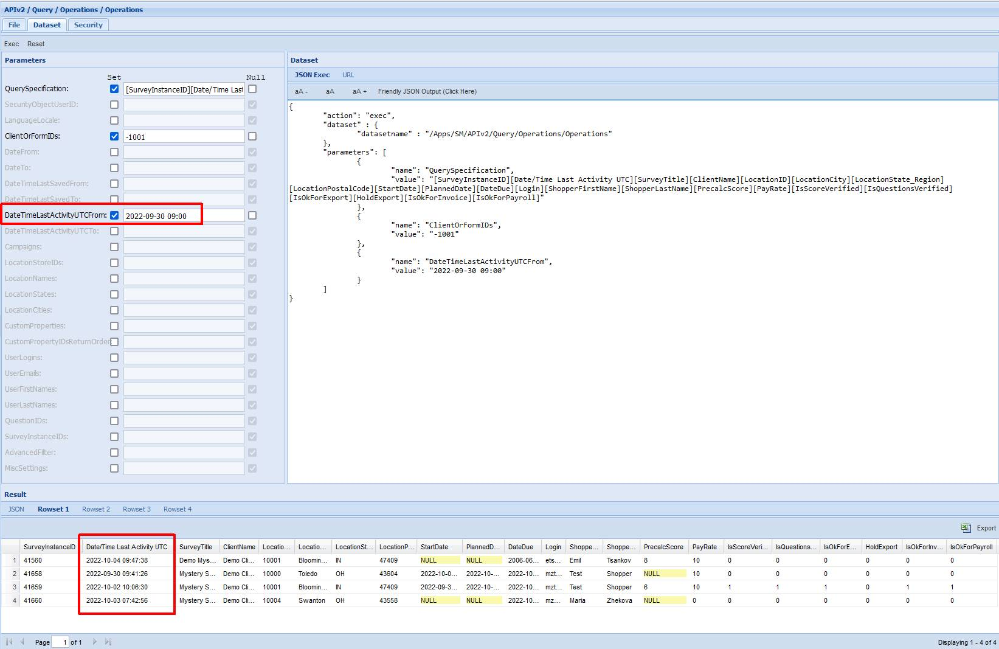
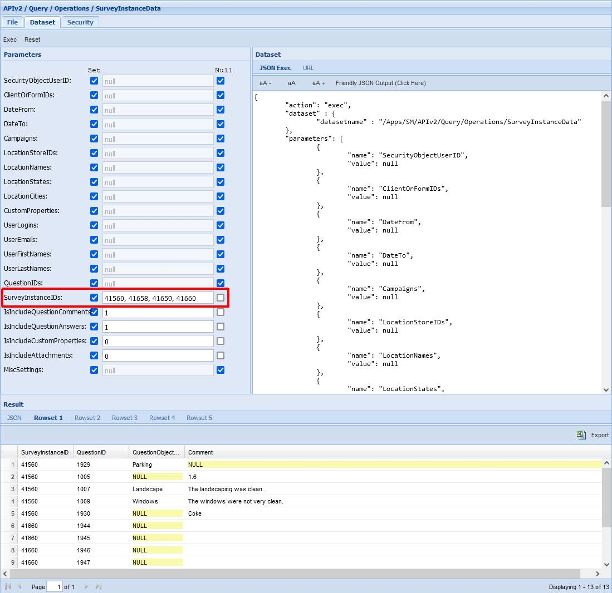

# Use Case: Extract Operational Survey Data Incrementally

Last Modified: 2025-11-27 | Code: APIOPUC

**NOTE: Since Update 22-10 the examples in the following article have been updated to use a new field for filtering: “Date/Time Last Activity UTC” instead of “Date/Time Last Saved”. "Survey Instance Date/Time Last Activity UTC" is updated when most survey history events occur. This way the Incrementally extracted data will have more survey instances with more up to date data. Note that if your business case is to extract Survey Responses only, using the "Date/Time Last Saved fields" for filtering is still the best way to go.**

The purpose of this article is to demonstrate how you can use the Shopmetrics Query API to extract operational data incrementally. Every run of the extraction process (job/script/etc.) works only for survey data that has been changed since the last extraction.

Below is a description of the data extraction process that uses the "/APIv2/Query/Operations/Operations" and "/APIv2/Query/Operations/SurveyInstanceData" query resources. The process includes the following steps:

1. Retrieval of the Last Extraction Date/Time

- If you are running the process (script) for the first time you need to manually set Last Extraction Date/Time to a value, relevant to your business case. This value must be before the current date/time

2. Setting the Next Extraction Date/Time to the current date/time

3. Extracting “Survey Explorer” data for the Survey Instances by:

- Using the "/APIv2/Query/Operations/Operations" query resource
- Using a Query Specification that includes the Survey Instance ID and other relevant fields (example below)
- Using the Last Extraction Date/Time for filtering the result. The Last Extraction Date/Time should be set as a value to the “DateTimeLastActivityUTCFrom” parameter of the "/APIv2/Query/Operations/Operations" query resource.

4. Creating a CSV list of the Survey Instance IDs for the Survey Instances, extracted on step 3

5. Extracting the Survey Instance Data by:

- Using the "/APIv2/Query/Operations/SurveyInstanceData" query resource
- Using the previously created CSV list of Survey Instance IDs for filtering the result. The CSV list should be set as a value to the “SurveyInstanceIDs” parameter of the "/APIv2/Query/Operations/SurveyInstanceData" query resource.

6. Saving the Next Extraction Date/Time as Last Extraction Date/Time to be used by the next run of the process

## List of Modified Survey Instances

The example below shows how to get a list of all survey instances, that have been modified since the last data extraction.

**Last Extraction Date/Time**: 2022-09-30 09:00

**Next Extraction Date/Time**: 2022-10-04 14:00

### Shopmetrics CMS UI — Dataset Execution

**1. Retrieve the Last Extraction Date/Time** - in this example it is 2022-09-30 09:00

**2. Set a Next Extraction Date/Time** - in this example it is 2022-10-04 14:00

**3. Extract Survey Instance data, using the Last Extraction Date/Time for filtering the result**

**Dataset:** /APIv2/Query/Operations/Operations

**QuerySpecification parameter:** [SurveyInstanceID][Date/Time Last Activity UTC][SurveyTitle][ClientName][LocationID][LocationCity][LocationState\_Region][LocationPostalCode][StartDate][PlannedDate][DateDue][Login][ShopperFirstName][ShopperLastName][PrecalcScore][PayRate][IsScoreVerified][IsQuestionsVerified][IsOkForExport][HoldExport][IsOkForInvoice][IsOkForPayroll]

**ClientOrFormIDs parameter:** -1001

**DateTimeLastActivityUTCFrom parameter****:** 2022-09-30 09:00

**NOTE: The parameters “DateTimeLastActivityUTCFrom” and “DateTimeLastActivityUTCTo” accept date/time values in UTC format**

**NOTE: The column “Date/Time Last Activity UTC” returns values in UTC date/time format**



**4. Create a CSV list of the Survey Instance IDs for the extracted instances**

In this example the CSV list will include the following Survey Instance IDs: 41560, 41658, 41659, 41660

**5. Extract the Survey Instance Data, using the created CSV list for filtering the result**

**Dataset**: /APIv2/Query/Operations/SurveyInstanceData

**SurveyInstanceIDs parameter:** 41560, 41658, 41659, 41660

**IsIncludeQuestionComments:** 1 (default parameter)

**IsIncludeQuestionAnswers:** 1 (default parameter)

**IsIncludeCustomProperties:** 0 (default parameter)

**IsIncludeAttachments:** 0  (default parameter)

The result will contain data only for the Survey Instances that have been modified since the last data extraction.



**6. Save the Next Extraction Date/Time as Last Extraction Date/Time to be used by the next run of the process**

In this example the Last Extraction Date/Time will be updated to 2022-10-04 14:00.

**7. If the next run of the process is scheduled for 2022-10-04 20:00, the date/time values will be as follows:**

- **Last Extraction Date/Time:** 2022-10-04 14:00
- **Next Extraction Date/Time:** 2022-10-04 20:00

### PowerShell Code

```
Clear-Host;
Write-Host "Script Started";
Write-Host;

#Url to the Shopmetrics Platform:
$SMPlatformURL = "https://training77.shopmetrics.com";

#Endpoint to get authentication token (Access Token):
$GetTokenEndpoint = "$($SMPlatformURL)/oauth/connect/token";

#Object with credentials to be used as payload for "get access token":
$GetTokenRequestPayload = @{client_id="Training77_ClientUserAPI"; client_secret="client secret"; grant_type="client_credentials"};

#Request Object to be used by the REST Request:
$GetTokenRequestObject = @{
    Uri         = $GetTokenEndpoint;
    Method      = "POST";
    Body        = $GetTokenRequestPayload;
};

#REST Request to get the Access Token and assigning it to a variable:
$GetTokenResponse = Invoke-RestMethod @GetTokenRequestObject;
$AccessToken = $GetTokenResponse."access_token";
#Print Access Token to check if it is successfully retrieved:
#Write-Host $AccessToken;

#During the first srcipt execution the Last Extraction Date/Time can be set manually:
$LastExtractionParamUTC = '2022-09-30 09:00'

#For each subsequent script execution, use the $NextExtractionParamUTC value from the previous execution:
#$LastExtractionParamUTC = $NextExtractionParamUTC

#Set the $NextExtractionParam Value with the current Date/Time in UTC format and save it for the next script execution:
$NextExtractionParamUTC = (Get-Date).ToUniversalTime().ToString("yyyy/MM/dd HH:mm")

#Endpoint to execute the dataset:
$DatasetsExecuteEndpoint = "$($SMPlatformURL)/api/v2/execute";

#The value of the "post" parameter of the Execute Dataset request. This is a JSON string where all required parameters of dataset the must be provided.
#We do a request to the "Operations" dataset and check the status of the Survey Instances. The  DateTimeLastActivityUTCFrom parameter is used for filtering by Last Extraction Date/Time.
$DatasetExecutePostParam = '{
"action": "exec",
"dataset" : {
"datasetname" : "/Apps/SM/APIv2/Query/Operations/Operations"
},
"parameters": [
{
"name": "QuerySpecification",
"value": "[SurveyInstanceID][Date/Time Last Activity UTC][SurveyTitle][ClientName][LocationID][LocationCity][LocationState_Region][LocationPostalCode][StartDate][PlannedDate][DateDue][Login][ShopperFirstName][ShopperLastName][PrecalcScore][PayRate][IsScoreVerified][IsQuestionsVerified][IsOkForExport][HoldExport][IsOkForInvoice][IsOkForPayroll]"
},
        {
"name": "ClientOrFormIDs",
"value": "-1001"
},
{
"name": "DateTimeLastActivityUTCFrom",
"value": "'+$LastExtractionParamUTC+'"
},
{
"name": "DateTimeLastActivityUTCTo",
"value": null
}
]
}';

#The Body of the Request Object to be used by the Execute Dataset request. It has only 1 parameter: "post" and its "value" is the "JSON string" with the input parameters:
$DatasetExecuteRequestPayload = @{post="$DatasetExecutePostParam"};

#Request Object to be used by the Execute Dataset request:
$DatasetExecuteRequestObject = @{
    Uri         = $DatasetsExecuteEndpoint;
    Headers     = @{"Authorization" = "Bearer $AccessToken"};
    Method      = "POST";
    Body        = $DatasetExecuteRequestPayload;
};

#REST Request to get the output data and assigning it to a variable: 
$DatasetExecuteResponse = Invoke-RestMethod @DatasetExecuteRequestObject;

#Write-Host $DatasetExecuteResponse.dataset.data[0];
$ResponseData = $DatasetExecuteResponse.dataset.data[0];

$SurveInstanceIDs = ""
#Create a CSV list of Survey InstanceIDs from the Response Data
ForEach ($Row in $ResponseData) {
    $SurveInstanceIDs += $Row.SurveyInstanceID
    $SurveInstanceIDs += ","
}
#Write-Host $SurveInstanceIDs 

#Request to get Survey Instance Data using the created CSV List as a value for the SurveyInstanceIDs filtering parameter:
$DatasetExecutePostParam = '{
"action": "exec",
"dataset" : {
"datasetname" : "/Apps/SM/APIv2/Query/Operations/SurveyInstanceData"
},
"parameters": [
{
"name": "SurveyInstanceIDs",
"value": "'+ $SurveInstanceIDs +'"
}
]
}'

#The Body of the Request Object to be used by the Execute Dataset request. It has only 1 parameter: "post" and its "value" is the "JSON string" with the input parameters:
$DatasetExecuteRequestPayload = @{post="$DatasetExecutePostParam"};

#Request Object to be used by the Execute Dataset request:
$DatasetExecuteRequestObject = @{
    Uri         = $DatasetsExecuteEndpoint;
    Headers     = @{"Authorization" = "Bearer $AccessToken"};
    Method      = "POST";
    Body        = $DatasetExecuteRequestPayload;
};

#REST Request to get the output data and assigning it to a variable: 
$DatasetExecuteResponse = Invoke-RestMethod @DatasetExecuteRequestObject;
#Write-Host $DatasetExecuteResponse.dataset.data[0];

Write-Host;
Write-Host "Script Complete";
```

## Key Survey Events Modifying Date/Time Last Activity UTC

The table below lists the most frequent survey history events that trigger changes to the "Date/Time Last Activity UTC" column, thereby influencing the incremental data extraction process.

| EventTypeID | EventType | EventTypeComment |
| --- | --- | --- |
| 104 | SURVEY.ASSIGN.SELFASSIGN.MOVETOINBOX | Self-assigned survey |
| 105 | SURVEY.ATTACHMENT.DISABLE | Attachment {##EventParam01##} Disabled: {##EventParam02##} |
| 107 | SURVEY.AUDITORSUBMIT | Survey submitted |
| 108 | SURVEY.AUDITORSUBMIT.OFFLINE | Survey submitted |
| 109 | SURVEY.AUDITORSUBMIT.ONLINE | Survey submitted |
| 112 | SURVEY.CLIENTACCESSSTAT.HIDEALL | Client Access status changed: Hide from Reports; Hide from Client Survey Explorer |
| 113 | SURVEY.CLIENTACCESSSTAT.HIDEREPORTS | Client Access status changed: Hide from Reports |
| 114 | SURVEY.CLIENTACCESSSTAT.SHOWALL | Client Access status changed: OK for Client Access |
| 116 | SURVEY.EXPORTED | Survey Export Completed Successfully. Export ID: [{##EventParam02##}] |
| 117 | SURVEY.EXPORTED.MANUALLY.NOTOKFORBILLING | Ok For Billing: No |
| 118 | SURVEY.EXPORTED.MANUALLY.NOTOKFORPAY | Ok For Pay: No |
| 119 | SURVEY.EXPORTED.MANUALLY.OKFORBILLING | Ok For Billing: Yes |
| 120 | SURVEY.EXPORTED.MANUALLY.OKFORPAY | Ok For Pay: Yes |
| 121 | SURVEY.INSTANTIATE.IMPORT | Survey imported |
| 122 | SURVEY.INSTANTIATE.IMPORT.SERVICE | Survey created by Import Service |
| 124 | SURVEY.INSTANTIATE.MANUALLY | Survey created manually |
| 125 | SURVEY.NODECLINE.NO | Survey set to "CAN Decline" |
| 126 | SURVEY.NODECLINE.YES | Survey set to "CAN NOT Decline" |
| 130 | SURVEY.PENDAPPPS.APP1.RECEIVED | Application for survey received |
| 132 | SURVEY.RETURNTO.AUDITOR.BULK.OK | Survey returned to shopper for additional modifications; |
| 133 | SURVEY.RETURNTO.AUDITOR.FAILED | Survey return to shopper for additional modifications \*FAILED\* |
| 134 | SURVEY.RETURNTO.AUDITOR.OK | Survey returned to shopper for additional modifications |
| 135 | SURVEY.RFA.ACCEPT | RFA Accepted |
| 136 | SURVEY.RFA.CLOSE | Survey RFA Closed |
| 137 | SURVEY.RFA.OPEN | Survey RFA open |
| 138 | SURVEY.ROUTE.TO.DONE | Survey Routing Completed |
| 139 | SURVEY.SAVED.OFFLINE | Saved from an offline client or mobile device |
| 140 | SURVEY.SAVED.ONLINE | Survey saved on the Web |
| 141 | SURVEY.SENDFORAPPS.BULK.FAILED | FAILED Attempt to set survey for application |
| 142 | SURVEY.SENDFORAPPS.BULK.OK | Survey set for application |
| 143 | SURVEY.SETSUBMITINCOMPLETEOK | Survey approved for incomplete submission |
| 144 | SURVEY.SHOPPER.PROFILE.ROTATION.CHECK.EXCLUDE.ASSIGNMENTS | Excluded to shopper profile Total Assignments check |
| 145 | SURVEY.SHOPPERCONFIRM.NO | Shopper confirmation requirement set to: NOT REQUIRED |
| 146 | SURVEY.SHOPPERCONFIRM.YES | Shopper confirmation requirement set to: REQUIRED |
| 147 | SURVEY.SHOPPERCONFIRMED | Assignment confirmed |
| 148 | SURVEY.VERIFICATION | Survey or survey property modified |
| 149 | SURVEY.VERIFICATION.BYLINE.DONE | Survey validated in by-question verification |
| 150 | SURVEY.VERIFICATION.BYLINE.START | By-question verification performed. (Only one event is logged for all "by question" validations done within one 60 minutes interval) |
| 151 | SURVEY.VERIFICATION.COMMENTSOK.NO | Comments Validated changed to "No" |
| 152 | SURVEY.VERIFICATION.COMMENTSOK.YES | Comments Validated changed to "Yes" |
| 153 | SURVEY.VERIFICATION.SCOREOK | Score verified |
| 154 | SURVEY.VERIFICATION.SCOREOK.NO | Score Verified changed to "No" |
| 155 | SURVEY.VERIFICATION.SCOREOK.YES | Score Verified changed to "Yes" |
| 157 | SURVEY.EXPORTFAILED | Survey Export Failed. Export ID: [{##EventParam02##}] |
| 163 | SURVEY.SCORE.RECALCULATION.OK | Survey score reset and recalculated. |
| 164 | SURVEY.SCORE.RECALCULATION.FAILED | FAILED Attempt to reset and recalculate survey score. |
| 165 | SURVEY.SCORE.RECALCULATION.SKIPPED.SCORE.LOCKED | Survey score recalculation failed because survey score was locked. |
| 177 | SURVEY.CLIENTACCESSSTAT.SHOWREPORTS | Client Access status changed: OK for Reports; Hide from Client Survey Explorer |
| 190 | SURVEY.REEXPORT.SET | Survey Set for Re-Export |
| 191 | SURVEY.REEXPORT.SET.FAILED | FAILED Attempt to set for re-export |
| 192 | INVOICE.CHANGED.FAILED | FAILED Attempt to change Invoice Changed to Invoice: {##EventParam01##} [{##InvoiceStartEndDates##}] |
| 193 | REVERSE.INVOICE.CHANGED.FAILED | FAILED Attempt to change Reverse Invoice |
| 194 | COLLABORATIONS.SURVEY.EXPORTED | Collaboration survey exported to Primary. [DefinitionID: {##EventParam01##}] |
| 196 | SURVEY.REPLACEMENT.SET.PROPERTIES.FROM.INSTANCE | Survey properties set from source instance |
| 197 | SURVEY.NOTES.DELETED | Survey Notes Deleted |
| 198 | SURVEY.NOTES.DELETED.FAILED | FAILED Attempt to delete Survey Notes |
| 199 | SURVEY.BUILDER.SCORE.RECALCULATION.FAILED | FAILED Attempt to reset and recalculated due to changes in the survey form. |
| 200 | SURVEY.BUILDER.SCORE.RECALCULATION.OK | Scores automatically reset and recalculated due to changes in the survey form. |
| 204 | SURVEY.ATTCHCNTMIN.RESET | Minimum number of attachments reset |
| 205 | SURVEY.ATTACHMENT.DISABLE.REPOSITORY | Delete Attachment from Repository |
| 206 | SURVEY.COMMENTS.SET.UPPERCASE | Comments set to UPPER Case |
| 209 | SURVEY.AFTERSUBMITORSUBMITTEDSAVE.RETRY.OK | Survey {##EventParam01##} successfully on retry. Custom procedure completed. |
| 210 | SURVEY.RETURNTO.AUDITOR.PRESERVE.CHANGES | Survey return to shopper for additional modifications with "preserve validator changes". |
| 211 | COLLABORATIONS.SURVEY.EXPORTED.BULK | Collaboration survey scheduled for export to Primary via bulk processing |
| 213 | SURVEY.V3.EVENTLOG.CHUNK.APPENDED | Event log chunk appended. |
| 214 | SURVEY.V3.EVENTLOG.CHUNK.DISCARDED | Event log chunk discarded. |
| 215 | SURVEY.V3.EVENTLOG.RESEQUENCED | Event log resequenced. |
| 218 | COLLABORATIONS.SURVEY.EXPORT.PENDING | Collaboration survey re-saved after initial export to Primary |
| 220 | COLLABORATIONS.SURVEY.IMPORT.PENDING | Survey data changes received from Secondary and added for review |
| 221 | COLLABORATIONS.SURVEY.IMPORT.PENDING.DECLINED | Survey data changes received from Secondary declined |
| 223 | COLLABORATIONS.SURVEY.EXPORT.ALLOW | Collaboration survey marked as "Can be Sent to Primary" |
| 224 | COLLABORATIONS.SURVEY.EXPORT.DENY | Collaboration survey marked as "Cannot be Sent to Primary" |
| 225 | COLLABORATIONS.SURVEY.EXPORT.SCHEDULED | Collaboration survey scheduled for export to Primary |
| 226 | SURVEY.SCORE.RECALCULATION.OK.FAILING.QUESTION.APPLIED | Survey score reset and recalculated (failing  question(s) is/are applied). |
| 230 | COLLABORATIONS.SURVEY.EXPORTED.FAILED | Collaboration survey export to Primary failed. |
| 232 | SURVEY.CUSTOM.PROPERTIES.UPDATE.USING.LOCATION.VALUES | Custom properties were updated using location custom properties values. |
| 233 | SURVEY.CUSTOM.PROPERTIES.UPDATE.USING.LOCATION.VALUES.FAILED | FAILED Attempt to update custom properties values using location custom properties values. |
| 234 | COLLABORATIONS.SURVEY.IMPORT.PENDING.ACCEPTED | Survey data changes received from Secondary accepted. |
| 235 | SURVEY.AUTO.SUBMIT.SCHEDULED | Survey Scheduled for auto submit. |
| 238 | SURVEY.AUTO.SUBMIT.FAILED | Survey auto submit failed. |
| 239 | SURVEY.AUTO.SUBMIT.SUCCESS | Survey auto submitted successfully. |
| 240 | SURVEY.SCORE.LOCKED | Survey score locked. |
| 241 | SURVEY.PERSONAL.DATA.CLEARED | Personal data removed from instance by the project archival process. |
| 242 | SURVEY.RFA.AUTO.ACCEPT | RFA Accepted Automatically |
| 243 | COLLABORATIONS.SURVEY.STATUS.CLEAR | Survey Collaborations status cleared. |
| 250 | SURVEY.ARCHIVEANDREPLACE.BULK.OK | Survey properties modified via Archive and Replace bulk processing |
| 251 | SURVEY.INSTANTIATE.GIGRECRUITER | Survey created by GigRecruiter automated integration service. Request {##EventParam01##}. |
| 252 | SURVEY.BULKPROCESSING.REFERENCECODE.RESET | Project Reference value reset via bulk processing. |
| 253 | SURVEY.PLANNEDDATE.CHANGED.BY.SHOPPER | Survey Planned Date changed from {##EventParam01##} to {##EventParam02##} via Shopper Rescheduling process. |
| 254 | SURVEY.PAYROLL.STATEMENT.ADDED.BY.AUTOMATION | Survey added to pay statement via automated process. Pay type: {##EventParam02##}, pay statement ID: {##EventParam01##}. |
| 255 | SURVEY.INVOICE.ADDED.BY.AUTOMATION | Survey added to Invoice via automated process. Invoice: {##EventParam01##} [{##InvoiceStartEndDates##}] |
| 300 | SURVEY.ATTACHMENT.ADD | Attachment {##EventParam01##} Added |
| 301 | SURVEY.ATTACHMENT.DELETE | Failed to upload attachment {##EventParam01##}. Attachment removed ! |
| 302 | SURVEY.ATTACHMENT.EXTERNAL.MOVE.FROM | External Attachment ID ({##EventParam01##}) moved to this survey from Survey Instance {##EventParam02##} |
| 303 | SURVEY.ATTACHMENT.EXTERNAL.MOVE.TO | External Attachment ID ({##EventParam01##}) moved to Survey Instance {##EventParam02##} |
| 304 | SURVEY.ATTACHMENT.MOVE.FROM | Attachment ID ({##EventParam01##}) moved to this survey from Survey Instance {##EventParam02##} |
| 305 | SURVEY.ATTACHMENT.MOVE.TO | Attachment ID ({##EventParam01##}) moved to Survey Instance {##EventParam02##} |
| 306 | SURVEY.BILLING.CHANGERATE | Billing Rate changed from {##EventParam01##} to {##EventParam02##} |
| 309 | SURVEY.INSTANTIATE.REPLACEMENT.MANUALLY | Survey created as a replacement survey for survey (Instance ID: {##EventParam01##}) |
| 310 | SURVEY.INSTANTIATE.SENDFORAPPS.ROUTEMNGR.MANUALLY | Survey created in Route Manager bulk processing and sent for applications to destination mailbox list ID: {##EventParam01##} |
| 311 | SURVEY.INSTANTIATE.SENDFORAPPS.ROUTEMNGR.SCHEDULER | Survey created by System (Route Scheduler) and sent for applications to destination mailbox list ID: {##EventParam01##} ProtoSurveyID: {##EventParam02##} |
| 312 | SURVEY.REPLACEMENT.INSTANTIATED | Replacement survey created. Replacement Survey Instance ID: {##EventParam01##}) |
| 313 | SURVEY.CAMPAIGN.SET.BULK.OK | Campaign set successfully to: {##EventParam02##} |
| 314 | SURVEY.SETSTARTDATE.BULK.FAILED | FAILED Attempt to change start date to {##EventParam01##} |
| 315 | SURVEY.SETSTARTDATE.BULK.OK | Start Date Changed from {##DatetimeToISO[{##EventParam02##}]##} (UTC) to {##DatetimeToISO[{##EventParam01##}]##} (UTC) |
| 320 | SURVEY.ATTACHMENT.EXTERNAL.BEGINUPLOAD | Video ID {##EventParam01##}: upload to cloud started |
| 321 | SURVEY.ATTACHMENT.EXTERNAL.ENCODINGCOMPLETED | Video ID {##EventParam01##}: conversion completed successfully |
| 322 | SURVEY.ATTACHMENT.EXTERNAL.ENCODINGFAILED | Video ID {##EventParam01##}: conversion failed |
| 323 | SURVEY.ATTACHMENT.EXTERNAL.ENCODINGSTARTED | Video ID {##EventParam01##}: conversion started |
| 324 | SURVEY.ATTACHMENT.EXTERNAL.FILEUPLOADCOMPLETE | Video ID {##EventParam01##}: upload to cloud completed |
| 327 | SURVEY.ATTCHCNTMIN.SET | Minimum number of attachments set to {##EventParam01##} |
| 328 | SURVEY.VALIDATORPAYROLL.CHANGERATE | Set change validator pay rate from {##EventParam01##} to {##EventParam02##} |
| 330 | SURVEY.BLACKOUT.APPLY | Blackout Definition "{##EventParam01##}" [ID:{##EventParam02##}] applied. |
| 337 | SURVEY.ACTIONPLAN.CREATED.FROM | Survey created as an action plan survey; Source Survey Instance ID: {##EventParam01##}; Definition ID: {##EventParam02##} |
| 338 | SURVEY.ACTIONPLAN.CREATED | Action plan survey created; Action plan Survey Instance ID: {##EventParam01##}; Definition ID: {##ActionPlanDefinitionID##} |
| 339 | SURVEY.MAILBOX.MOVE | Survey moved to Mailbox: {##MailBoxID[{##EventParam02##}]##} |
| 340 | SURVEY.MAILBOX.MOVE.FAILED | FAILED Attempt to move survey to Mailbox: {##MailBoxID[{##EventParam02##}]##} |
| 341 | SURVEY.MAILBOX.MOVE.ASSIGNED | Survey moved to Mailbox: {##MailBoxID[{##EventParam02##}]##} in Assigned Status |
| 344 | SURVEY.REPLACEMENT.INSTANTIATED.MAILBOX | Replacement survey MailBox: {##MailBoxID[{##EventParam02##}]##} |
| 345 | SURVEY.REPLACEMENT.INSTANTIATED.NOTES.PUBLIC | Summary notes copied from Survey ID: {##EventParam02##} |
| 346 | SURVEY.REPLACEMENT.INSTANTIATED.NOTES.PRIVATE | Summary notes copied from Survey ID: {##EventParam02##} |
| 347 | SURVEY.RESTRICTAPPLYPROFILE.BULK.OK | {##EventParam01##} Profile Set to {##ShopperProfileID##} |
| 348 | SURVEY.RESTRICTAPPLYPROFILE.BULK.FAILED | FAILED Attempt to Change {##EventParam01##} Profile to {##ShopperProfileID##} |
| 349 | SURVEY.DUEDATE.AUTOCHANGED | Due Date Changed Automatically from {##DatetimeToISO[{##EventParam01##}]##} (UTC) to {##DatetimeToISO[{##EventParam02##}]##} (UTC) |
| 351 | SURVEY.DUEDATE.CHANGED | Survey Due Date changed from {##DatetimeToISO[{##EventParam01##}]##} (UTC) to {##DatetimeToISO[{##EventParam02##}]##} (UTC) |
| 352 | SURVEY.SETHOLDSTATUS.BULK.FAILED | Hold Export Status set to "{##HoldStatus[{##EventParam02##}]##}" |
| 353 | SURVEY.SETHOLDSTATUS.BULK.OK | Hold Export Status set to "{##HoldStatus[{##EventParam02##}]##}" |
| 354 | SURVEY.ASSIGN.APPLICATION.APPROVED | Application approved and the survey has been assigned to {##UserID[{##EventParam01##}]##} - UserID: {##EventParam01##} |
| 355 | SURVEY.ASSIGN.DETAILED.REASSIGN.BULK.OK | Survey Reassigned to Mailbox: {##MailBoxID[{##EventParam01##}]##} using Survey Reassign Advanced |
| 356 | SURVEY.ASSIGN.REASSIGN.BULK.OK | Survey Reassigned to Mailbox: {##MailBoxID[{##EventParam01##}]##} |
| 357 | SURVEY.ASSIGN.REASSIGN.BULK.FAILED | FAILED Attempt to reassign survey to Mailbox: {##MailBoxID[{##EventParam01##}]##} |
| 358 | SURVEY.ASSIGN.SELFASSIGN.APPLICATION | Application approved and assigned to current user (self assign) |
| 359 | SURVEY.STARTDATE.AUTOCHANGED | Start Date Changed Automatically from {##DatetimeToISO[{##EventParam01##}]##} to {##DatetimeToISO[{##EventParam02##}]##} |
| 360 | SURVEY.SET.AS.REPLICABLE | Set as Replicable for Assignment set to: {##EventParam01##} |
| 361 | SURVEY.SET.INVOICE.STATUS | Hold Invoice: {##EventParam01##} |
| 362 | SURVEY.SET.PAYROLL.STATUS | Hold Payroll: {##EventParam01##} |
| 363 | SURVEY.PLANNEDDATE.CHANGED | Survey Planned Date changed from {##EventParam01##} to {##EventParam02##} |
| 364 | SURVEY.ROUTE.TO | Survey moved from mailbox: {##MailBoxID[{##EventParam02##}]##} to mailbox: {##MailBoxID[{##EventParam01##}]##} by survey processing and routing automation. |
| 365 | SURVEY.ROUTE.TO.FAILED | FAILED to move survey from mailbox: {##MailBoxID[{##EventParam02##}]##} to mailbox: {##MailBoxID[{##EventParam01##}]##} by survey processing and routing automation. |
| 366 | SURVEY.INSTANTIATE.ROUTEMNGR.SCHEDULER | Survey created by System (Route Scheduler) and sent to mailbox: {##MailBoxID[{##EventParam01##}]##}; ProtoSurveyID: {##EventParam02##} |
| 367 | SURVEY.INSTANTIATE.ROUTEMNGR.MANUALLY | Survey created in Route Manager bulk processing and sent to mailbox: {##MailBoxID[{##EventParam01##}]##}; ProtoSurveyID: {##EventParam02##} |
| 386 | SURVEY.SET.ADDITIONAL.BILLING.PAYROLL.ITEMS.FAILED | ERROR: The Billing and Payroll process generated errors while linking additional billing items. Details: {##EventParam01##} |
| 387 | SURVEY.INSTANTIATE.FROM.REPLICABLE | Survey created from replicable and sent to destination Mailbox: {##MailBoxID[{##EventParam02##}]##}. Replicable ID: {##EventParam01##} |
| 389 | SURVEY.MANAGE.PAYROLL.ITEM | Payroll Item {##PayrollItem##} : Amount changed to {##EventParam02##} |
| 390 | SURVEY.MANAGE.PAYROLL.ITEM.FAILED | FAILED Payroll Item {##PayrollItem##} : Amount changed to {##EventParam02##} |
| 391 | SURVEY.PAYROLL.ITEM.DELETED | Payroll Item {##PayrollItem##} Deleted |
| 392 | SURVEY.PAYROLL.ITEM.DELETED.FAILED | FAILED Attempt to delete Payroll Item {##PayrollItem##} |
| 393 | SURVEY.MANAGE.BILLING.ITEM | Billing Item {##BillingItem##} : Amount changed to {##EventParam02##} |
| 394 | SURVEY.MANAGE.BILLING.ITEM.FAILED | FAILED Billing Item {##BillingItem##} : Amount changed to {##EventParam02##} |
| 395 | SURVEY.BILLING.ITEM.DELETED | Billing Item {##BillingItem##} Deleted |
| 396 | SURVEY.BILLING.ITEM.DELETED.FAILED | FAILED Attempt to delete Billing Item {##BillingItem##} |
| 397 | COLLABORATIONS.SURVEY.CREATED | Survey created by an automated collaboration service. [Secondary InstanceID: {##EventParam01##}] [DefinitionID: {##EventParam02##}] |
| 398 | COLLABORATIONS.SURVEY.UPDATED | Survey updated by an automated collaboration service. [Secondary InstanceID: {##EventParam01##}] [DefinitionID: {##EventParam02##}] |
| 399 | SURVEY.MANAGE.CUSTOM.PROPERTY.FAILED | FAILED to modify Custom Property {##CustomProperty##} value |
| 400 | SURVEY.CUSTOM.PROPERTY.DELETED | Custom Property {##CustomProperty##} Deleted |
| 401 | SURVEY.CUSTOM.PROPERTY.DELETED.FAILED | FAILED Attempt to delete Custom Property {##CustomProperty##} |
| 402 | SURVEY.PAYROLL.STATEMENT.CHANGED | Payroll Statement Changed to {##PayrollStatement##} |
| 403 | SURVEY.PAYROLL.STATEMENT.CHANGED.FAILED | FAILED Attempt to change Payroll Statement {##PayrollStatement##} |
| 404 | SURVEY.INSTANTIATE.SURVEY.SCHEDULER | Survey created by System (Survey Scheduler) and sent to mailbox: {##MailBoxID[{##EventParam01##}]##} |
| 405 | SURVEY.INSTANTIATE.SURVEY.SCHEDULER.COUNT | Survey created by System (Survey Scheduler) and sent for applications to {##EventParam01##} mailbox(es) |
| 408 | SURVEY.BILLING.CHANGERATE.FAILED | FAILED Attempt to change billing rate from {##EventParam01##} to {##EventParam02##} |
| 409 | SURVEY.VERIFICATION.HOLDEXPORT.YES | Hold Export changed to "Yes" |
| 410 | SURVEY.VERIFICATION.HOLDEXPORT.NO | Hold Export changed to "No" |
| 411 | SURVEY.VERIFICATION.OKFORPAYROLL.YES | OK for Payroll changed to "Yes" |
| 412 | SURVEY.VERIFICATION.OKFORPAYROLL.NO | OK for Payroll changed to "No" |
| 413 | SURVEY.VERIFICATION.OKFORINVOICE.YES | OK for Invoice changed to "Yes" |
| 414 | SURVEY.VERIFICATION.OKFORINVOICE.NO | OK for Invoice changed to "No" |
| 415 | SURVEY.VERIFICATION.HOLDPAYROLL.YES | Hold (Ignore for) Payroll changed to "Yes" |
| 416 | SURVEY.VERIFICATION.HOLDPAYROLL.NO | Hold (Ignore for) Payroll changed to "No" |
| 417 | SURVEY.VERIFICATION.HOLDINVOICE.YES | Hold (Ignore for) Invoice changed to "Yes" |
| 418 | SURVEY.VERIFICATION.HOLDINVOICE.NO | Hold (Ignore for) Invoice changed to "No" |
| 419 | SURVEY.VERIFICATION.REVERSEPAYROLL.YES | Reverse Payroll changed to "Yes" |
| 420 | SURVEY.VERIFICATION.REVERSEPAYROLL.NO | Reverse Payroll changed to "No" |
| 421 | SURVEY.VERIFICATION.REVERSEINVOICE.YES | Reverse Invoice changed to "Yes" |
| 422 | SURVEY.VERIFICATION.REVERSEINVOICE.NO | Reverse Invoice changed to "No" |
| 423 | SURVEY.ATTACHMENT.MODIFIED | Attachment modified. AttachmentID: {##EventParam01##} |
| 429 | SURVEY.SUBMITTED.ON.BEHALF.OF | Survey submitted on behalf of {##UserID[{##EventParam01##}]##} by {##UserID[{##EventParam02##}]##} |
| 434 | SURVEY.INSTANTIATE.SAMPLE.WIZARD | Instance created through Sample Wizard interface. |
| 436 | SURVEY.SET.AS.REPLICABLE.FOR.APPLICATION | Set as Replicable for Application set to: {##EventParam01##} |
| 440 | SURVEY.SET.INBOX.VISIBILITY | Survey visibility for Assignment set to: {##EventParam01##}. |
| 441 | SURVEY.V3.INSTANTIATE.IMPORT.SERVICE | Survey created by Import Service. Response ID [{##EventParam01##}]. |
| 449 | COLLABORATIONS.SURVEY.NOTE.POST | Collaborations Survey Note Added. NoteID: {##EventParam01##}, DefinitionID: {##EventParam02##} |
| 450 | SURVEY.ATTACHMENT.ENABLE | Attachment {##EventParam01##} enabled. |
| 451 | SURVEY.NOTE.VALIDATION.POST | Survey validation note posted. |
| 452 | SURVEY.ACTIONPLAN.GENERATION.ERROR | Action Plan generation error; Definition ID: {##EventParam02##} |
| 453 | SURVEY.DATA.ENCRYPT | Personal Data encryption completed due to change in Data Classification: QuestionID {##EventParam01##} |
| 454 | SURVEY.SUBMISSION.INVALID.INTERNAL.IDS | Invalid internal IDs detected during the submission process. |
| 455 | SURVEY.INSTANTIATE.SAMPLE.WIZARD.RETAILAUDIT | Interview Script Instance created through Sample Wizard interface. |
| 460 | SURVEY.APPEAL.CREATED | Appeal ID {##EventParam02##} opened |
| 461 | SURVEY.APPEAL.UPDATED | Appeal ID {##EventParam02##} updated |
| 462 | SURVEY.APPEAL.CLOSED | Appeal ID {##EventParam02##} closed |
| 463 | SURVEY.ACTIONPLAN.INSTANTIATION.PROCESS.STARTED | Action plan instantiation process started from Definition ID:[{##EventParam01##}] for {##EventParam02##} assignments. |
| 464 | SURVEY.ACTIONPLAN.DEFINITION.EXECUTION.SCHEDULED | Action plan execution process scheduled for Definition ID:[{##EventParam01##}]. |
| 465 | SURVEY.APPEAL.REOPEN | Appeal ID {##EventParam01##} reopened. |
| 466 | SURVEY.ENDDATE.CHANGED | Survey End Date changed from {##DatetimeToISO[{##EventParam01##}]##} (UTC) to {##DatetimeToISO[{##EventParam02##}]##} (UTC). |
| 470 | ONLINE.SURVEY.CODE.DELETED.FOR.SURVEY.INSTANCE | Code {##EventParam02##} of Online Survey Definition "{##OnlineSurveysDefinitionName##}" ({##OnlineSurveysDefinitionProjectID##}) deleted |
| 471 | ONLINE.SURVEY.CODE.CREATED.FOR.SURVEY.INSTANCE | Code {##EventParam02##} of Online Survey Definition "{##OnlineSurveysDefinitionName##}" ({##OnlineSurveysDefinitionProjectID##}) created |
| 472 | ONLINE.SURVEY.ADD.CODE | Survey Created from Online Survey Definition "{##OnlineSurveysDefinitionName##}" ({##OnlineSurveysDefinitionProjectID##}) using code {##EventParam02##} |
| 473 | SURVEY.AUTO.SUBMIT.GIGRECRUITER | Job submitted in execution of Job Removal request {##EventParam02##}. Reason: {##EventParam01##} |
| 474 | SURVEY.BULKPROCESSING.REFERENCECODE.CHANGED | Project Reference value changed to "{##ReferenceCodeID[{##EventParam01##}]##}"  via bulk processing. |
| 475 | TELEPHONY.SESSION.START | Telephony Session started. Session ID: {##EventParam01##} |
| 476 | TELEPHONY.SESSION.END | Telephony Session end. Session ID: {##EventParam01##} |
| 477 | SURVEY.ASSIGN.FAILED.PROFILE.FILTER.CONFLICT | Survey assigned conflicting with Restrict Application Profile ID: ({##EventParam01##}). Conflict registered when evaluating ({##ShopperProfileFilterNotMatchReason##}). |
| 479 | SURVEY.INSTANTIATE.WORKORDERLINE | Survey created using Work Order Line ID: {##EventParam01##}. |
| 500 | SURVEY.ACTIONPLAN.ERROR | {##EventParam03##} |
| 501 | SURVEY.DECLINED | {##EventParam03##} |
| 502 | SURVEY.DECLINED.ADMIN.EXCUSED | {##EventParam03##} |
| 503 | SURVEY.DECLINED.ADMIN.NOTEXCUSED | {##EventParam03##} |
| 504 | SURVEY.DELETED.BULK.FAILED | {##EventParam03##} |
| 505 | SURVEY.DELETED.BULK.OK | {##EventParam03##} |
| 506 | SURVEY.EXPORTED.MANUALLY | {##EventParam03##} |
| 507 | SURVEY.INCOMPLETEQUESTIONS | {##EventParam03##} |
| 508 | SURVEY.NOTE.POST | {##EventParam03##} |
| 509 | SURVEY.NOTE.PUBLIC.POST | {##EventParam03##} |
| 510 | SURVEY.NOTE.PUBLIC.UPDATE | {##EventParam03##} |
| 511 | SURVEY.PAYROLL.CHANGERATE | {##EventParam03##} |
| 512 | SURVEY.SKIPPEDQUESTIONS | {##EventParam03##} |
| 514 | SURVEY.EXPORT.TRIGGER.START | {##EventParam03##} |
| 515 | SURVEY.EXPORTSTART | Survey Export Started. Export batch ID: {##EventParam01##}. Export ID: [{##EventParam02##}] |
| 519 | SURVEY.ASSIGN.REASSIGN.INDIVIDUAL.OK | {##EventParam03##} |
| 523 | SURVEY.INSTANTIATE.IMPORT.EXTERNAL.SYSTEM | {##EventParam03##} |
| 525 | INVOICE.CHANGED | Invoice Changed to Invoice: {##EventParam01##} [{##InvoiceStartEndDates##}] |
| 526 | REVERSE.INVOICE.CHANGED | {##EventParam03##} |
| 527 | SURVEY.MANAGE.CUSTOM.PROPERTY | Custom property {##CustomProperty##} value changed via bulk process. |
| 528 | SURVEY.ITEM.ADD.MANUALLY | {##EventParam03##} |
| 529 | SERVICE.EXCELLENCE.REPORT.ERROR | {##EventParam03##} |
| 530 | SURVEY.BILLING.CHANGERATE.REASON | {##EventParam03##} |
| 537 | SURVEY.CUSTOM.PROPERTIES.UPDATE.USING.LOCATION.VALUES.ERROR | {##EventParam03##} |
| 539 | SURVEY.BULKPROCESSING.OKFORPAY | {##EventParam03##} |
| 540 | SURVEY.BULKPROCESSING.NOTOKFORPAY | {##EventParam03##} |
| 541 | SURVEY.APPEAL.QUESTION.CURED | Question modified via Appeals Question Curing module. |
| 543 | SURVEY.PENDAPPS.APPLICATION.DECLINED | {##EventParam03##} |
| 1189 | SURVEY.ARCHIVED.HOLDEXPORT.NO | Export Status set to "Not On Hold" |
| 1190 | SURVEY.ARCHIVED.HOLDEXPORT.YES | Export Status set to "{##EventParam02##}" |
| 1193 | SURVEY.CALL.AUTHENTICATE.SUCCESS | Call successfully authenticated to begin recording |
| 1197 | SURVEY.CREATED.INSTANT | Survey created with "Create Instant Survey" functionality in Mailbox: {##MailBoxID[{##EventParam01##}]##} |
| 1199 | SURVEY.DELETED.BULK.FAILED.REACHEDLIMIT | FAILED attempt to delete survey, because daily limit was reached by user |
| 1209 | SURVEY.SETCUSTOMSTATUS | Custom Survey Status set |
| 1215 | SURVEY.ACTIONPLAN.ADMINISTRATIVE.SUBMIT | Survey submitted by action plan process (Administrative submit) |
| 1243 | SURVEY.PAYLIMIT.APPROVE.OK | Approved pay limit exception |
| 1244 | SURVEY.PERMANENTLY.DEACTIVATED | Survey was permanently deactivated and removed from the user mailbox |
| 1247 | SURVEY.GROUP.SET.BULK.OK | Package set successfully to: {##EventParam01##} |
| 1253 | SURVEY.INSTANTIATE.UNDELETE | Survey restored from deleted survey (Instance ID {##EventParam01##}) to mailbox: {##GetMailBoxNameByID[{##EventParam02##}]##} |
| 1265 | SURVEY.RFA.SETSTATUS | RFA Status set to {##EventParam02##} |
| 1331 | SURVEY.RESTORED | Survey restored. (Instance ID: {##EventParam01##}) to mailbox: {##GetMailBoxNameByID[{##EventParam02##}]##} |
| 1333 | SURVEY.CLONE.FAIL.DIFFERENT.PROJECT | Server-Side Skips & Triggers Execution: New instance creation failed as target proto ID is under a different project. |
| 1334 | SURVEY.CLONE.DESTINATION.PROTO.CHANGED | Server-Side Skips & Triggers Execution: Target proto ID was defined as {##EventParam01##}, but instance was created with the latest handed over proto ID in the Family ({##EventParam02##}). |
