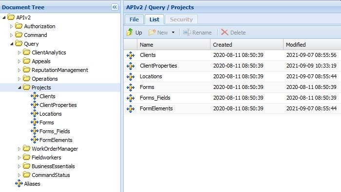

# Introduction to Projects

Last Modified: 2021-09-14 | Code: APIIP

The Shopmetrics API Projects Query Data Model can be used for retrieving data for project entities like Clients, Locations, Client Properties and Forms.

**NOTE: Due to the rapid development of our product, some of the images in this set of articles will differ slightly from the production implementation.**

