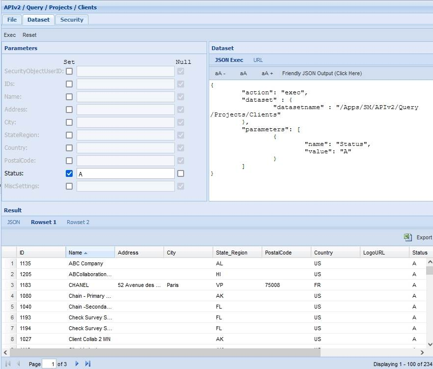
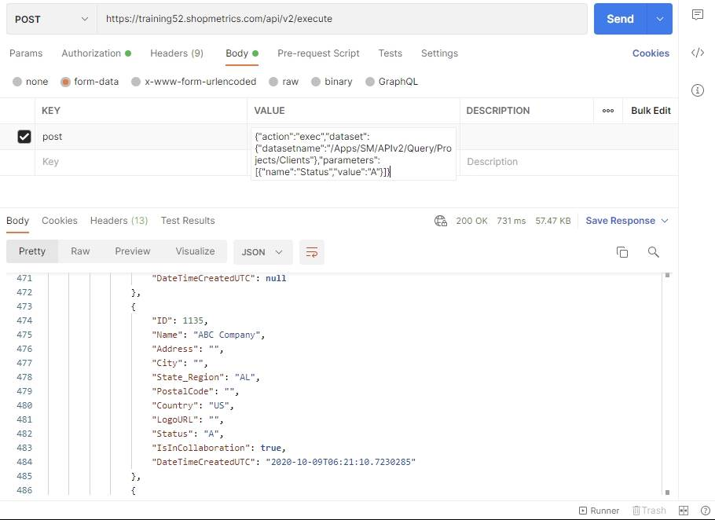
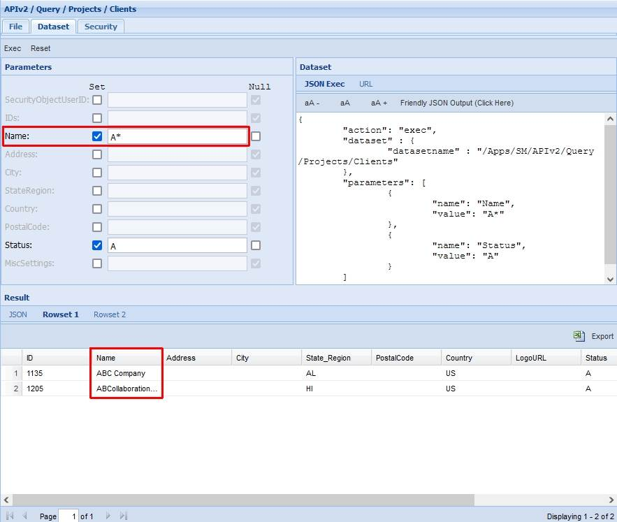
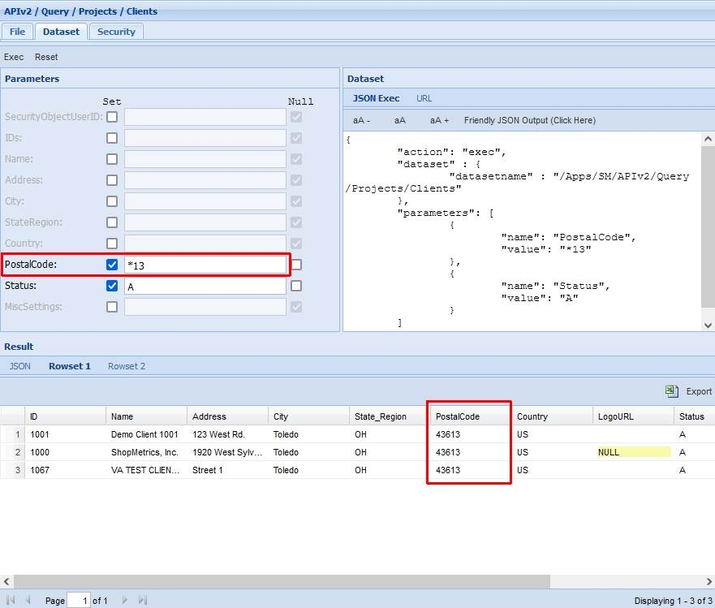

# Clients Query Resource

Last Modified: 2021-10-26 | Code: APIPC

To see all available Clients use the "/APIv2/Query/Projects/Clients" database without supplying values for the parameters.

**NOTE: The "Status" parameter has a default value set to "A" (only Active clients).**

### Shopmetrics CMS UI — Dataset Execution

**Status parameter:** A (default value)

### Postman

The content for the “post” parameter in the Body:

{"action":"exec","dataset":{"datasetname":"/Apps/SM/APIv2/Query/Projects/Clients"},"parameters":[{"name":"Status","value":"A"}]}

## Examples: Search capabilities

When working with the “/APIv2/Query/Projects/Clients” dataset you can include wildcards in the values of the filtering parameters.

### Example 1

The example below demonstrates how to use a wildcard to get a list of all active clients, whose names begin with the letter "A".

### Example 2

The example below demonstrates how to use a wildcard to get a list of all active clients, whose postal codes end with "13".

