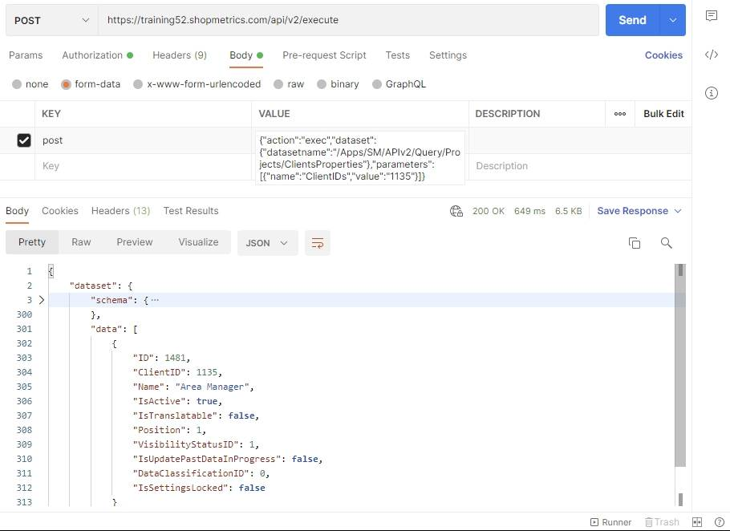

# Client Properties Query Resource

Last Modified: 2021-09-14 | Code: APIPCP

To see the available Clients' Properties use the "/APIv2/Query/Projects/ClientProperties" dataset.

### Shopmetrics CMS UI — Dataset Execution

**ClientIDs parameter:** 1135

### Postman

The content for the “post” parameter in the Body:

{"action":"exec","dataset":{"datasetname":"/Apps/SM/APIv2/Query/Projects/ClientProperties"},"parameters":[{"name":"ClientIDs","value":"1135"}]}

