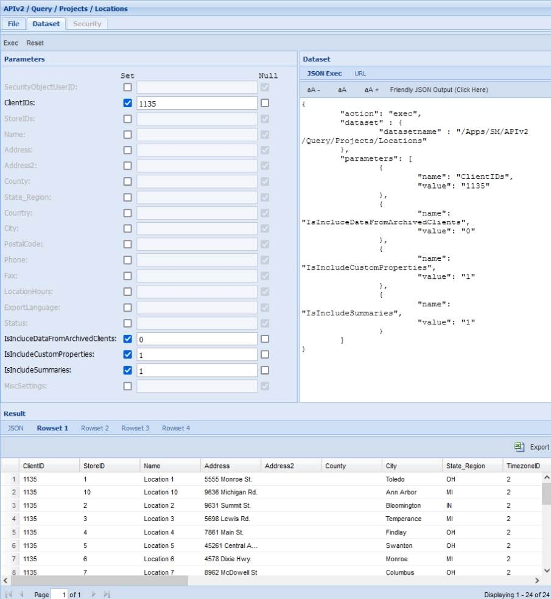
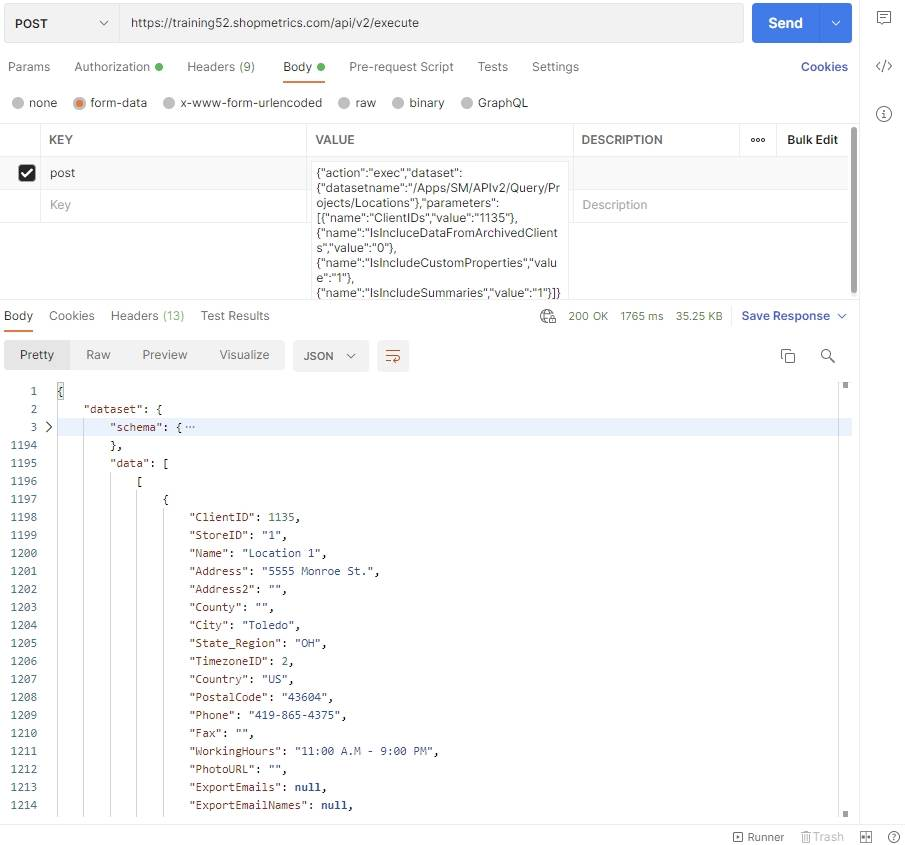
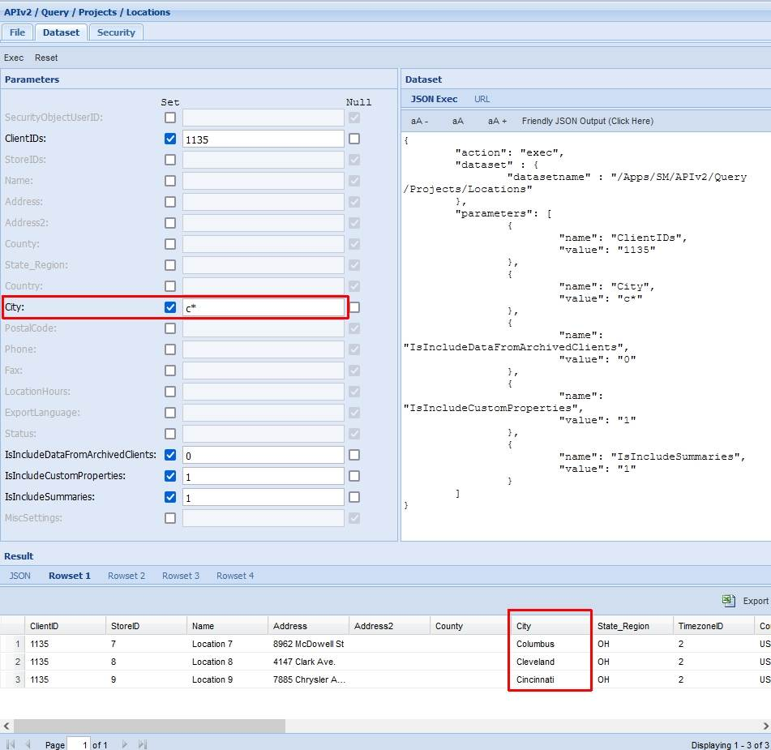
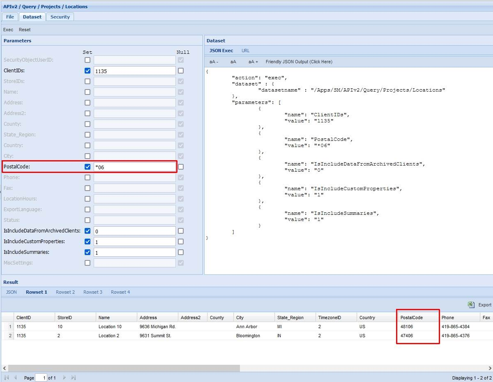

# Locations Query Resource

Last Modified: 2021-10-26 | Code: APIPL

To retrieve data for Client Locations use the "/APIv2/Query/Projects/Locations" dataset.

**NOTE: The parameters IsIncludeDataFromArchivedClients, IsIncludeCustomProperties and IsIncludeSummaries have default values set.**

**NOTE: The ClientIDs parameter is required.**

The Locations dataset returns 4 rowsets:

- Rowset 1  contains data about the queried Locations.
- Rowset 2 contains the custom property values for the locations in Rowset 1. This rowset returns data if the IsIncludeCustomProperties parameter has a value of "1".
- Rowset 3 contains data about the summary items for the locations in Rowset 1. This rowset returns data if the IsIncludeSummaries parameter has a value of "1".
- Rowset 4 contains information for errors in case of a failed execution.

### Shopmetrics CMS UI – Dataset Execution

**ClientIDs parameter:** 1135

**IsIncludeDataFromArchivedClients parameter:** 0 (default value)

**IsIncludeCustomProperties parameter:** 1 (default value)

**IsIncludeSummaries parameter:** 1 (default value)

### Postman

The content for the “post” parameter in the Body:

{"action":"exec","dataset":{"datasetname":"/Apps/SM/APIv2/Query/Projects/Locations"},"parameters":[{"name":"ClientIDs","value":"1135"},{"name":"IsIncludeDataFromArchivedClients","value":"0"},{"name":"IsIncludeCustomProperties","value":"1"},{"name":"IsIncludeSummaries","value":"1"}]}

## Examples: Search capabilities

When working with the “/APIv2/Query/Projects/Locations” dataset you can include a wildcard (\*) in the values of the filtering parameters.

### Example 1

The example below shows how to use a wildcard to get a list of all client's locations, whose city names begin with the letter "c".  
  

### Example 2

The example below shows how to use a wildcard to get a list of all client's locations, whose postal codes end with "06".  
  

