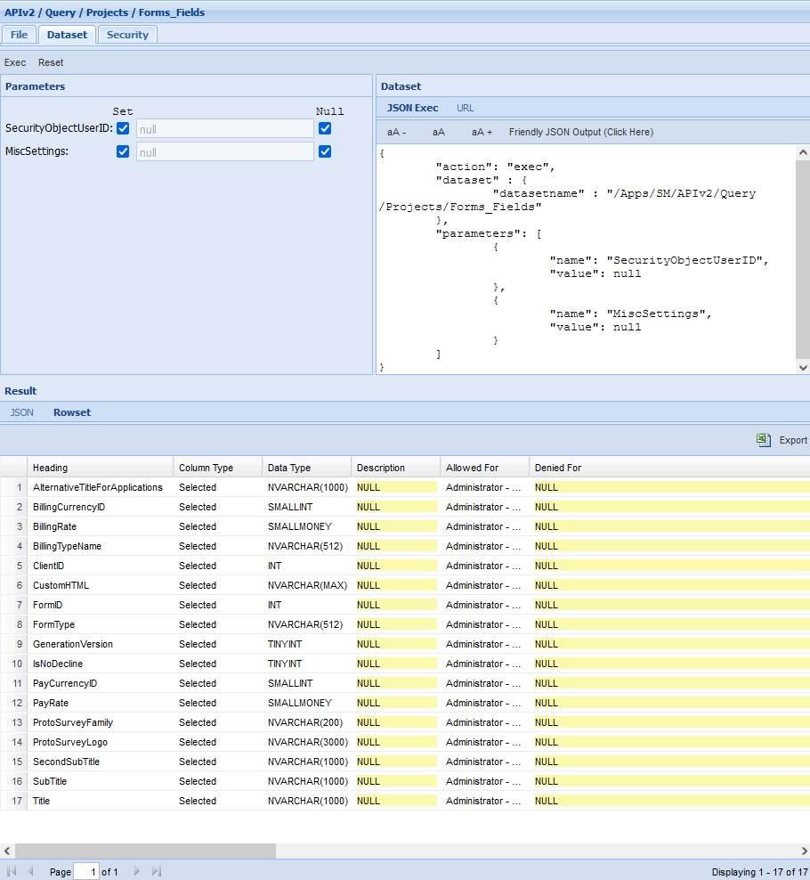
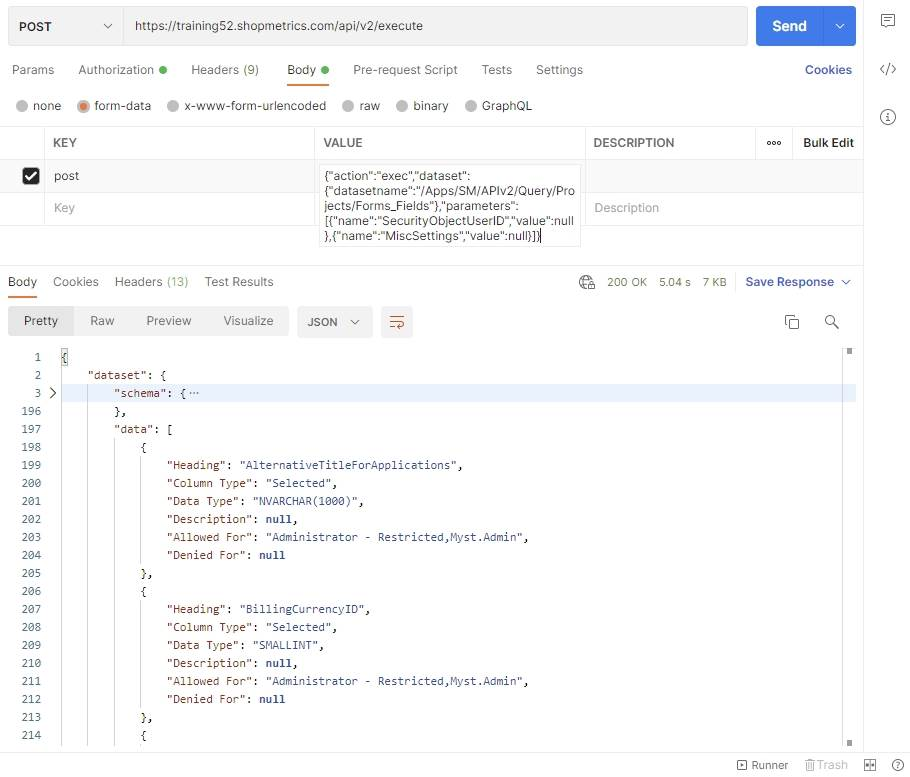
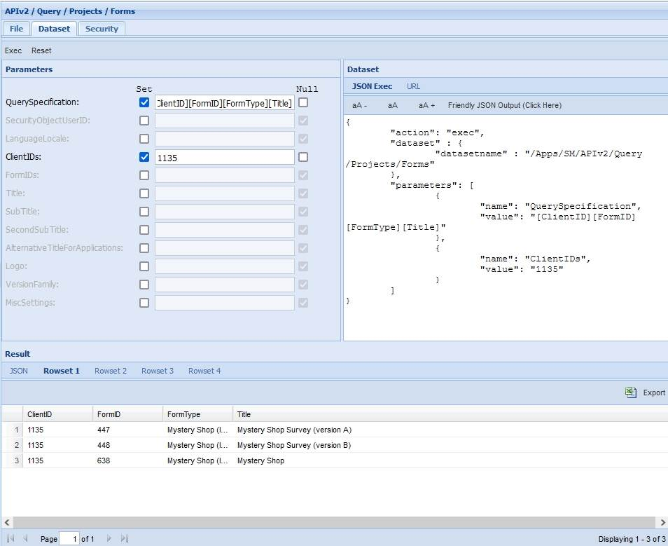
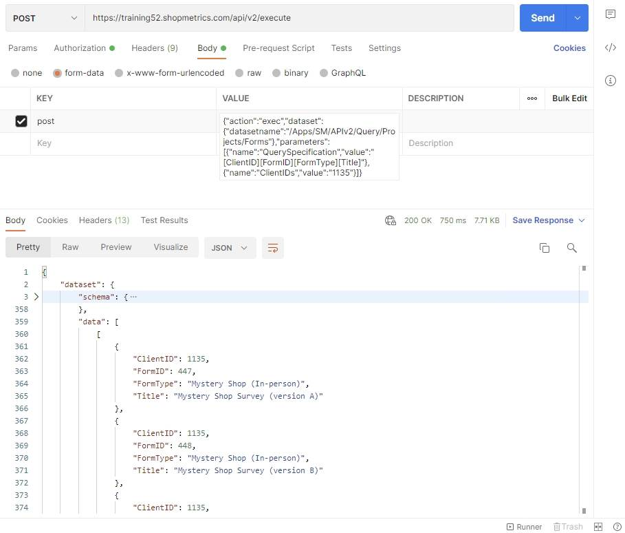
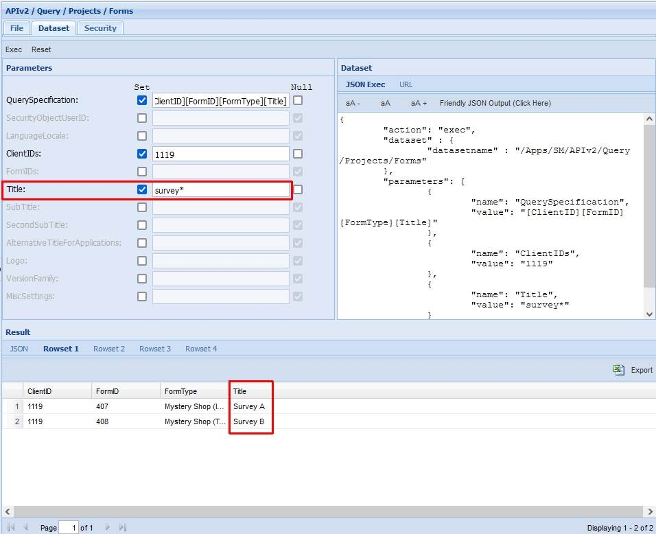
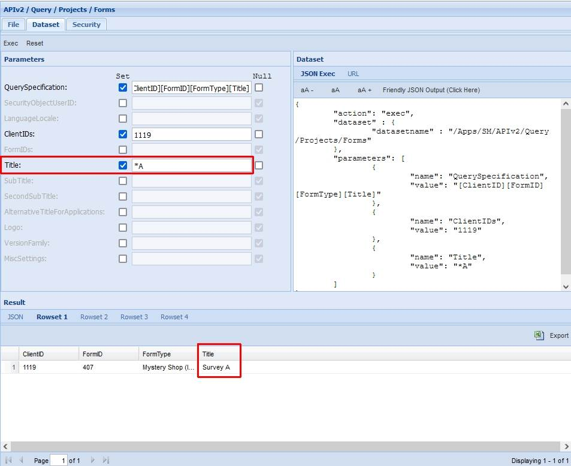
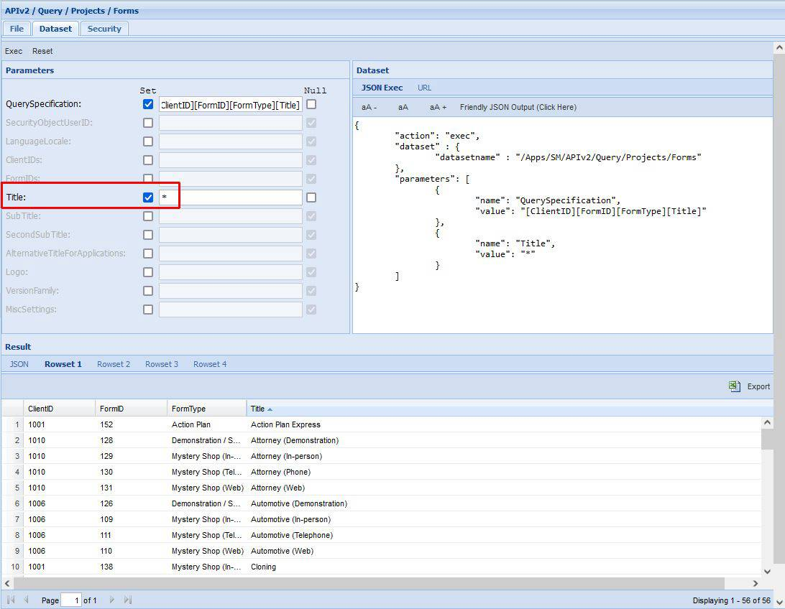

# Forms Query Resources

Last Modified: 2022-06-22 | Code: APIPF

## Forms Fields

To see all available options (columns) of the “Query Specification” parameter for the Forms Query Resource, use the “/APIv2/Query/Projects/Forms\_Fields” dataset. The dataset can be executed without supplying values for the parameters.

### Shopmetrics CMS UI — Dataset Execution

### Postman

The content for the “post” parameter in the Body:

{"action":"exec","dataset":{"datasetname":"/Apps/SM/APIv2/Query/Projects/Forms\_Fields"},"parameters":[{"name":"SecurityObjectUserID","value":null},{"name":"MiscSettings","value":null}]}

## List of Survey Forms

The example below shows how to use the “/APIv2/Query/Projects/Forms” dataset to get the same data as Administration -> Clients List.

**QuerySpecification parameter:** [ClientID][FormID][FormType][Title]

**ClientIDs parameter:** 1135

### Shopmetrics CMS UI — Dataset Execution

### Postman

The content for the “post” parameter in the Body:

{"action":"exec","dataset":{"datasetname":"/Apps/SM/APIv2/Query/Projects/Forms"},"parameters":[{"name":"QuerySpecification","value":"[ClientID][FormID][FormType][Title]"},{"name":"ClientIDs","value":"1135"}]}

## Examples: Search capabilities

When working with the “/APIv2/Query/Projects/Forms” dataset you can include a wildcard (\*) in the values of the filtering parameters.

### Example 1

The example below shows how to use a wildcard to get a list of all survey forms, whose titles begin with the word "survey".

**QuerySpecification parameter:** [ClientID][FormID][FormType][Title]

**ClientIDs parameter:** 1119

**Title parameter:** survey\*  

### Example 2

The example below shows how to use a wildcard to get a list of all survey forms, whose titles end with the letter "A".

**QuerySpecification parameter:**[ClientID][FormID][FormType][Title]

**ClientIDs parameter:** 1119

**Title parameter:** \*A  

### Example 3

The example below demonstrates how you can use a wildcard to get a list of all survey forms on your website.

**QuerySpecification parameter:**[ClientID][FormID][FormType][Title]

**Title parameter:** \*  

