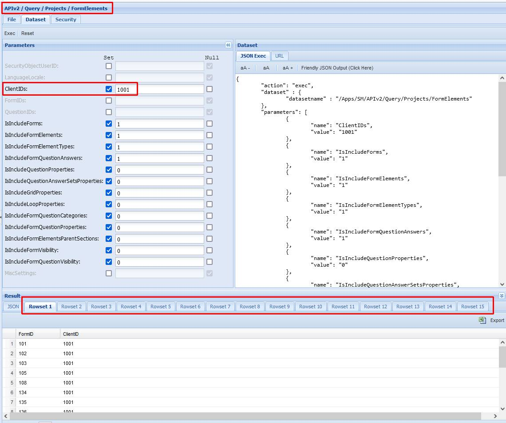
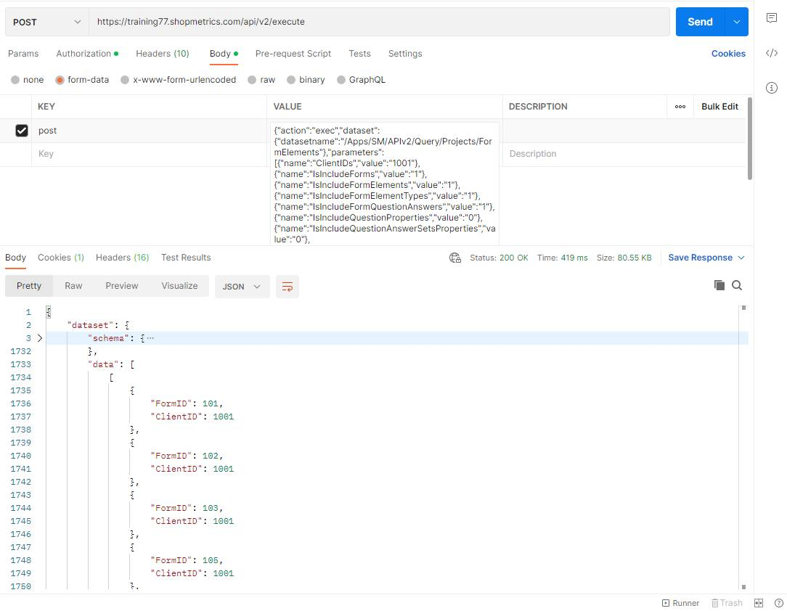

# Form Elements Query Resource

Last Modified: 2024-05-22 | Code: APIPFE

Use the "/APIv2/Query/Projects/FormElements" dataset to retrieve data for the survey forms' structure. The dataset returns data that is summarized in the Extended Survey View interface.

**NOTE: The dataset requires passing a value to at least one of the following parameters: ClientIDs and FormIDs.**

The dataset returns 15 rowsets:

- **Rowset 1** contains information about the survey forms and their corresponding client. This rowset returns data if the **IsIncludeForms parameter** has a value of "1".
- **Rowset 2** contains information about the survey form structure for the survey forms in Rowset 1. This rowset returns data if the **IsIncludeFormElements parameter** has a value of "1".  
  If the **IsIncludeFormElementsParentSections parameter** has a value of "1", **Rowset 2** returns additional information about the parent sections of the survey form elements .
- **Rowset 3** contains information about the types of elements in Rowset 2. This rowset returns data if the **I****sIncludeFormElementTypes parameter** has a value of "1".
- **Rowset 4** contains information about the survey form questions with answer sets. This rowset returns data if the **IsIncludeFormQuestionAnswers parameter** has a value of "1".
- **Rowset 5** contains information about the question properties on a question level for the survey forms in Rowset 1.This rowset returns data if the **IsIncludeQuestionProperties parameter** has a value of "1".
- **Rowset 6** contains information about the answer set properties for the questions in Rowset 2. This rowset returns data if the **IsIncludeQuestionAnswerSetsProperties parameter** has a value of "1".
- **Rowset 7** contains information about the grid properties for the survey forms in Rowset 1. This rowset returns data if the **IsIncludeGridProperties parameter** has a value of "1" and there are grid properties defined for the queried survey forms.
- **Rowset 8** contains information about the loop properties for the survey forms in Rowset 1. This rowset returns data if the **IsIncludeLoopProperties parameter** has a value of "1" and there are loop properties defined for the queried survey forms.
- **Rowset 9** contains information about the question categories for the survey forms in Rowset 1. This rowset returns data if the **IsIncludeFormQuestionCategories parameter** has a value of "1" and there are question categories defined for the queried survey forms.
- **Rowset 10** contains information about the question properties on a survey from level for the survey forms in Rowset 1. This rowset returns data if the I**sIncludeFormQuestionProperties parameter** has a value of "1".
- **Rowset 11** contains information about the survey form visibility for the survey forms in Rowset 1. This rowset returns data if the **IsIncludeFormVisibility parameter** has a value of "1" and there is specific survey visibility set for the queried survey forms.
- **Rowset 12** contains information about the security groups which are set as survey visibility exceptions for the survey forms in Rowset 1. This rowset returns data if the **IsIncludeFormVisibility parameter** has a value of "1" and there are visibility exceptions set for the queried survey forms.
- **Rowset 13** contains information about the questions with specific visibility set for the survey forms in Rowset 1. This rowset returns data if the **IsIncludeFormQuestionVisibility parameter** has a value of "1" and there is specific question visibility set for the queried survey forms.
- **Rowset 14** contains information about the security groups which are set as question visibility exceptions for the survey forms in Rowset 1. This rowset returns data if the I**sIncludeFormQuestionVisibility parameter** has a value of "1" and there are question visibility exceptions set for the queried survey forms.
- **Rowset 15** contains information for errors in case of a failed execution.

### Shopmetrics CMS UI – Dataset Execution

**ClientIDs parameter:** 1001

**IsIncludeForms parameter:** 1 (default value)

**IsIncludeFormElements parameter:** 1 (default value)

**IsIncludeFormElementTypes parameter:** 1 (default value)

**IsIncludeFormQuestionAnswers parameter:** 1 (default value)

**IsIncludeQuestionProperties parameter:** 0 (default value)

**IsIncludeQuestionAnswerSetsProperties parameter:** 0 (default value)

**IsIncludeGridProperties parameter:** 0 (default value)

**IsIncludeLoopProperties parameter:** 0 (default value)

**IsIncludeFormQuestionCategories:** 0 (default value)

**IsIncludeFormQuestionProperties****:** 0 (default value)

**IsIncludeFormElementsParentSections****:** 0 (default value)

**IsIncludeFormVisibility**: 0 (default value)

I**sIncludeFormQuestionVisibility**: 0 (default value)

### Postman

The content for the “post” parameter in the Body:

{"action":"exec","dataset":{"datasetname":"/Apps/SM/APIv2/Query/Projects/FormElements"},"parameters":[{"name":"ClientIDs","value":"1001"},{"name":"IsIncludeForms","value":"1"},{"name":"IsIncludeFormElements","value":"1"},{"name":"IsIncludeFormElementTypes","value":"1"},{"name":"IsIncludeFormQuestionAnswers","value":"1"},{"name":"IsIncludeQuestionProperties","value":"0"},{"name":"IsIncludeQuestionAnswerSetsProperties","value":"0"},{"name":"IsIncludeGridProperties","value":"0"},{"name":"IsIncludeLoopProperties","value":"0"},{"name":"IsIncludeFormQuestionCategories","value":"0"},{"name":"IsIncludeFormQuestionProperties","value":"0"},{"name":"IsIncludeFormElementsParentSections","value":"0"},{"name":"IsIncludeFormVisibility","value":"0"},{"name":"IsIncludeFormQuestionVisibility","value":"0"}]}

