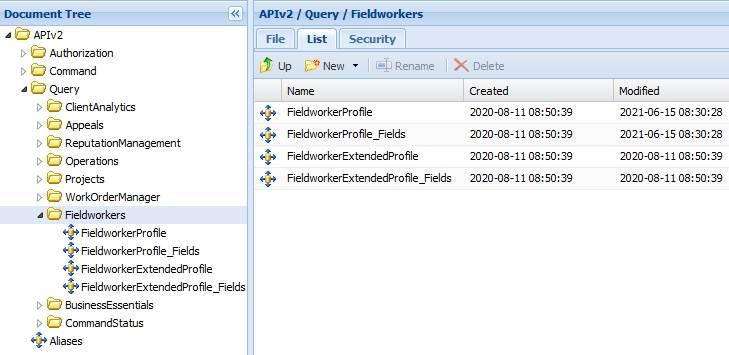

# Introduction to Fieldworkers

Last Modified: 2021-09-14 | Code: APIIFW

The Shopmetrics API Fieldworkers Query Data Model can be used for retrieving the contact and demographic data of users with any status. The Fieldworkers Query Data Model includes the Fieldworkers Profile Query Resources and the Fieldworkers Extended Profile Query Resources.

- The Fieldworkers Profile Query Resources return the data from the Contact Information and Details tabs of the User Profile interface
- The Fieldworkers Extended Profile Query Resources return the data from the Extended Profile tab of the User Profile interface

**NOTE: All Query Resources in this Data Model retrieve sensitive data and must be used with caution!**

It is recommended the Fieldworkers Query Data Model to be used with the "User Profiles - Restricted" security role. You can find more information about granting restricted access in the article "Grant Restricted Access to the System". Just type the article's code **GRAS** in the search bar and the document will appear first in the search results.

All Query Resources in this Data Model retrieve data which might be classified as personal. In order to get personal data in a plain text format, the user should be a member of the **PersonalData.Allow** security group. Otherwise, the fields classified as personal will not be displayed in the result. More information about the security roles can be found in the article "Privacy Governance in Shopmetrics". Just type the article's code **PGOV** in the search bar and the document will appear first in the search results.

**NOTE: Due to the rapid development of our product, some of the images in this set of articles will differ slightly from the production implementation.**

****
