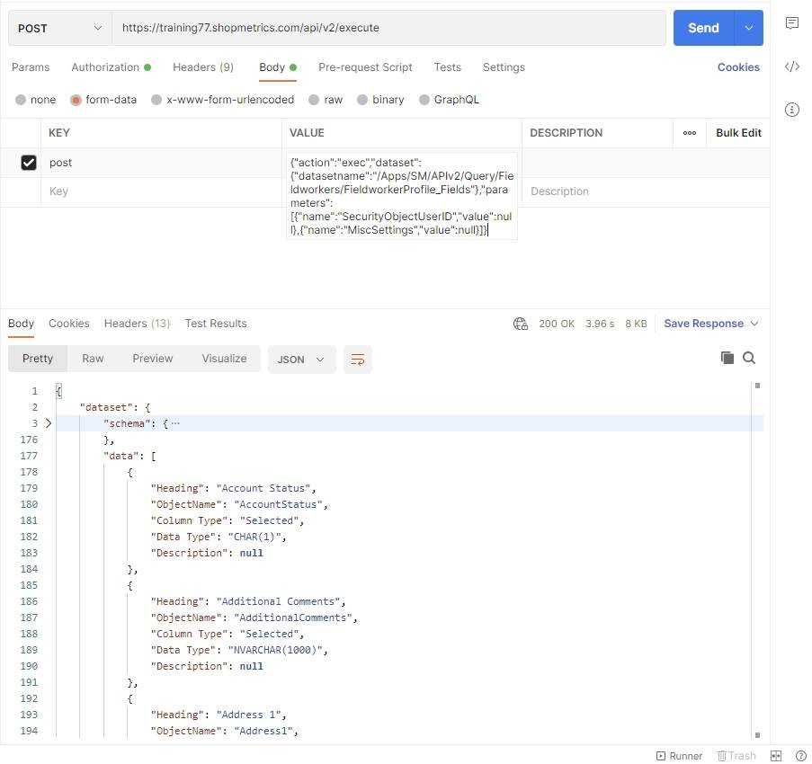
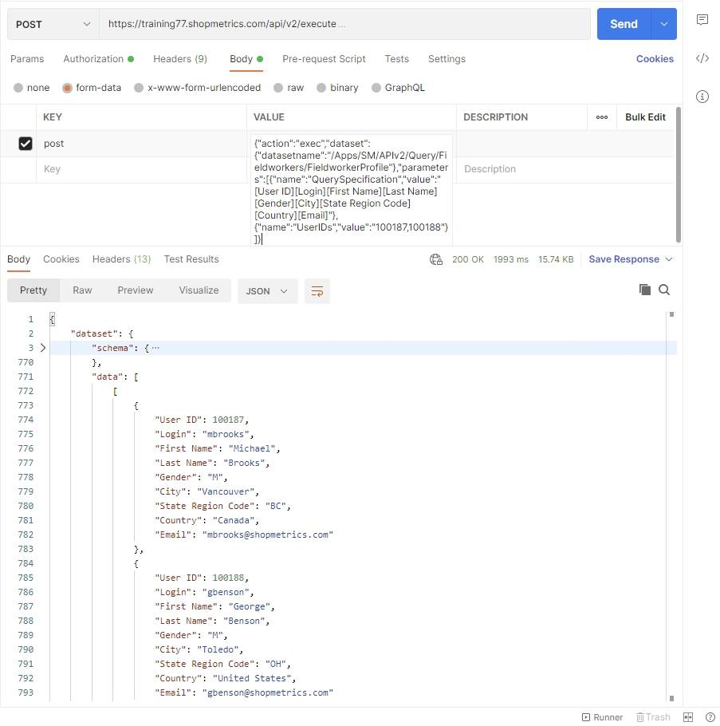
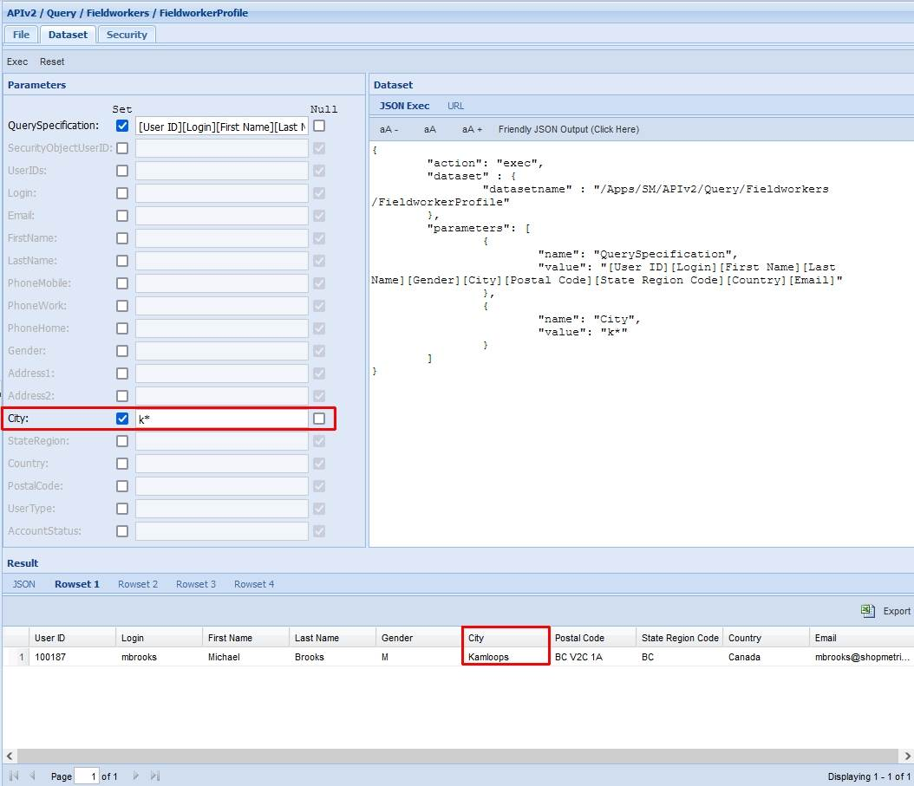
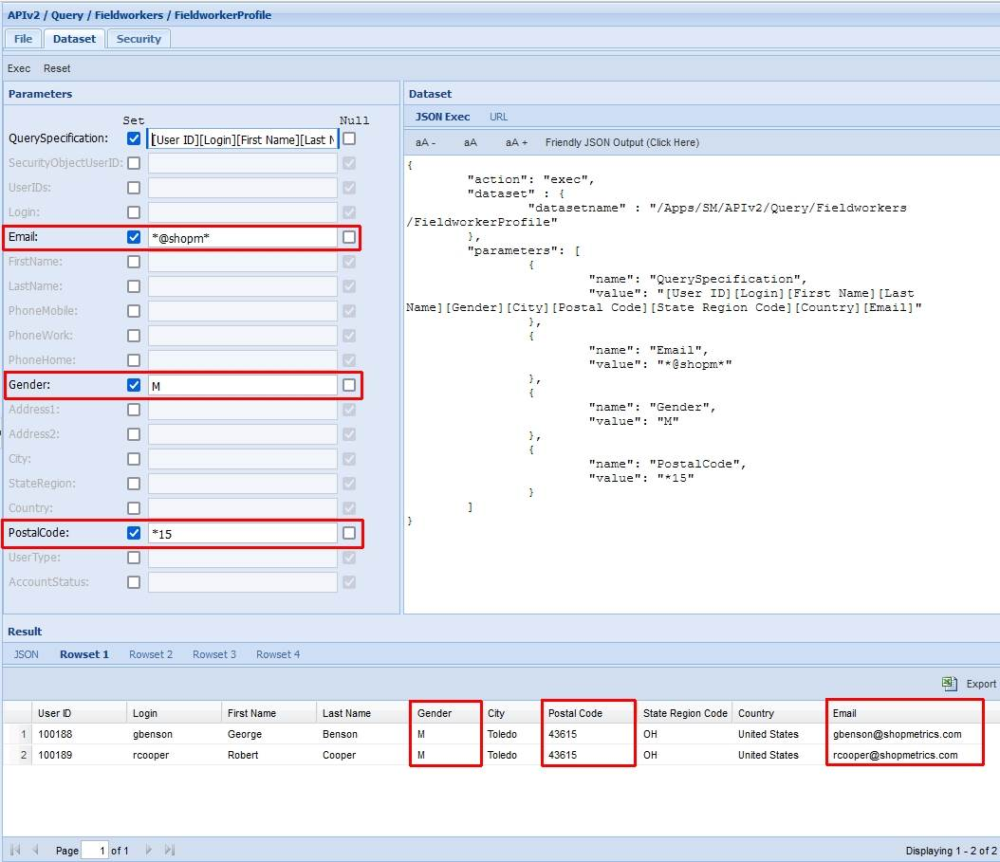
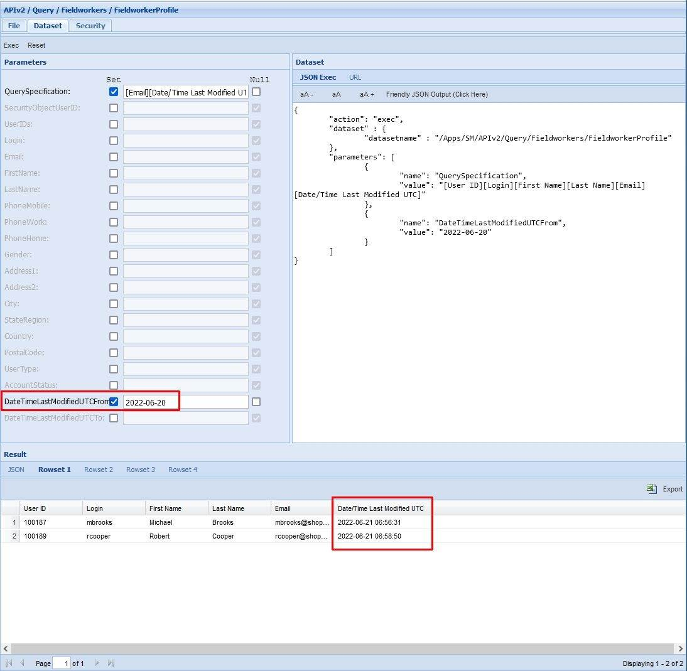

# Fieldworkers Query Resources

Last Modified: 2026-02-20 | Code: APIFW

## Fieldworkers Profile Fields

To see all available options (columns) of the “Query Specification” parameter for the FieldworkersProfile Query Resource, use the “/APIv2/Query/FieldWorkers/FieldworkerProfile\_Fields” dataset. The dataset can be executed without supplying values for the parameters.

### Shopmetrics CMS UI — Dataset Execution

### Postman

The API endpoint: /api/v2/execute

The content for the “post” parameter in the Body:

{"action":"exec","dataset":{"datasetname":"/Apps/SM/APIv2/Query/Fieldworkers/FieldworkerProfile\_Fields"},"parameters":[{"name":"SecurityObjectUserID","value":null},{"name":"MiscSettings","value":null}]}  


## List of Fieldworkers (Users)

The example below shows how to use the “/APIv2/Query/FieldWorkers/FieldworkerProfile” dataset to get the data from the Contact Information and Details tabs of the User Profile interface.

**NOTE: "/APIv2/Query/FieldWorkers/FieldworkerProfile" is a base query resource which means that it requires providing a value for the "QuerySpecification" parameter and providing a value(s) for at least one more of the following filtering parameters:**

- **UserIDs**
- **Login**
- **Email**
- **FirstName**
- **LastName**
- **PhoneMobile**
- **PhoneWork**
- **PhoneHome**
- **Address1**
- **Address2**
- **City**
- **StateRegion**
- **Country**
- **PostalCode**

**QuerySpecification parameter:** [User ID][Login][First Name][Last Name][Gender][City][State Region Code][Country][Email]

**UserIDs:** 100187,100188

### Shopmetrics CMS UI — Dataset Execution

### Postman

The API endpoint: /api/v2/execute

The content for the “post” parameter in the Body:

{"datasetname":"/Apps/SM/APIv2/Query/Fieldworkers/FieldworkerProfile"},"parameters":[{"name":"QuerySpecification","value":"[User ID][Login][First Name][Last Name][Gender][City][State Region Code][Country][Email]"},{"name":"UserIDs","value":"100187,100188"}]}  


### PowerShell code

```
Clear-Host;
Write-Host "Script Started";
Write-Host;

#Url to the Shopmetrics Platform:
$SMPlatformURL = "https://training77.shopmetrics.com";

#Endpoint to get authentication token (Access Token):
$GetTokenEndpoint = "$($SMPlatformURL)/oauth/connect/token";

#Object with credentials to be used as payload for "get access token":
$GetTokenRequestPayload = @{client_id="Training77_ApiUserOM"; client_secret="client_secret"; grant_type="client_credentials"};

#Request Object to be used by the REST Request:
$GetTokenRequestObject = @{
Uri = $GetTokenEndpoint;
Method = "POST";
Body = $GetTokenRequestPayload;
};

#REST Request to get the Access Token and assigned to a variable:
$GetTokenResponse= Invoke-RestMethod @GetTokenRequestObject;
$AccessToken = $GetTokenResponse."access_token";
#Print Access Token to check if it is successfully retrieved:
#Write-Host $AccessToken;

#Endpoint to execute the dataset:
$DatasetsExecuteEndpoint = "$($SMPlatformURL)/api/v2/execute";

#The value of the "post" parameter of the Execute Dataset request. This is a JSON string where all required parameters of the dataset must be provided:
$DatasetExecutePostParam = ' {"datasetname":"/Apps/SM/APIv2/Query/Fieldworkers/FieldworkerProfile"},"parameters":[{"name":"QuerySpecification","value":"[User ID][Login][First Name][Last Name][Gender][City][State Region Code][Country][Email]"},{"name":"UserIDs","value":"100187,100188"}]}';

#The Body of the Request Object to be used by the Execute Dataset request. It has only 1 parameter: "post" and its "value" is the "JSON string" with the input parameters:
$DatasetExecuteRequestPayload = @{post="$DatasetExecutePostParam"};

#Request Object to be used by the Execute Dataset request:
$DatasetExecuteRequestObject = @{
Uri = $DatasetsExecuteEndpoint;
Headers = @{"Authorization" = "Bearer $AccessToken"};
Method = "POST";
Body = $DatasetExecuteRequestPayload;
};

#REST Request to get the output data and assigned to a variable:
$DatasetExecuteResponse = Invoke-RestMethod @DatasetExecuteRequestObject;

#Write the output data (in JSON format) in a txt file:
$DatasetExecuteResponse | ConvertTo-Json -Depth 20 | Out-String | Out-File -FilePath "$($PSScriptRoot)\SMAPIIntegration_Example_FieldWorkers_List_Result.txt"

Write-Host;
Write-Host "Script Complete";
```

## Examples: Search capabilities

When working with “/APIv2/Query/Fieldworkers/FieldworkerProfile” you have the ability to filter your results by using the dataset's filtering parameters.

**NOTE: The values for the filtering parameters can include wildcards.**

### Example 1

The example below demonstrates how to use a wildcard to get a list of all shoppers whose cities start with the letter **"k".**

**QuerySpecification parameter:** [User ID][Login][First Name][Last Name][Gender][City][Postal Code][State Region Code][Country][Email]

**City parameter:**k\*  


### Example 2

The example below demonstrates how to use wildcards to get a list of all **male** shoppers with a **postal code**, which ends with **"15"** and an **email address**, which includes the string **"@shopm"**.

**QuerySpecification parameter:** [User ID][Login][First Name][Last Name][Gender][City][Postal Code][State Region Code][Country][Email]

**Email parameter:**\*@shopm\*

**Gender parameter:**M

**PostalCode parameter:**\*15  


### Example 3

The example below demonstrates how you can use the “/APIv2/Query/Fieldworkers/FieldworkerProfile” resource to extract all shoppers with profiles that were updated (or created) after **"****2022-06-20"**.

**QuerySpecification parameter:** [User ID][Login][First Name][Last Name][Email][Date/Time Last Modified UTC]

**DateTimeLastModifiedUTCFrom parameter:** 2022-06-20  

