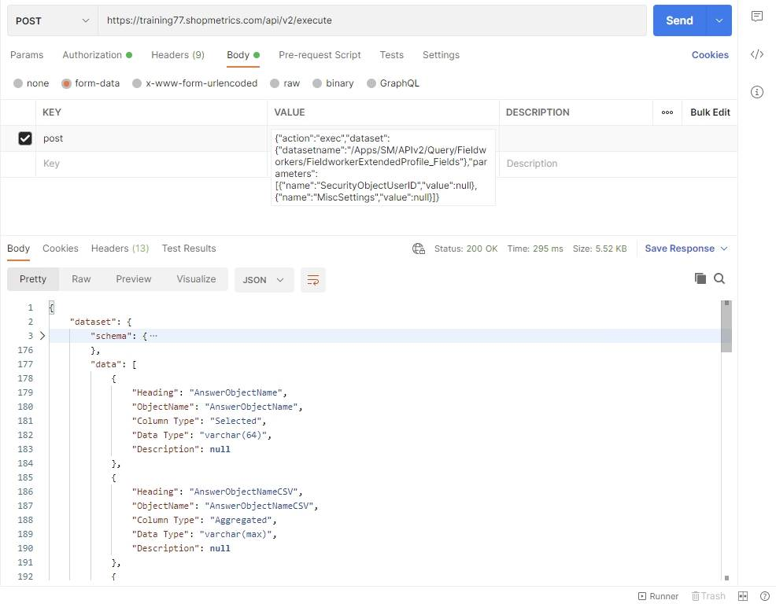
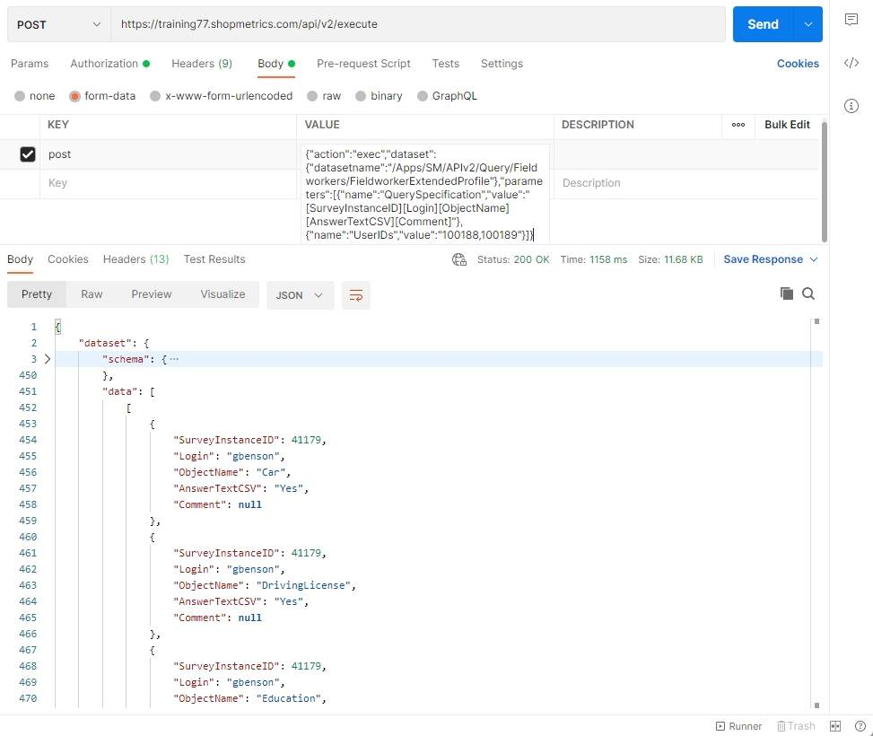
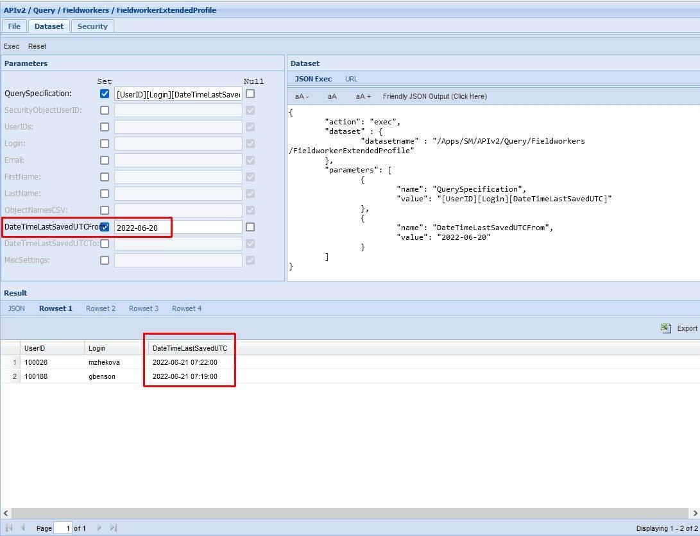
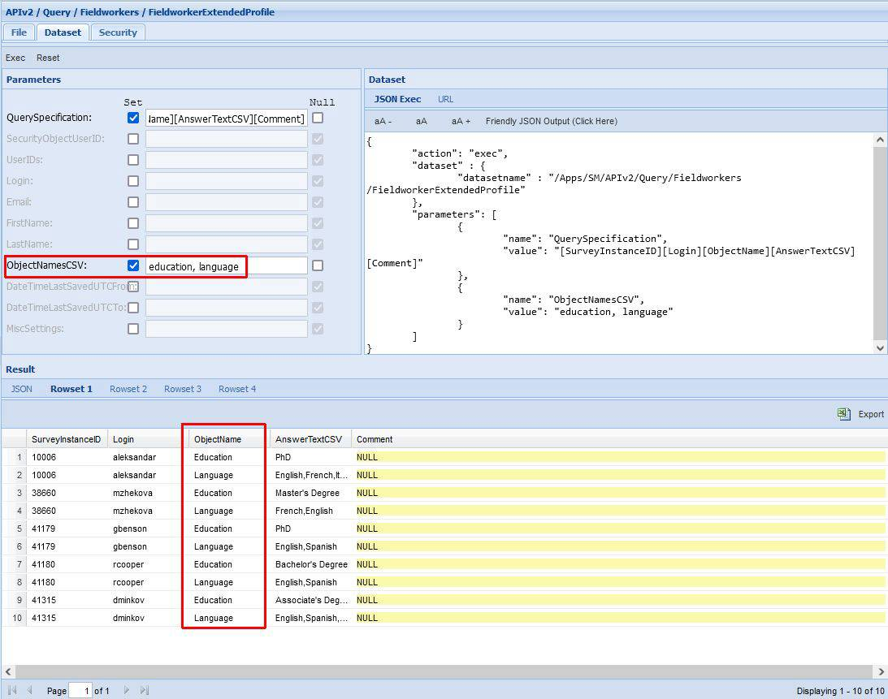

# Fieldworkers Extended Profile Query Resources

Last Modified: 2022-06-22 | Code: APIFWEX

## Fieldworkers Extended Profile Fields

To see all available options (columns) of the “Query Specification” parameter for the FieldworkersExtendedProfile Query Resource, use the “/APIv2/Query/Fieldworkers/FieldworkerExtendedProfile\_Fields” dataset. The dataset can be executed without supplying values for the parameters.

### Shopmetrics CMS UI — Dataset Execution

### Postman

The API endpoint: /api/v2/execute

The content for the “post” parameter in the Body:

{"action":"exec","dataset":{"datasetname":"/Apps/SM/APIv2/Query/Fieldworkers/FieldworkerExtendedProfile\_Fields"},"parameters":[{"name":"SecurityObjectUserID","value":null},{"name":"MiscSettings","value":null}]}



## List of Fieldworkers (Users) Extended Profile

The example below shows how to use the “/APIv2/Query/Fieldworkers/FieldworkerExtendedProfile” dataset to get the data from the Extended Profile tab of the User Profile interface.

**NOTE: The “FieldworkerExtendedProfile” dataset does not return any data for users who do not have an extended profile.**

**NOTE: The "FieldworkerExtendedProfile" dataset does not return data for questions with answers set to "N/A".**

**NOTE: The “FieldworkerExtendedProfile” dataset does not return data for questions in the Extended Profile that do not have Question Object Names set. You can find more information about Object Names in the article "How to Add/Edit Question Object Names in V2 Survey Forms". Just type the article's code ONV2 in the search bar and the document will appear first in the search results.**

**QuerySpecification parameter:** [SurveyInstanceID][Login][ObjectName][AnswerTextCSV][Comment]

**UserIDs parameter:** 100188,100189

### Shopmetrics CMS UI — Dataset Execution

### Postman

The API endpoint: /api/v2/execute

The content for the “post” parameter in the Body:

{"action":"exec","dataset":{"datasetname":"/Apps/SM/APIv2/Query/Fieldworkers/FieldworkerExtendedProfile"},"parameters":[{"name":"QuerySpecification","value":"[SurveyInstanceID][Login][ObjectName][AnswerTextCSV][Comment]"},{"name":"UserIDs","value":"100188,100189"}]}



### PowerShell code

```
Clear-Host;
Write-Host "Script Started";

#Url to the Shopmetrics Platform:
$SMPlatformURL = "https://training77.shopmetrics.com";

#Endpoint to get authentication token (Access Token):
$GetTokenEndpoint = "$($SMPlatformURL)/oauth/connect/token";

#Object with credentials to be used as payload for "get access token":
$GetTokenRequestPayload = @{client_id="Training77_ApiUserOM"; client_secret="client_secret"; grant_type="client_credentials"};

#Request Object to be used by the REST Request:
$GetTokenRequestObject = @{
Uri = $GetTokenEndpoint;
Method = "POST";
Body = $GetTokenRequestPayload;
};

#REST Request to get the Access Token and assigned to a variable:
$GetTokenResponse= Invoke-RestMethod @GetTokenRequestObject;
$AccessToken = $GetTokenResponse."access_token";
#Print Access Token to check if it is successfully retrieved:
#Write-Host $AccessToken;

#Endpoint to execute the dataset:
$DatasetsExecuteEndpoint = "$($SMPlatformURL)/api/v2/execute";

#The value of the "post" parameter of the Execute Dataset request. This is a JSON string where all required parameters of the dataset must be provided:
$DatasetExecutePostParam = ' {"action":"exec","dataset":{"datasetname":"/Apps/SM/APIv2/Query/Fieldworkers/FieldworkerExtendedProfile"},"parameters":[{"name":"QuerySpecification","value":"[SurveyInstanceID][Login][ObjectName][AnswerTextCSV][Comment]"},{"name":"UserIDs","value":"100188,100189"}]}';

#The Body of the Request Object to be used by the Execute Dataset request. It has only 1 parameter: "post" and its "value" is the "JSON string" with the input parameters:
$DatasetExecuteRequestPayload = @{post="$DatasetExecutePostParam"};

#Request Object to be used by the Execute Dataset request:
$DatasetExecuteRequestObject = @{
Uri = $DatasetsExecuteEndpoint;
Headers = @{"Authorization" = "Bearer $AccessToken"};
Method = "POST";
Body = $DatasetExecuteRequestPayload;
};

#REST Request to get the output data and assigned to a variable:
$DatasetExecuteResponse = Invoke-RestMethod @DatasetExecuteRequestObject;

#Write the output data (in JSON format) in a txt file:
$DatasetExecuteResponse | ConvertTo-Json -Depth 20 | Out-String | Out-File -FilePath "$($PSScriptRoot)\SMAPIIntegration_Example_FieldWorkersExtendedProfile_List_Result.txt"

Write-Host "Script Complete";
```

## Examples: Search capabilities

When working with “/APIv2/Query/Fieldworkers/FieldworkerExtendedProfile” you have the ability to filter your results by using the dataset's filtering parameters.

### Example 1

The example below demonstrates how you can use the “/Apps/SM/APIv2/Query/Fieldworkers/FieldworkerExtendedProfile” resource to extract all shoppers with extended profiles that were updated after **"2022-06-20"**.

**QuerySpecification parameter:** [UserID][Login][DateTimeLastSavedUTC]

**DateTimeLastSavedUTCFrom parameter:** 2022-06-20



### Example 2

The example below demonstrates how to get a list of all shoppers, who answered the questions with object names "Education" and "Language" in their extended profile.

**QuerySpecification parameter:** [UserID][Login][DateTimeLastSavedUTC]

**ObjectNamesCSV parameter:** education, language  
  

