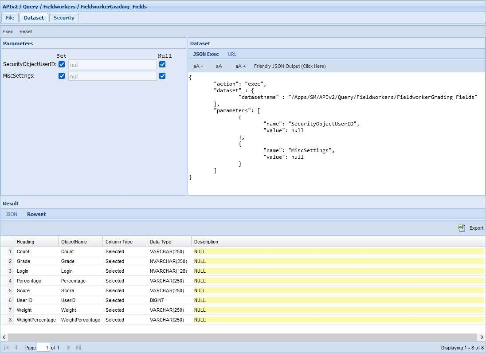
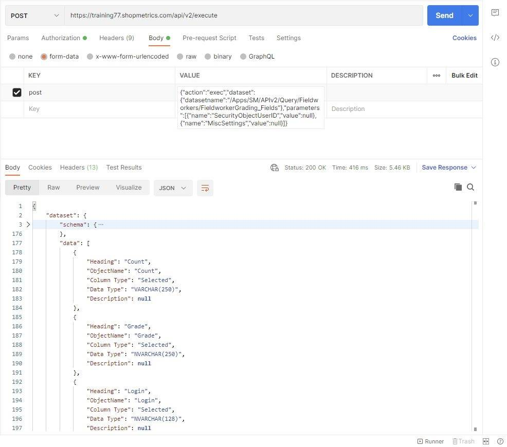
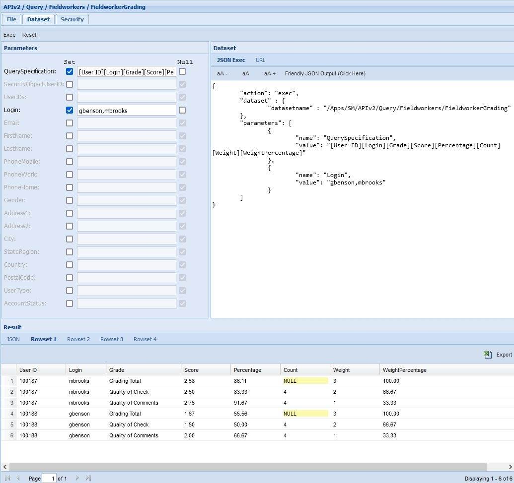
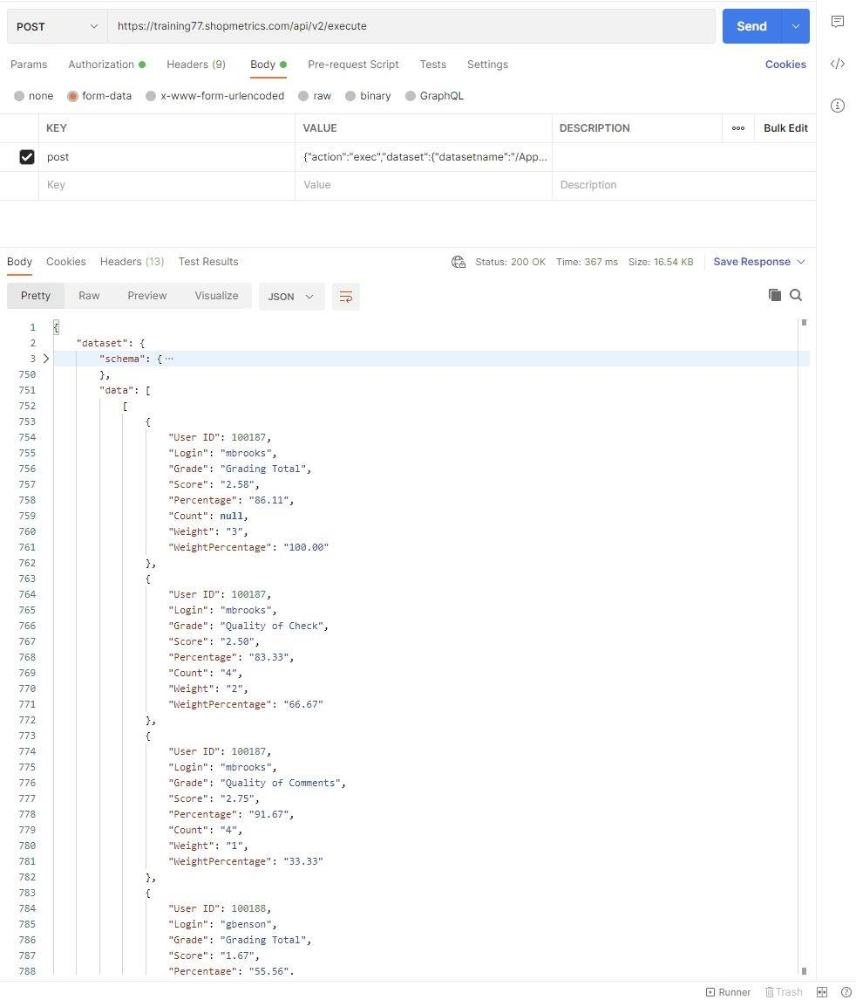

# Fieldworkers Grading Query Resource

Last Modified: 2025-04-07 | Code: APIFWG

## Fieldworkers Grading Fields

To see all available options (fields) of the “Query Specification” parameter for the FieldworkersGrading Query Resource, use the “/Apps/SM/APIv2/Query/Fieldworkers/FieldworkerGrading\_Fields” dataset. The dataset can be executed without supplying values for the parameters.

### Shopmetrics CMS UI — Dataset Execution

### Postman

The API endpoint: /api/v2/execute

The content for the “post” parameter in the Body:

{"action":"exec","dataset":{"datasetname":"/Apps/SM/APIv2/Query/Fieldworkers/FieldworkerGrading\_Fields"},"parameters":[{"name":"SecurityObjectUserID","value":null},{"name":"MiscSettings","value":null}]}

## List of Fieldworkers Grading Summary Data

The example below details how to use the “/Apps/SM/APIv2/Query/Fieldworkers/FieldworkerGrading” dataset to get the same data as the "Grading Summary" table in the Performance tab of the User Profile interface.

**NOTE: "/Apps/SM/APIv2/Query/Fieldworkers/FieldworkerGrading" is a base query resource which means that it requires providing a value for the "QuerySpecification" parameter and providing a value(s) for at least one more of the following filtering parameters:**

- **UserIDs**
- **Login**
- **Email**
- **FirstName**
- **LastName**
- **PhoneMobile**
- **PhoneWork**
- **PhoneHome**
- **Address1**
- **Address2**
- **City**
- **StateRegion**
- **Country**
- **PostalCode**

### Shopmetrics CMS UI — Dataset Execution

**QuerySpecification parameter:** [User ID][Login][Grade][Score][Percentage][Count][Weight][WeightPercentage]

**Login parameter:** gbenson,mbrooks

### Postman

The API endpoint: /api/v2/execute

The content for the “post” parameter in the Body:

{"action":"exec","dataset":{"datasetname":"/Apps/SM/APIv2/Query/Fieldworkers/FieldworkerGrading"},"parameters":[{"name":"QuerySpecification","value":"[User ID][Login][Grade][Score][Percentage][Count][Weight][WeightPercentage]"},{"name":"Login","value":"gbenson,mbrooks"}]}

