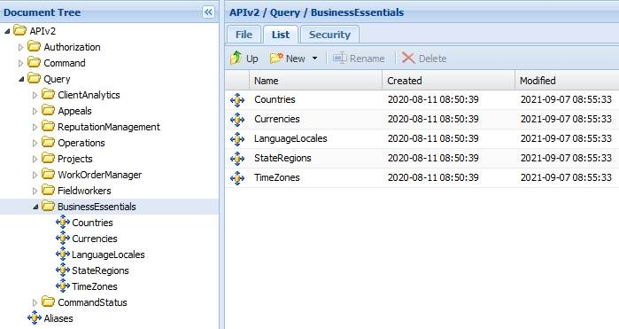

# Introduction to Business Essentials

Last Modified: 2021-09-14 | Code: APIIBE

The Shopmetrics API Business Essentials Query Data Model can be used for retrieving data for enumerated administrative system entities. The enumerated administrative system entities include Countries, Languages, State/Regions, Currencies and Time Zones that are enabled on your Shopmetrics application.

**NOTE: Due to the rapid development of our product, some of the images in this set of articles will differ slightly from the production implementation.**

****
