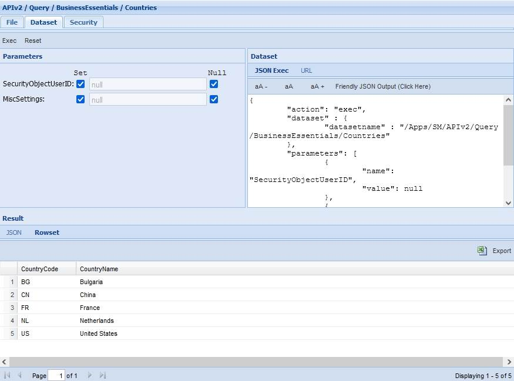
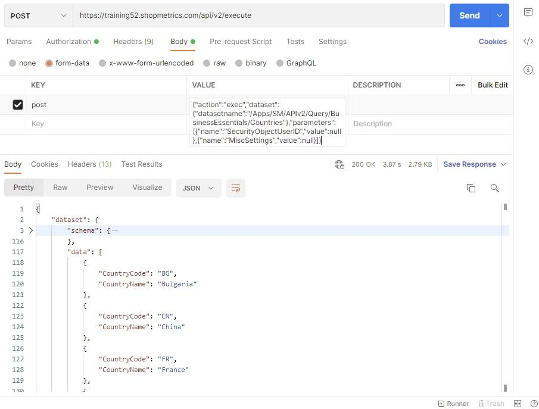

# Countries Query Resource

Last Modified: 2021-10-26 | Code: APIBECO

To see the available Countries use the "/APIv2/Query/BusinessEssentials/Countries" dataset. The dataset can be executed without supplying values for the parameters.

### Shopmetrics CMS UI — Dataset Execution

### Postman

The content for the “post” parameter in the Body:

{"action":"exec","dataset":{"datasetname":"/Apps/SM/APIv2/Query/BusinessEssentials/Countries"},"parameters":[{"name":"SecurityObjectUserID","value":null},{"name":"MiscSettings","value":null}]}

