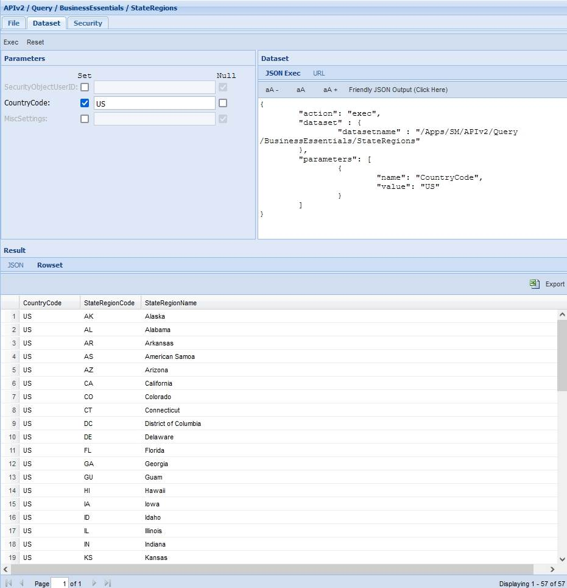
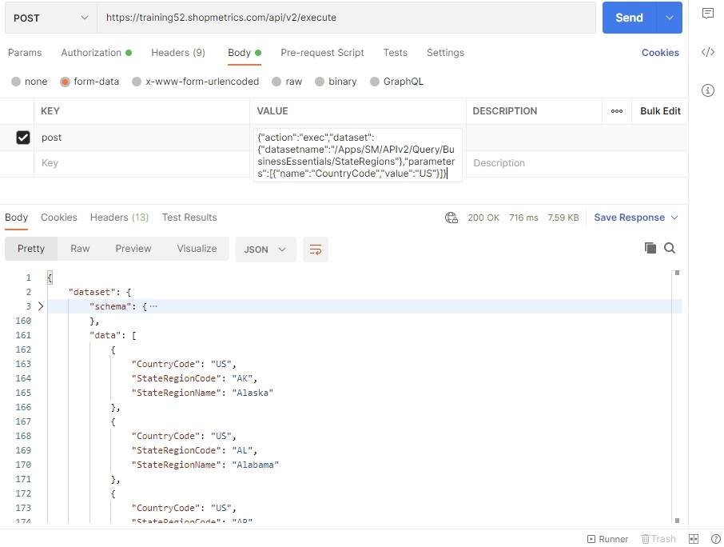

# State/Regions Query Resource

Last Modified: 2021-10-26 | Code: APIBESR

To see the available State/Regions use the "/APIv2/Query/BusinessEssentials/StateRegions" dataset. The dataset can be executed without supplying values for the parameters.

### Shopmetrics CMS UI — Dataset Execution

**CountryCode parameter:** US

### Postman

The content for the “post” parameter in the Body:

{"action":"exec","dataset":{"datasetname":"/Apps/SM/APIv2/Query/BusinessEssentials/StateRegions"},"parameters":[{"name":"CountryCode","value":"US"}]}

