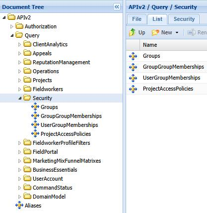

# Introduction to Security

Last Modified: 2025-09-09 | Code: APIIS

The Shopmetrics API Security Query Data Model provides access to Query Resources for discovering the Security Schema and Security Group Memberships.

- **Security Groups Query Resource** - returns a catalogue of the security groups and roles in the system, each paired with its stored description.
- **Security Group Memberships Query Resource** - lists parent-child relationships between groups and roles.
- **User Security Group Memberships Query Resource** - lists the security groups tied to each user.
- **Project Access Policies Query Resource** - returns data for project access policies that are explicitly defined for individual users across clients, locations, and client properties.

**NOTE: Due to the rapid development of our product, some of the images in this set of articles may differ slightly from the production implementation.**

****
