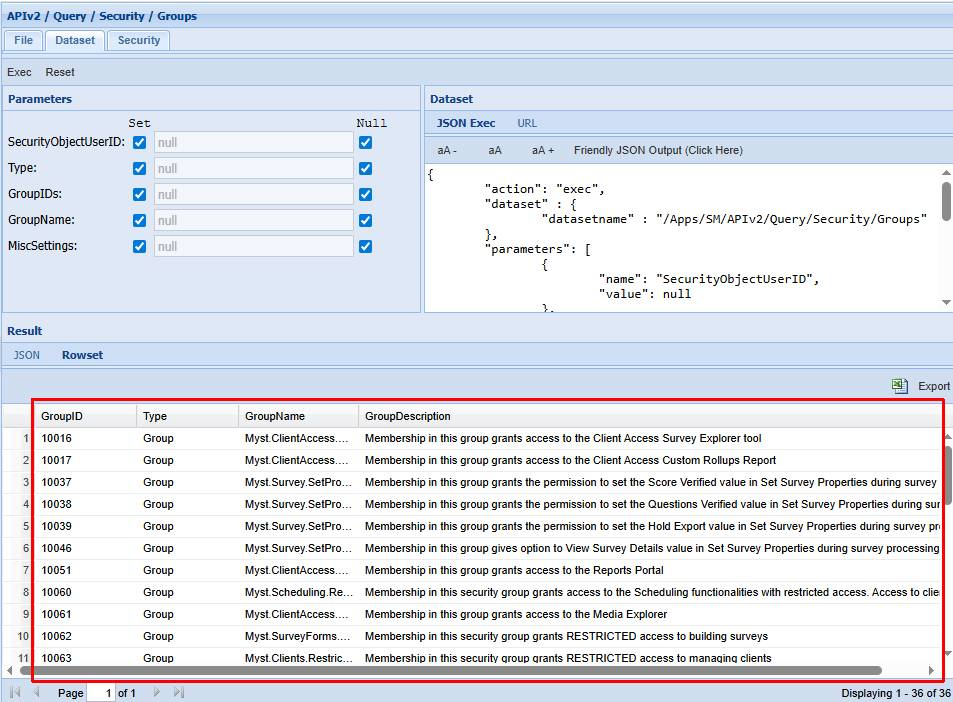
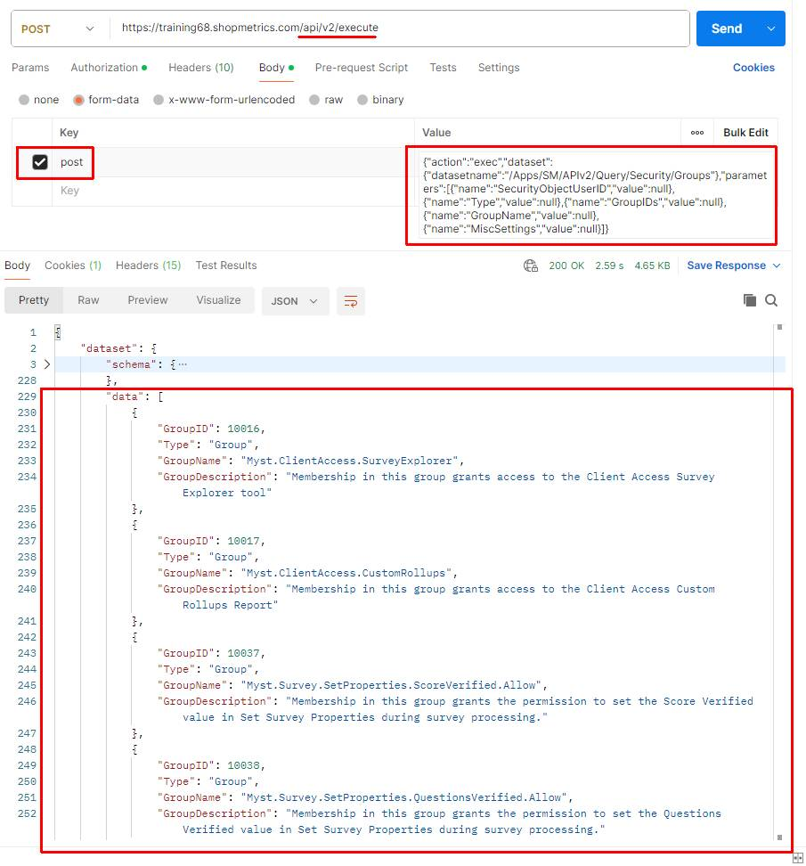

# Security Groups Query Resource

Last Modified: 2025-07-04 | Code: APISG

To see the available Security Groups and Roles use the "/APIv2/Query/Security/Groups" dataset without supplying values for the parameters.

### Shopmetrics CMS UI — Dataset Execution

### Postman

**API endpoint**: /api/v2/execute

The content for the “post” parameter in the Body:

{"action":"exec","dataset":{"datasetname":"/Apps/SM/APIv2/Query/Security/Groups"},"parameters":[{"name":"SecurityObjectUserID","value":null},{"name":"Type","value":null},{"name":"GroupIDs","value":null},{"name":"GroupName","value":null},{"name":"MiscSettings","value":null}]}

