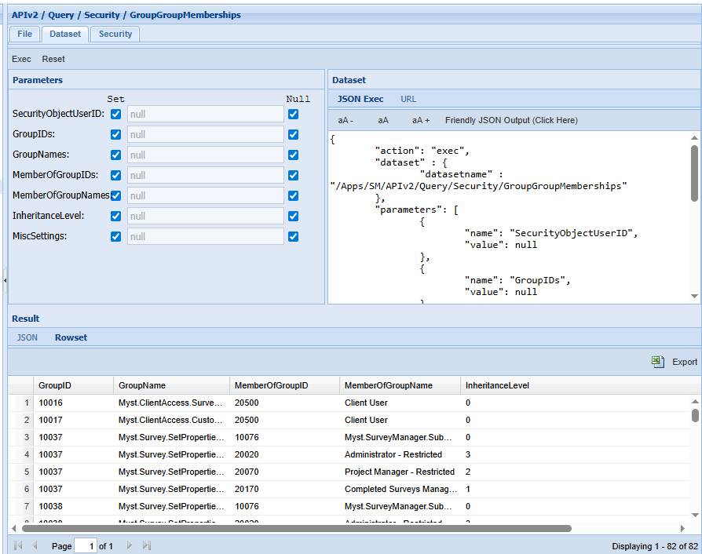
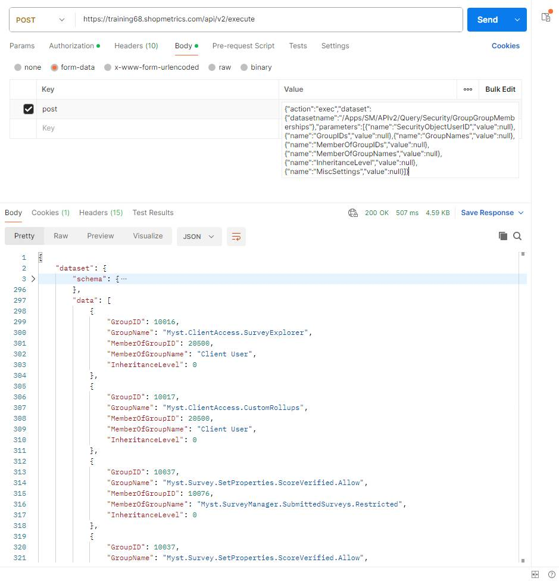
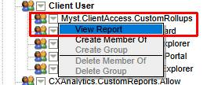
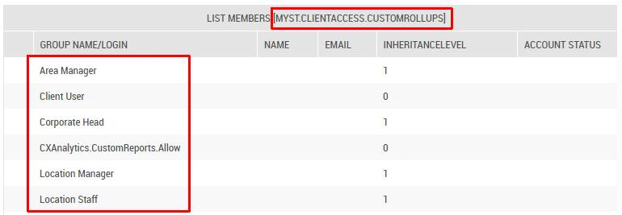
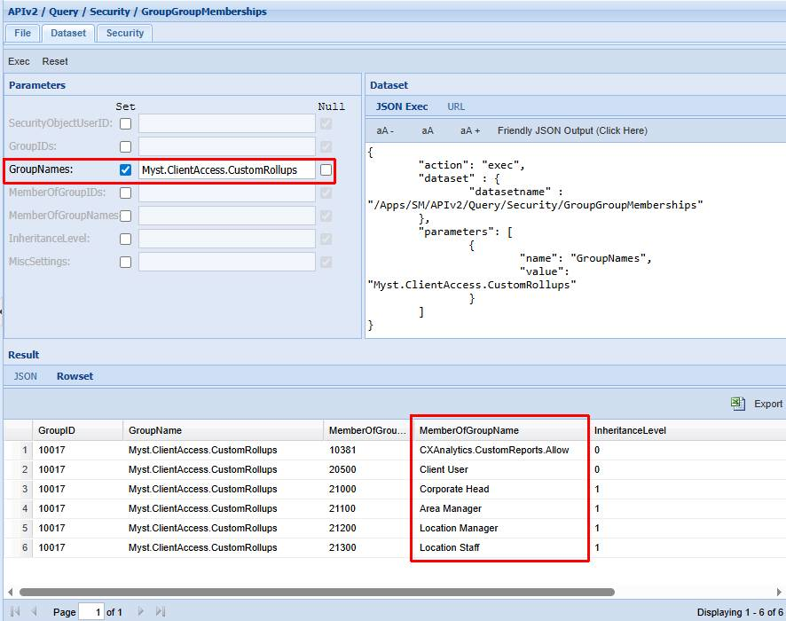
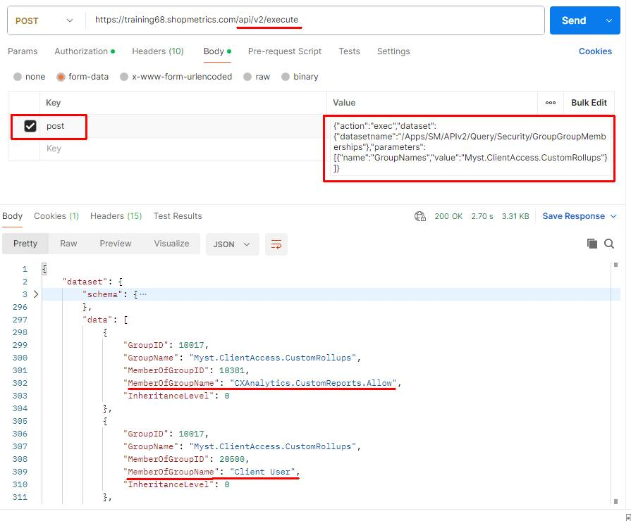
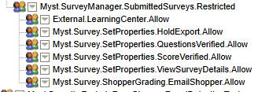
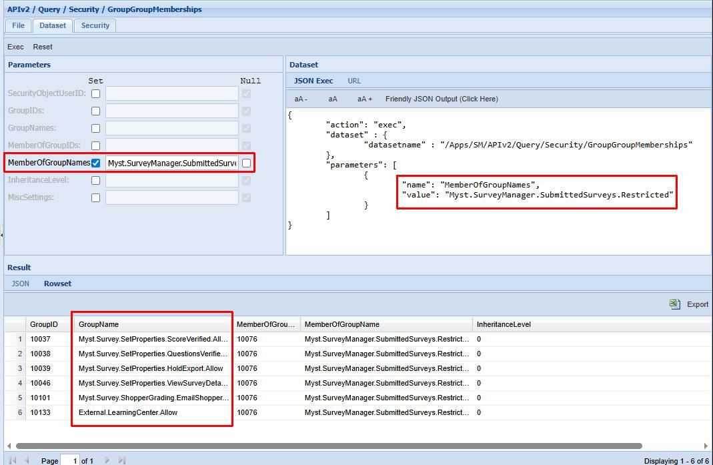
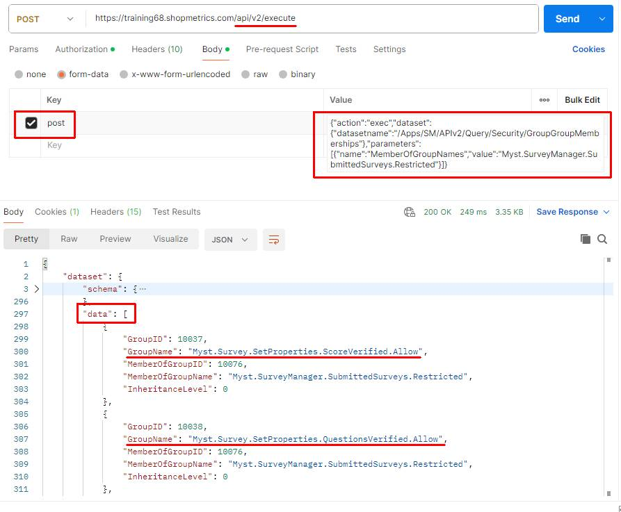

# Security Group Memberships Query Resource

Last Modified: 2025-07-04 | Code: APISGM

To get the available security groups and roles, along with their memberships in other security groups or roles, use the “**/APIv2/Query/Security/GroupGroupMemberships**” dataset without specifying any parameters.

### Shopmetrics CMS UI — Dataset Execution

### Postman

**API endpoint**: /api/v2/execute

The content for the “post” parameter in the Body:

{"action":"exec","dataset":{"datasetname":"/Apps/SM/APIv2/Query/Security/GroupGroupMemberships"},"parameters":[{"name":"SecurityObjectUserID","value":null},{"name":"GroupIDs","value":null},{"name":"GroupNames","value":null},{"name":"MemberOfGroupIDs","value":null},{"name":"MemberOfGroupNames","value":null},{"name":"InheritanceLevel","value":null},{"name":"MiscSettings","value":null}]}

## Examples: Search capabilities

When working with “/APIv2/Query/Security/GroupGroupMemberships” you have the ability to filter your results by using the dataset's filtering parameters.

### Example 1

The example below retrieves every security group and role to which "**Myst.ClientAccess.CustomRollups**" belongs.

The screenshot below shows the security groups/roles to which "Myst.ClientAccess.CustomRollups" belongs, as viewed in the Security Interface:

#### Shopmetrics CMS UI — Dataset Execution

**GroupNames parameter:** Myst.ClientAccess.CustomRollups

**NOTE: The "GroupNames" parameter can also accept a comma-separated list of values.**

****

#### Postman

**API endpoint**: /api/v2/execute

The content for the “post” parameter in the Body:

{"action":"exec","dataset":{"datasetname":"/Apps/SM/APIv2/Query/Security/GroupGroupMemberships"},"parameters":[{"name":"GroupNames","value":"Myst.ClientAccess.CustomRollups"}]}

### Example 2

The following example shows how to retrieve every security group that belongs to "**Myst.SurveyManager.SubmittedSurveys.Restricted**".

The screenshot below shows the security groups that "Myst.SurveyManager.SubmittedSurveys.Restricted" includes, as viewed in the Security Interface:

#### Shopmetrics CMS UI — Dataset Execution

**MemberOfGroupNames parameter**: Myst.SurveyManager.SubmittedSurveys.Restricted

**NOTE: The "MemberOfGroupNames" parameter can also accept a comma-separated list of values.******

#### Postman

**API endpoint**: /api/v2/execute

The content for the “post” parameter in the Body:

{"action":"exec","dataset":{"datasetname":"/Apps/SM/APIv2/Query/Security/GroupGroupMemberships"},"parameters":[{"name":"MemberOfGroupNames","value":"Myst.SurveyManager.SubmittedSurveys.Restricted"}]}

