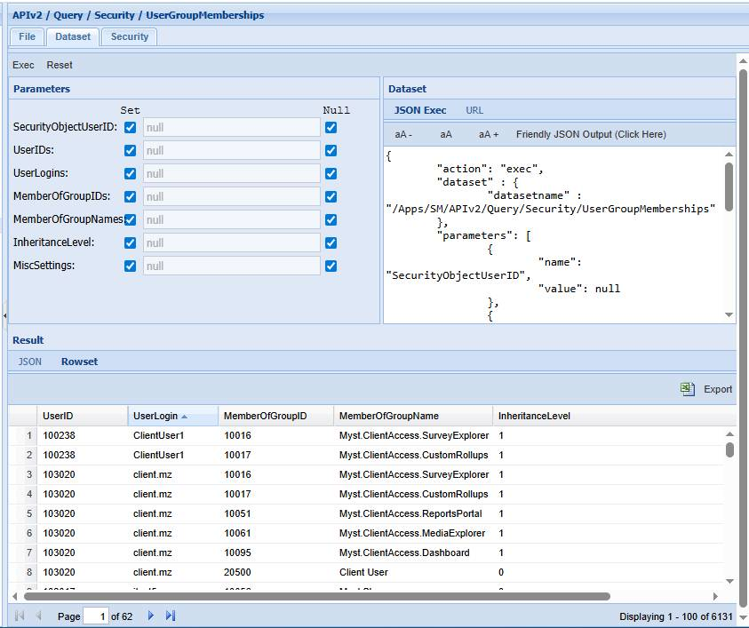
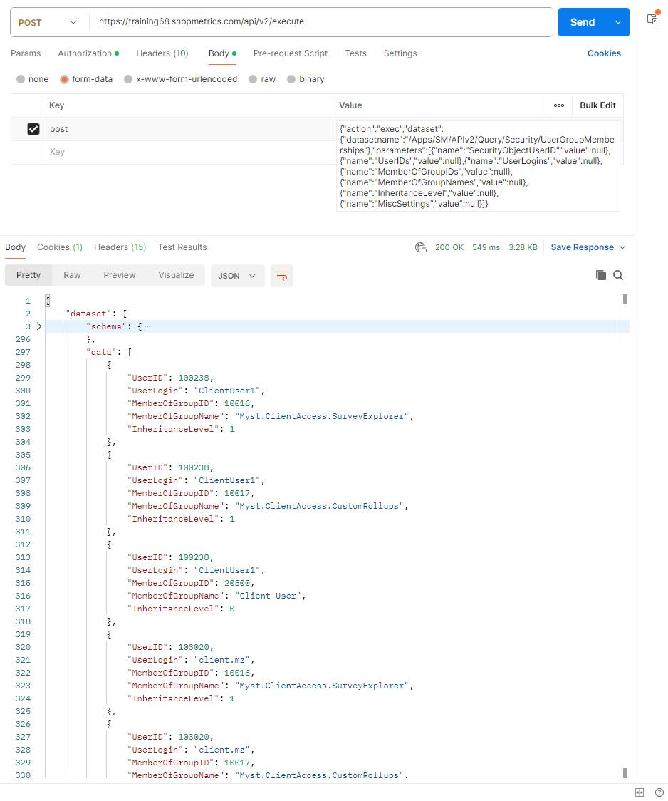
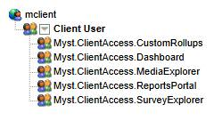
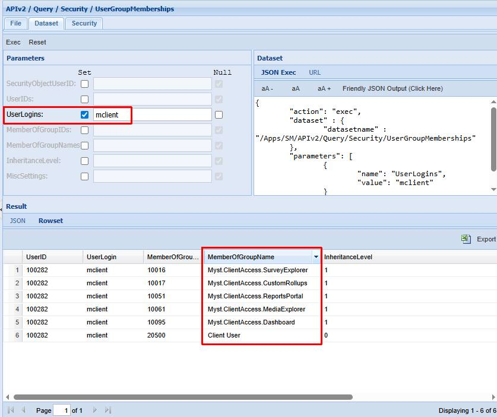
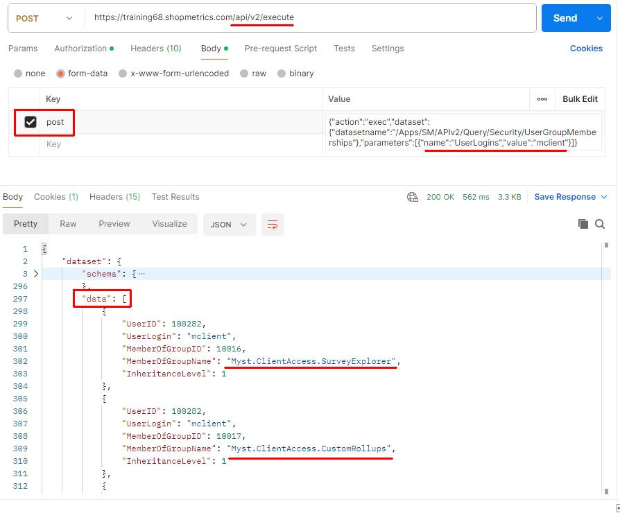
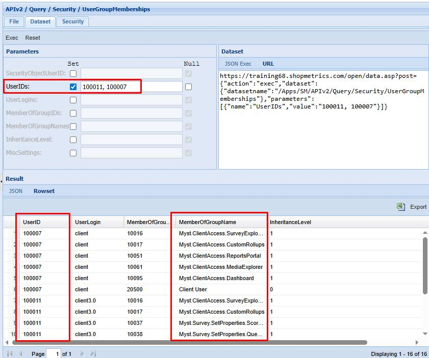
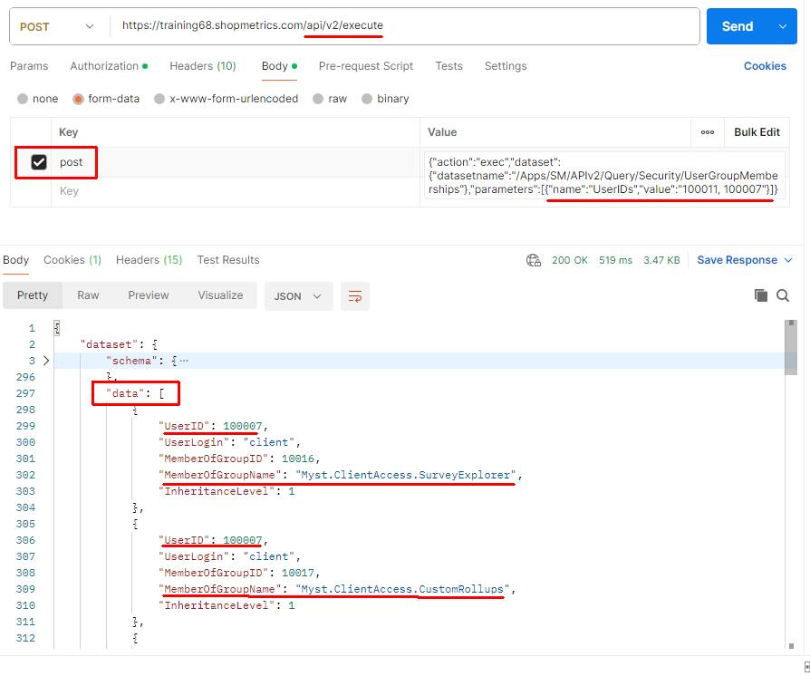
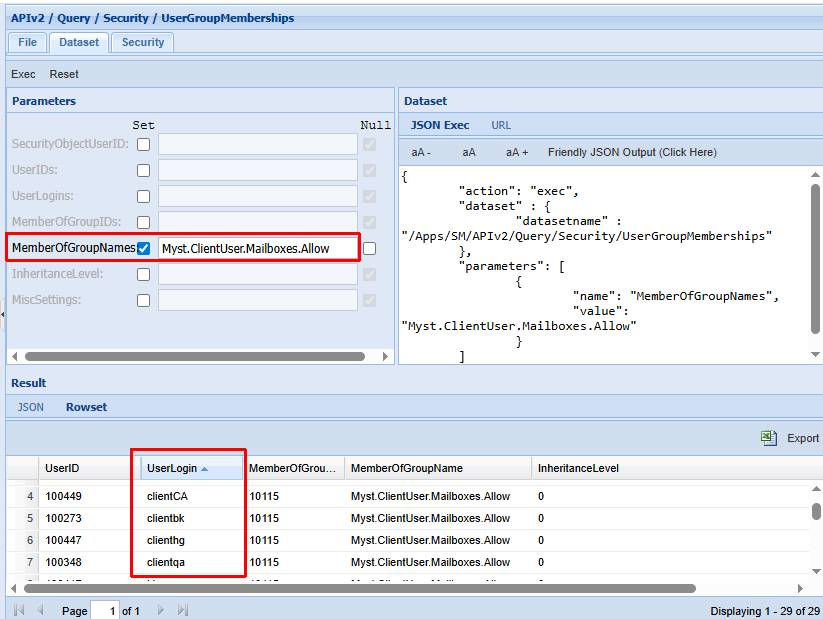
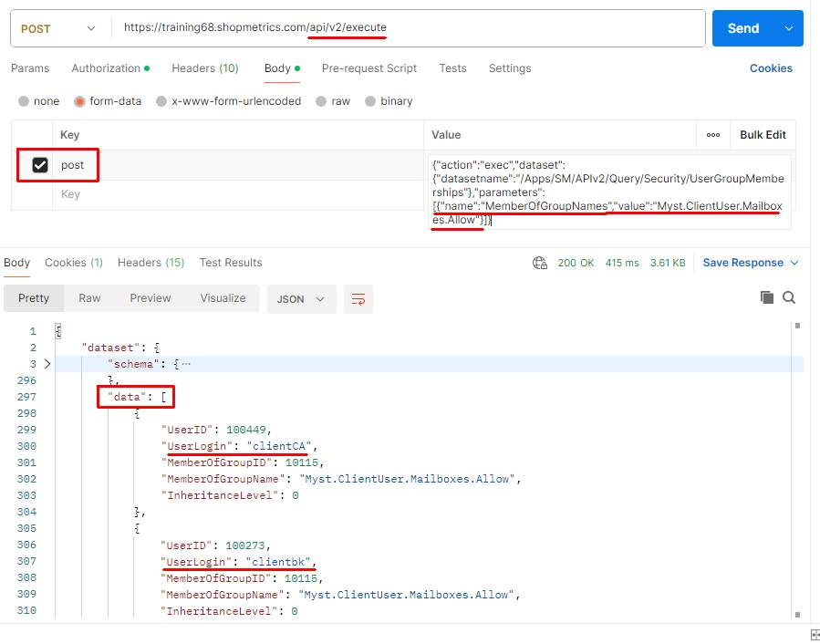

# User Security Group Memberships Query Resource

Last Modified: 2025-07-04 | Code: APIUSGM

To see the user security groups memberships you can use the "**/APIv2/Query/Security/UserGroupMemberships**" dataset without supplying values for the parameters.

### Shopmetrics CMS UI — Dataset Execution

### Postman

**API endpoint**: /api/v2/execute

The content for the “post” parameter in the Body:

{"action":"exec","dataset":{"datasetname":"/Apps/SM/APIv2/Query/Security/UserGroupMemberships"},"parameters":[{"name":"SecurityObjectUserID","value":null},{"name":"UserIDs","value":null},{"name":"UserLogins","value":null},{"name":"MemberOfGroupIDs","value":null},{"name":"MemberOfGroupNames","value":null},{"name":"InheritanceLevel","value":null},{"name":"MiscSettings","value":null}]}

## Examples: Search capabilities

When working with “/APIv2/Query/Security/UserGroupMemberships” you have the ability to filter your results by using the dataset's filtering parameters.

### Example 1

The example below retrieves the security groups and roles to which the user with login “**mclient**” belongs.

The screenshot below shows the user “mclient” and their security group and role memberships in the Security interface:

#### Shopmetrics CMS UI — Dataset Execution

**UserLogins parameter**: mclient

**NOTE: The "UserLogins" parameter can also accept a comma-separated list of values.**

#### Postman

**API endpoint:** /api/v2/execute

The content for the “post” parameter in the Body:

{"action":"exec","dataset":{"datasetname":"/Apps/SM/APIv2/Query/Security/UserGroupMemberships"},"parameters":[{"name":"UserLogins","value":"mclient"}]}

### Example 2

The example below retrieves the security group and role memberships for the users with IDs  "**100011**" and "**100007**".

#### Shopmetrics CMS UI — Dataset Execution

**UserIDs parameter**: 100011, 100007

#### Postman

**API endpoint:** /api/v2/execute

The content for the “post” parameter in the Body:

{"action":"exec","dataset":{"datasetname":"/Apps/SM/APIv2/Query/Security/UserGroupMemberships"},"parameters":[{"name":"UserIDs","value":"100011, 100007"}]}

### Example 3

The following example shows how to retrieve the user logins that belong to the "**Myst.ClientUser.Mailboxes.Allow**" security group.

#### Shopmetrics CMS UI — Dataset Execution

**MemberOfGroupNames parameter**: Myst.ClientUser.Mailboxes.Allow

**NOTE: The "MemberOfGroupNames" parameter can accept a comma-separated list of values.**

#### Postman

**API endpoint**: /api/v2/execute

The content for the “post” parameter in the Body:

{"action":"exec","dataset":{"datasetname":"/Apps/SM/APIv2/Query/Security/UserGroupMemberships"},"parameters":[{"name":"MemberOfGroupNames","value":"Myst.ClientUser.Mailboxes.Allow"}]}

