# Project Access Policies Query Resource

Last Modified: 2025-09-09 | Code: APISPAP

You can use the "**/Apps/SM/APIv2/Query/Security/ProjectAccessPolicies**" dataset to **retrieve data for project access policies that are explicitly defined** for individual users across clients, locations, and client properties.

The dataset returns 3 rowsets:

- **Rowset 1** contains data for **user** **access policies at the client level.** It reflects the user permissions configured in the “**Client Policies**” table found under **Administration -> Security -> Clients/Locations tab**:  
   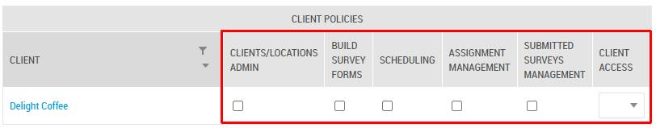**NOTE: Rowset 1 returns data if the IsIncludeClientPolicies parameter has a value of "1".**
- **Rowset 2** contains data for **user access policies scoped to specific locations within each client**. It captures the user permissions set in the “Location Policies” table, accessible by opening a specific client under Administration -> Security -> Clients/Locations tab:  
  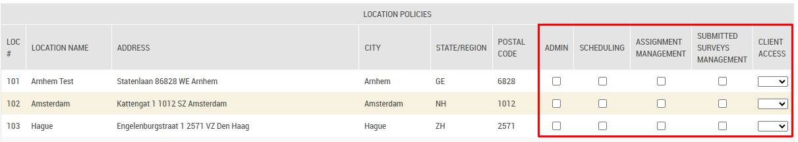**NOTE: Rowset 2 returns data if the IsIncludeClientLocationPolicies parameter has a value of "1".**
- **Rowset 3** contains data for **user access policies in the context of client-defined (custom) properties**. It reflects the user permissions set in the “Custom Properties” table, accessible when opening a specific client under Administration -> Security -> Clients/Locations tab:  
  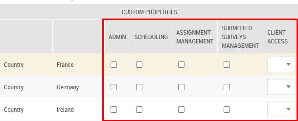**NOTE: Rowset 3 returns data if the IsIncludeClientCustomPropertiesPolicies parameter has a value of "1".**

## Shopmetrics CMS UI — Dataset Execution

**IsIncludeClientPolicies parameter**: 1 (default value)

**IsIncludeClientLocationPolicies parameter**: 1 (default value)

**IsIncludeClientCustomPropertiesPolicies parameter**: 1 (default value)

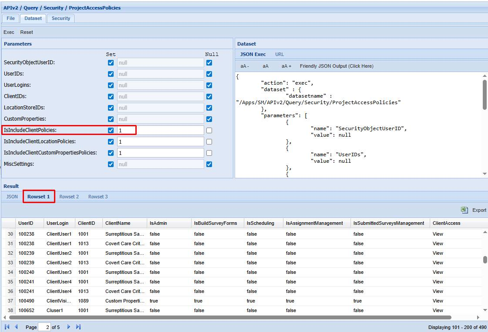

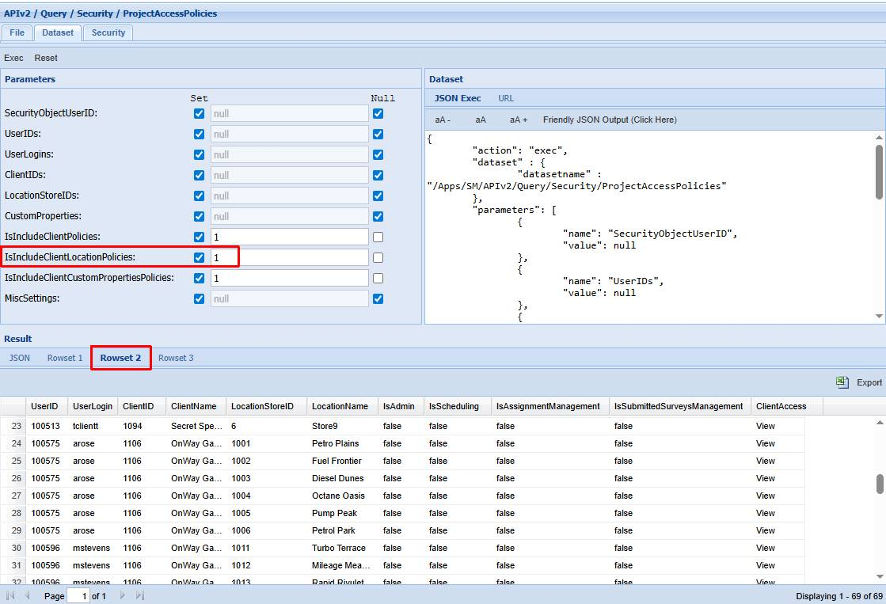

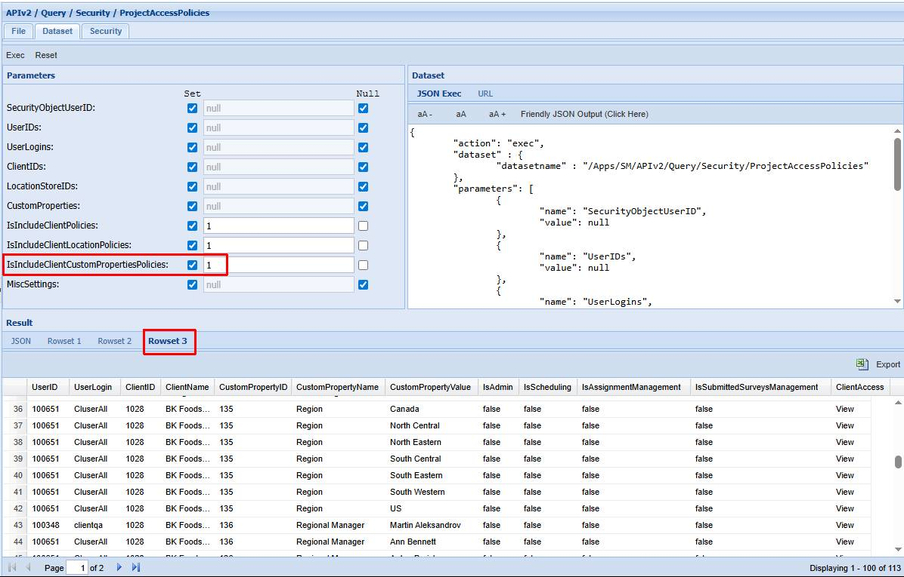

## Postman

**API endpoint**: /api/v2/execute

The content for the “post” parameter in the Body:

{"action":"exec","dataset":{"datasetname":"/Apps/SM/APIv2/Query/Security/ProjectAccessPolicies"},"parameters":[{"name":"SecurityObjectUserID","value":null},{"name":"UserIDs","value":null},{"name":"UserLogins","value":null},{"name":"ClientIDs","value":null},{"name":"LocationStoreIDs","value":null},{"name":"CustomProperties","value":null},{"name":"IsIncludeClientPolicies","value":"1"},{"name":"IsIncludeClientLocationPolicies","value":"1"},{"name":"IsIncludeClientCustomPropertiesPolicies","value":"1"},{"name":"MiscSettings","value":null}]}

**Rowset 1 (Client Access Policies)**

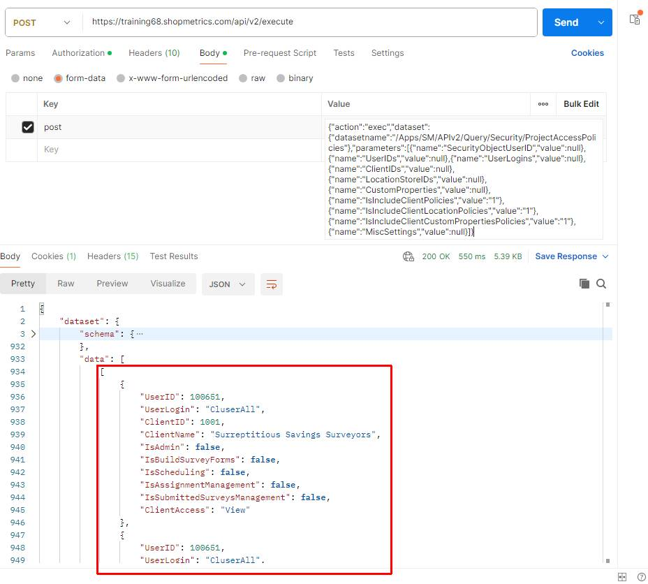

**Rowset 2 (Client Location Access Policies)**

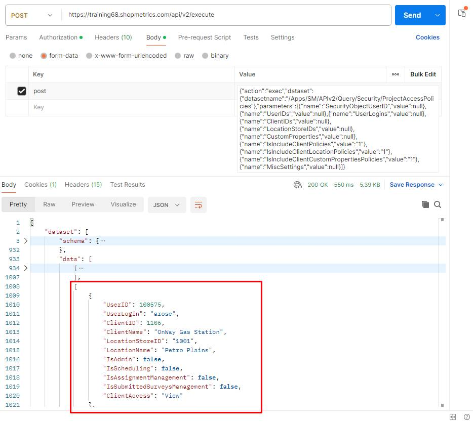

**Rowset 3 (Client Custom Properties Access Policies)**

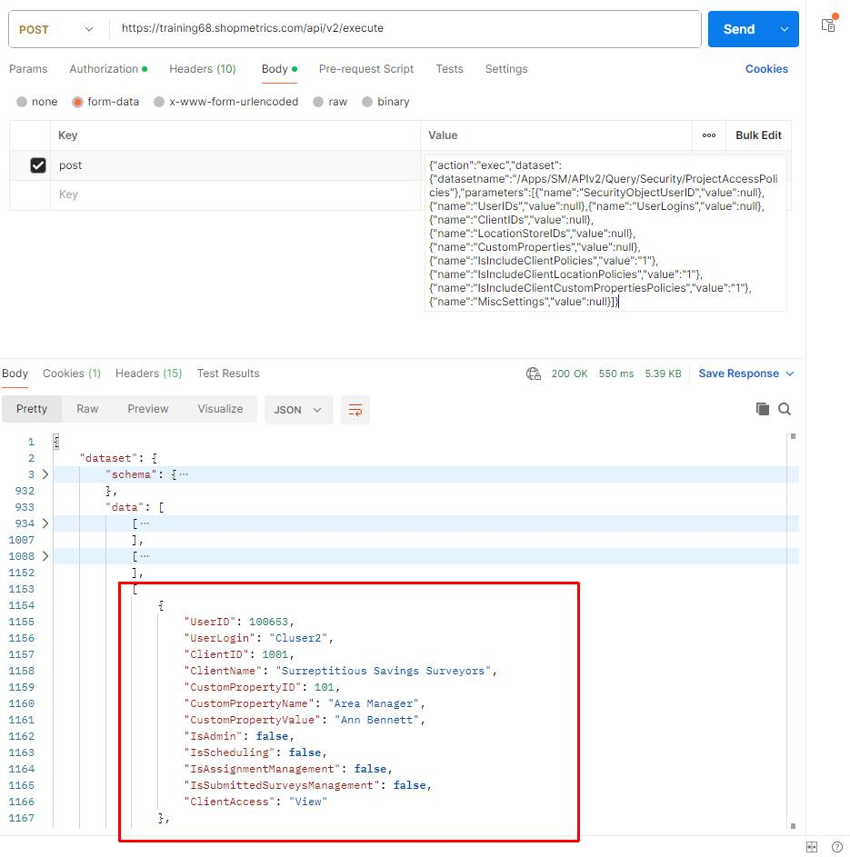

## Examples: Search capabilities

When working with “/Apps/SM/APIv2/Query/Security/ProjectAccessPolicies” you have the ability to filter your results by using the dataset's filtering parameters.

### Example 1

The example below retrieves the project access policies for user with login "client.mz".

The screenshots below show the user access policies set for “client.mz” from the Security interface:

**Client Policies**

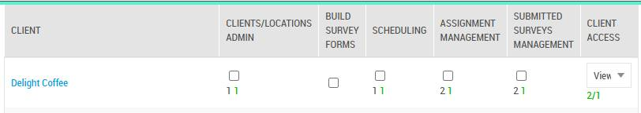

**Client Locations Policies**

**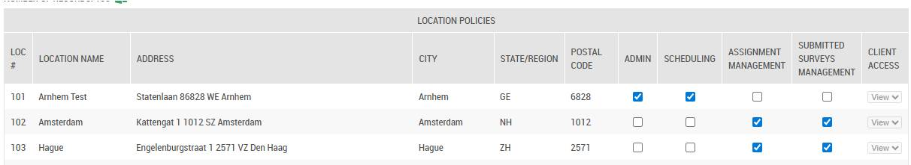**

**Client Custom Properties Policies**

**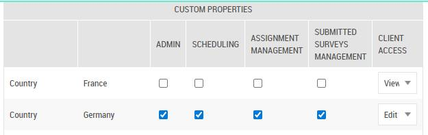**

#### Shopmetrics CMS UI — Dataset Execution

**UserLogins parameter**: client.mz

**IsIncludeClientPolicies parameter**: 1 (default value)

**IsIncludeClientLocationPolicies parameter**: 1 (default value)

**IsIncludeClientCustomPropertiesPolicies parameter**: 1 (default value)

**NOTE: The parameters "UserIDs", "UserLogins", "ClientIDs", "LocationStoreIDs" can accept a comma-separated list of values**.

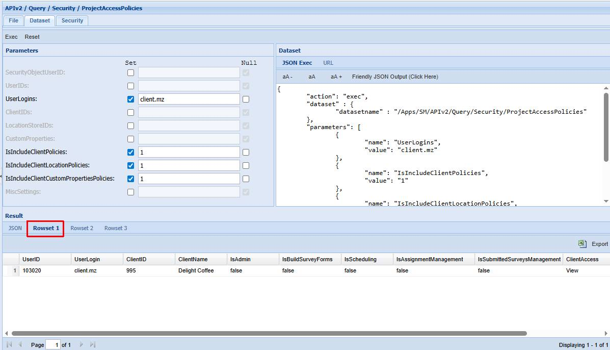

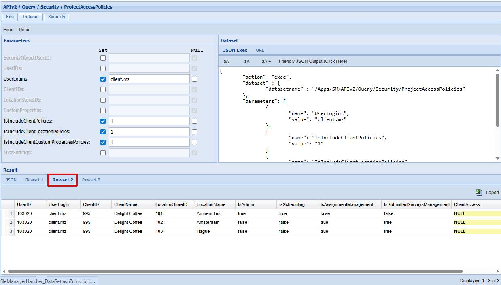

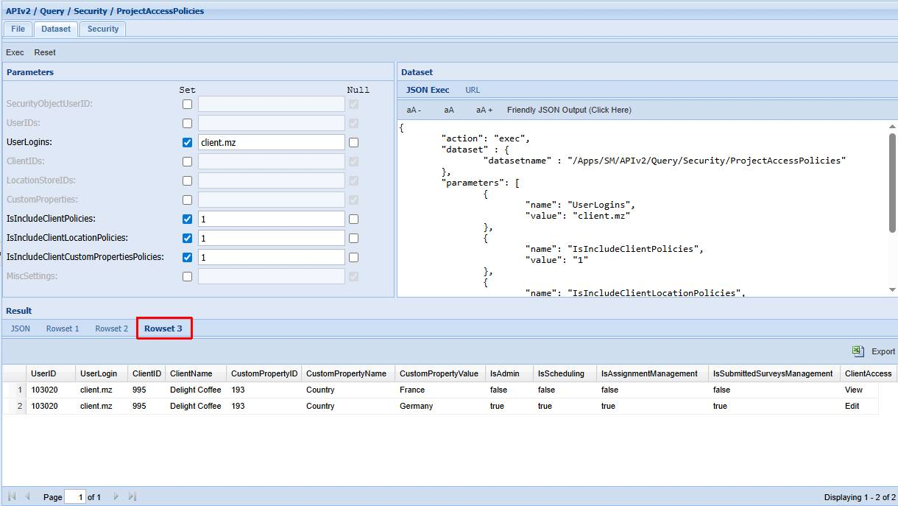

#### Postman

**API endpoint**: /api/v2/execute

The content for the “post” parameter in the Body

{"datasetname":"/Apps/SM/APIv2/Query/Security/ProjectAccessPolicies"},"parameters":[{"name":"UserLogins","value":"client.mz"},{"name":"IsIncludeClientPolicies","value":"1"},{"name":"IsIncludeClientLocationPolicies","value":"1"},{"name":"IsIncludeClientCustomPropertiesPolicies","value":"1"}]}

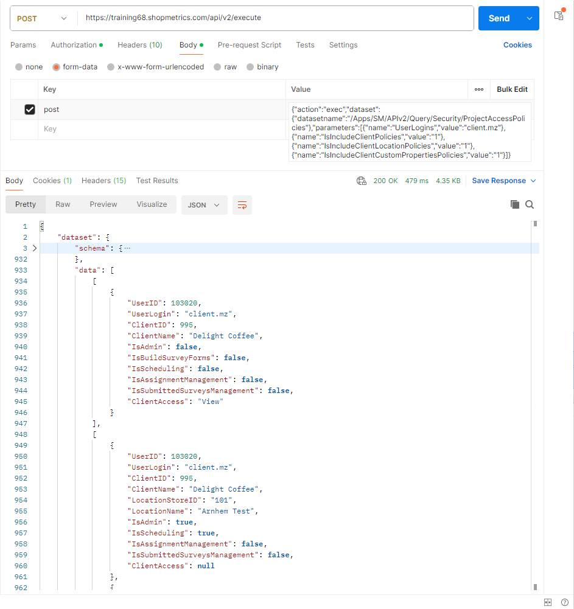

### Example 2

The example below retrieves the user access policies for specific clients.

#### Shopmetrics CMS UI — Dataset Execution

**ClientIDs parameter**: 995, 1001

**IsIncludeClientPolicies parameter**: 1 (default value)

**IsIncludeClientLocationPolicies parameter**: 1 (default value)

**IsIncludeClientCustomPropertiesPolicies parameter**: 1 (default value)

**Rowset 1** returns data for all users that have specific Client Access Policies set for Clients with IDs 995 and 1001:

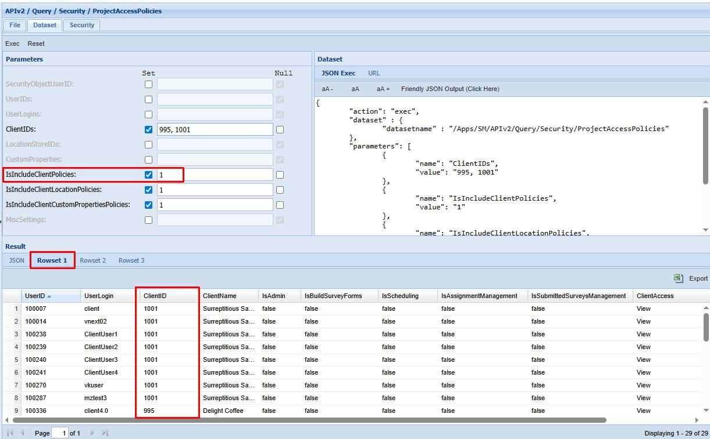

**Rowset 2** returns data for users with explicit Client Location Access Policies for Client IDs 995 and 1001 (in the current example, there are no such policies for Client ID 1001).

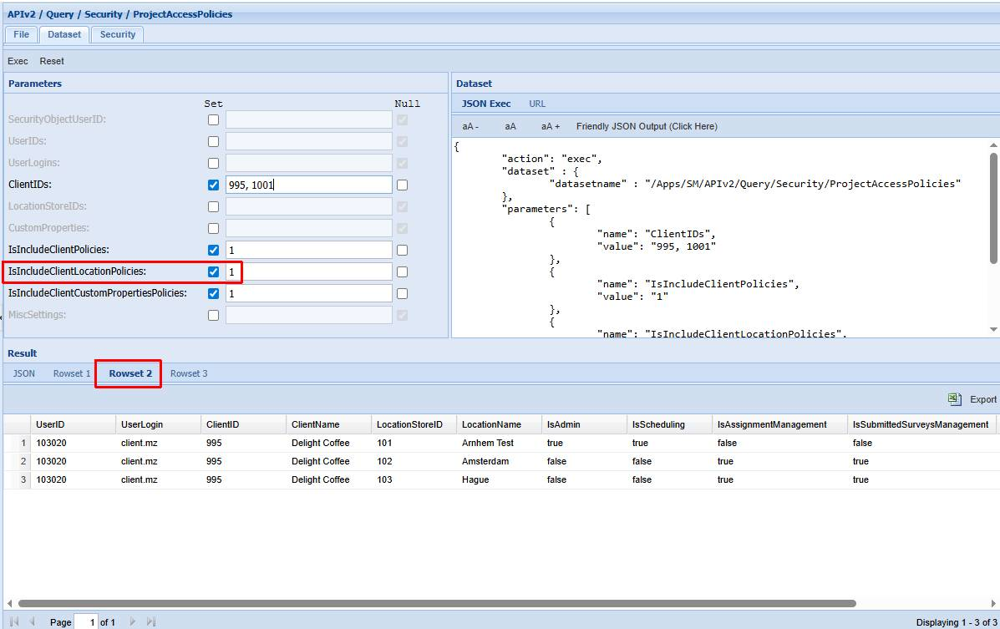

**Rowset 3** returns data for all users that have explicit Client Custom Properties Access Policies set for Clients with IDs 995 and 1001:

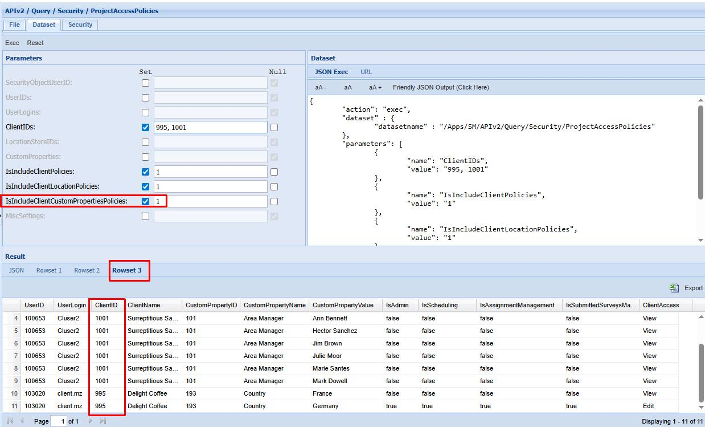

#### Postman

**API endpoint**: /api/v2/execute

The content for the “post” parameter in the Body:

{"action":"exec","dataset":{"datasetname":"/Apps/SM/APIv2/Query/Security/ProjectAccessPolicies"},"parameters":[{"name":"ClientIDs","value":"995, 1001"},{"name":"IsIncludeClientPolicies","value":"1"},{"name":"IsIncludeClientLocationPolicies","value":"1"},{"name":"IsIncludeClientCustomPropertiesPolicies","value":"1"}]}

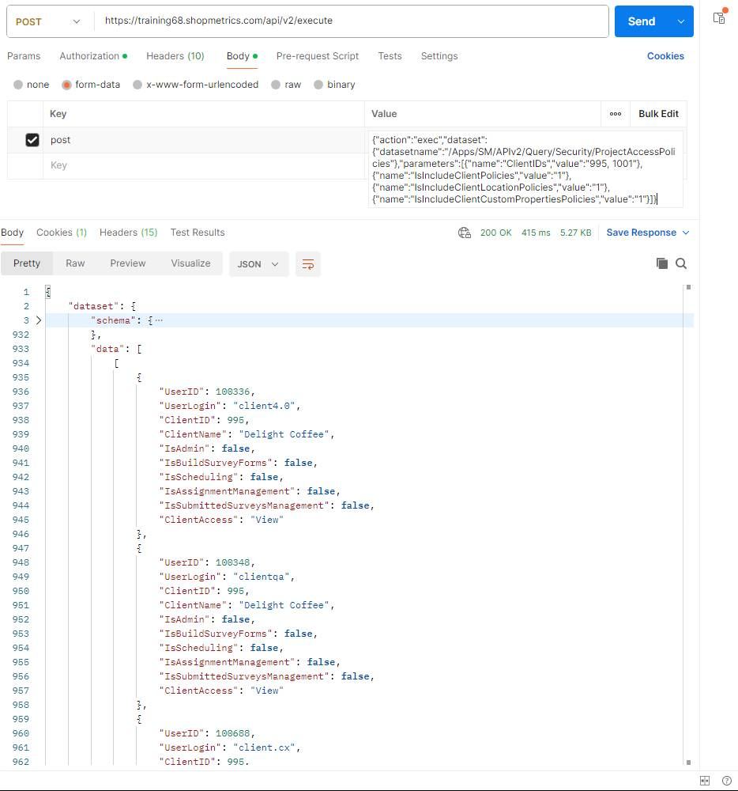
