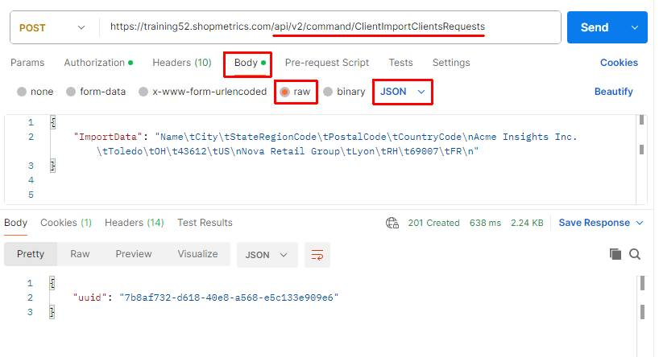
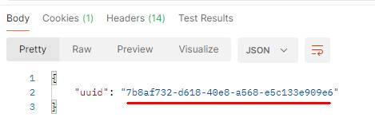
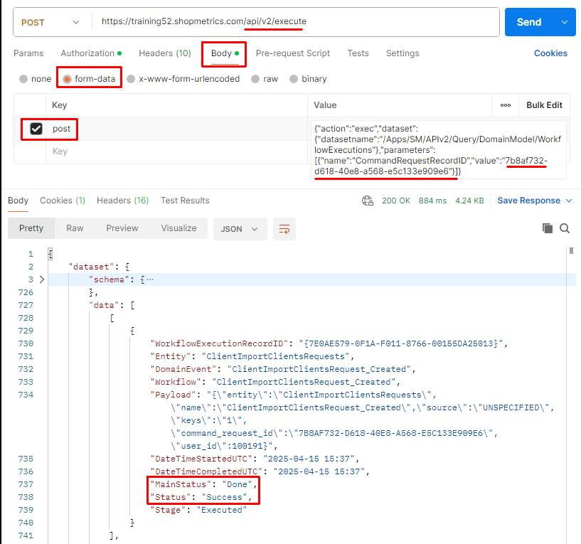
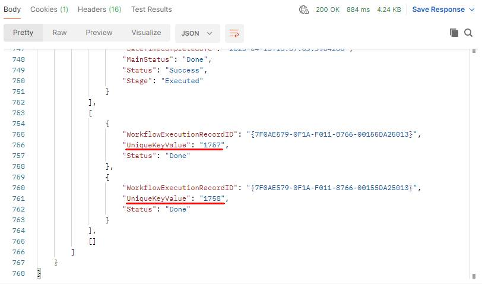
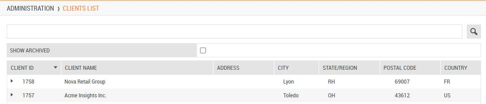
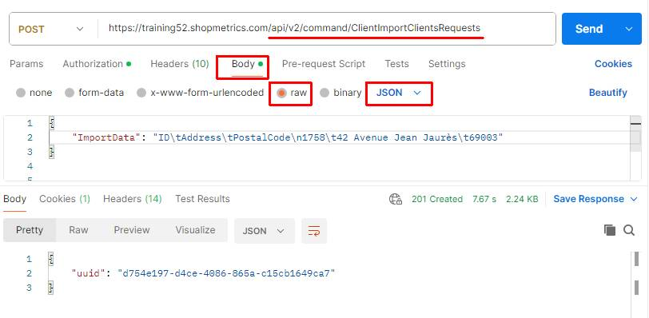
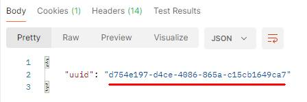
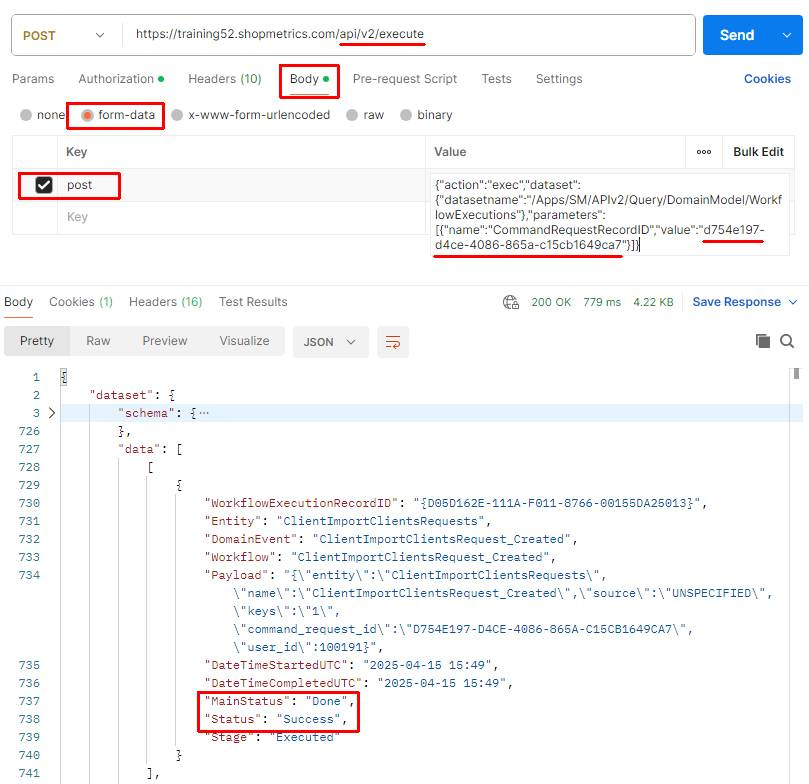
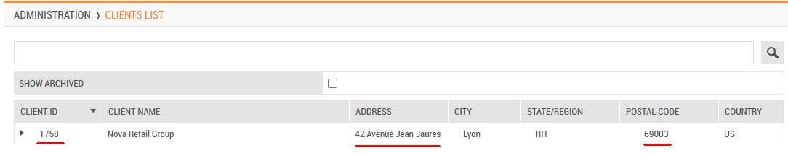

# Use Case: Import Clients via Import Command Request

Last Modified: 2025-05-07 | Code: APIICCR

This document provides an example of how a Shopmetrics Command API is used to perform changes in the Data Model. The changes are made using an asynchronous operation that is started by a Command Request

Command Requests are calls to Command API Resources that return only a Request ID. The Request ID can be passed as a parameter to an API query resource that checks and returns the status of the request.

## User Security

To be able to use the Import Command Request successfully, the user executing the request should have the following security settings in the Shopmetrics system:

1. Membership in the "**Project Manager - Restricted**" security role  
       a. **Note**: The membership of the role can also be inherited
2. Membership in "**Myst.Clients.CreateNewClient.Allow**" security group
3. Valid **Client Credentials** for API authorization

For more information about granting restricted access to the system refer to the article "Grant Restricted Access to the System" (short code: **GRAS**).

For more information about the Client Credentials and API Authorization you can refer to the article “API Authorization” (short code: **APIAUT**).

## Command Request Format

You can import clients by executing a command request to the following API endpoint:

**/api/v2/command/ClientImportClientsRequests**

The request should be written in the following JSON format:

{  
    "ImportData": "*The client data you want to import. The data should be formatted in a tab-separated format (for more information see the section “Import Data Format”*)"  
}

## Import Data Format

The client data for import should be formatted in a tab-separated format. The following separators should be used accordingly:

- A **new line** should be represented with **\n**
- A **tab**should be represented with **\t**

## Clients Import Data Fields

In the table below you can find the object names and short descriptions of all Client Import Data Fields that can be used when importing client data:

| Field Object Name | Description | Is Required |
| --- | --- | --- |
| ID | Unique identifier for the client.  **NOTE: The value for this field is automatically generated during client creation.** | Required **only for Update requests** |
| Name | Client name. This field is always **required**. | **Yes** |
| Address | Client main address. | No |
| City | City where the client is located. | No |
| StateRegionCode | State or the region where the client is located.  **NOTE: The value of this field should be a two-letter State/Region code according to the International Organization for Standardization (ISO) standard.** | No |
| PostalCode | Postal code for the client. Be sure postal codes are entered in the appropriate ISO format for the client country/region. | No |
| CountryCode | Country where the client is located.  **NOTE: The value of this field should be the Alpha-2 code of the Country, according to the ISO-3166 standard.** | No |
| LogoURL | URL pointing to a client logo image. | No |
| Status | Client status. The possible values for this field are:   - **A** - Active - **R** - Archived | No |
| OnlineReviewsAndRatingsPlan | Client online reviews and ratings configuration. Accepted values are:   - **Express** – Enables the Express Reviews and Ratings plan for the client. - **Disabled** – Disables the reviews and ratings functionality. | No |
| IsAutomatedGeocodingEnabled | Client automated geocoding configuration. Accepted values are:   - **Enabled** - **Disabled** | No |
| ContactFirstName | First name of the primary client contact. | No |
| ContactLastName | Last name of the primary client contact. | No |
| ContactPhone | Primary contact phone number. | No |
| ContactEmail | Primary contact email address. | No |
| Comment | Additional information regarding the client. | No |

## Import Clients

The process of importing clients includes the following steps:

1. Executing the Import Command Request which generates a Request ID
2. Using the generated Request ID to check the status of the request. This is done via the /Apps/SM/APIv2/Query/DomainModel/WorkflowExecutions query API resource

### Postman example

The content of the JSON formatted request:

{  
   "ImportData": "Name\tCity\tStateRegionCode\tPostalCode\tCountryCode\nAcme Insights Inc.\tToledo\tOH\t43612\tUS\nNova Retail Group\tLyon\tARA\t69007\tFR\n"  
}

**Step 1** – execute the Import Command Request. The request should be sent to the **following API endpoint**: **/api/v2/command/ClientImportClientsRequests**

****

The Import Command Request generates a unique Request ID which will be used in Step 2:

**Step 2** – copy the generated Request ID and use the **/Apps/SM/APIv2/Query/DomainModel/WorkflowExecutions** API query resource to check the status of the request.

The content for the “post” parameter in Body:

{"action":"exec","dataset":{"datasetname":"/Apps/SM/APIv2/Query/DomainModel/WorkflowExecutions"},"parameters":[{"name":"CommandRequestRecordID","value":"**7b8af732-d618-40e8-a568-e5c133e909e6**"}]}

In addition to providing the command request status, the "/Apps/SM/APIv2/Query/DomainModel/WorkflowExecutions" API query resource also returns the Client IDs for all clients created by the command request:

The newly imported clients in the Administration -> Clients List interface:

## Update Clients

You can update existing Clients providing the following Clients Import Data Fields:

- **Existing** Client ID - **required field**
- The Clients Import Data Fields you want to update

The process of updating clients includes the following steps:

1. Executing the Import Command Request which generates a Request ID
2. Using the generated Request ID to check the status of the request. This is done via the /Apps/SM/APIv2/Query/DomainModel/WorkflowExecutions query API resource.

### Postman Example

The following example demonstrates an update to **existing** Client.

The content of the JSON formatted request:

{  
   "ImportData": "ID\tAddress\tPostalCode\n1758\t42 Avenue Jean Jaurès\t69003"  
}

After executing the above request for the **existing client** with **ID 1758**:

- The field **Address** will have a value of **42 Avenue Jean Jaurès**
- The field **Postal Code** will have a value of **69003**

**Step 1** – execute the Import Command Request. The request should be sent to the following API endpoint: **/api/v2/command/ClientImportClientsRequests**

****

The Import Command Request generates a unique Request ID which will be used in Step 2:

**Step 2** – copy the generated Request ID and use the **/Apps/SM/APIv2/Query/DomainModel/WorkflowExecutions** API query resource to check the status of the request.

The content for the “post” parameter in Body:

{"action":"exec","dataset":{"datasetname":"/Apps/SM/APIv2/Query/DomainModel/WorkflowExecutions"},"parameters":[{"name":"CommandRequestRecordID","value":"**d754e197-d4ce-4086-865a-c15cb1649ca7**"}]}

The updated client data in the Administration -> Clients List interface:

