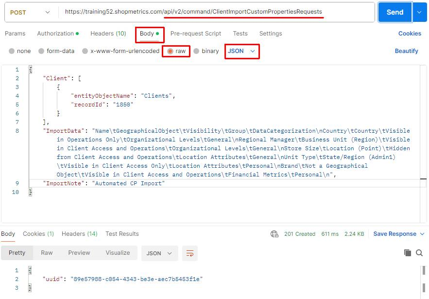
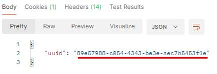
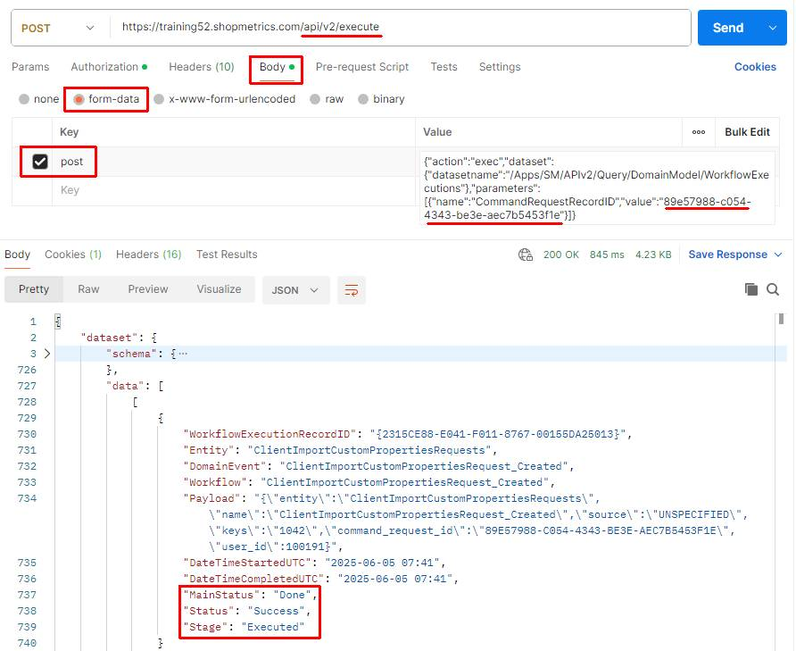
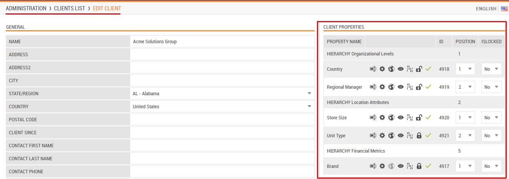

# Use Case: Import Client Custom Properties via Import Command Request

Last Modified: 2025-07-05 | Code: APICPCR

This document provides an example of how a Shopmetrics Command API is used to perform changes in the Data Model. The changes are made using an asynchronous operation that is started by a Command Request.

Command Requests are calls to Command API Resources that return only a Request ID. The Request ID can be passed as a parameter to an API query resource that checks and returns the status of the request.

## User Security

To be able to use the Import Command Request successfully, the user executing the request should have the following security settings in the Shopmetrics system:

1. Membership in the "**Clients - Restricted**" security role  
        **Note:** The membership of the role can also be inherited
2. Permission to be “**Clients/Locations Admin**” for the clients whose custom properties will be imported.
3. Valid **Client Credentials** for API authorization

For more information about granting restricted access to the system refer to the article "Grant Restricted Access to the System" (short code: **GRAS**).

For more information about the Client Credentials and API Authorization you can refer to the article “API Authorization” (short code: **APIAUT**)

## Command Request Format

You can import clients by executing a command request to the following API endpoint: **/api/v2/command/ClientImportCustomPropertiesRequests**

The request should be written in the following JSON format:

{  
   "Client": [  
      {  
            "entityObjectName": "Clients",  
            "recordId": "*The ID of the Client you want to import custom properties data for.*"  
        }  
    ],  
    "ImportData": "*The custom properties data that you want to import. The data should be formatted in a tab-separated format (for more information see the section “Import Data Format”*)",  
    "ImportNote": "*A text, containing information for troubleshooting, tracing, or any additional details related to the import request.*"  
}

## Import Data Format

The client custom properties data for import should be formatted in a tab-separated format. The following separators should be used accordingly:

- A **new line** should be represented with **\n**
- A **tab** should be represented with **\t**

## Client Custom Properties Import Data Fields

In the table below you can find the object names and a short description of all Client Custom Properties Import Data Fields that can be used when importing client properties data:

| Field Object Name | Description | Is Required |
| --- | --- | --- |
| Name | Custom property name. This is a **required field**. | **Yes** |
| GeographicalObject | Specifies if the custom property should be treated as a geography object. This is a **required field**.  Accepted values for this field are:   - Not a Geographical Object - Business Unit (Region) - Country - Location (Point) - State/Region (Admin1)   For more information about the client custom properties as geography objects refer to the article "Client Custom Properties As Geography Objects" (short code: **CPGO**). | **Yes** |
| Visibility | Controls the visualization of the custom property. This is a **required field**.  Accepted values for this field are:   - Visible in Operations Only - Visible in Client Access and Operations - Hidden from Client Access and Operations - Visible in Client Access Only | **Yes** |
| Group | Hierarchy group for the custom property. This is a **required field**.  Accepted values for this field are:   - Organizational Levels - Location Attributes - Financial Metrics - Competitive Intelligence | **Yes** |
| DataCategorization | Sensitivity categorization of data collected/stored in the custom property. This is a **required field**.  Accepted values for this field are:   - General - Personal | **Yes** |
| OrderIndexInGroup | Custom property position in the relevant hierarchy group.  Note that if you decide to use this field make sure that you provide order indexes for all custom properties in the "ImportData"; failing to do so will result in an error.  If you do not provide this field each property will be positioned at the end of its respective hierarchy group following the order they appear in the "ImportData". | No |

## Import Client Custom Properties

The process of importing custom properties includes the following steps:

1. Executing the Import Command Request which generates a Request ID
2. Using the generated Request ID to check the status of the request. This is done via the /Apps/SM/APIv2/Query/DomainModel/WorkflowExecutions query API resource

### Postman example

The content of the JSON formatted request:

```
{
    "Client": [
        {
            "entityObjectName": "Clients",
            "recordId": "1850"
        }
    ],
    "ImportData": "Name\tGeographicalObject\tVisibility\tGroup\tDataCategorization\nCountry\tCountry\tVisible in Operations Only\tOrganizational Levels\tGeneral\nRegional Manager\tBusiness Unit (Region)\tVisible in Client Access and Operations\tOrganizational Levels\tGeneral\nStore Size\tLocation (Point)\tHidden from Client Access and Operations\tLocation Attributes\tGeneral\nUnit Type\tState/Region (Admin1)\tVisible in Client Access Only\tLocation Attributes\tPersonal\nBrand\tNot a Geographical Object\tVisible in Client Access and Operations\tFinancial Metrics\tPersonal\n",
    "ImportNote": "Automated CP Import"
}
```

**Step 1** – execute the Import Command Request. The request should be sent to the following API endpoint: **/api/v2/command/ClientImportCustomPropertiesRequests**  
 ****

The Import Command Request generates a unique Request ID which will be used in Step 2:



**Step 2** – copy the generated Request ID and use the **/Apps/SM/APIv2/Query/DomainModel/WorkflowExecutions** API query resource to check the status of the request.

The content for the “post” parameter in Body:

{"action":"exec","dataset":{"datasetname":"/Apps/SM/APIv2/Query/DomainModel/WorkflowExecutions"},"parameters":[{"name":"CommandRequestRecordID","value":"**89e57988-c054-4343-be3e-aec7b5453f1e**"}]}



The newly imported client custom properties in the Administration -> Clients List -> Edit Client interface:


