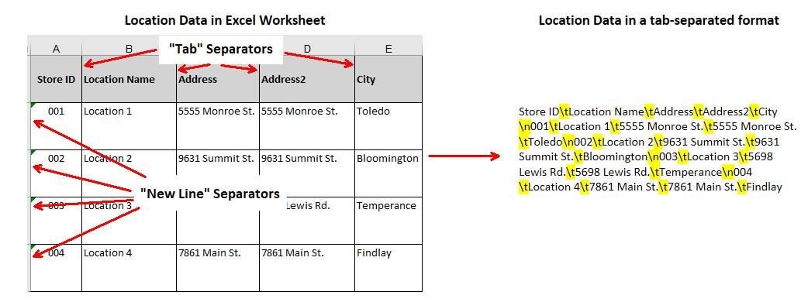
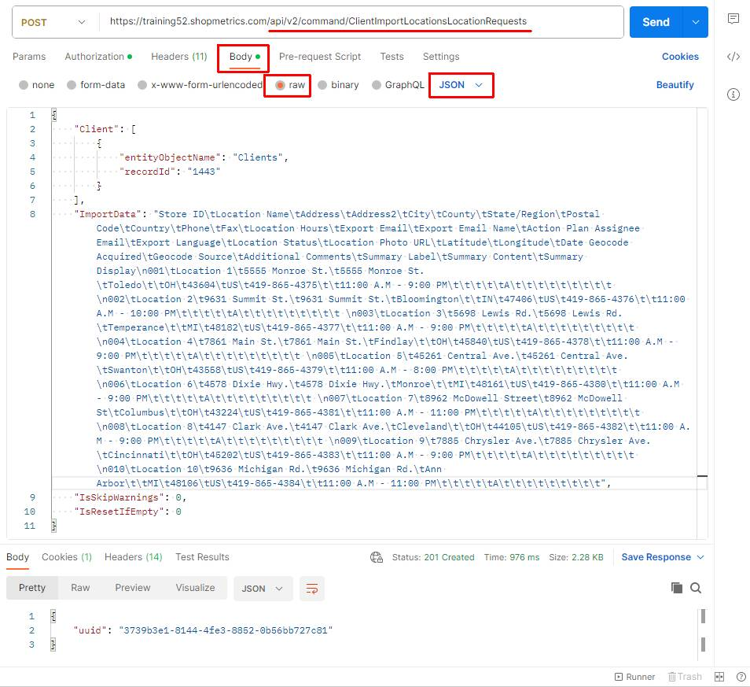
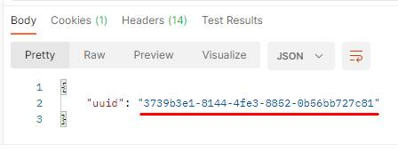
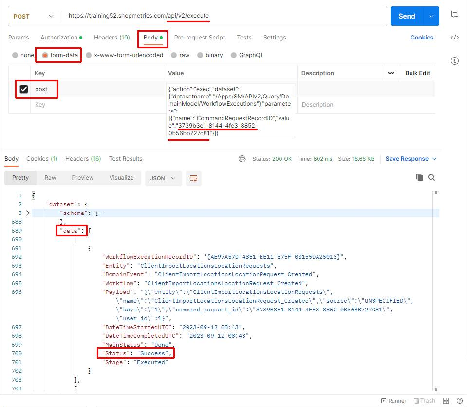

# Use Case: Import Locations via Import Command Request

Last Modified: 2024-11-14 | Code: APIILCR

This document provides an example of how a Shopmetrics Command API is used to perform changes in the Data Model. The changes are made using an asynchronous operation that is started by a Command Request.

Command Requests are calls to Command API Resources that return only a Request ID. The Request ID can be passed as a parameter to an API query resource that checks and returns the status of the request.

## User Access Setup

To be able to use the Import Command Request successfully, the user executing the request should have the following security settings in the Shopmetrics system:

1. Membership in the "**Locations - Restricted**" security role
   1. **Note:** The membership of the role can also be inherited
2. Permission to be “**Clients/Locations Admin**” for the clients whose locations will be imported.
   1. **Note:** The user also needs permission to “View” the client.
3. Valid Client Credentials for API authorization.

For more information about granting restricted access to the system refer to the article "**Grant Restricted Access to the System**" (short code: **GRAS**).

For more information about the Client Credentials and API Authorization you can refer to the article “**API Authorization**” (short code: **APIAUT**)

## Command Request Format

You can import locations by executing a command request to the **following API endpoint: /api/v2/command/ClientImportLocationsLocationRequests**.

The request should be written in the following JSON format:

{

    "Client": [

        {

            "entityObjectName": "Clients",

            "recordId": "*The ID of the Client you want to import location data for.*"

        }

    ],

    "ImportData": "*The data for the locations you want to import. The data should be formatted in a tab-separated format (for more information see the section “Import Data Format*”)",

    "IsSkipWarnings": 0,

    "IsResetIfEmpty": 0

}

## Import Data Format

The location data for import should be formatted in a tab-separated format. The following separators should be used accordingly:

- A “new line” should be represented with **\n**
- A “tab” should be represented with **\t**

On the screenshot below you can see an example of Excel worksheet, containing location data for import and how the same data is presented in a tab-separated format:



## Import Data Fields

### Location Import Data Fields

In the table below you can find the object names and short descriptions of all Location Import Data Fields that can be used when importing locations data:

| Field Object Name | Description | Is Required |
| --- | --- | --- |
| Store ID | This field is **always required**. Each of the client's locations must have a unique Store ID. However, the same Store ID can be used again as long as the location belongs to another client. | Yes |
| Location Name | This is generally the familiar or friendly name that a client uses to refer to this specific location. While each location normally has a specific street address or location ID, the location name may reference the part of town or a specific development/complex that the location is. | No |
| Address | The physical address of the store/facility | No |
| Address2 | The second line of the address (if needed), i.e., Suite 107 | No |
| City | The proper city where the location is situated. | No |
| County | The County or the Local Territory where the location is situated. | No |
| State/Region | The State or the Region where the location is situated.  **NOTE: The value of this field should be a two-letter State/Region code according to the International Organization for Standardization (ISO) standard.** | No |
| Postal Code | The postal code for the location. Be sure postal codes are entered in the appropriate ISO format for your country/region. | No |
| Country | The country where the location is situated.  **NOTE: The value of this field should be the Alpha-2 code of the Country, according to the ISO-3166 standard.** | No |
| Phone | The location's phone number. | No |
| Fax | The location's fax number. | No |
| Location Hours | The location's hours of operation. | No |
| Export Email | For this field you can set the email addresses of those who should receive emails containing completed audits/mystery shops for this location. Multiple recipients can be entered, separated by semi-colons (;).  **NOTE: Setting email addresses for this field does not enable email delivery of completed surveys. An Export Definition must be created and configured in the main client properties in order for emails to be sent to these recipients.** | No |
| Export Email Name | Even if you set email recipients for the Export Email field, you can specify a recipient name to be displayed in the "To:" field of export emails generated for this location. | No |
| Action Plan Assignee Email | For this field you have the ability to specify emails for Action Plan Assignees on a location level. | No |
| Export Language | The value for this field dictates the default language on a location level for reports, exported via Automated Export service.  **NOTE: The value for this field should be a two-letter language code according to the ISO standard.** | No |
| Location Status | When you add a new location, it is marked as ACTIVE by default. However, you can choose alternate statuses if necessary.  You can use one of the following values for this field: **A**, **T**or **X**.  Here is a short description of the values:  **A → Active**: This location is open for business and is available for assigning jobs to it.  **T → Temporarily Deactivated**: This status simply flags locations for which mystery shopping services have been temporarily suspended, perhaps due to renovations or the like. As a safeguard, no new surveys will be distributed for locations marked as Temporarily Deactivated, even if executing a route manually.  **X → Permanently Deactivated**: This status flags locations for which mystery shopping services have been suspended permanently. | No |
| Location Photo URL | An URL address pointing to a location image. For more information about the location image URLs refer to the article "Advanced Location Properties" (*short code: ADLP*). | No |
| Latitude | The Location Latitude. | No |
| Longitude | The Location Longitude. | No |
| Date Geocode Acquired | The date that Latitude/Longitude information was updated for this location. | No |
| Geocode Source | The source of Latitude/Longitude data for the location, i.e. a specific shopper who provided the information, a website, or the client. | No |
| Additional Comments | You can set your own comments about the location. This might be information that schedulers may find useful or the like. Currently, this is an internal field only and is not visible to shoppers or client users. | No |
| Summary Label | If needed, you can enter instructions/summary information that is specific to this location. For this field you can specify the Label for this information. | No |
| Summary Content | The Summary Content for the location.  Note that this summary information will be displayed on ALL surveys that are distributed for this location. | No |
| Summary Display | Here you can specify the visibility of the Summary Information.  You can set one of the following values: **A**or **H**.  Here is a short description of these values:  **A → Always**: The Summary Label and the Summary Content for the location will always be visible for the shoppers.  **H → Hide for Applications**: The Summary Label and the Summary Content for the location will be hidden from shoppers on the Job Board. | No |

**NOTE: The field object names in the table above can be specified with either spaced or unspaced conventions. For instance, "Location Name" and "LocationName" are both valid formats.**

### Custom Property Import Data Fields

You can use the Import Command Request to import location level values for any defined Client Custom Properties. To do so just:

- Add all Custom Property Import Data Fields after the location import data fields.
- For Custom Property Import Data Fields object names use the property names defined in the Client properties.

**NOTE: The Custom Property Fields should have different object names than the Location Import Data Fields. Otherwise the Custom Property data will not be imported.**

## Import Locations

The process of importing locations includes the following steps:

1. Executing the Import Command Request which generates a Request ID
2. Using the generated Request ID to check the status of the request. This is done via the /Apps/SM/APIv2/Query/DomainModel/WorkflowExecutions query API resource

### Postman example

The content of the JSON formatted request:

{

    "Client": [

        {

            "entityObjectName": "Clients",

            "recordId": "1443"

        }

    ],

    "ImportData": "Store ID\tLocation Name\tAddress\tAddress2\tCity\tCounty\tState/Region\tPostal Code\tCountry\tPhone\tFax\tLocation Hours\tExport Email\tExport Email Name\tAction Plan Assignee Email\tExport Language\tLocation Status\tLocation Photo URL\tLatitude\tLongitude\tDate Geocode Acquired\tGeocode Source\tAdditional Comments\tSummary Label\tSummary Content\tSummary Display\n001\tLocation 1\t5555 Monroe St.\t5555 Monroe St.\tToledo\t\tOH\t43604\tUS\t419-865-4375\t\t11:00 A.M - 9:00 PM\t\t\t\t\tA\t\t\t\t\t\t\t\t\t \n002\tLocation 2\t9631 Summit St.\t9631 Summit St.\tBloomington\t\tIN\t47406\tUS\t419-865-4376\t\t11:00 A.M - 10:00 PM\t\t\t\t\tA\t\t\t\t\t\t\t\t\t \n003\tLocation 3\t5698 Lewis Rd.\t5698 Lewis Rd.\tTemperance\t\tMI\t48182\tUS\t419-865-4377\t\t11:00 A.M - 9:00 PM\t\t\t\t\tA\t\t\t\t\t\t\t\t\t \n004\tLocation 4\t7861 Main St.\t7861 Main St.\tFindlay\t\tOH\t45840\tUS\t419-865-4378\t\t11:00 A.M - 9:00 PM\t\t\t\t\tA\t\t\t\t\t\t\t\t\t \n005\tLocation 5\t45261 Central Ave.\t45261 Central Ave.\tSwanton\t\tOH\t43558\tUS\t419-865-4379\t\t11:00 A.M - 8:00 PM\t\t\t\t\tA\t\t\t\t\t\t\t\t\t \n006\tLocation 6\t4578 Dixie Hwy.\t4578 Dixie Hwy.\tMonroe\t\tMI\t48161\tUS\t419-865-4380\t\t11:00 A.M - 9:00 PM\t\t\t\t\tA\t\t\t\t\t\t\t\t\t \n007\tLocation 7\t8962 McDowell Street\t8962 McDowell St\tColumbus\t\tOH\t43224\tUS\t419-865-4381\t\t11:00 A.M - 11:00 PM\t\t\t\t\tA\t\t\t\t\t\t\t\t\t \n008\tLocation 8\t4147 Clark Ave.\t4147 Clark Ave.\tCleveland\t\tOH\t44105\tUS\t419-865-4382\t\t11:00 A.M - 9:00 PM\t\t\t\t\tA\t\t\t\t\t\t\t\t\t \n009\tLocation 9\t7885 Chrysler Ave.\t7885 Chrysler Ave.\tCincinnati\t\tOH\t45202\tUS\t419-865-4383\t\t11:00 A.M - 9:00 PM\t\t\t\t\tA\t\t\t\t\t\t\t\t\t \n010\tLocation 10\t9636 Michigan Rd.\t9636 Michigan Rd.\tAnn Arbor\t\tMI\t48106\tUS\t419-865-4384\t\t11:00 A.M - 11:00 PM\t\t\t\t\tA\t\t\t\t\t\t\t\t\t",

    "IsSkipWarnings": 0,

    "IsResetIfEmpty": 0

}

**Step 1** – execute the Import Command Request. The request should be sent to the **following API endpoint: /api/v2/command/ClientImportLocationsLocationRequests**.



The Import Command Request generates a unique Request ID which will be used in Step 2:



**Step 2** – copy the generated Request ID and use the **/Apps/SM/APIv2/Query/DomainModel/WorkflowExecutions** API query resource to check the status of the request.

The content for the “post” parameter in Body:

{"action":"exec","dataset":{"datasetname":"/Apps/SM/APIv2/Query/DomainModel/WorkflowExecutions"},"parameters":[{"name":"CommandRequestRecordID","value":"**3739b3e1-8144-4fe3-8852-0b56bb727c81**"}]}



### PowerShell Code

```
Clear-Host;
Write-Host "Script Started";
Write-Host;

#Url to the Shopmetrics Platform:
$SMPlatformURL = "(Your Shopmetrics Platform Web URL)";
#Endpoint to get the authentication token (Access Token):
$GetTokenEndpoint = "$($SMPlatformURL)/oauth/connect/token";

#Object with credentials to be used as a payload for getting the Access Token:
$GetTokenRequestPayload = @{client_id="(Shopmetrics API Credentials - client_id)"; client_secret="(Shopmetrics API Credentials - client_secret)"; grant_type="client_credentials"};

#Request Object to be used by the REST Request for getting the Access Token:
$GetTokenRequestObject = @{
    Uri         = $GetTokenEndpoint;
    Method      = "POST";
    Body        = $GetTokenRequestPayload;
};

#REST Request to get the Access Token and assign it to a variable:
$GetTokenResponse= Invoke-RestMethod @GetTokenRequestObject;
$AccessToken = $GetTokenResponse."access_token";
#Print Access Token to check if it is successfully retrieved:

#URL to the Shopmetrics apiv2 service for retrieving data:
$DatasetsExecuteCommandEndpoint = "$($SMPlatformURL)/api/v2/command/ClientImportLocationsLocationRequests";
$DatasetsExecuteEndpoint = "$($SMPlatformURL)/api/v2/execute";
#A variable with a Client ID that can be used as a parameter value in the JSON String:
$ClientIDsParameter = "1443";

#A variable with the Location Data for import – the rows are separated by new lines and the cells/columns are separated by tabs:
$ImportData = "Store ID Location Name   Address Address2    City    County  State/Region    Postal Code Country Phone   Fax Location Hours  Export Email    Export Email Name   Action Plan Assignee Email  Export Language Location Status Location Photo URL  Latitude    Longitude   Date Geocode Acquired   Geocode Source  Additional Comments Summary Label   Summary Content Summary Display
001 Location 1  5555 Monroe St. 5555 Monroe St. Toledo      OH  43604   US  419-865-4375        11:00 A.M - 9:00 PM                 A                                    
002 Location 2  9631 Summit St. 9631 Summit St. Bloomington     IN  47406   US  419-865-4376        11:00 A.M - 10:00 PM                    A                                    
003 Location 3  5698 Lewis Rd.  5698 Lewis Rd.  Temperance      MI  48182   US  419-865-4377        11:00 A.M - 9:00 PM                 A                                    
004 Location 4  7861 Main St.   7861 Main St.   Findlay     OH  45840   US  419-865-4378        11:00 A.M - 9:00 PM                 A                                    
005 Location 5  45261 Central Ave.  45261 Central Ave.  Swanton     OH  43558   US  419-865-4379        11:00 A.M - 8:00 PM                 A                                    
006 Location 6  4578 Dixie Hwy. 4578 Dixie Hwy. Monroe      MI  48161   US  419-865-4380        11:00 A.M - 9:00 PM                 A                                    
007 Location 7  8962 McDowell Street    8962 McDowell St    Columbus        OH  43224   US  419-865-4381        11:00 A.M - 11:00 PM                    A                                    
008 Location 8  4147 Clark Ave. 4147 Clark Ave. Cleveland       OH  44105   US  419-865-4382        11:00 A.M - 9:00 PM                 A                                    
009 Location 9  7885 Chrysler Ave.  7885 Chrysler Ave.  Cincinnati      OH  45202   US  419-865-4383        11:00 A.M - 9:00 PM                 A                                    
010 Location 10 9636 Michigan Rd.   9636 Michigan Rd.   Ann Arbor       MI  48106   US  419-865-4384        11:00 A.M - 11:00 PM                    A                                    
";

# JSON String with input Parameters: Client: a single Client ID or a variable with a Client ID (It must be passed to the "recordId" JSON node);ImportData: a variable with the Location Data for import 

$DatasetExecutePostParam = @{
    Client = @(
        @{
            entityObjectName= "Clients"
            recordId = $ClientIDsParameter
        }
    )
    ImportData = $ImportData
    IsSkipWarnings = 0
    IsResetIfEmpty = 0
} | ConvertTo-Json -Depth 2

#The Body of the Request Object to be used by the Execute Dataset request.
$DatasetExecuteRequestPayload = $DatasetExecutePostParam;

#Request Object to be used by the Execute Dataset request:
$DatasetExecuteRequestObject = @{
    Uri         = $DatasetsExecuteCommandEndpoint
    Headers     = @{"Authorization" = "Bearer $AccessToken"}
    Method      = "POST"
    Body        = $DatasetExecuteRequestPayload
    ContentType = "application/json; charset=utf-8"
};

#REST Request to get the output data and assign it to a variable:
Try {
    $DatasetExecuteResponse = Invoke-RestMethod @DatasetExecuteRequestObject;
    $DatasetExecuteRequestStatus = 200;
}
Catch {
    
    #If there is an error while executing the request, we check the status:
    Write-Host "StatusCode:" $_.Exception.Response.StatusCode.value__;
    Write-Host "StatusDescription:" $_.Exception.Response.StatusDescription;
    $DatasetExecuteRequestStatus = $_.Exception.Response.StatusCode.value__;
};

#If it is not 200 (OK), this means something is wrong (most likely with the parameters) and we suspend the rest of the script

If ($DatasetExecuteRequestStatus -ne 200) {
    Write-Host "Error with executing the request. Script terminated.";
    Exit;
};

#Get the Command Request UUID and set it to a local variable:
$CommandRequestUUID = $DatasetExecuteResponse.uuid;
Write-Host "Command RequestUUID: $CommandRequestUUID";
Write-Host "";

#We do a second request to check the status of the Command Request. We pass the Command Request UUID:
$DatasetExecutePostParam = '{"action":"exec","dataset":{"datasetname":"/Apps/SM/APIv2/Query/DomainModel/WorkflowExecutions"},"parameters":[{"name":"SecurityObjectUserID","value":null},{"name":"CommandRequestRecordID","value":"' + $CommandRequestUUID + '"},{"name":"Workflow","value":null},{"name":"MainStatuses","value":null},{"name":"Statuses","value":null},{"name":"MiscSettings","value":null}]}';

#The Body of the Request Object to be used by the Execute Dataset request. It has only 1 parameter: "post" and its "value" is the "JSON string" with the input parameters:
$DatasetExecuteRequestPayload = @{post="$DatasetExecutePostParam"};

#Request Object to be used by the Execute Dataset request:
$DatasetExecuteRequestObject = @{
    Uri        = $DatasetsExecuteEndpoint;
    Headers    = @{"Authorization" = "Bearer $AccessToken"};
    Method     = "POST";
    Body       = $DatasetExecuteRequestPayload;
};

#REST Request to get the output data and assign it to a variable:
#$DatasetExecuteResponse = Invoke-RestMethod @DatasetExecuteRequestObject;
#Write-Host "Main Status: $($DatasetExecuteResponse.dataset.data.MainStatus); Status: $($DatasetExecuteResponse.dataset.data.Status)";

$CheckSMCommandRequestsStatusCounter = 0;
Do {
    #REST Request to get the output data and assign it to a variable: 
    $CheckStatusExecuteResponse = Invoke-RestMethod @DatasetExecuteRequestObject;
    
    $SMCommandRequestMainStatus = $CheckStatusExecuteResponse.dataset.data[0].MainStatus;
    $SMCommandRequestStatus = $CheckStatusExecuteResponse.dataset.data[0].Status;
    #Printing the response status:
    Write-Host "Main Status: $($SMCommandRequestMainStatus); Status: $($SMCommandRequestStatus)";
    
    $CheckSMCommandRequestsStatusCounter ++;
}
Until (($SMCommandRequestMainStatus -eq "Done") -or ($CheckSMCommandRequestsStatusCounter -eq 100))

#Printing the response Status of LocationImport dataset:
Write-Host "Locations_Import Response Status: $($SMCommandRequestStatus)";

Write-Host "";
Write-Host "Script Complete";
Write-Host "";
```
