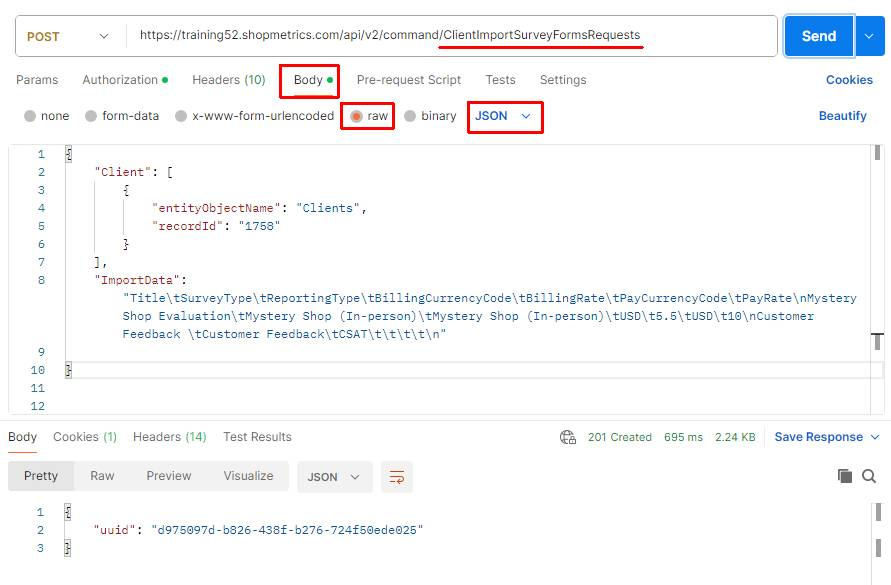
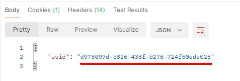
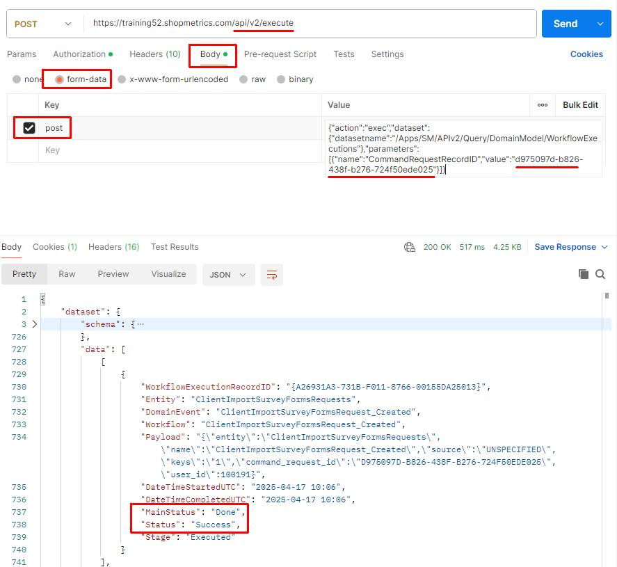
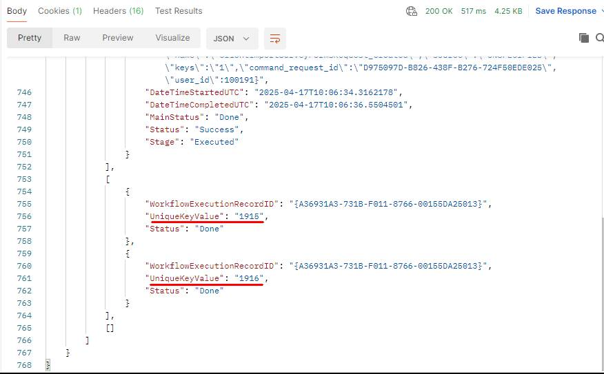
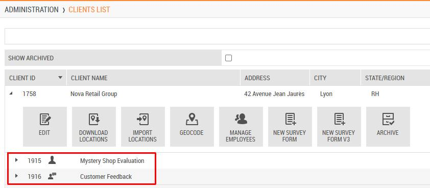

# Use Case: Import Survey Forms via Import Command Request

Last Modified: 2025-06-18 | Code: APIIFCR

**NOTE: The Shopmetrics Command API described in this article works only with V3 survey forms.**

This document provides an example of how a Shopmetrics Command API is used to perform changes in the Data Model. The changes are made using an asynchronous operation that is started by a Command Request.

Command Requests are calls to Command API Resources that return only a Request ID. The Request ID can be passed as a parameter to an API query resource that checks and returns the status of the request.

## User Security

To be able to use the Import Command Request successfully, the user executing the request should have the following security settings in the Shopmetrics system:

1. Membership in the "**Project Manager - Restricted**" security role  
       a. **Note:** The membership of the role can also be inherited
2. Permission to “**Build Survey Forms**” for the relevant clients.
3. Valid **Client Credentials** for API authorization

For more information about granting restricted access to the system refer to the article "Grant Restricted Access to the System" (short code: **GRAS**).

For more information about the Client Credentials and API Authorization you can refer to the article “API Authorization” (short code: **APIAUT**).

## Command Request Format

You can import survey forms by executing a command request to the following API endpoint:

**/api/v2/command/ClientImportSurveyFormsRequests**

The request should be written in the following JSON format:

{  
     "Client": [  
      {  
            "entityObjectName": "Clients",  
            "recordId": "*The ID of the Client you want to import survey forms for.*"  
       }  
    ],  
   "ImportData": "*The data for the survey forms you want to import. The data should be formatted in a tab-separated format (for more information see the section “Import Data Format”*)"  
}

## Import Data Format

The survey form data for import should be formatted in a tab-separated format. The following separators should be used accordingly:

- A **new line** should be represented with **\n**
- A **tab** should be represented with **\t**

## Survey Forms Import Data Fields

In the table below you can find the object names and short descriptions of all Survey Form Import Data Fields that can be used when importing survey form data:

| Field Object Name | Description | Is Required |
| --- | --- | --- |
| ID | Unique identifier for the survey form.  **NOTE: The ID is automatically generated during survey form creation.** | Required **only for Update requests** |
| Title | Survey form title. This field is **required**. | **Yes** |
| SurveyType | General type of the survey form. This field is **required**.  You can see **the available values for this field** in:   - /Apps/SM/APIv2/Query/Projects/EvaluationTypes Query Resource - "**General**" section of **Survey Properties** interface: | **Yes** |
| ReportingType | General type of the survey form. This field is **required**.  You can see **the available values for this field** in:   - **/Apps/SM/APIv2/Query/Projects/ReportingTypes** Query Resource - "**General**" section of **Survey Properties** interface: | **Yes** |
| SubTitle | Optional subtitle to distinguish survey forms with the same title but minor differences. | No |
| AlternativeTitleforApplications | Alternate title to display in the Job Board instead of the survey form title. This alternative title appears only in the Open Opportunities interface. | No |
| Logo | URL pointing to the survey form logo. | No |
| BillingCurrencyCode | Billing currency specified in ISO 4217 Alpha-3 format. | No |
| BillingRate | Amount to be billed to the client per completed visit. | No |
| CustomHTML | HTML content to be rendered in the form | No |
| FormStatus | Survey Form Status. Accepted values are:   - **A** - Active - **D** - Disabled | No |
| PayCurrencyCode | Payment currency specified in ISO 4217 Alpha-3 format. | No |
| PayRate | Compensation amount for a completed visit. | No |
| VersionFamily | Survey form version family. | No |
| IsRequiredPlannedDate | Determines whether the fieldworker is required to provide a Planned Date during the application process for instances of the survey form.  Accepted values are:   - **0**- Planned Date is NOT required for application - **1**- Planned Date is required for application  If not provided, the default website-specific value will be applied. | No |
| IsSetDueDateToPlannedDate | Specifies whether the Due Date for survey form instances is automatically set to the Planned Date chosen by the fieldworker during application.  Accepted values are:   - **0**- Due Date is NOT set to Planned Date - **1**- Due Date is set to Planned Date   - This value **can be used only when IsRequiredPlannedDate is set to "1".**  If not provided, the default website-specific value will be applied. | No |
| IsSetStartDateToPlannedDate | Specifies whether the Start Date for survey form instances is automatically set to the Planned Date chosen by the fieldworker during application.  Accepted values are:   - **0**- Start Date is NOT set to Planned Date - **1** - Start Date is set to Planned Date   - This value **can be used only when IsRequiredPlannedDate is set to "1".**  If not provided, the default website-specific value will be applied. | No |

## Import Survey Forms

The process of importing survey forms includes the following steps:

1. Executing the Import Command Request which generates a Request ID
2. Using the generated Request ID to check the status of the request. This is done via the /Apps/SM/APIv2/Query/DomainModel/WorkflowExecutions query API resource

### Postman Example

The content of the JSON formatted request:

```
{
    "Client": [
        {
            "entityObjectName": "Clients",
            "recordId": "1758"
        }
    ],
    "ImportData": "Title\tSurveyType\tReportingType\tBillingCurrencyCode\tBillingRate\tPayCurrencyCode\tPayRate\nMystery Shop Evaluation\tMystery Shop (In-person)\tMystery Shop (In-person)\tUSD\t5.5\tUSD\t10\nCustomer Feedback \tCustomer Feedback\tCSAT\t\t\t\t\n"
    
}
```

**Step 1** – execute the Import Command Request. The request should be sent to the following API endpoint:

**/api/v2/command/ClientImportSurveyFormsRequests**

****

The Import Command Request generates a unique Request ID which will be used in Step 2:



**Step 2** – copy the generated Request ID and use the **/Apps/SM/APIv2/Query/DomainModel/WorkflowExecutions** API query resource to check the status of the request.

The content for the “post” parameter in Body:

{"action":"exec","dataset":{"datasetname":"/Apps/SM/APIv2/Query/DomainModel/WorkflowExecutions"},"parameters":[{"name":"CommandRequestRecordID","value":"**d975097d-b826-438f-b276-724f50ede025**"}]}



In addition to providing the command request status, the "/Apps/SM/APIv2/Query/DomainModel/WorkflowExecutions" API query resource also returns the Form IDs for all survey forms created by the command request:



The newly imported Survey Forms for the client in Administration -> Clients List:


