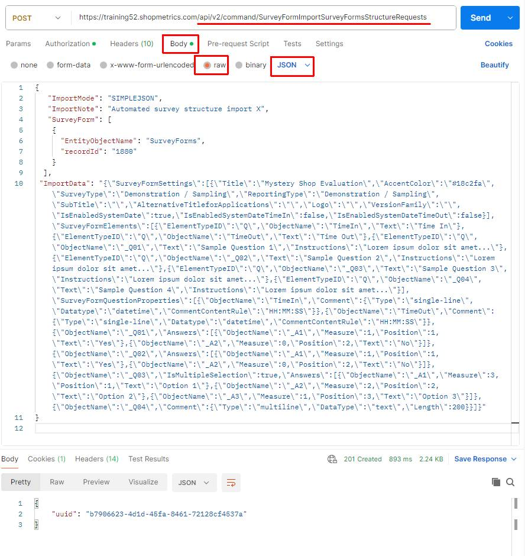
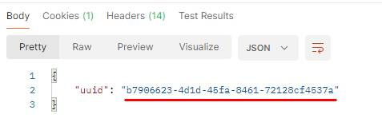
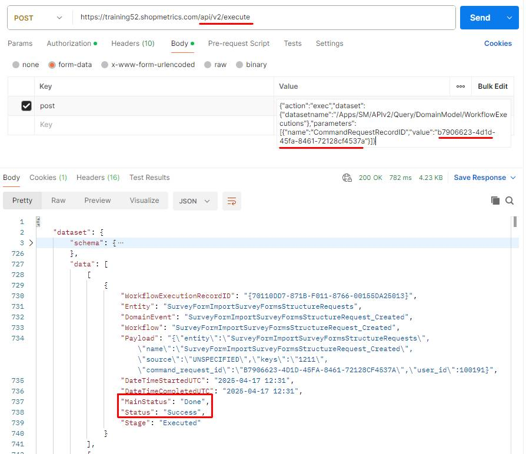
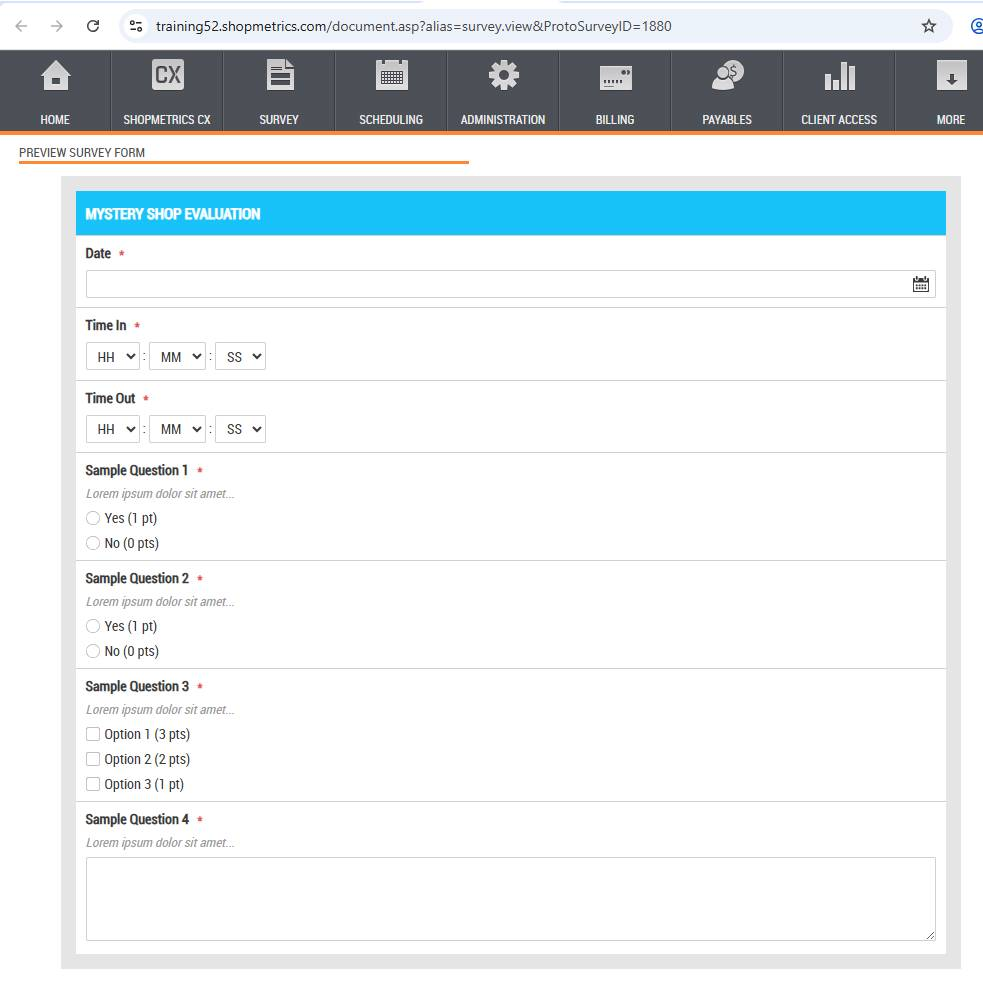
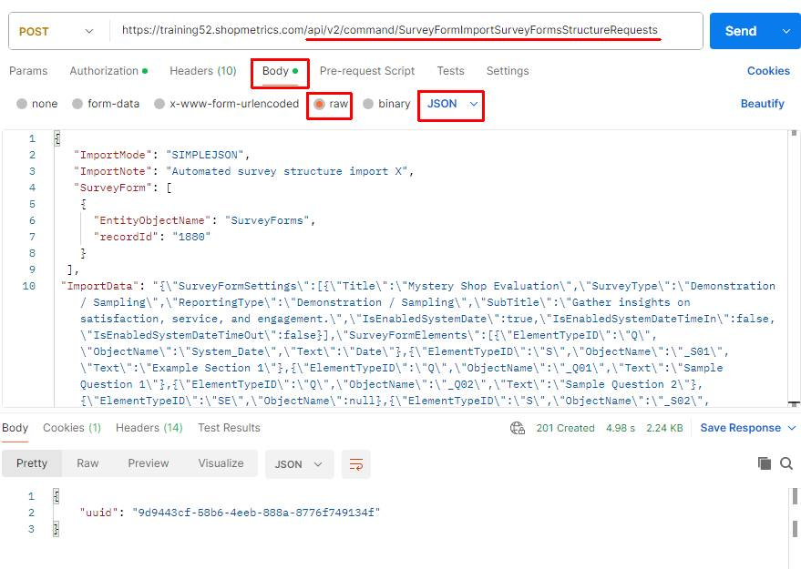
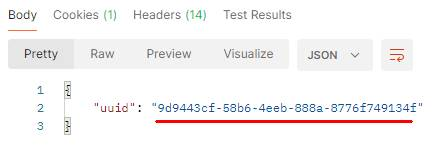
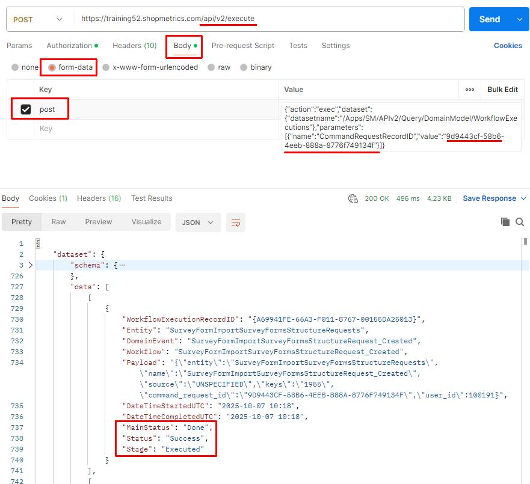
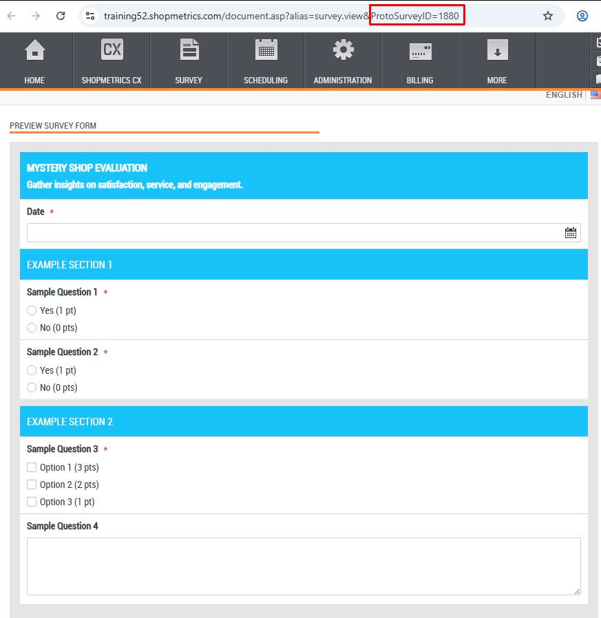
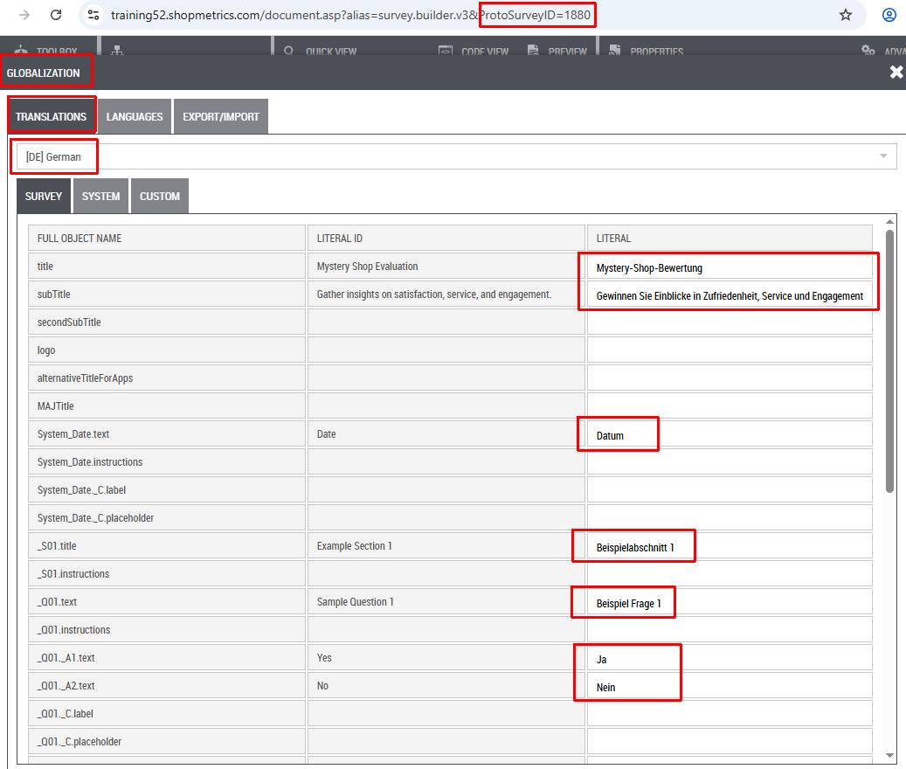
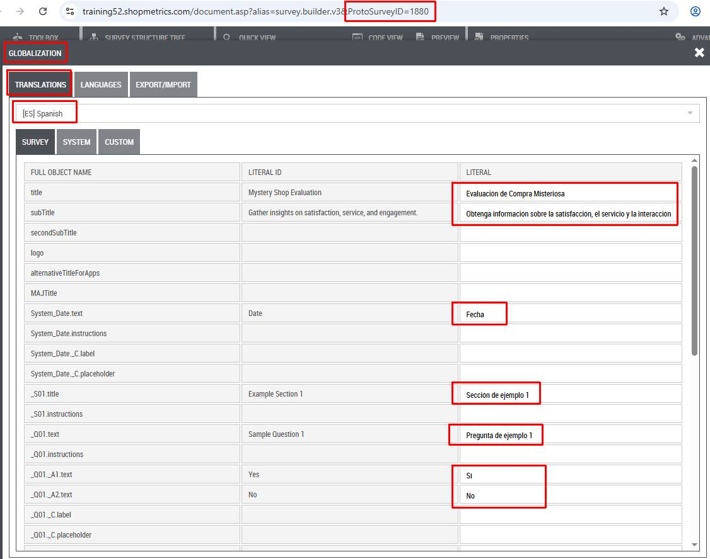

# Use Case: Import Survey Form Structure via Import Command Request

Last Modified: 2025-10-07 | Code: APIISCR

**NOTE: The Shopmetrics Command API described in this document works only with V3 survey forms.**

This document provides an example of how a Shopmetrics Command API is used to perform changes in the Data Model. The changes are made using an asynchronous operation that is started by a Command Request.

Command Requests are calls to Command API Resources that return only a Request ID. The Request ID can be passed as a parameter to an API query resource that checks and returns the status of the request.

## User Security

To be able to use the Import Command Request successfully, the user executing the request should have the following security settings in the Shopmetrics system:

1. Membership in the "**Project Manager - Restricted**" security role  
    a. **Note**: The membership of the role can also be inherited
2. Permission to “**Build Survey Forms**” for the relevant clients.
3. Valid **Client Credentials** for API authorization

For more information about granting restricted access to the system refer to the article "Grant Restricted Access to the System" (short code: **GRAS**).

For more information about the Client Credentials and API Authorization you can refer to the article “API Authorization” (short code: **APIAUT**).

## Command Request Format

You can import survey data by executing a command request to the following API endpoint: **/api/v2/command/SurveyFormImportSurveyFormsStructureRequests**

The request should be written in the following JSON format:

{

   "ImportMode": "SIMPLEJSON",  //*currently only "SIMPLEJSON" is supported*

   "ImportNote": "*A text, containing information for troubleshooting, tracing, or any additional details related to the import request .*",

   "SurveyForm": [

    {

      "EntityObjectName": "SurveyForms",

      "recordId": "*The ID of the Survey Form you want to import survey structure for*."

    }

  ],

 "ImportData": "*The survey form structure data you want to import. **It should be formatted as an escaped JSON**. More information about the Import Data JSON you can find in the “I**mport Data Format**” section.*"

}

### "ImportNote" field

The "ImportNote" field is a required component of the command request. It allows you to add troubleshooting, tracing, debugging, or other contextual information during survey form structure imports.

**Note that the value of the "ImportNote" field is restricted to 32 characters.**

When a survey form structure import request is successfully executed, a history event is created. This history event captures the "ImportNote" content, ensuring that all contextual information is logged and can be referenced later.

## Import Data Format (SIMPLEJSON mode)

To ensure seamless survey structure import, the survey structure data for import should be formatted in JSON (JavaScript Object Notation).

### Import Data JSON

The JSON for importing a survey form structure consists of multiple top-level nodes. Each node represents a specific part of the survey form structure, such as form settings, elements, and elements properties.

Here is a simple example of a JSON formatted survey structure data for import:

```
{
    "SurveyFormSettings": [
        {
            "Title": "Mystery Shop Evaluation",
            "AccentColor": "#18c2fa",
            "SurveyType": "Demonstration / Sampling",
            "ReportingType":"Demonstration / Sampling",
            "SubTitle": "",
            "AlternativeTitleforApplications":"",
            "Logo":"",
            "VersionFamily":"",
            "IsEnabledSystemDate":true,
            "IsEnabledSystemDateTimeIn": false,
            "IsEnabledSystemDateTimeOut": false
        }
    ],
    "SurveyFormElements": [        
        {
            "ElementTypeID": "Q",
            "ObjectName": "_Q01",
            "Text": "Sample Question 1",
            "Instructions": "Lorem ipsum dolor sit amet..."
        },
        {
            "ElementTypeID": "Q",
            "ObjectName": "_Q02",
            "Text": "Sample Question 2",
            "Instructions": "Lorem ipsum dolor sit amet..."
        }
    ],
    "SurveyFormQuestionProperties": [        
        {
            "ObjectName": "_Q01",            
            "Answers": [
                {
                    "ObjectName": "_A1",
                    "Measure": 1,
                    "Position": 1,
                    "Text": "Yes"                    
                },
                {
                    "ObjectName": "_A2",
                    "Measure": 0,
                    "Position": 2,
                    "Text": "No"                    
                }
            ]
        },
        {
            "ObjectName": "_Q02",
            "Comment":{
              "Type": "multiline",
              "Datatype": "text",
              "Length": 200
            }
        }
        
    ]
}
```

### Import Data JSON Components

In the sections below, you can find descriptions of the top-level JSON nodes and their components which represent the survey structure data for import.

#### SurveyFormSettings

SurveyFormSettings is an array containing a single JSON object with survey form properties configuration.

This node is **always required**.

| **SurveyFormSettings Field** | **Description** | **Is Required** |
| --- | --- | --- |
| Title | Survey form title. This field is **required**. | **Yes** |
| IsEnabledSystemDate | Defines if the default System\_Date should be included in the generated survey form structure. This field is **required.**  The accepted values for this field are:   - **true** - **false** | **Yes** |
| IsEnabledSystemDateTimeIn | Defines if the default System\_TimeIn should be included in the generated survey form structure. This field is **required.**  The accepted values for this field are:   - **true** - **false** | **Yes** |
| IsEnabledSystemDateTimeOut | Defines if the default System\_TimeOut should be included in the generated survey form structure. This field is **required.**  The accepted values for this field are:   - **true** - **false** | **Yes** |
| SurveyType | General type of the survey form.  You can see the available values for this field in:   - /Apps/SM/APIv2/Query/Projects/EvaluationTypes Query Resource - "General" section of Survey Properties interface: | No |
| ReportingType | General reporting type of the survey form.  You can see the available values for this field in:   - /Apps/SM/APIv2/Query/Projects/ReportingTypes Query Resource - "General" section of Survey Properties interface: | No |
| SubTitle | Optional subtitle to distinguish survey forms with the same title but minor differences. | No |
| AlternativeTitleforApplications | Alternate title to display in the Job Board instead of the survey form title. This alternative title appears only in the Open Opportunities interface. | No |
| Logo | URL pointing to the survey form logo. | No |
| VersionFamily | Survey form version family. | No |
| AdvancedScript | User defined code, which will be executed in the survey. Additional information on advanced scripts can be found in the following articles:   - "Introduction: Survey Logic" - short code: **ISUL** - "Integrated Code Editor" - short code: **INCE** | No |
| AccentColor | Controls the background color of survey and section titles.  **The value for this field must be a valid HEX color code.** | No |

#### SurveyFormElements

SurveyFormElements is an array of JSON objects, each representing a survey form element (e.g., a question, a section, a grid) and its general properties.

This node is **always required**.

| **SurveyFormElements Field** | **Description** | **Is Required** |
| --- | --- | --- |
| ElementTypeID | Type of element you want to import. This field is **required.**  The possible values for this field are:   - **Q** -> Question - **S**-> Section Start - **SE**-> Section End - **G**-> Grid Start - **GE**-> Grid End - **L**-> Loop Start - **LE**-> Loop End | **Yes** |
| ObjectName | Programmatic reference ID. It must be unique across all elements. When specifying an object name consider the **following constraints**:   - Object names can only contain letters, numbers and underscores - Object names cannot start with a number - The maximum length of an object name is 64 characters  This field is **required.** | **Yes** |
| Text | Primary text label displayed for a survey form element:   - For **Questions**, this is t**he question text which will be displayed in the survey**. - For **Sections**, **Grids**or **Loops**it refers to **their title**. | No |
| Position | Numerical order of the survey form elements.  If not provided, the element is displayed in the order it is listed in the SurveyFormElements node. | No |
| Instructions | Optional supplementary text displayed below the main text, defined in the "Text" field. | No |

#### SurveyFormQuestionProperties

SurveyFormQuestionProperties is an array of JSON objects, where each object defines detailed properties for a specific survey form question.

This node is **always required**.

| **SurveyFormQuestionProperties Field** | **Description** | **Is Required** |
| --- | --- | --- |
| ObjectName | Object name for the question defined in "SurveyFormElements" node. This field is **required.** | **Yes** |
| QuestionType | Type of question. The possible values for this field are:   - **generic** - **text** - **numeric** - **date** - **info** - **media** - **list**   If not provided the default value for this field is "generic". | No |
| DataClassification | Data sensitivity classification for the question comment field. The possible values for this field are:   - **General** - **Personal** - **Personal Sensitive** - **Consent**   If not provided the default value for this field is "General". | No |
| Comment {} | A JSON object representing comment properties. For more details refer to the table "**Comment fields**" below. | **Yes**, **if****Answers is NOT specified** |
| Answers [] | An array of objects where each object represents an answer and its properties. For more details about the fields in each Answers object refer to the table "**Answers components**" below. | **Yes, if Comments is NOT specified** |
| PredefinedNumber | Number or label that should be displayed next to the question. The value entered for this field will override any automatic numbering scheme that might be set at the overall survey level. | No |
| IsAllowAttachments | Specifies whether attachments are allowed for the question.  The possible values for this field are:   - **true** -> attachments are **allowed** - **false** -> attachments are **NOT allowed**   If not provided the default value for this field is: false. | No |
| AttachmentSize | Visual size of the thumbnail preview for image attachments displayed directly within the survey form. The possible values for this field are:   - **S** - **M** - **L** - **XL**   If not provided the default value for this field is: L.  **NOTE: Applicable only if IsAllowAttachments is provided and set to "true".** | No |
| IsMultipleSelection | Defines if multiple answer selection is allowed for a question. The possible values for this field are:   - **true**-> multiple selection is **allowed** - **false**-> multiple selections is **not allowed**   If not provided the default value for this field is: false. | No |
| IsShowMeasure | Defines whether the points for the question will be displayed to fieldworkers. The possible values for this field are:   - **true** -> the possible points for the question will **be visible** to fieldworkers - **false**-> the possible points for the question will **NOT be visible**to fieldworkers | No |
| IsRequired | Determines whether answering the question is mandatory.  The possible values for this field are:   - **true** -> answering the question **is required** - **false** -> answering   the question **is NOT required**   If not provided the default value for this field is: true. | No |
| IsNumbered | Specifies whether the question number should be displayed.  The possible values for this field are:   - **true** ->  question number **WILL be displayed** - **false** ->  question number will **NOT be displayed**   If not provided the default value for this field is: true | No |
| PointsPossible | The number of points possible to achieve for the question. | No |
| LimitMeasureMinimum | The minimum number of points a question can score, regardless of how it was answered. | No |
| LimitMeasureMaximum | The maximum number of points a question can score, regardless of how it was answered. | No |
| StartingPoints | Defines an initial score for the answer set before any answers are considered. | No |
| AnswerOrderType | Defines the order type of the question answers.  The possible values for this field are:   - **Default** - **Alphabetical(A-Z)** - **Alphabetical(Z-A)** - **BasedOnPoints** - **UserSpecifiedOrder** - **Random** - **RandomBasedOnInstance** - **Rotated** - **Reversed**   If not provided the default value for this field is "Default". | No |
| QuestionCategory1 | A text label used to categorize the question for reporting purposes. | No |
| QuestionCategory2 | A text label used to categorize the question for reporting purposes. | No |
| QuestionCategory3 | A text label used to categorize the question for reporting purposes. | No |

**Comment fields:**

| **Comment {} Field** | **Description** | **Is Required** |
| --- | --- | --- |
| Type | Layout/display format of the text input field. The possible values for this field are:   - **single-line** - **multiline** - **null**-> no text   If not provided the default value for this field is "single-line". | No |
| DataType | Expected data type for the input coment. The possible values for this field are:   - **text** - **numeric** - **datetime** - **boolean**  If not provided the default value for this field is "text". | No |
| Length | Maximum number of characters (for Text) or total digits (for Numeric) allowed in the comment field. | No |
| Scale | Maximum number of digits allowed after the decimal point for numeric questions. | No |
| CommentContentRule | Specific format requirement (like date format, email, number) that the user input must match. The possible values for this field are:  - **No Rule** - **DD.MM.YYYY** - **DD/MM/YYYY** - **MM/DD/YYYY** - **YYYY-MM-DD** - **YYYY-MM-DD HH:MM:SS** - **HH:MM** - **HH:MM AM/PM** - **HH:MM:SS** - **HH:MM:SS AM/PM** - **MM:SS** - **SS**  If not provided the default value for this field is "No Rule". | No |
| MinCommentLength | Minimum number of characters required **for text inputs**. | No |
| MaxCommentLength | Maximum number of characters allowed **for text inputs**. | No |
| MinCommentValue | Minimum number value allowed as an input. **Applicable for numeric data type comments**. | No |
| MaxCommentValue | Maximum number value allowed as an input. **Applicable for numeric data type comments.** | No |
| CommentRange | Specific allowed value ranges or steps using a special expression format for numeric, text, or date/time input. | No |
| RegExp | JavaScript regular expression for validating user input. **Applicable for numeric, text and datetime data type comments.** | No |
| CustomFunction | Name of a custom function that will be executed on validation. | No |
| Placeholder | Placeholder text for a single-line or multiline comment. The text is visible in the input box until the user enters content.  If not provided the default value for this field is “Enter comment here…”. | No |
| Label | Label for a single-line or multiline comment.  If not provided the default value for this field is “Comment:”. | No |

**Answers components:**

| **Answers [] component** | **Description** | **Is Required** |
| --- | --- | --- |
| Text | Primary text label displayed for the answer. This field is **required.** | **Yes** |
| ObjectName | Programmatic reference ID. It must be unique across all elements. When specifying an object name consider the **following constraints**:   - Object names can only contain letters, numbers and underscores - Object names cannot start with a number - The maximum length of an object name is 64 characters | No |
| Position | Answer position within the question. The value for this field must be an integer. | No |
| Measure | Points assigned to the answer option. The value for this field must be an integer. | No |
| IsExclusive | Controls whether the answer option should be exclusive. **Applicable for questions where multiple answer selection is allowed.**  The possible values for this field are:   - **true** -> the answer option is exclusive and CANNOT be selected with other answer options simultaneously - **false** -> the answer option is NOT exclusive and CAN be selected along with other answer options   If not provided the default value for this field is: false. | No |
| IsOther | Controls whether an input field should be displayed and required to be completed if the answer option is selected.  The possible values for this field are:   - **true** -> an input field is displayed next to the answer option - **false** -> NO input field is displayed next to the answer option   If not provided the default value for this field is: false. | No |
| IsOtherSettings {} | A JSON object representing IsOther answer properties. For more details refer to the table "**IsOtherSettings fields**" below. | No |
| OtherDataClassification | Data sensitivity classification for the IsOther answer input field.  The possible values for this field are:   - **General** - **Personal** - **Personal Sensitive**   If not provided the default value for this field is "General". | No |
| IsIgnoreFilter | Controls the answer option visibility behavior against scripts. **Applicable for "Generic" and "Categorical" questions.**  The possible values for this field are:   - **true** -> the answer option will NOT be a subject to visibility changes from scripts - **false** -> the answer option CAN be a subject to visibility changes from scripts   If not provided the default value for this field is: false. | No |
| IsFixedToPosition | Determines if the current answer option position in the survey structure should override any special ordering set to the upper level element.  The possible values for this field are:   - **true** ->  the answer option always stays at its current position - **false** ->  the answer option position can be determined by a special ordering set to the upper level element   If not provided the default value for this field is: false | No |
| DisplayOrder | User specified position of the answer option. The value for this field must be an integer.  **NOTE: This field is applicable when "AnswerOrderType" for the question is set to "User Specified".** | No |
| Group | Controls the hierarchical structure of the answer set by defining the answer option as either a parent or a child item.  The possible values for this field are:   - **true** ->  sets the answer option as the parent of a new group **NOTE: Using this value  automatically sets "IsDisplayAsHeader" field to "true".** - **false** ->  the answer is a standard option or a child within existing group   If not provided the default value for this field is: false | No |
| IsDisplayAsHeader | Determines if the answer option is an actual option or just a displayed, non-selectable label.  The possible values for this field are:   - **true** ->  the answer option is just a label and cannot be selected - **false** ->  the answer option is a normal answer option and can be selected   If not provided the default value for this field is: false | No |

**IsOtherSettings fields:**

| **IsOtherSettings Field** | **Description** | **Is Required** |
| --- | --- | --- |
| ObjectName | Programmatic reference ID. It must be unique across all elements. When specifying an object name consider the **following constraints**:   - Object names can only contain letters, numbers and underscores - Object names cannot start with a number - The maximum length of an object name is 64 characters | No |
| Type | Layout/display format of the text input field. The possible values for this field are:   - **single-line** - **multiline**   If not provided the default value for this field is "single-line". | No |
| DataType | Expected data type for the input comment. The possible values for this field are:   - **text** - **numeric** - **datetime** - **boolean**   If not provided the default value for this field is "text". | No |
| Length | Maximum number of characters (for Text) or total digits (for Numeric) allowed in the comment field. | No |
| Scale | Maximum number of digits allowed after the decimal point for numeric inputs. | No |
| MinCommentLength | Minimum number of characters required **for text inputs**. | No |
| MaxCommentLength | Maximum number of characters allowed **for text inputs**. | No |
| MinCommentValue | Minimum number value allowed as an input. **Applicable for numeric data type comments**. | No |
| MaxCommentValue | Maximum number value allowed as an input. **Applicable for numeric data type comments.** | No |
| CommentContentRule | Specific format requirement (like date format, email, number) that the user input must match. The possible values for this field are:  - **No Rule** - **DD.MM.YYYY** - **DD/MM/YYYY** - **MM/DD/YYYY** - **YYYY-MM-DD** - **YYYY-MM-DD HH:MM:SS** - **HH:MM** - **HH:MM AM/PM** - **HH:MM:SS** - **HH:MM:SS AM/PM** - **MM:SS** - **SS** | No |
| CommentRange | Specific allowed value ranges or steps using a special expression format for numeric, text, or date/time input. | No |
| RegExp | JavaScript regular expression for validating user input. **Applicable for numeric, text and datetime data type comments.** | No |
| Placeholder | Placeholder text for a single-line or multiline comment. The text is visible in the input box until the user enters content.  If not provided the default value for this field is “Enter comment here…”. | No |

#### SectionProperties

SectionProperties is an array of JSON objects that provide details for any sections defined in the "SurveyFormElements" node.

This node is **required only** if sections are defined in the SurveyFormElements node.

| **SectionProperties Field** | **Description** | **Is Required** |
| --- | --- | --- |
| ObjectName | Object name for the element defined in "SurveyFormElements" JSON node. This field is **required.** | **Yes** |
| IsRestartQuestionNumberCount | Determines whether the survey numbering will be restarted at the beginning of the section.  The possible values for this field are:   - **true** ->  restart numbering for this section - **false** ->  continue the survey numbering   If not provided the default value for this field is: false | No |
| QuestionNumberType | Specifies how elements within the section are numbered.  The possible values for this field are:   - **No Numbering** - **1,2,3** - **a), b), c)** - **A, B, C** - **Use Object Name**   If not provided the default value for this field is "Use Object Name". | No |
| IsNumbered | Specifies if the section number should be displayed.  The possible values for this field are:   - **true** ->  section number WILL be displayed - **false** ->  section number will NOT be displayed   If not provided the default value for this field is: true | No |
| PredefinedNumber | Custom number or label that should be displayed next to the section title.  The value entered for this field will override any automatic numbering scheme that might be set at the overall survey level. | No |
| ChildElementsDisplayOrder | Determines how the Section inner elements are ordered in the survey form.  The possible values for this field are:   - **Default** - **Alphabetical(A-Z)** - **Alphabetical(Z-A)** - **BasedOnPoints** - **UserSpecifiedOrder** - **Random** - **RandomBasedOnInstance** - **Rotated** - **Reversed**   If not provided the default value for this field is "Default". | No |
| IsFixedToPosition | Determines if the current section position in the survey structure should override any special ordering set to the upper level element.  The possible values for this field are:   - **true** ->  the section will force its own, current position in the ordering - **false** ->  the section will honor the settings set by the upper level element   If not provided the default value for this field is: false | No |

#### GridProperties

GridProperties is an array of JSON objects used to define detailed properties for any grid  defined in the "SurveyFormElements" node.

This node is **required only** if grids are defined in the SurveyFormElements node.

| **GridProperties Field** | **Description** | **Is Required** |
| --- | --- | --- |
| ObjectName | Object name for the element defined in "SurveyFormElements" JSON node. This field is **required.** | **Yes** |
| IsRestartQuestionNumberCount | Determines whether the survey numbering will be restarted at the beginning of the grid.  The possible values for this field are:   - **true** ->  restart numbering for this grid - **false** ->  continue the survey numbering   If not provided the default value for this field is: false | No |
| IsNumbered | Specifies if the grid number should be displayed in the survey.  The possible values for this field are:   - **true** ->  grid number WILL be displayed - **false** ->  grid number will NOT be displayed   If not provided the default value for this field is: true | No |
| PredefinedNumber | Custom number or label that should be displayed next to the grid title.  The value entered for this field will override any automatic numbering scheme that might be set at the overall survey level. | No |

#### LoopProperties

LoopProperties is an array of JSON objects specifying configuration for any loop defined in the "SurveyFormElements" node.

This node is **required** **only**if loops are defined in the SurveyFormElements node.

| LoopProperties Field | **Description** | **Is Required** |
| --- | --- | --- |
| ObjectName | Object name for the element defined in "SurveyFormElements" JSON node. This field is **required.** | **Yes** |
| DisplayAs | Specifies how the questions inside the loop are displayed.  The possible values for this field are:   - **Grid** -> the loop questions will be displayed in a grid - **Section** -> the loop questions will be displayed in a section   If not provided the default value for this field is "Grid" | No |
| Orientation | Specifies how the loop iterations should be arranged when the DisplayAs field is set to "Grid".  The possible values for this field are:   - **Row** -> each loop iteration will be displayed as a row in the grid - **Column** -> each loop iteration will be displayed as a column in the grid   If not provided the default value for this field is "Row". | No |
| IsNumbered | Specifies if the loop number should be displayed.  The possible values for this field are:   - **true** ->   loop number WILL be displayed - **false** ->   loop number will NOT be displayed   If not provided the default value for this field is: true | No |
| PredefinedNumber | Custom number or label that should be displayed next to the loop title.  The value entered for this field will override any automatic numbering scheme that might be set at the overall survey level. | No |
| IsShowLoopText | Specifies if loop text (title) should be displayed in the survey.  The possible values for this field are:   - **true** ->  the loop text will be displayed in the survey - **false** ->   the loop text will NOT be displayed in the survey, but it will still be included in data exports and reporting   If not provided the default value for this field is: true | No |
| IsShowQuestionTexts | Specifies if the inner question texts will be displayed in the survey.  The possible values for this field are:   - **true** ->  the question texts will be displayed in the survey - **false** ->   the question texts will NOT be displayed in the survey, but it will still be included in data exports and reporting   If not provided the default value for this field is: true | No |
| IsShowChildNodeTexts | Specifies if the inner question answer texts will be displayed in the survey.  The possible values for this field are:   - **true** ->  the answer texts will be displayed in the survey - **false** ->   the answer texts will NOT be displayed in the survey   If not provided the default value for this field is: true | No |
| IsShowIterationTexts | Specifies if the text specific to the iteration will be displayed.  The possible values for this field are:   - **true** ->  the iteration text will be displayed in the survey - **false** ->   the iteration text will NOT be displayed in the survey   If not provided the default value for this field is: true | No |
| IterationType | Specifies the source of the loop iterations.  The possible values for this field are:   - **Answers** - **Index (Count)**   If not provided the default value for this field is "Index (Count)". | No |
| MaxIterations | Specifies the maximum number of loop iterations. The value for this field must be an integer. | No |
| IsFixedToPosition | Determines if the current loop position in the survey structure should override any special ordering set to the upper level element.  The possible values for this field are:   - **true** ->  the loop element will force its own, current position in the ordering - **false** ->  the loop will honor the ordering settings set by the upper level element   If not provided the default value for this field is: false | No |
| Answers [] | An array of objects where each object represents an answer and its properties. For more details about the fields in each Answers object refer to the table "**Answers fields**" below.  **NOTES:** **• In the context of a loop each answer represents a single loop iteration.** **• Applicable only if IterationType is set to "Answers".** | No |

**Answers fields:**

| **Answers Field** | **Description** | **Is Required** |
| --- | --- | --- |
| Text | Primary text label displayed for the loop iteration. This field is **required.** | **Yes** |
| ObjectName | Programmatic reference ID. It must be unique across all elements. When specifying an object name consider the **following constraints**:   - Object names can only contain letters, numbers and underscores - Object names cannot start with a number - The maximum length of an object name is 64 characters | No |
| Position | Position of the iteration within the loop. The value for this field must be an integer. | No |
| IsFixedToPosition | Determines if the loop iteration current position in the survey structure should override any special ordering set to the upper level element.  The possible values for this field are:   - **true**->  the loop iteration always stays at its current position - **false**->  the loop iteration position can be determined by any special ordering set to the upper level element   If not provided the default value for this field is: false | No |
| Group | Controls the hierarchical structure of the loop iterations by defining the loop iteration as either a parent or a child item.  The possible values for this field are:   - **true**-> sets the loop iteration as the parent of a new group **NOTE: This value automatically sets the "IsDisplayAsHeader" field to "true".** - **false** ->  the loop iteration is a standard iteration or a child within existing group   If not provided the default value for this field is: false | No |
| IsDisplayAsHeader | Determines if the loop iteration is an actual interactive iteration or just a displayed, non-interactive header.  The possible values for this field are:   - **true**->  the loop iteration is a non-interactive header - **false**->  the loop iteration is an actual interactive iteration   If not provided the default value for this field is: false | No |

#### SurveyFormGlobalizationLanguageLocales

SurveyFormGlobalizationLanguageLocales is an array of JSON objects, each enabling a specific language for survey translations.

| SurveyFormGlobalizationLanguageLocales Field | Description | Is Required |
| --- | --- | --- |
| Language | Language, available in the system,  to be activated for the survey form. This field i**s required**.  **The value for this field should be a valid language code according to the ISO 639-1 standard.** | **Yes** |
| IsRTL | Specifies if the language has Right-to-Left (RTL) text direction.  The possible values for this field are:   - **true** -> the language has Right-to-Left text direction - **false** -> the language does NOT have Right-to-Left text direction   If not provided the default value for this field is: false. | No |

#### SurveyFormGlobalizationTranslations

SurveyFormGlobalizationTranslations is an array of JSON objects, each defining a translation to be imported for a specific survey element.

| SurveyFormGlobalizationTranslations Field | Description | Is Required |
| --- | --- | --- |
| LanguageLocale | Language, activated in *SurveyFormGlobalizationLanguageLocales,*for survey translation. This field i**s required.**  **The value for this field should be a valid language code according to the ISO 639-1 standard.** | **Yes** |
| ElementObjectName | Object name of the element being translated. This field is required.   - **For survey elements** use the element object name as defined in the SurveyFormElements node. - **For answer options** use the combination of the question object name and the answer object name, denoted as **QuestionObjectName.AnswerObjectName** - **For survey properties** you can use the property field name as documented in the SurveyFormSettings fields table | **Yes** |
| Translation | Localized text for the survey element in the target language. This field**is required**. | **Yes** |

### Escaped Import Data JSON

To ensure the data is correctly imported via the Import Data Command API, the Import Data JSON should be provided in the request as an escaped JSON string. This means that special characters such as quotes, backslashes, and control characters (e.g., newlines) within the JSON data must be properly escaped.

- Double Quotes ("): Should be escaped as \".
- Backslashes (\): Should be escaped as \\.
- Control Characters (e.g., newlines \n and carriage returns \r): Should be included if necessary and also escaped.

This ensures that the data is parsed accurately and avoids any syntax errors during the import process.

Here is an example of a JSON formatted survey data for import and its escaped version ready to be passed to the Command Request:

**Import Data JSON:**

```
{
    "SurveyFormSettings": [
        {
            "Title": "Mystery Shop Evaluation",
            "AccentColor": "#18c2fa",
            "SurveyType": "Demonstration / Sampling",
            "ReportingType":"Demonstration / Sampling",
            "SubTitle": "",
            "AlternativeTitleforApplications":"",
            "Logo":"",
            "VersionFamily":"",
            "IsEnabledSystemDate":true,
            "IsEnabledSystemDateTimeIn": false,
            "IsEnabledSystemDateTimeOut": false
        }
    ],
    "SurveyFormElements": [        
        {
            "ElementTypeID": "Q",
            "ObjectName": "_Q01",
            "Text": "Sample Question 1",
            "Instructions": "Lorem ipsum dolor sit amet..."
        },
        {
            "ElementTypeID": "Q",
            "ObjectName": "_Q02",
            "Text": "Sample Question 2",
            "Instructions": "Lorem ipsum dolor sit amet..."
        }
    ],
    "SurveyFormQuestionProperties": [        
        {
            "ObjectName": "_Q01",            
            "Answers": [
                {
                    "ObjectName": "_A1",
                    "Measure": 1,
                    "Position": 1,
                    "Text": "Yes"                    
                },
                {
                    "ObjectName": "_A2",
                    "Measure": 0,
                    "Position": 2,
                    "Text": "No"                    
                }
            ]
        },
        {
            "ObjectName": "_Q02",
            "Comment":{
              "Type": "multiline",
              "Datatype": "text",
              "Length": 200
            }
        }
        
    ]
}
```

**Escaped Import Data JSON:**

```
{\"SurveyFormSettings\":[{\"Title\":\"Mystery Shop Evaluation\",\"AccentColor\":\"#18c2fa\",\"SurveyType\":\"Demonstration / Sampling\",\"ReportingType\":\"Demonstration / Sampling\",\"SubTitle\":\"\",\"AlternativeTitleforApplications\":\"\",\"Logo\":\"\",\"VersionFamily\":\"\",\"IsEnabledSystemDate\":true,\"IsEnabledSystemDateTimeIn\":false,\"IsEnabledSystemDateTimeOut\":false}],\"SurveyFormElements\":[{\"ElementTypeID\":\"Q\",\"ObjectName\":\"_Q01\",\"Text\":\"Sample Question 1\",\"Instructions\":\"Lorem ipsum dolor sit amet...\"},{\"ElementTypeID\":\"Q\",\"ObjectName\":\"_Q02\",\"Text\":\"Sample Question 2\",\"Instructions\":\"Lorem ipsum dolor sit amet...\"}],\"SurveyFormQuestionProperties\":[{\"ObjectName\":\"_Q01\",\"Answers\":[{\"ObjectName\":\"_A1\",\"Measure\":1,\"Position\":1,\"Text\":\"Yes\"},{\"ObjectName\":\"_A2\",\"Measure\":0,\"Position\":2,\"Text\":\"No\"}]},{\"ObjectName\":\"_Q02\",\"Comment\":{\"Type\":\"multiline\",\"DataType\":\"text\",\"Length\":200}}]}
```

## Import Survey Form Structure

The process of importing survey data includes the following steps:

1. Executing the Import Command Request which generates a Request ID
2. Using the generated Request ID to check the status of the request. This is done via the /Apps/SM/APIv2/Query/DomainModel/WorkflowExecutions query API resource

### Postman example

The content of the JSON formatted request:

```
{
   "ImportMode": "SIMPLEJSON",
   "ImportNote": "Automated survey structure import X",
   "SurveyForm": [
    {
      "EntityObjectName": "SurveyForms",
      "recordId": "1880"
    }
  ],
 "ImportData": "{\"SurveyFormSettings\":[{\"Title\":\"Mystery Shop Evaluation\",\"AccentColor\":\"#18c2fa\",\"SurveyType\":\"Demonstration / Sampling\",\"ReportingType\":\"Demonstration / Sampling\",\"SubTitle\":\"\",\"AlternativeTitleforApplications\":\"\",\"Logo\":\"\",\"VersionFamily\":\"\",\"IsEnabledSystemDate\":true,\"IsEnabledSystemDateTimeIn\":false,\"IsEnabledSystemDateTimeOut\":false}],\"SurveyFormElements\":[{\"ElementTypeID\":\"Q\",\"ObjectName\":\"TimeIn\",\"Text\":\"Time In\"},{\"ElementTypeID\":\"Q\",\"ObjectName\":\"TimeOut\",\"Text\":\"Time Out\"},{\"ElementTypeID\":\"Q\",\"ObjectName\":\"_Q01\",\"Text\":\"Sample Question 1\",\"Instructions\":\"Lorem ipsum dolor sit amet...\"},{\"ElementTypeID\":\"Q\",\"ObjectName\":\"_Q02\",\"Text\":\"Sample Question 2\",\"Instructions\":\"Lorem ipsum dolor sit amet...\"},{\"ElementTypeID\":\"Q\",\"ObjectName\":\"_Q03\",\"Text\":\"Sample Question 3\",\"Instructions\":\"Lorem ipsum dolor sit amet...\"},{\"ElementTypeID\":\"Q\",\"ObjectName\":\"_Q04\",\"Text\":\"Sample Question 4\",\"Instructions\":\"Lorem ipsum dolor sit amet...\"}],\"SurveyFormQuestionProperties\":[{\"ObjectName\":\"TimeIn\",\"Comment\":{\"Type\":\"single-line\",\"Datatype\":\"datetime\",\"CommentContentRule\":\"HH:MM:SS\"}},{\"ObjectName\":\"TimeOut\",\"Comment\":{\"Type\":\"single-line\",\"Datatype\":\"datetime\",\"CommentContentRule\":\"HH:MM:SS\"}},{\"ObjectName\":\"_Q01\",\"Answers\":[{\"ObjectName\":\"_A1\",\"Measure\":1,\"Position\":1,\"Text\":\"Yes\"},{\"ObjectName\":\"_A2\",\"Measure\":0,\"Position\":2,\"Text\":\"No\"}]},{\"ObjectName\":\"_Q02\",\"Answers\":[{\"ObjectName\":\"_A1\",\"Measure\":1,\"Position\":1,\"Text\":\"Yes\"},{\"ObjectName\":\"_A2\",\"Measure\":0,\"Position\":2,\"Text\":\"No\"}]},{\"ObjectName\":\"_Q03\",\"IsMultipleSelection\":true,\"Answers\":[{\"ObjectName\":\"_A1\",\"Measure\":3,\"Position\":1,\"Text\":\"Option 1\"},{\"ObjectName\":\"_A2\",\"Measure\":2,\"Position\":2,\"Text\":\"Option 2\"},{\"ObjectName\":\"_A3\",\"Measure\":1,\"Position\":3,\"Text\":\"Option 3\"}]},{\"ObjectName\":\"_Q04\",\"Comment\":{\"Type\":\"multiline\",\"DataType\":\"text\",\"Length\":200}}]}"
}
```

**Step 1** – execute the Import Command Request. The request should be sent to the following API endpoint: /api/v2/command/SurveyFormImportSurveyFormsStructureRequests.



The Import Command Request generates a unique Request ID which will be used in Step 2:



**Step 2** – copy the generated Request ID and use the **/Apps/SM/APIv2/Query/DomainModel/WorkflowExecutions** API query resource to check the status of the request.

The content for the “post” parameter in Body:

{"action":"exec","dataset":{"datasetname":"/Apps/SM/APIv2/Query/DomainModel/WorkflowExecutions"},"parameters":[{"name":"CommandRequestRecordID","value":"**b7906623-4d1d-45fa-8461-72128cf4537a**"}]}



On the screenshot below you can see a preview of the newly imported survey form structure:



## Example: Import Survey Form Structure - Globalization

The following example shows how to import a survey form structure, enable a language for globalization and import translations for the survey elements.

Below is the JSON formatted survey structure data for import:

```
{
    "SurveyFormSettings": [
        {
            "Title": "Mystery Shop Evaluation",
            "SurveyType": "Demonstration / Sampling",
            "ReportingType": "Demonstration / Sampling",
            "SubTitle": "Gather insights on satisfaction, service, and engagement.",
            "IsEnabledSystemDate": true,
            "IsEnabledSystemDateTimeIn": false,
            "IsEnabledSystemDateTimeOut": false
        }
    ],
    "SurveyFormElements": [
        {
            "ElementTypeID": "Q",
            "ObjectName": "System_Date",
            "Text": "Date"
        },
        {
            "ElementTypeID": "S",
            "ObjectName": "_S01",
            "Text": "Example Section 1"
        },
        {
            "ElementTypeID": "Q",
            "ObjectName": "_Q01",
            "Text": "Sample Question 1"
        },
        {
            "ElementTypeID": "Q",
            "ObjectName": "_Q02",
            "Text": "Sample Question 2"
        },
        {
            "ElementTypeID": "SE",
            "ObjectName": null
        },
        {
            "ElementTypeID": "S",
            "ObjectName": "_S02",
            "Text": "Example Section 2"
        },
        {
            "ElementTypeID": "Q",
            "ObjectName": "_Q03",
            "Text": "Sample Question 3"
        },
        {
            "ElementTypeID": "Q",
            "ObjectName": "_Q04",
            "Text": "Sample Question 4"
        },
        {
            "ElementTypeID": "SE",
            "ObjectName": null
        }
    ],
    "SurveyFormQuestionProperties": [
        {
            "ObjectName": "System_Date",
            "QuestionType": "date",
            "Comment": {
                "Type": "single-line",
                "Datatype": "datetime",
                "CommentContentRule": "YYYY-MM-DD"
            }
        },
        {
            "ObjectName": "_Q01",
            "Answers": [
                {
                    "ObjectName": "_A1",
                    "Measure": 1,
                    "Position": 1,
                    "Text": "Yes"
                },
                {
                    "ObjectName": "_A2",
                    "Measure": 0,
                    "Position": 2,
                    "Text": "No"
                }
            ]
        },
        {
            "ObjectName": "_Q02",
            "Answers": [
                {
                    "ObjectName": "_A1",
                    "Measure": 1,
                    "Position": 1,
                    "Text": "Yes"
                },
                {
                    "ObjectName": "_A2",
                    "Measure": 0,
                    "Position": 2,
                    "Text": "No"
                }
            ]
        },
        {
            "ObjectName": "_Q03",
            "IsMultipleSelection": true,
            "Answers": [
                {
                    "ObjectName": "_A1",
                    "Measure": 3,
                    "Position": 1,
                    "Text": "Option 1"
                },
                {
                    "ObjectName": "_A2",
                    "Measure": 2,
                    "Position": 2,
                    "Text": "Option 2"
                },
                {
                    "ObjectName": "_A3",
                    "Measure": 1,
                    "Position": 3,
                    "Text": "Option 3"
                }
            ]
        },
        {
            "ObjectName": "_Q04",
            "IsRequired": false,
            "Comment": {
                "Type": "multiline",
                "DataType": "text",
                "Length": 200
            }
        }
    ],
    "SectionProperties": [
        {
            "ObjectName": "_S01",
            "QuestionNumberType": "No Numbering",
            "IsNumbered": false
        },
        {
            "ObjectName": "_S02",
            "QuestionNumberType": "No Numbering",
            "IsNumbered": false
        }
    ],
    "SurveyFormGlobalizationLanguageLocales": [
        {
            "Language": "de"
        },
        {
            "Language": "es"
        }
    ],
    "SurveyFormGlobalizationTranslations": [
        {
            "LanguageLocale": "de",
            "ElementObjectName": "Title",
            "Translation": "Mystery-Shop-Bewertung"
        },
        {
            "LanguageLocale": "es",
            "ElementObjectName": "Title",
            "Translation": "Evaluación de Compra Misteriosa"
        },
        {
            "LanguageLocale": "de",
            "ElementObjectName": "SubTitle",
            "Translation": "Gewinnen Sie Einblicke in Zufriedenheit, Service und Engagement"
        },
        {
            "LanguageLocale": "es",
            "ElementObjectName": "SubTitle",
            "Translation": "Obtenga información sobre la satisfacción, el servicio y la interacción"
        },
        {
            "LanguageLocale": "de",
            "ElementObjectName": "System_Date",
            "Translation": "Datum"
        },
        {
            "LanguageLocale": "es",
            "ElementObjectName": "System_Date",
            "Translation": "Fecha"
        },
        {
            "LanguageLocale": "de",
            "ElementObjectName": "_S01",
            "Translation": "Beispielabschnitt 1"
        },
        {
            "LanguageLocale": "es",
            "ElementObjectName": "_S01",
            "Translation": "Sección de ejemplo 1"
        },
        {
            "LanguageLocale": "de",
            "ElementObjectName": "_S02",
            "Translation": "Beispielabschnitt 2"
        },
        {
            "LanguageLocale": "es",
            "ElementObjectName": "_S02",
            "Translation": "Sección de ejemplo 2"
        },
        {
            "LanguageLocale": "de",
            "ElementObjectName": "_Q01",
            "Translation": "Beispiel Frage 1"
        },
        {
            "LanguageLocale": "de",
            "ElementObjectName": "_Q01._A1",
            "Translation": "Ja"
        },
        {
            "LanguageLocale": "de",
            "ElementObjectName": "_Q01._A2",
            "Translation": "Nein"
        },
        {
            "LanguageLocale": "es",
            "ElementObjectName": "_Q01",
            "Translation": "Pregunta de ejemplo 1"
        },
        {
            "LanguageLocale": "es",
            "ElementObjectName": "_Q01._A1",
            "Translation": "Sí"
        },
        {
            "LanguageLocale": "es",
            "ElementObjectName": "_Q01._A2",
            "Translation": "No"
        },
        {
            "LanguageLocale": "de",
            "ElementObjectName": "_Q02",
            "Translation": "Beispiel Frage 2"
        },
        {
            "LanguageLocale": "de",
            "ElementObjectName": "_Q02._A1",
            "Translation": "Ja"
        },
        {
            "LanguageLocale": "de",
            "ElementObjectName": "_Q02._A2",
            "Translation": "Nein"
        },
        {
            "LanguageLocale": "es",
            "ElementObjectName": "_Q02",
            "Translation": "Pregunta de ejemplo 2"
        },
        {
            "LanguageLocale": "es",
            "ElementObjectName": "_Q02._A1",
            "Translation": "Sí"
        },
        {
            "LanguageLocale": "es",
            "ElementObjectName": "_Q02._A2",
            "Translation": "No"
        },
        {
            "LanguageLocale": "de",
            "ElementObjectName": "_Q03",
            "Translation": "Beispiel Frage 3"
        },
        {
            "LanguageLocale": "de",
            "ElementObjectName": "_Q03._A1",
            "Translation": "Option 1"
        },
        {
            "LanguageLocale": "de",
            "ElementObjectName": "_Q03._A2",
            "Translation": "Option 2"
        },
        {
            "LanguageLocale": "de",
            "ElementObjectName": "_Q03._A3",
            "Translation": "Option 3"
        },
        {
            "LanguageLocale": "es",
            "ElementObjectName": "_Q03",
            "Translation": "Pregunta de ejemplo 3"
        },
        {
            "LanguageLocale": "es",
            "ElementObjectName": "_Q03._A1",
            "Translation": "Opción 1"
        },
        {
            "LanguageLocale": "es",
            "ElementObjectName": "_Q03._A2",
            "Translation": "Opción 2"
        },
        {
            "LanguageLocale": "es",
            "ElementObjectName": "_Q03._A3",
            "Translation": "Opción 3"
        },
        {
            "LanguageLocale": "de",
            "ElementObjectName": "_Q04",
            "Translation": "Beispiel Frage 4"
        },
        {
            "LanguageLocale": "es",
            "ElementObjectName": "_Q04",
            "Translation": "Pregunta de ejemplo 4"
        }
    ]
}
```

### Postman example

The content of the JSON formatted request:

```
{
   "ImportMode": "SIMPLEJSON",
   "ImportNote": "Automated survey structure import X",
   "SurveyForm": [
    {
      "EntityObjectName": "SurveyForms",
      "recordId": "1880"
    }
  ],
 "ImportData": "{\"SurveyFormSettings\":[{\"Title\":\"Mystery Shop Evaluation\",\"SurveyType\":\"Demonstration / Sampling\",\"ReportingType\":\"Demonstration / Sampling\",\"SubTitle\":\"Gather insights on satisfaction, service, and engagement.\",\"IsEnabledSystemDate\":true,\"IsEnabledSystemDateTimeIn\":false,\"IsEnabledSystemDateTimeOut\":false}],\"SurveyFormElements\":[{\"ElementTypeID\":\"Q\",\"ObjectName\":\"System_Date\",\"Text\":\"Date\"},{\"ElementTypeID\":\"S\",\"ObjectName\":\"_S01\",\"Text\":\"Example Section 1\"},{\"ElementTypeID\":\"Q\",\"ObjectName\":\"_Q01\",\"Text\":\"Sample Question 1\"},{\"ElementTypeID\":\"Q\",\"ObjectName\":\"_Q02\",\"Text\":\"Sample Question 2\"},{\"ElementTypeID\":\"SE\",\"ObjectName\":null},{\"ElementTypeID\":\"S\",\"ObjectName\":\"_S02\",\"Text\":\"Example Section 2\"},{\"ElementTypeID\":\"Q\",\"ObjectName\":\"_Q03\",\"Text\":\"Sample Question 3\"},{\"ElementTypeID\":\"Q\",\"ObjectName\":\"_Q04\",\"Text\":\"Sample Question 4\"},{\"ElementTypeID\":\"SE\",\"ObjectName\":null}],\"SurveyFormQuestionProperties\":[{\"ObjectName\":\"System_Date\",\"QuestionType\":\"date\",\"Comment\":{\"Type\":\"single-line\",\"Datatype\":\"datetime\",\"CommentContentRule\":\"YYYY-MM-DD\"}},{\"ObjectName\":\"_Q01\",\"Answers\":[{\"ObjectName\":\"_A1\",\"Measure\":1,\"Position\":1,\"Text\":\"Yes\"},{\"ObjectName\":\"_A2\",\"Measure\":0,\"Position\":2,\"Text\":\"No\"}]},{\"ObjectName\":\"_Q02\",\"Answers\":[{\"ObjectName\":\"_A1\",\"Measure\":1,\"Position\":1,\"Text\":\"Yes\"},{\"ObjectName\":\"_A2\",\"Measure\":0,\"Position\":2,\"Text\":\"No\"}]},{\"ObjectName\":\"_Q03\",\"IsMultipleSelection\":true,\"Answers\":[{\"ObjectName\":\"_A1\",\"Measure\":3,\"Position\":1,\"Text\":\"Option 1\"},{\"ObjectName\":\"_A2\",\"Measure\":2,\"Position\":2,\"Text\":\"Option 2\"},{\"ObjectName\":\"_A3\",\"Measure\":1,\"Position\":3,\"Text\":\"Option 3\"}]},{\"ObjectName\":\"_Q04\",\"IsRequired\":false,\"Comment\":{\"Type\":\"multiline\",\"DataType\":\"text\",\"Length\":200}}],\"SectionProperties\":[{\"ObjectName\":\"_S01\",\"QuestionNumberType\":\"No Numbering\",\"IsNumbered\":false},{\"ObjectName\":\"_S02\",\"QuestionNumberType\":\"No Numbering\",\"IsNumbered\":false}],\"SurveyFormGlobalizationLanguageLocales\":[{\"Language\":\"de\"},{\"Language\":\"es\"}],\"SurveyFormGlobalizationTranslations\":[{\"LanguageLocale\":\"de\",\"ElementObjectName\":\"Title\",\"Translation\":\"Mystery-Shop-Bewertung\"},{\"LanguageLocale\":\"es\",\"ElementObjectName\":\"Title\",\"Translation\":\"Evaluación de Compra Misteriosa\"},{\"LanguageLocale\":\"de\",\"ElementObjectName\":\"SubTitle\",\"Translation\":\"Gewinnen Sie Einblicke in Zufriedenheit, Service und Engagement\"},{\"LanguageLocale\":\"es\",\"ElementObjectName\":\"SubTitle\",\"Translation\":\"Obtenga información sobre la satisfacción, el servicio y la interacción\"},{\"LanguageLocale\":\"de\",\"ElementObjectName\":\"System_Date\",\"Translation\":\"Datum\"},{\"LanguageLocale\":\"es\",\"ElementObjectName\":\"System_Date\",\"Translation\":\"Fecha\"},{\"LanguageLocale\":\"de\",\"ElementObjectName\":\"_S01\",\"Translation\":\"Beispielabschnitt 1\"},{\"LanguageLocale\":\"es\",\"ElementObjectName\":\"_S01\",\"Translation\":\"Sección de ejemplo 1\"},{\"LanguageLocale\":\"de\",\"ElementObjectName\":\"_S02\",\"Translation\":\"Beispielabschnitt 2\"},{\"LanguageLocale\":\"es\",\"ElementObjectName\":\"_S02\",\"Translation\":\"Sección de ejemplo 2\"},{\"LanguageLocale\":\"de\",\"ElementObjectName\":\"_Q01\",\"Translation\":\"Beispiel Frage 1\"},{\"LanguageLocale\":\"de\",\"ElementObjectName\":\"_Q01._A1\",\"Translation\":\"Ja\"},{\"LanguageLocale\":\"de\",\"ElementObjectName\":\"_Q01._A2\",\"Translation\":\"Nein\"},{\"LanguageLocale\":\"es\",\"ElementObjectName\":\"_Q01\",\"Translation\":\"Pregunta de ejemplo 1\"},{\"LanguageLocale\":\"es\",\"ElementObjectName\":\"_Q01._A1\",\"Translation\":\"Sí\"},{\"LanguageLocale\":\"es\",\"ElementObjectName\":\"_Q01._A2\",\"Translation\":\"No\"},{\"LanguageLocale\":\"de\",\"ElementObjectName\":\"_Q02\",\"Translation\":\"Beispiel Frage 2\"},{\"LanguageLocale\":\"de\",\"ElementObjectName\":\"_Q02._A1\",\"Translation\":\"Ja\"},{\"LanguageLocale\":\"de\",\"ElementObjectName\":\"_Q02._A2\",\"Translation\":\"Nein\"},{\"LanguageLocale\":\"es\",\"ElementObjectName\":\"_Q02\",\"Translation\":\"Pregunta de ejemplo 2\"},{\"LanguageLocale\":\"es\",\"ElementObjectName\":\"_Q02._A1\",\"Translation\":\"Sí\"},{\"LanguageLocale\":\"es\",\"ElementObjectName\":\"_Q02._A2\",\"Translation\":\"No\"},{\"LanguageLocale\":\"de\",\"ElementObjectName\":\"_Q03\",\"Translation\":\"Beispiel Frage 3\"},{\"LanguageLocale\":\"de\",\"ElementObjectName\":\"_Q03._A1\",\"Translation\":\"Option 1\"},{\"LanguageLocale\":\"de\",\"ElementObjectName\":\"_Q03._A2\",\"Translation\":\"Option 2\"},{\"LanguageLocale\":\"de\",\"ElementObjectName\":\"_Q03._A3\",\"Translation\":\"Option 3\"},{\"LanguageLocale\":\"es\",\"ElementObjectName\":\"_Q03\",\"Translation\":\"Pregunta de ejemplo 3\"},{\"LanguageLocale\":\"es\",\"ElementObjectName\":\"_Q03._A1\",\"Translation\":\"Opción 1\"},{\"LanguageLocale\":\"es\",\"ElementObjectName\":\"_Q03._A2\",\"Translation\":\"Opción 2\"},{\"LanguageLocale\":\"es\",\"ElementObjectName\":\"_Q03._A3\",\"Translation\":\"Opción 3\"},{\"LanguageLocale\":\"de\",\"ElementObjectName\":\"_Q04\",\"Translation\":\"Beispiel Frage 4\"},{\"LanguageLocale\":\"es\",\"ElementObjectName\":\"_Q04\",\"Translation\":\"Pregunta de ejemplo 4\"}]}"
}
```

**Step 1** – execute the Import Command Request. The request should be sent to the following API endpoint: /api/v2/command/SurveyFormImportSurveyFormsStructureRequests



The Import Command Request generates a unique Request ID which will be used in Step 2:



**Step 2** – copy the generated Request ID and use the **/Apps/SM/APIv2/Query/DomainModel/WorkflowExecutions** API query resource to check the status of the request.

The content for the “post” parameter in Body:

{"action":"exec","dataset":{"datasetname":"/Apps/SM/APIv2/Query/DomainModel/WorkflowExecutions"},"parameters":[{"name":"CommandRequestRecordID","value":"**9d9443cf-58b6-4eeb-888a-8776f749134f**"}]}



In the screenshots below, you can see a preview of the newly imported survey form structure and the corresponding translations in the Globalization interface:






