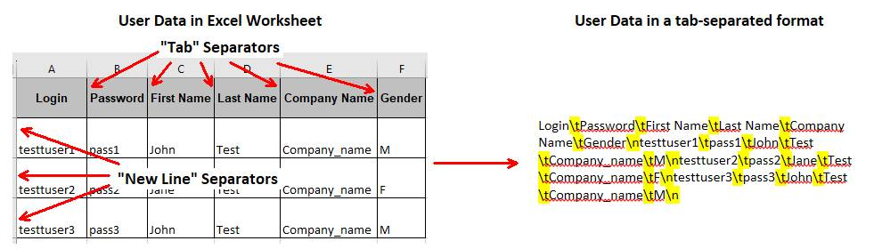
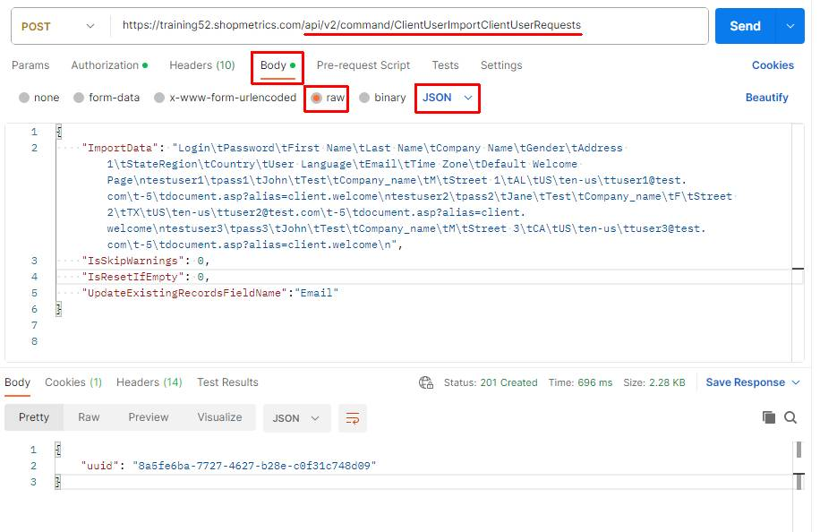
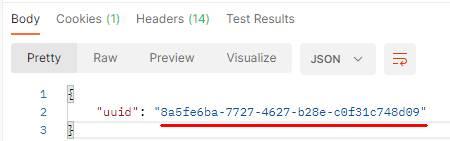
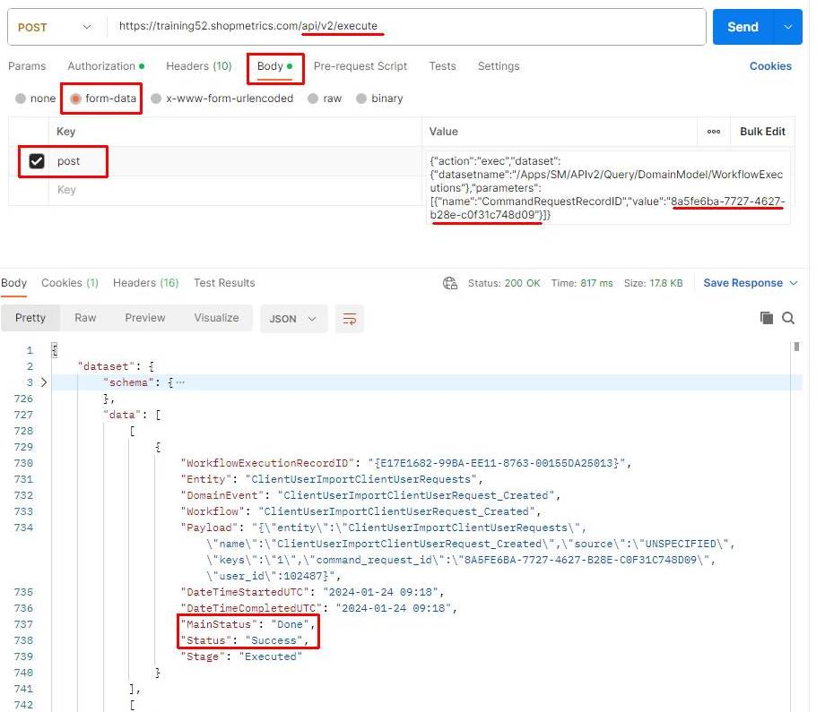
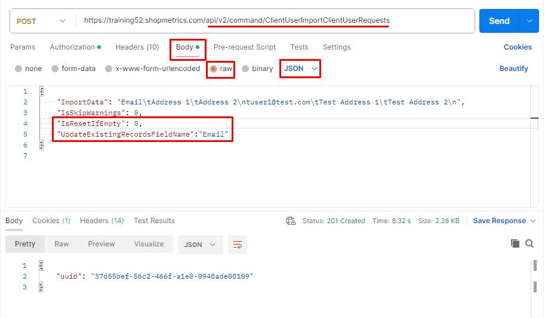
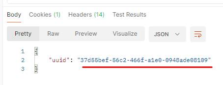
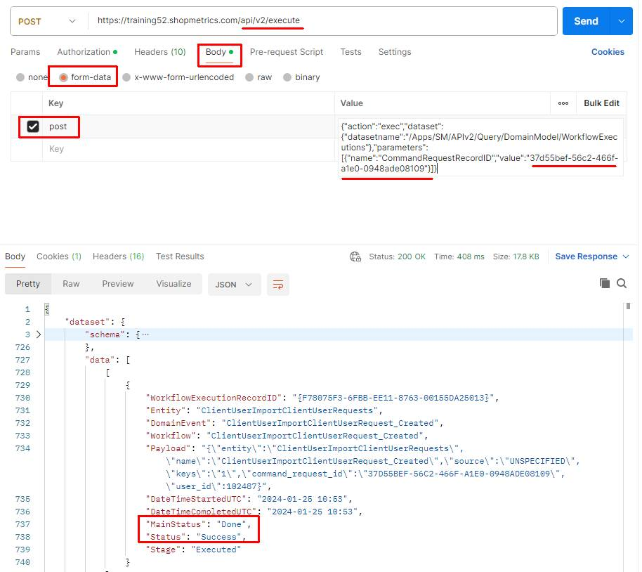
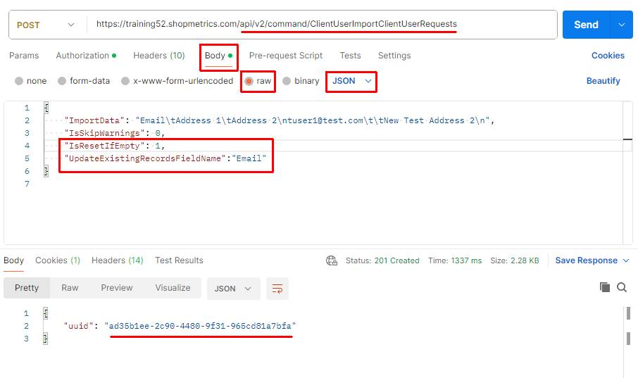
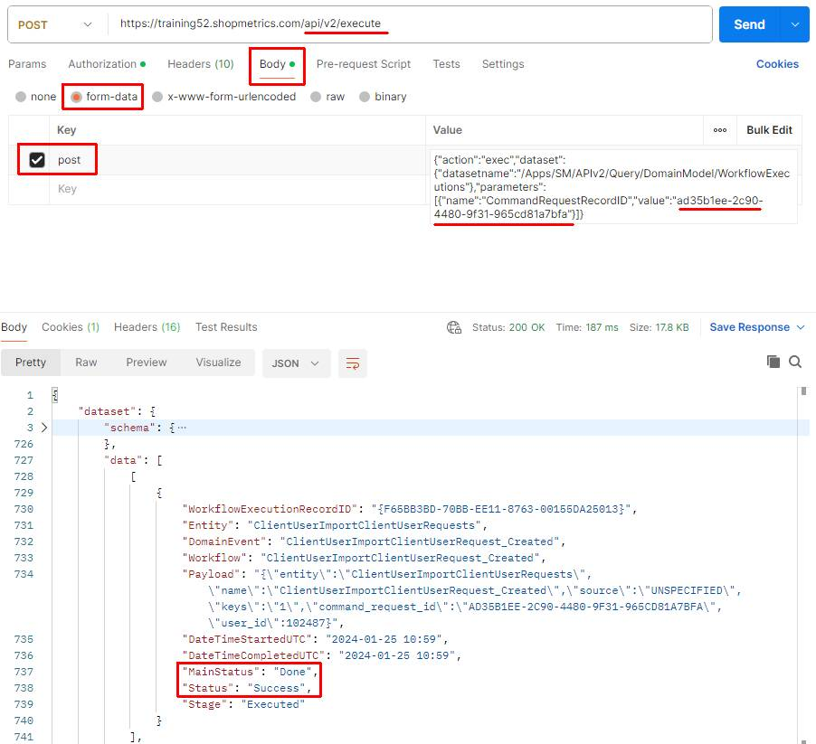

# Use Case: Import Client Users via Import Command Request

Last Modified: 2025-06-27 | Code: APICUCR

This document provides an example of how a Shopmetrics Command API is used to perform changes in the Data Model, related to User entities. These modifications are executed through an asynchronous operation, initiated by a Command Request.

Command Requests involve contacting Command API Resources, yielding only a Request ID. This ID can then be supplied as a parameter to a Query API resource, enabling verification and retrieval of the request status.

## User Access Setup

To be able to use the Import Command Request successfully, the user executing the request should have the following security settings in the Shopmetrics system:

- Membership in the "**User Profiles - Restricted"** security role  
  **Note:** The membership of the role can also be inherited

For more information about granting restricted access to the system refer to the article "**Grant Restricted Access to the System**" (short code: **GRAS**).

For more information about the Client Credentials and API Authorization you can refer to the article “**API Authorization**” (short code: **APIAUT**)

## Command Request Format

You can import client users by executing a request to the **following endpoint**:  
**/api/v2/command/ClientUserImportClientUserRequests**

The request should be written in the following JSON format:

{

    "ImportData": *"The data for the client users you want to import. The data should have specific line and column separators (for more information see section “Import Data Format")*,  
    "IsSkipWarnings": 0,  
    "IsResetIfEmpty": 0,  
    "UpdateExistingRecordsFieldName":"*Here you can specify one of the following values: Login or Email.*"

}

## Import Data Format

The client user data for import should be formatted in a tab-separated format. The following separators should be used accordingly:

- A “new line” should be represented with **\n**
- A “tab” should be represented with **\t**

On the screenshot below you can see an example of Excel worksheet, containing user data for import and how the same data is formatted in a tab-separated format:

## Client User Import Data Fields

In the table below you can find the object names and short descriptions of all Client User Import Data Fields that can be used when importing client user data:

| **Field Object Name** | **Description** | **Is Required** |
| --- | --- | --- |
| Login | The Login for the User. The value for this field should not include spaces, dots, pluses, dashes. | No |
| Password | The Password for the User. | No |
| FirstName | The First Name of the user. This field is **always required.** | **Yes** |
| LastName | The Last Name of the user. This field is **always required.** | **Yes** |
| CompanyName | The User Company Name | No |
| Gender | The Gender of the User. This field is **always required.** | **Yes** |
| Address1 | The physical address of the user. | No |
| Address2 | The second line of the address (if needed), i.e., Suite 107 | No |
| City | The City where the user resides. | No |
| StateRegion | The State or the Region where the user resides.  **NOTE: The value of this field should be a two-letter State/Region code according to the International Organization for Standardization (ISO) standard.** | No |
| Country | The country where the user resides.  **NOTE: The value of this field should be the Alpha-2 code of the Country, according to the ISO-3166 standard.** | No |
| UserLanguage | The value for this field should be a valid language code according to the ISO 639-1 standard. | No |
| PostalCode | Be sure postal codes are entered in the appropriate ISO format for the user country/region. | No |
| PhoneHome | A valid phone number. | No |
| PhoneWork | A valid phone number. | No |
| PhoneMobile | A valid phone number. | No |
| Email | The User Email address. This field is **always required.** | **Yes** |
| TimeZone | The Time Zone in which the User resides. The value of this field should be a number of hours offset from GMT. | No |
| DefaultWelcomePage | Valid Format: document.asp?alias=\*\*\*Alias\*\*\*  Replace \*\*\*Alias\*\*\* with the name of the alias. For e.g. document.asp?alias=client.welcome | No |
| AccountDisabled | A new user account is marked as **Active by default.**  Here you can explicitly set one of the following values:   - **Y** -The user account will be marked as **Disabled** - **N** -The user account will be marked as **Active** | No |

**NOTE: The field object names in the table above can be specified with either spaced or unspaced conventions. For instance, "First Name" and "FirstName" are both valid formats.**

## Import Client Users

The process of importing client users includes the following steps:

1. Executing the Import Command Request which generates a Request ID
2. Using the generated Request ID to check the status of the request. This is done via the /Apps/SM/APIv2/Query/DomainModel/WorkflowExecutions query API resource

### Postman Example

The content of the JSON formatted request:

{

    "ImportData": "Login\tPassword\tFirst Name\tLast Name\tCompany Name\tGender\tAddress 1\tStateRegion\tCountry\tUser Language\tEmail\tTime Zone\tDefault Welcome Page\ntestuser1\tpass1\tJohn\tTest\tCompany\_name\tM\tStreet 1\tAL\tUS\ten-us\ttuser1@test.com\t-5\tdocument.asp?alias=client.welcome\ntestuser2\tpass2\tJane\tTest\tCompany\_name\tF\tStreet 2\tTX\tUS\ten-us\ttuser2@test.com\t-5\tdocument.asp?alias=client.welcome\ntestuser3\tpass3\tJohn\tTest\tCompany\_name\tM\tStreet 3\tCA\tUS\ten-us\ttuser3@test.com\t-5\tdocument.asp?alias=client.welcome\n",  
    "IsSkipWarnings": 0,  
    "IsResetIfEmpty": 0,  
    "UpdateExistingRecordsFieldName":"Email"

}

**Step 1** – execute the Import Command Request. The request should be sent to the **following API endpoint**: **/api/v2/command/ClientUserImportClientUserRequests**  
The Import Command Request generates a unique Request ID which will be used in Step 2:  

**Step 2** – copy the generated Request ID and use the **/Apps/SM/APIv2/Query/DomainModel/WorkflowExecutions** API query resource to check the status of the request.

The content for the “post” parameter in Body:

{"action":"exec","dataset":{"datasetname":"/Apps/SM/APIv2/Query/DomainModel/WorkflowExecutions"},"parameters":[{"name":"CommandRequestRecordID","value":"**8a5fe6ba-7727-4627-b28e-c0f31c748d09**"}]}  

## Update Client Users

You can update existing Client Users providing the following Client User Import Data Fields:

- Existing Client User Login **or** Email - **required field**
- The Client User Import Data Fields you want to update

The process of updating client users includes the following steps:

1. Executing the Import Command Request which generates a Request ID
2. Using the generated Request ID to check the status of the request. This is done via the /Apps/SM/APIv2/Query/DomainModel/WorkflowExecutions query API resource

### Postman Example

The following examples demonstrate updates to an **existing**Client User Import Data Fields (Address 1 and Address 2) using Email for the required field.

**NOTE: If the "IsResetIfEmpty" flag is set to 1, any field within the "ImportData" field that does not have a corresponding value in the request will be reset. Text fields without a value will be set to an empty string or NULL, and date or numeric fields will be set to NULL. However, this doesn't apply to the "Login", "Password", "First Name", "Last Name", "Gender", and "Email" fields. These fields cannot be reset.**

#### IsResetIfEmpty: 0

The content of the JSON formatted request:

{

    "ImportData": "**Email**\tAddress 1\tAddress 2\ntuser1@test.com\tTest Address 1\tTest Address 2\n",  
    "IsSkipWarnings": 0,  
**"IsResetIfEmpty": 0,**  
**"UpdateExistingRecordsFieldName":"Email"**

}

After executing the above request for the **existing****user**with email tuser1@test.com:

- The field Address 1 will have a value of **Test Address 1**
- The field Address 2 will have a value of **Test Address 2**

**Step 1** – execute the Import Command Request. The request should be sent to the **following API endpoint**: **/api/v2/command/ClientUserImportClientUserRequests**  

The Import Command Request generates a unique Request ID which will be used in Step 2:  

**Step 2** – copy the generated Request ID and use the **/Apps/SM/APIv2/Query/DomainModel/WorkflowExecutions** API query resource to check the status of the request.

The content for the “post” parameter in Body:

{"action":"exec","dataset":{"datasetname":"/Apps/SM/APIv2/Query/DomainModel/WorkflowExecutions"},"parameters":[{"name":"CommandRequestRecordID","value":"**37d55bef-56c2-466f-a1e0-0948ade08109**"}]}  

#### IsResetIfEmpty: 1

The content of the JSON formatted request:

{

    "ImportData": "**Email**\tAddress 1\tAddress 2\ntuser1@test.com\t\tNew Test Address 2\n",  
    "IsSkipWarnings": 0,  
**"IsResetIfEmpty": 1,**  
**"UpdateExistingRecordsFieldName":"Email"**

}

After executing the above request for the **existing user** with email tuser1@test.com:

- The **value**for field Address 1 **will be reset** (empty or NULL)
- The field Address 2 will have a value of **New Test Address 2**

**Step 1** – execute the Import Command Request. The request should be sent to the **following API endpoint**: **/api/v2/command/ClientUserImportClientUserRequests**  

**Step 2** – copy the generated Request ID and use the **/Apps/SM/APIv2/Query/DomainModel/WorkflowExecutions** API query resource to check the status of the request.

The content for the “post” parameter in Body:

{"action":"exec","dataset":{"datasetname":"/Apps/SM/APIv2/Query/DomainModel/WorkflowExecutions"},"parameters":[{"name":"CommandRequestRecordID","value":"**ad35b1ee-2c90-4480-9f31-965cd81a7bfa**"}]}  

