# Use Case: Import Fieldworkers via Import Command Request

Last Modified: 2026-04-17 | Code: APIFWCR

This article illustrates the use of a Shopmetrics Command API for making alterations to the Data Model related to User entities. These changes are executed through an asynchronous operation, triggered by a Command Request.

Command Requests are made to the Command API Resources, which respond with only a Request ID. You can use this ID with a Query API resource to check and get the status of your request.

## User Access Setup

To be able to use the Import Command Request successfully, the user executing the request should have the following security settings in the Shopmetrics system:

- Membership in the "**User Profiles - Restricted**" security role  
  **Note:** The membership of the role can also be inherited

For more information about granting restricted access to the system refer to the article "**Grant Restricted Access to the System**" (short code: **GRAS**).

For more information about the Client Credentials and API Authorization you can refer to the article “**API Authorization**” (short code: **APIAUT**)

## Command Request Format

You can import fieldworkers by executing a request to the **following endpoint**:

**/api/v2/command/FieldworkerImportFieldworkerRequests**

The request should be written in the following JSON format:

{

    "ImportData": "*The data for the fieldworkers you want to import. The data should have specific line and column separators (for more information see section “Import Data Format"*),

    "IsSkipWarnings": 0,

    "IsResetIfEmpty": 0,

    "IsSendLoginDetails": "*This setting is optional. Here you can set one of the following values: 0 or 1. For more information see section "IsSendLoginDetails Setting*"",

    "UpdateExistingRecordsFieldName": "*Here you can specify one of the following values: Login or Email.*",

    "IsICAgreementRequiredForNewAccounts": "*This setting is optional. Here you can set one of the following values: 0 or 1. For more information see section "IsICAgreementRequiredForNewAccounts"*",

    "IsICAgreementRenewalRequiredForExistingAccounts": "*This setting is optional. Here you can set one of the following values: 0 or 1. For more information see section "IsICAgreementRenewalRequiredForExistingAccounts"*"

}

### "IsResetIfEmpty" Setting

The "IsResetIfEmpty" setting determines how the system handles empty fields in your import data (*fields, included in the "ImportData" field that do not have corresponding values in the request*), offering a way to manage updates to fieldworker profiles thoughtfully. Here's a breakdown of its functionality:

- Set to **1** (Yes): If a field in your import data is empty, the system will clear (reset) that fieldworker's information for the corresponding field. If the field contains data, the system updates the fieldworker's information normally; the "IsResetIfEmpty" setting does not affect fields with provided data.  
  **NOTE: The option to reset data is not applicable for the fields "Login", "Password", "HireStatus" and the required profile fields (more information about the required profile fields you can find in the section "Fieldworker Import Data Fields").**
- Set to **0** (No): The system retains the existing information for all fields in the "ImportData" field that do not have corresponding values in the request. This ensures that no fieldworker information is accidentally deleted.

Additionally, if a field is not included in the import data, the system will ignore this field, regardless of the "IsResetIfEmpty" setting. This means that you can choose which fieldworker information to update or leave unchanged by including or omitting fields in your import data.

This setting is crucial for ensuring that user data is updated accurately and according to your intentions. It allows for the precise control of information that needs to be cleared, updated, or maintained, ensuring a high degree of flexibility and safety in managing bulk user data.

### "IsSendLoginDetails" Setting

The "IsSendLoginDetails" setting determines if an email with account information will be sent to fieldworkers imported via the Import Command Request. Here is a brief overview of its functionality:

- Set to **1**: Emails containing account information will be sent automatically to all fieldworkers imported through the Import Command Request.  
  **NOTE: Setting "IsSendLoginDetails" to "1" cannot be used when updating existing fieldworkers via the Import Command Request. If the Import Data includes fieldworkers for update and "IsSendLoginDetails" is set to "1", the Import Command Request will generate an error and will not be executed.**
- Set to **0**: No emails will be sent. This is useful if you prefer to distribute account details through other methods.

This setting lets you control how account information is sent, offering a choice between automated and manual processes.

### "IsICAgreementRequiredForNewAccounts" Setting

The "IsICAgreementRequiredForNewAccounts" setting determines whether newly created fieldworker accounts must sign the Independent Contractor (IC) Agreement after being imported via the Import Command Request. Here is a brief overview of its functionality:

- Set to **1**: All new fieldworkers whose accounts are successfully created by the Import Command Request will be prompted to review and sign the IC Agreement on their first login.
- Set to **0**: No IC Agreement prompt is shown for newly created fieldworkers.

This setting helps you enforce IC Agreement acceptance during onboarding for accounts created by the Import Command Request.

### "IsICAgreementRenewalRequiredForExistingAccounts" Setting

The "IsICAgreementRenewalRequiredForExistingAccounts" setting determines whether existing fieldworkers included in the Import Command Request will be required to re-sign the IC Agreement. Here is a brief overview of its functionality:

- Set to **1**: All existing fieldworkers whose records are successfully updated by the Import Command Request will be prompted to review and sign the IC Agreement on their next login.
- Set to **0**: No IC Agreement prompt will be triggered for existing fieldworkers updated by the Import Command Request.

This setting lets you require IC Agreement acceptance for existing accounts as part of an update process.

## Import Data Format

The fieldworker data for import should be formatted in a tab-separated format. The following separators should be used accordingly:

- A “new line” should be represented with **\n**
- A “tab” should be represented with **\t**

On the screenshot below you can see an example of Excel worksheet, containing user (fieldworker) data for import and how the same data is formatted in a tab-separated format:

## Fieldworker Import Data Fields

### Fieldworker Profile Import Data Fields

The table below lists the object names and brief descriptions of all available Fieldworker Profile Import Data Fields for importing fieldworker data:

| **Field Object Name** | **Description** | **Is Required** |
| --- | --- | --- |
| Login | The Login for the Fieldworker. The value for this field should not include spaces, dots, pluses, dashes. | No |
| Password | The Password for the Fieldworker. | No |
| FirstName | The First Name of the fieldworker. This field is **always required**. | **Yes** |
| LastName | The Last Name of the fieldworker. This field is **always required**. | **Yes** |
| CompanyName | The Fieldworker Company Name. | No |
| Gender | The Gender of the Fieldworker. This field is **always required.** | **Yes** |
| Address1 | The physical address of the fieldworker. | No |
| Address2 | The second line of the address (if needed), i.e., Suite 107 | No |
| City | The City where the fieldworker resides. | No |
| State/Region | The State or the Region where the fieldworker resides.  This field is **required only if PostalCode is NOT specified**.  **NOTE: The value of this field should be a two-letter State/Region code according to the International Organization for Standardization (ISO) standard.** | **Yes, only if**  **PostalCode is NOT specified** |
| Country | The country where the fieldworker resides. This field is **always required**.  **NOTE: The value of this field should be the Alpha-2 code of the Country, according to the ISO-3166 standard.** | **Yes** |
| UserLanguage | The value for this field should be a valid language code according to the ISO 639-1 standard. | No |
| PostalCode | Be sure postal codes are entered in the appropriate ISO format for the fieldworker country/region.  This field is **required only if State/Region is NOT specified**. | **Yes, only if**  **State/Region is NOT specified** |
| HomeLocationLatitude | The Latitude of the Fieldworker Home Location. | No |
| HomeLocationLongitude | The Longitude of the Fieldworker Home Location. | No |
| PhoneHome | A valid phone number. | No |
| PhoneWork | A valid phone number. | No |
| PhoneMobile | A valid phone number. | No |
| Email | The Fieldworker Email address. This field is **always required.** | **Yes** |
| TimeZone | The Time Zone in which the fieldworker resides. The value of this field should be a number of hours offset from GMT.  If not provided, the default website-specific value will be applied. | No |
| DateOfBirth | Valid format: YYYY-MM-DD. This field is **always required**. | **Yes** |
| TaxIDType | You can specify one of the following values:   - **EIN**- Employer Identification Number - **SSN**- Social Security Number | No |
| TaxID | A valid Tax ID, depending on the value specified for Tax ID Type.  This field i**s required only if Tax ID Type is specified**. | **Yes, only if TaxIDType is specified** |
| MSPACertification | You can specify one of the following values:   - **Gold** - **Silver** - **Not Certified** | No |
| MSPACert.ID | A valid MSPA Certification ID. | No |
| DistanceWillingtoTravel | Here you can specify the maximum number of miles or kilometers a fieldworker is willing to travel.  If not provided the default value for this field is '**15**' miles. | No |
| DistanceWillingtoTravelUnits | Determines the measurement unit (miles or kilometers), used for the value specified in the DistanceWillingtoTravel field.  Accepted values for **kilometers**:   - k - km - kilometer - kilometre - kilometers - kilometres   Accepted values for **miles**:   - m - mi - mile - miles   If not provided the **default measurement unit is miles**. | No |
| AdditionalComments | Any additional comments. | No |
| HireStatus | You can specify one of the following values:   - **Hire** - **Do Not Hire**   If not provided the default value for this field is '**Hire**'. | No |
| AccountDisabled | You can set one of the following values:   - **Y**- The fieldworker account will be marked as **Disabled** - **N**- The fieldworker account will be marked as **Active**  If not provided the default value for this field is "**N**". | No |

**NOTE: The field object names in the table above can be specified with either spaced or unspaced conventions. For instance, "FirstName" and "First Name" are both valid formats.**

### Fieldworker Extended Profile Import Data Fields

The Fieldworkers Import Command Request allows you to import Extended Profile data for fieldworkers. To use this feature, ensure you have the following:

- An active Extended Profile form on your website
- **Object names defined** for the **questions** in the Extended Profile form
- **Object names defined** for the question **answers** in the Extended Profile form

**NOTE: We recommend using 'EP\_' at the beginning of all Extended Profile Question Object Names to prevent conflicts with standard system object names.**

For more information on how to set object names for V2 Survey Forms you can refer to the article "**How to Add/Edit Question Object Names in V2 Survey Forms**", short code: **ONV2**.

To import fieldworkers Extended Profile data via the Command Request you have to:

- Add the Extended Profile Import Data Fields after the Fieldworker Profile Import Data Fields.
- When specifying object names for Extended Profile Import Data Fields, use the corresponding question and answer object names from your Extended Profile Survey Form.

**NOTE: The Fieldworkers Import Command Request does NOT validate required questions or enforce comment content rules set in the Extended Profile form. This means the Import will not produce an error if you do not import data for required questions in the Extended Profile survey instance, or if you import data that does not satisfy comment content rules set for questions.**

**NOTE: Importing Extended Profile data via the Fieldworkers Import Command Request does NOT trigger any Skips or Triggers defined in the Extended Profile form. This means that any conditional logic will not be applied during the import process.**

The table below provides examples of how to construct Field Object Names for Extended Profile Import Data Fields based on common question types in an Extended Profile form:

| Extended Profile Question type | Extended Profile Field Object Name | Description |
| --- | --- | --- |
| Question Comment | The **unique object name of the question** for which data is being imported. | Used for importing specific data (time, date, text or numeric) for a question within the Extended Profile survey. |
| Categorical | A combination of the question object name and its corresponding answer object name, denoted as **[QuestionObjectName].[AnswerObjectName**]  Possible Values:   - **TRUE**- the answer is selected - **FALSE**- the answer remains unselected or is deselected if it was previously selected. | Used to denote the selection or deselection of a specific answer option for a question in the Extended Profile survey.  When **selecting an answer** you should note the following regarding the Categorical Question type:   - **Single Selection Question**: If a different answer is selected, the previous selection is automatically deselected. - **Multiple Selection Question**: If a different answer is selected, the previous selections remain unchanged. |

## Import Fieldworkers

The process of importing fieldworkers includes the following steps:

1. Executing the Import Command Request which generates a Request ID
2. Using the generated Request ID to check the status of the request. This is done via the /Apps/SM/APIv2/Query/DomainModel/WorkflowExecutions query API resource

### Postman Example

The content of the JSON formatted request:

{

    "ImportData": "Login\tPassword\tFirst Name\tLast Name\tGender\tCompany Name\tAddress 1\tCity\tState/Region\tCountry\tUser Language\tEmail\tTime Zone\tDate Of Birth\tDistance Willing to Travel\ntestshopper1\tpass1\tJonh\tTest\tM\tAcme Corp\t123 Test Address\tToledo\tOH\tUS\ten-us\ttestshopper1@test.com\t-5\t1985-07-13\t75\n",

    "IsSkipWarnings": 0,

    "IsResetIfEmpty": 0,

    "UpdateExistingRecordsFieldName":"Email"

}

**Step 1** – execute the Import Command Request. The request should be sent to the **following API endpoint**: **/api/v2/command/FieldworkerImportFieldworkerRequests**

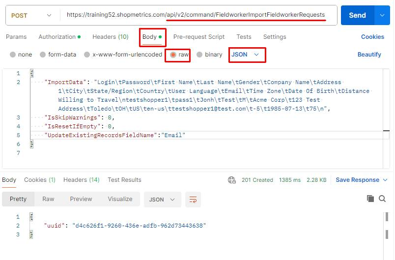

The Import Command Request generates a unique Request ID which will be used in Step 2:

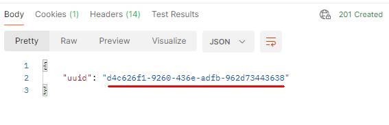

**Step 2** – copy the generated Request ID and use the **/Apps/SM/APIv2/Query/DomainModel/WorkflowExecutions** API query resource to check the status of the request.

The content for the “post” parameter in Body:

{"action":"exec","dataset":{"datasetname":"/Apps/SM/APIv2/Query/DomainModel/WorkflowExecutions"},"parameters":[{"name":"CommandRequestRecordID","value":"**d4c626f1-9260-436e-adfb-962d73443638**"}]}

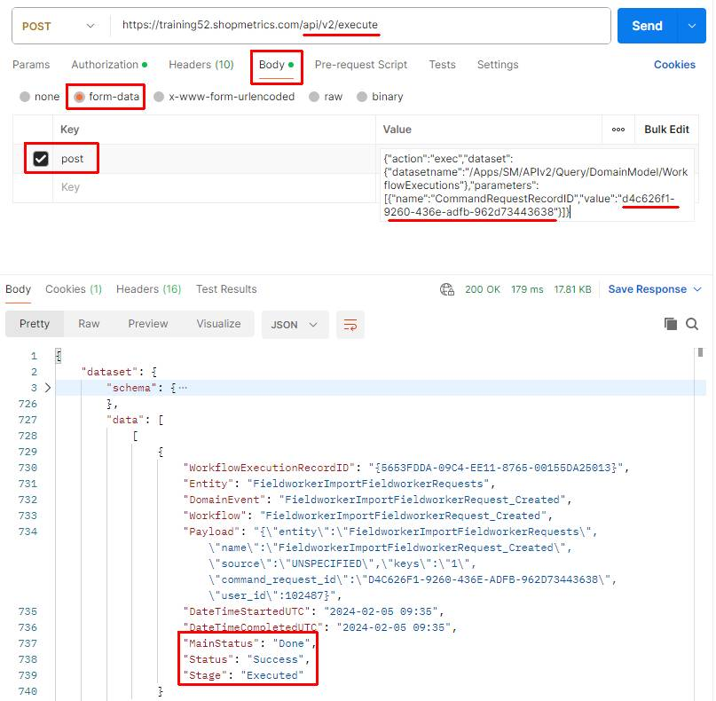

## Update Fieldworkers

You can update **existing** Fieldworkers providing the following Fieldworker Import Data Fields:

- Existing Fieldworker Login **or** Email - **required field**
- The Fieldworker Import Data Fields you want to update

The process of updating fieldworkers includes the following steps:

1. Executing the Import Command Request which generates a Request ID
2. Using the generated Request ID to check the status of the request. This is done via the /Apps/SM/APIv2/Query/DomainModel/WorkflowExecutions query API resource

### Postman Example

The following examples demonstrate updates to an **existing** Fieldworker Import Data Fields (City, State/Region and Country) using Email for the required field.

#### IsResetIfEmpty: 0

The content of the JSON formatted request:

{

    "ImportData": "**Email**\tCity\tState/Region\tCountry\ntestshopper1@test.com\tPortland\tOR\tUS\n",

    "IsSkipWarnings": 0,

**"IsResetIfEmpty": 0,**

**"UpdateExistingRecordsFieldName":"Email"**

}

After executing the above request for the **existing fieldworker**with email testshopper1@test.com:

- The field City will have a value of **Portland**
- The field State/Region will have a value of **OR**
- The field Country will have a value of **US**

**Step 1** – execute the Import Command Request. The request should be sent to the following API endpoint: **/api/v2/command/FieldworkerImportFieldworkerRequests**

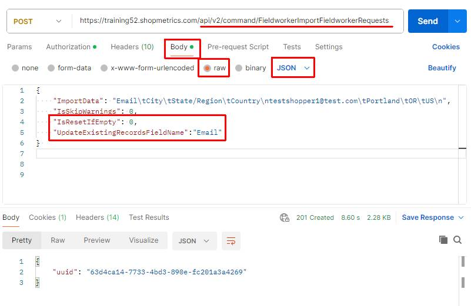

The Import Command Request generates a unique Request ID which will be used in Step 2:

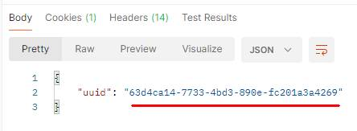

**Step 2** – copy the generated Request ID and use the **/Apps/SM/APIv2/Query/DomainModel/WorkflowExecutions** API query resource to check the status of the request.

The content for the “post” parameter in Body:

{"action":"exec","dataset":{"datasetname":"/Apps/SM/APIv2/Query/DomainModel/WorkflowExecutions"},"parameters":[{"name":"CommandRequestRecordID","value":"**63d4ca14-7733-4bd3-890e-fc201a3a4269**"}]}

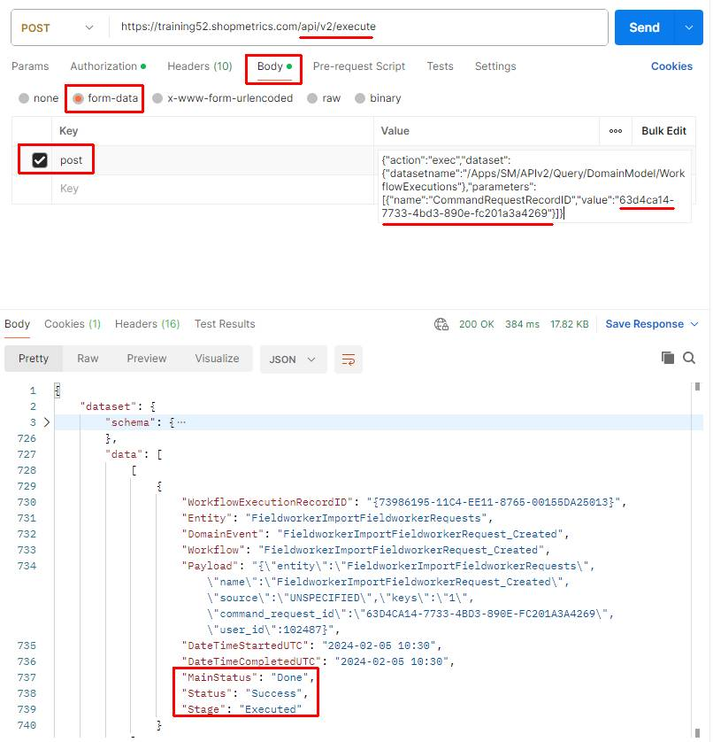

#### IsResetIfEmpty: 1

The content of the JSON formatted request:

{

    "ImportData": "**Email**\tCity\tState/Region\tCountry\ntestshopper1@test.com\t\tOH\tUS\n",

    "IsSkipWarnings": 0,

**"IsResetIfEmpty": 1,**

**"UpdateExistingRecordsFieldName":"Email"**

}

After executing the above request for the **existing fieldworker** with email testshopper1@test.com:

- The **value**for field City**will be reset** (empty or NULL)
- The field State/Region will have a value of **OH**
- The field Country will have a value of **US**

**Step 1** – execute the Import Command Request. The request should be sent to the following API endpoint: **/api/v2/command/FieldworkerImportFieldworkerRequests**

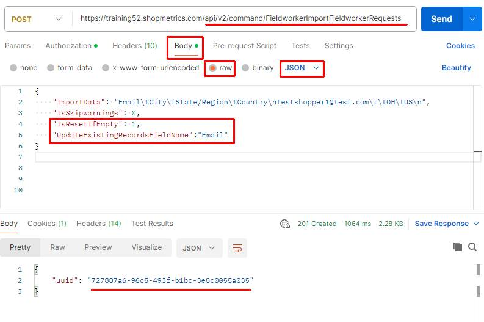

**Step 2** – copy the generated Request ID and use the **/Apps/SM/APIv2/Query/DomainModel/WorkflowExecutions** API query resource to check the status of the request.

The content for the “post” parameter in Body:

{"action":"exec","dataset":{"datasetname":"/Apps/SM/APIv2/Query/DomainModel/WorkflowExecutions"},"parameters":[{"name":"CommandRequestRecordID","value":"**727887a6-96c5-493f-b1bc-3e8c0055a035**"}]}

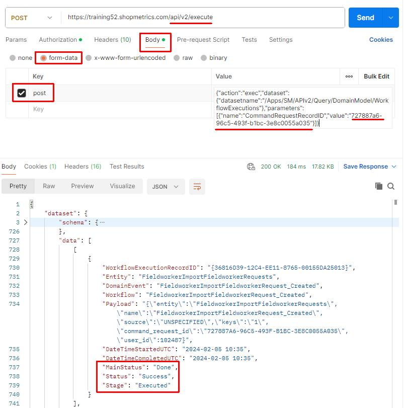

## Import Fieldworkers Extended Profile

The process of importing fieldworkers with Extended Profile data includes the following steps:

1. Executing the Import Command Request which generates a Request ID
2. Using the generated Request ID to check the status of the request via the /Apps/SM/APIv2/Query/DomainModel/WorkflowExecutions query API resource

The following examples in this section are based on a sample Extended Profile form, with question and answer object names defined in the Extended Survey View (as shown below):

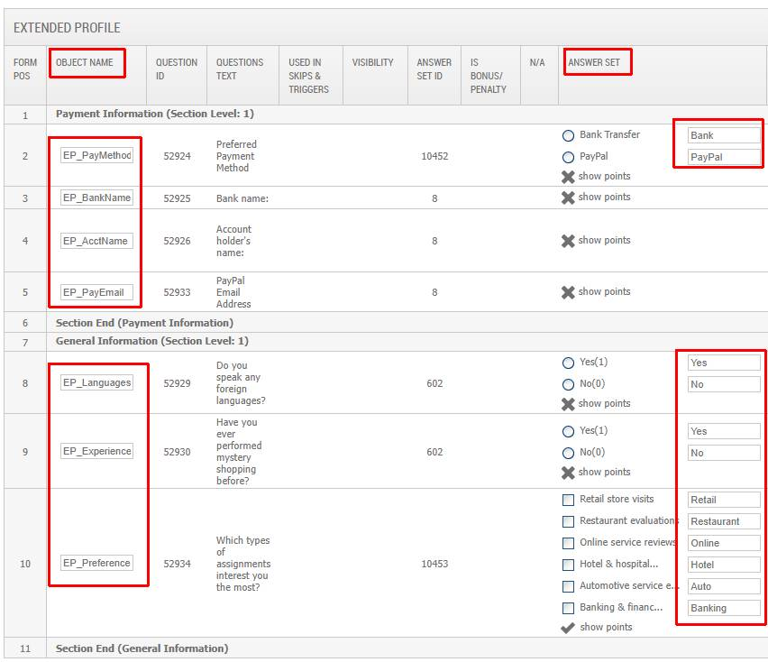

### Import New Fieldworkers with Extended Profile

#### Postman Example

The content of the JSON formatted request (the **Extended Profile Import Data Fields** are added after the Fieldworker Profile Import Data Fields):

{

  "ImportData": "Login\tPassword\tFirst Name\tLast Name\tGender\tState/Region\tCountry\tEmail\tDate Of Birth\tDistance Willing to Travel\t**EP\_PayMethod.Bank\tEP\_BankName\tEP\_AcctName\tEP\_Languages.Yes\tEP\_Languages\tEP\_Experience.No\tEP\_Preferences.Restaurant\tEP\_Preferences.Auto\tEP\_Preferences.Banking**\ntestshopper3\tpass1\tJonh\tTest\tM\tOH\tUS\ttestshopper3@test.com\t1985-07-01\t75\t**TRUE\tABCBank\tJohn Test\tTRUE\tSpanish, German\tTRUE\tTRUE\tTRUE\tTRUE**\n",

 "IsSkipWarnings": 0,

 "IsResetIfEmpty": 0,

 "UpdateExistingRecordsFieldName":"Email"

}

**Step 1** – execute the Import Command Request. The request should be sent to the following API endpoint: **/api/v2/command/FieldworkerImportFieldworkerRequests**

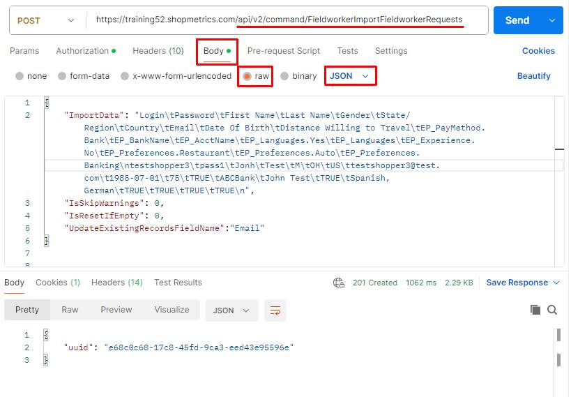

The Import Command Request generates a unique Request ID which will be used in Step 2:

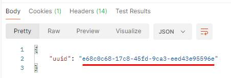

**Step 2** – copy the generated Request ID and use the **/Apps/SM/APIv2/Query/DomainModel/WorkflowExecutions** API query resource to check the status of the request.

The content for the “post” parameter in Body:

{"action":"exec","dataset":{"datasetname":"/Apps/SM/APIv2/Query/DomainModel/WorkflowExecutions"},"parameters":[{"name":"CommandRequestRecordID","value":"**e68c0c68-17c8-45fd-9ca3-eed43e95596e**"}]}

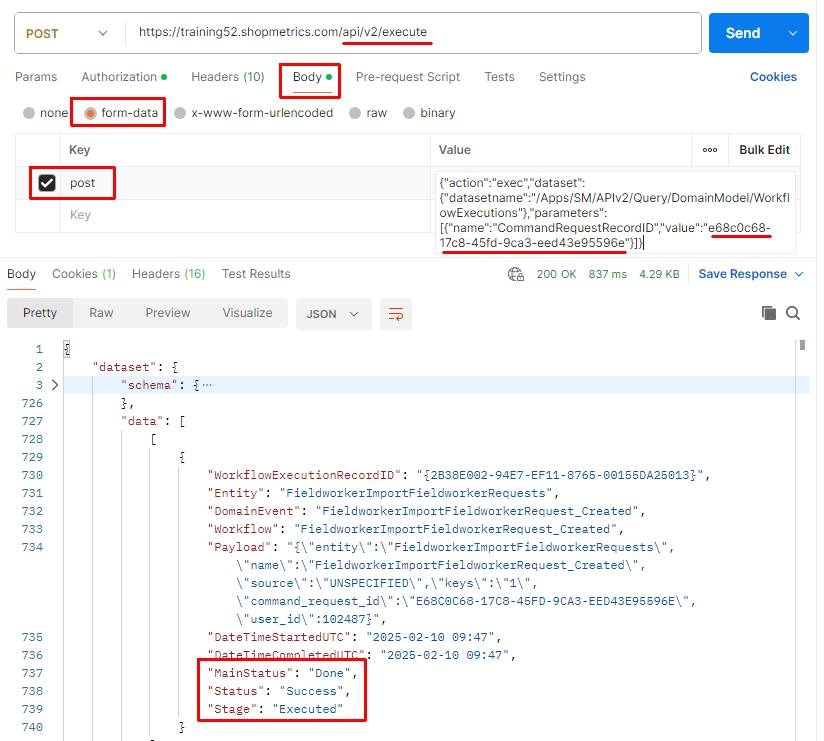

**Results**: The new fieldworker is imported successfully along with their Extended Profile data:

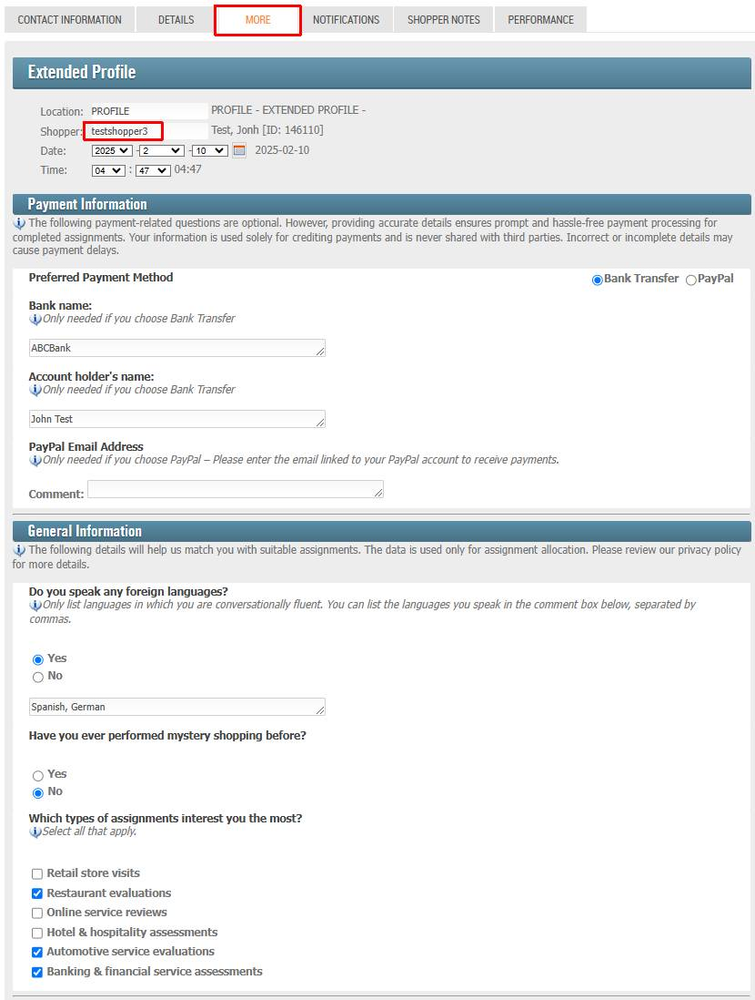

### Import Fieldworker Extended Profile for existing users

You can import Extended Profile data for **existing** fieldworkers providing the following Fieldworker Import Data Fields:

- Existing Fieldworker Login **or** Email - **required field**
- The Fieldworker Extended Profile Import Data Fields you want to import

#### Postman Example

The example below demonstrates the import of Fieldworker Extended Profile data to an **existing** fieldworker using "Login" for the required field.

The following fieldworker exists in the system but does not have Extended Profile data:

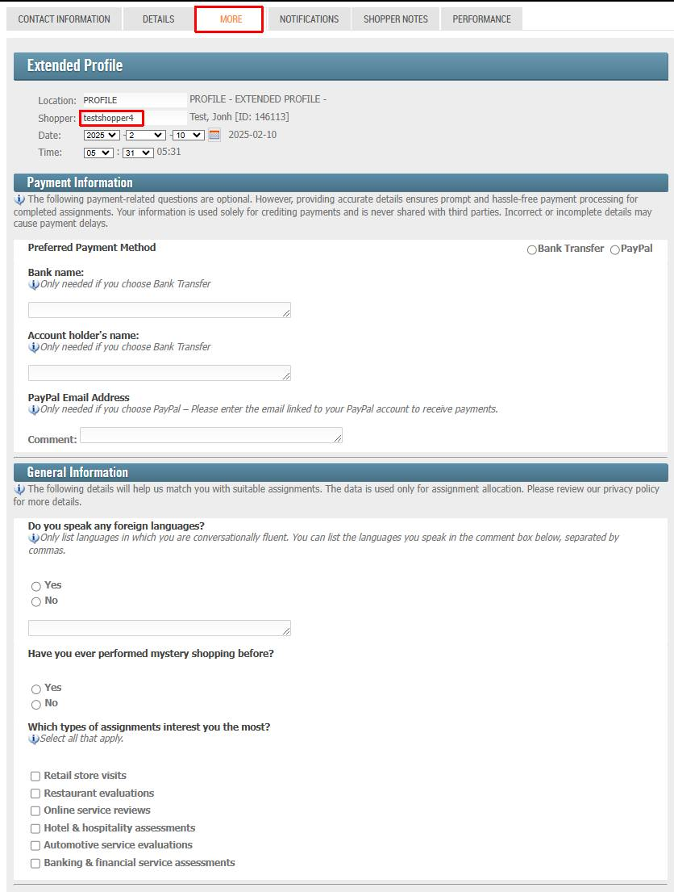

The content of the JSON formatted request:

{

    "ImportData":"**Login**\tEP\_PayMethod.PayPal\tEP\_PayEmail\tEP\_Languages.No\tEP\_Experience.Yes\tEP\_Preferences.Retail\tEP\_Preferences.Online\tEP\_Preferences.Hotel\ntestshopper4\tTRUE\tjtest4@test.com\tTRUE\tTRUE\tTRUE\tTRUE\tTRUE\n",

    "IsSkipWarnings": 0,

    "IsResetIfEmpty": 0,

    "**UpdateExistingRecordsFieldName":"Login"**

}

**Step 1** – execute the Import Command Request. The request should be sent to the following API endpoint: **/api/v2/command/FieldworkerImportFieldworkerRequests**

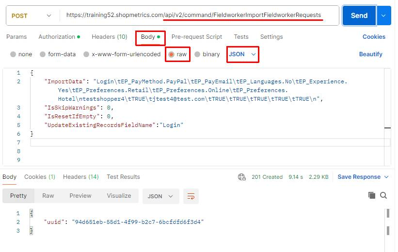

The Import Command Request generates a unique Request ID which will be used in Step 2:

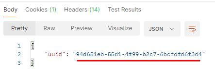

**Step 2** – copy the generated Request ID and use the **/Apps/SM/APIv2/Query/DomainModel/WorkflowExecutions** API query resource to check the status of the request.

The content for the “post” parameter in Body:

{"action":"exec","dataset":{"datasetname":"/Apps/SM/APIv2/Query/DomainModel/WorkflowExecutions"},"parameters":[{"name":"CommandRequestRecordID","value":"**94d651eb-55d1-4f99-b2c7-6bcfdfd6f3d4**"}]}

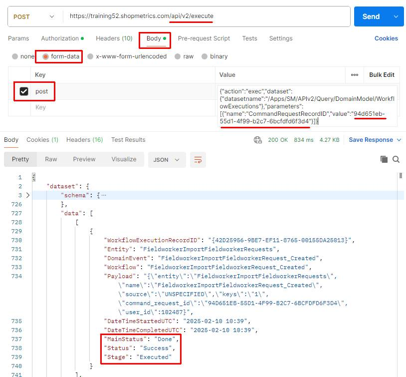

**Result**: The Extended Profile data for the fieldworker with login testshopper4 is successfully imported:

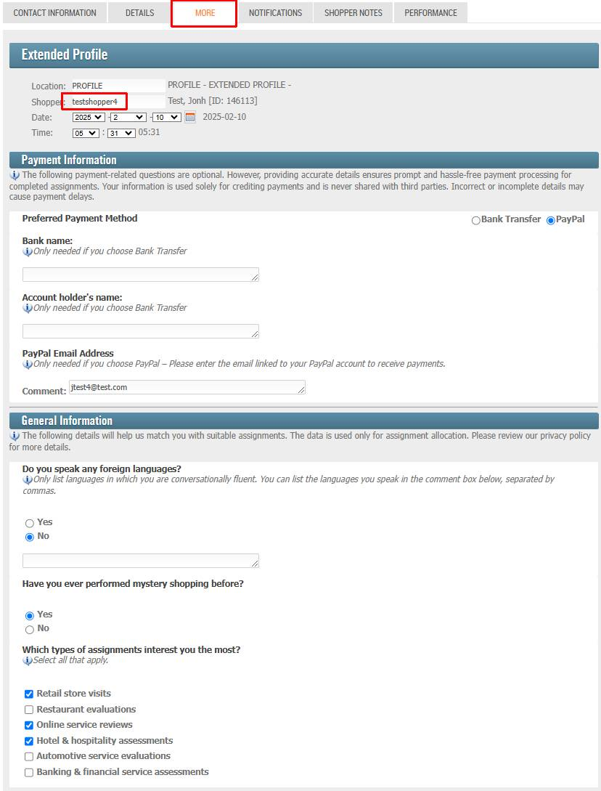
