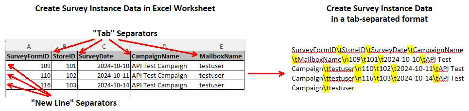
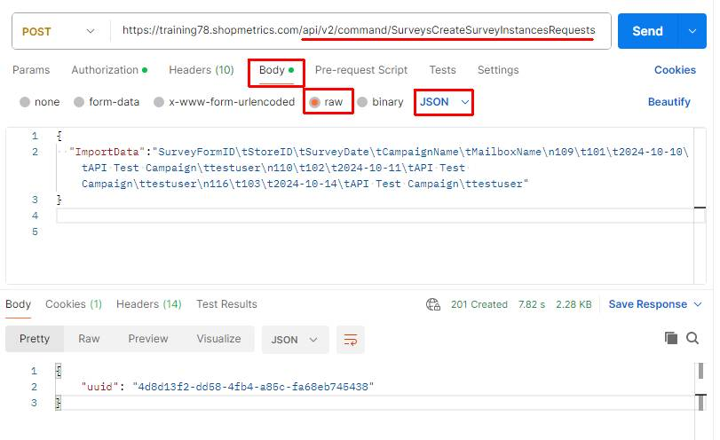
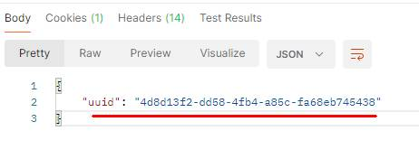
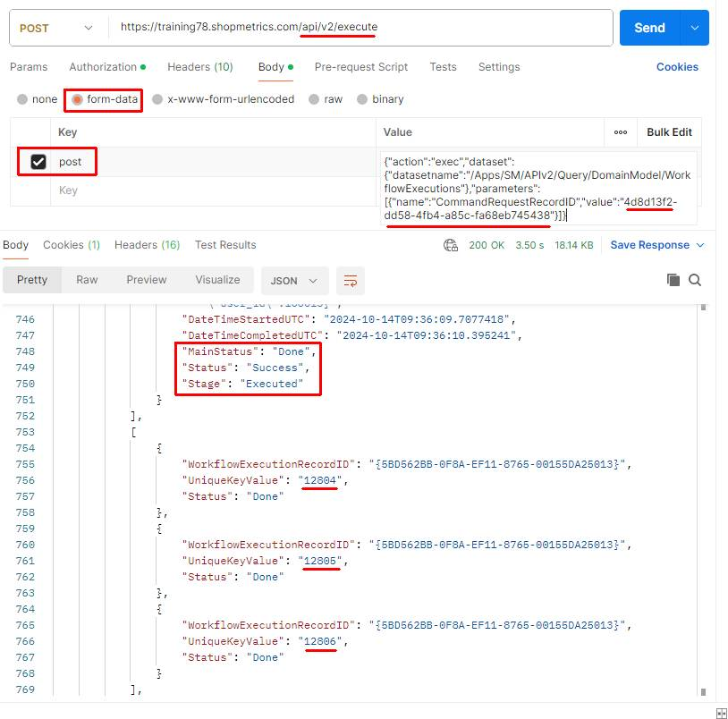

# Use Case: Create Survey Instances via Command API Request

Last Modified: 2026-03-27 | Code: APICICR

**NOTE: The Shopmetrics Command API described in this article works only with V3 survey forms.**

This article explains how to use the Shopmetrics Command API to create new survey instances by sending a Command Request. This approach uses the Command API to start creating the surveys as an asynchronous operation.

When you send a Command Request to the Command API Resources, you get a Request ID in return. You can use this ID with a Query API resource to check the status of your request, making it easy to track the creation of the survey instances.

**NOTE: Currently, any survey instance generated through the API Command Request will have a status of "Completed".**

## User Access Setup

To successfully use the Command Request for survey instance creation, the user should have the following security settings in the Shopmetrics system:

1. Be a member of the "Administrator - Restricted" security role.
2. Have access to the clients for which the new survey instances will be created.
3. Possess valid Client Credentials for API authorization.

For more information about granting restricted access to the system refer to the article "Grant Restricted Access to the System" (short code: **GRAS**).

For more information about the Client Credentials and API Authorization you can refer to the article “API Authorization” (short code: **APIAUT**).

## Command Request Format

You can create survey instances by executing a command request to the **f****ollowing API endpoint**: **/api/v2/command/SurveysCreateSurveyInstancesRequests**.

The request should be written in the following JSON format:

{

  "ImportData":"*The data for the survey instances you want to create. The data should be formatted in a tab-separated format (for more information see the section “Import Data Format”*)"

}

## Import Data Format

The data for creating the survey instances should be formatted using tab-separated values. Use the following separators accordingly:

- A “new line” should be represented with **\n**
- A “tab” should be represented with **\t**

In the screenshot below, you can see an example of an Excel worksheet containing data for creating survey instances, and how the same data is formatted in a tab-separated format:

## Create Survey Instance Data Fields

In the table below, you can find the object names and short descriptions of all Create Survey Instance Data Fields that can be used when creating survey instances:

| **Field Object Name** | **Description** | **Is Required** |
| --- | --- | --- |
| SurveyFormID | The ID of the Form from which a survey instance will be created. This field is **always required.** | **Yes** |
| StoreID | The Store ID of the Location for which a survey instance will be created. | **Yes** |
| SurveyDate | Survey date/time for the survey instance. This field is **always required.**ISO format is expected in either of the following formats:   - A date-only (YYYY-MM-DD) format - A date-time format (YYYY-MM-DD HH:MM:SS).   If the date-only format is used a UTC time of 12:00:00 AM (midnight) is assumed. | **Yes** |
| CampaignName | The Campaign name for the survey instance.  If not provided the survey instance will be created under 'N/A' Campaign. | No |
| MailboxName | The login of a fieldworker existing in the system. This field is **always required.** | **Yes** |
| IsScoreVerified | Controls the survey instance flag Score Verified. You can specify one of the following values:   - 0 - Score Verified will be set to 'No' - 1 - Score Verified will be set to 'Yes'   If not provided the default value for this field is '0'. | No |
| IsCommentsValidated | Controls the survey instance flag Comments Validated. You can specify one of the following values:   - 0 - Comments Validated will be set to 'No' - 1 - Comments Validated will be set to 'Yes'   If not provided the default value for this field is '0'. | No |
| IsHoldExport | Controls the survey instance flag Hold Export. You can specify one of the following values:   - 0 - Hold Export will be set to 'No' - 1 - Hold Export will be set to 'Yes'   If not provided the default value for this field is '0'. | No |
| IsOkForPayroll | Controls the survey instance flag OK for Payroll. You can specify one of the following values:   - 0 - OK for Payroll will be set to 'No' - 1 - OK for Payroll will be set to 'Yes'   If not provided the default value for this field is '0'. | No |
| IsHoldPayroll | Controls the survey instance flag Hold Payroll. You can specify one of the following values:   - 0 - Hold Payroll will be set to 'No' - 1 - Hold Payroll will be set to 'Yes'   If not provided the default value for this field is '0' | No |
| IsHoldInvoice | Controls the survey instance flag Hold Invoice. You can specify one of the following values:   - 0 - Hold Invoice will be set to 'No' - 1 - Hold Invoice will be set to 'Yes'   If not provided the default value for this field is '0' | No |
| IsOkForInvoice | Controls the survey instance flag OK for Invoice. You can specify one of the following values:   - 0 - OK for Invoice will be set to 'No' - 1 - OK for Invoice will be set to 'Yes'   If not provided the default value for this field is '0'. | No |
| ImportNote | An optional field for providing troubleshooting or contextual details related to the creation of the survey instance.   If a value is provided, a history event is created for the newly created survey instance that captures the ImportNote content.   **Note that the value of this field is restricted to 32 characters**. | No |

## Create Survey Instances

The process of creating survey instances includes the following steps:

1. Executing the Command Request for survey creation which generates a Request ID
2. Using the generated Request ID to check the status of the request. This is done via the /Apps/SM/APIv2/Query/DomainModel/WorkflowExecutions query API resource

### Postman Example

The content of the JSON formatted request:

{

  "ImportData":"SurveyFormID\tStoreID\tSurveyDate\tCampaignName\tMailboxName\n109\t101\t2024-10-10\tAPI Test Campaign\ttestuser\n110\t102\t2024-10-11\tAPI Test Campaign\ttestuser\n116\t103\t2024-10-14\tAPI Test Campaign\ttestuser"

}

**Step 1** – execute the Import Command Request. The request should be sent to the **following API endpoint**: **/api/v2/command/SurveysCreateSurveyInstancesRequests**.

The Import Command Request generates a unique Request ID which will be used in Step 2:

**Step 2** – copy the generated Request ID and use the **/Apps/SM/APIv2/Query/DomainModel/WorkflowExecutions** API query resource to check the status of the request.

The content for the “post” parameter in Body:

{"action":"exec","dataset":{"datasetname":"/Apps/SM/APIv2/Query/DomainModel/WorkflowExecutions"},"parameters":[{"name":"CommandRequestRecordID","value":"**4d8d13f2-dd58-4fb4-a85c-fa68eb745438**"}]}

In addition to providing the command request status, the "**/Apps/SM/APIv2/Query/DomainModel/WorkflowExecutions**" API query resource also returns the survey instance IDs for all surveys created by the executed command request:

