# Use Case: Import Survey Data for Existing Survey Instances via Import Command Request

Last Modified: 2026-01-06 | Code: APIIDCR

**NOTE: The Shopmetrics Command API described in this document works only with V3 survey forms.**

This article illustrates the use of a Shopmetrics Command API for making changes to the survey data of existing survey instances. These changes are executed through an asynchronous operation, triggered by a Command Request.

Command Requests are made to the Command API Resources, which respond with only a Request ID. You can use this ID with a Query API resource to check and get the status of the request.

## User Access Setup

To successfully use the Import Command Request, the user must have the following security settings in the Shopmetrics system:

1. Be a member of the "Administrator - Restricted" security role.
2. Have access to the clients whose survey instance data will be imported.
3. Possess valid Client Credentials for API authorization.

For more information about granting restricted access to the system refer to the article "Grant Restricted Access to the System" (short code: **GRAS**).

For more information about the Client Credentials and API Authorization you can refer to the article “API Authorization” (short code: **APIAUT**).

## Command Request Format

You can import survey data by executing a command request to the **following API endpoint**: **/api/v2/command/SurveysImportSurveyDataRequests**.

The request should be written in the following JSON format:

{

  "ImportData": "*T**he survey data you want to import. **It should be formatted as an escaped JSO****N**. More information about the Import Data JSON you can find in the “**I****mport Data Format**” section.*",

"ImportNote": "*A text, containing information for troubleshooting, tracing, or any additional details related to the import request*.",

"IsAllowIncompleteImport": "(Optional) *Here you can set one of the following values: 0 or 1. For more information see section ""IsAllowIncompleteImport" and "IsAllowIncompleteImportIfOkForClientAccess" fields"*",

"IsAllowIncompleteImportIfOkForClientAccess": "(Optional) *Here you can set one of the following values: 0 or 1. For more information see section ""IsAllowIncompleteImport" and "IsAllowIncompleteImportIfOkForClientAccess" fields"*"

}

### "ImportNote" field

The "ImportNote" field is a required component of the command request. It allows you to add troubleshooting, tracing, debugging, or other contextual information during survey data imports.

**Note that the value of the "ImportNote" field is restricted to 32 characters.**

When a survey data import request is successfully executed, a history event is created for each survey instance included in the "ImportData" field. This history event captures the "ImportNote" content, ensuring that all contextual information is logged and can be referenced later.

### "IsAllowIncompleteImport" and "IsAllowIncompleteImportIfOkForClientAccess" fields

To provide additional flexibility when importing survey data, the Import Survey Data Command Request supports two optional fields that control the import behavior when survey data validation errors are detected.

**"IsAllowIncompleteImport" field**

This setting controls importing data with validation errors for survey instances that are NOT "OK for Client View".

- Set to 1: Allows the import of incomplete data (with validation errors)
- Set to 0: Standard validation rules apply and invalid data will not be imported.

**"IsAllowIncompleteImportIfOkForClientAccess" field**

This setting controls incomplete data import for survey instances that are "OK for Client View".

- Set to 1: Allows the import of incomplete data (with validation errors) for survey instances that are "OK for Client View", but only if "IsAllowIncompleteImport" is also set to 1.
- Set to 0: Incomplete data will not be imported for survey instances that are "OK for Client View"

**NOTE: The behavior described in section “Handling Partial Failure During Survey Data Import” does not apply when all of the following are true:**

- **IsAllowIncompleteImport = 1**
- **IsAllowIncompleteImportIfOkForClientAccess is 0 or not provided**
- **The request includes at least one survey instance that is “OK for Client View” and has validation errors**

**As a result, no survey instance data is imported for any survey instance in the request.**

## Import Data Format

To ensure seamless data import, the survey data for import should be formatted in JSON (JavaScript Object Notation).

### Import Data JSON

The JSON structure for importing survey data consists of an array of survey instances. Each survey instance is represented by its Survey Instance ID (**“id”**) and includes an array of questions. Each question is a JSON object with a unique name and a corresponding value.

Here is an example of a JSON formatted survey data for import:

[  
 {  
   "id": 11111,  
   "data": [  
    {  
     "name": "\_Q1",  
     "value": "88"  
    },  
    {  
     "name": "\_Q2.\_1",  
     "value": true  
    },  
    {  
     "name": "\_Q3",  
     "value": " Lorem ipsum dolor sit amet..."  
    }  
  ]  
 }  
]

### Import Data JSON Components

In the table below, you can find descriptions of the various JSON components that represent the survey data for import:

| Survey Element | JSON attribute | Description | Example |
| --- | --- | --- | --- |
| Survey Instance ID | **"id"**: The identifier for the specific instance of a survey. | A **required**numeric identifier that uniquely identifies a survey instance. | ``` [  {   "id":10305  } ] ``` |
| Question Comment - Time | **"name"**: The unique object name of the question for which data is being imported.  **"value"**: Time value to be imported for the question. Format: HH:MM:SS | Used for importing specific time responses or data for a question within a survey. | ``` [  {   "id":10305,   "data": [    {     "name":"_Q1",     "value":"13:14:15"    }   ]  } ] ``` |
| Question Comment - Text | **"name"**: The unique object name of the question for which data is being imported.  **"value"**: Specific comment value to be imported for the question. (String) | Used for importing specific text responses or comments for a question within a survey. | ``` [  {   "id":10305,   "data": [    {     "name":"_Q1",     "value":"Lorem ipsum dolor sit amet..."    }   ]  } ] ``` |
| Question Comment - Numeric | **"name"**: The unique object name of the question for which data is being imported.  **"value"**: The specific comment value to be imported for the selected question. (Numeric) | Used for importing specific numeric responses for a question within a survey. | ``` [  {   "id":10305,   "data": [    {     "name":"_Q1",     "value":"12345"    }   ]  } ] ``` |
| Question Comment – Date | **"name"**: The unique object name of the question for which data is being imported.  **"value"**: Date value to be imported for the question. Format: YYYY-MM-DD | Used for importing specific date responses or data for a question within a survey. | ``` [  {   "id":10305,   "data": [    {     "name":"_Q1",     "value":"2024-01-01"    }   ]  } ] ``` |
| Loops | **"name"**: The full object name of the element within the loop. This includes the loop object name and the iteration number as part of the object name.  **[LoopObjectName].[IterationObjectName].[ElementFullObjectName]**  **"value"**: Specifies the value to be imported for the element within the loop. For more details check the examples for the different elements. |  | ``` [  {   "id":10305,   "data": [    {     "name":"_L12[2]._Q14",     "value": "22"    }   ]  } ] ``` |
| Categorical: Deselecting an Answer | **"name"**: Combination of the question object name and the answer object name, denoted as **[QuestionObjectName].[AnswerObjectName]**.  **"value"**: false (A Boolean indicating that the answer is not selected). | Used to explicitly mark an answer as not selected, suitable for toggling or correcting previous inputs. | ``` [  {   "id":10305,   "data": [    {     "name":"_Q1._1",     "value": false    }   ]  } ] ``` |
| Categorical: Selecting an Answer | **"name"**: Combination of the question object name and the answer object name, denoted as **[QuestionObjectName].[AnswerObjectName]**.  **"value"**: true | Used to denote the selection of a specific answer option for a question in a survey.  **Single Selection Question**: If another answer was selected it will automatically be deselected.  **Multiple Selection Question**: If another answer was previously selected it will stay selected. | ``` [  {   "id":10305,   "data": [    {     "name":"_Q1._1",     "value": true    }   ]  } ] ``` |
| Categorical - Comment for an Answer Option (isOther) | **"name"**: Full Object Name constructed from the question object, answer object, and 'isOther' Object Name.  **[QuestionObjectName].[AnswerObjectName].[isOtherObjectName]**  **"value"**: The content or data that will be used for the 'isOther' input field.  Depending on the datatype different value validations will be applied:   - Text - String - Numeric - Number - DateTime - Date: YYYY-MM-DD - DateTime - Time - HH:MM:SS | Applies when an answer option allows for additional text input, usually under 'Other, please specify' scenarios. | ``` [  {   "id":10305,   "data": [    {     "name":"_Q2._3._C_3",     "value": "Lorem ipsum dolor sit amet..."    }   ]  } ] ``` |

### Escaped Import Data JSON

To ensure the data is correctly imported via the Import Data Command API, the Import Data JSON should be provided in the request as an **escaped JSON string**. This means that special characters such as quotes, backslashes, and control characters (e.g., newlines) within the JSON data must be properly escaped.

- Double Quotes ("): Should be escaped as \".
- Backslashes (\): Should be escaped as \\.
- Control Characters (e.g., newlines \n and carriage returns \r): Should be included if necessary and also escaped.

This ensures that the data is parsed accurately and avoids any syntax errors during the import process.

Here is an example of a JSON formatted survey data for import and its escaped version ready to be passed to the Command Request:

| Import Data JSON | Escaped Import Data JSON |
| --- | --- |
| ``` [  {   "id":11111,   "data": [    {     "name":"_Q1",     "value":"88"    },    {     "name":"_Q2._1",     "value":true    },    {     "name":"_Q3",     "value":"Lorem ipsum dolor sit amet..."    }   ]  } ] ``` | ``` "[{\"id\":11111,\"data\":[{\"name\":\"_Q1\",\"value\":\"88\"},{\"name\":\"_Q2._1\",\"value\":true},{\"name\":\"_Q3\",\"value\":\"Lorem ipsum dolor sit amet...\"}]}]" ``` |

## Import Survey Data

The process of importing survey data includes the following steps:

1. Executing the Import Command Request which generates a Request ID
2. Using the generated Request ID to check the status of the request. This is done via the /Apps/SM/APIv2/Query/DomainModel/WorkflowExecutions query API resource

### Postman example

The content of the JSON formatted request:

{

  "ImportData": "[{\"**id\":11870**,\"data\":[{\"name\":\"\_Q5\",\"value\":\"88\"},{\"name\":\"\_Q6\",\"value\":\"6.5\"},{\"name\":\"\_Q7\",\"value\":\"2405\"},{\"name\":\"\_Q8\",\"value\":\"24051\"},{\"name\":\"\_Q9\",\"value\":\"24.05\"},{\"name\":\"\_Q10\",\"value\":\"2405.16\"}]}]",

**"ImportNote": "Automated survey data update X"**

}

**Step 1** – execute the Import Command Request. The request should be sent to the **following API endpoint**: **/api/v2/command/SurveysImportSurveyDataRequests**.

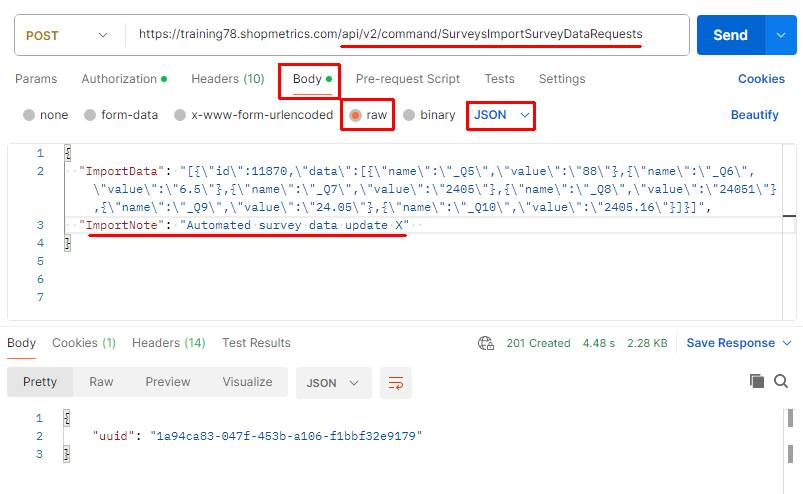

The Import Command Request generates a unique Request ID which will be used in Step 2:

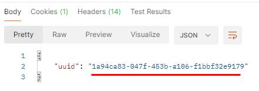

**Step 2** – copy the generated Request ID and use the **/Apps/SM/APIv2/Query/DomainModel/WorkflowExecutions** API query resource to check the status of the request.

The content for the “post” parameter in Body:

{"action":"exec","dataset":{"datasetname":"/Apps/SM/APIv2/Query/DomainModel/WorkflowExecutions"},"parameters":[{"name":"CommandRequestRecordID","value":"**1a94ca83-047f-453b-a106-f1bbf32e9179**"}]}

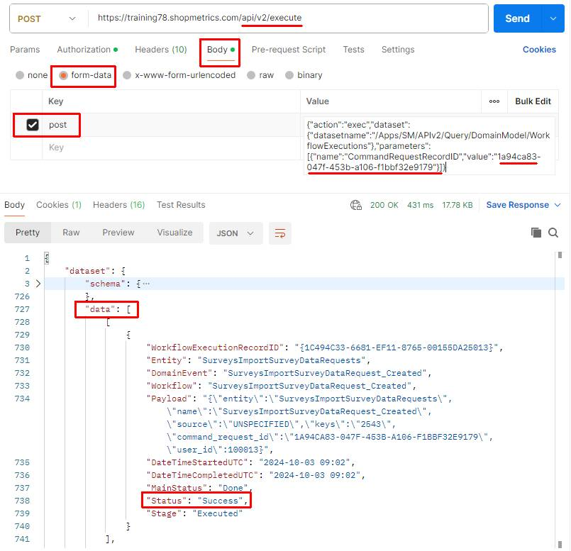

The "ImportNote" content is successfully recorded in the Survey History Event:

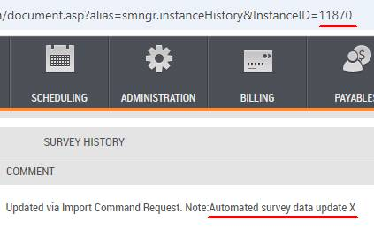

### Postman example – incorrectly formatted Import Data JSON

The example below illustrates the response of the Import Command request when an incorrectly formatted Import Data JSON is provided.

The content of the JSON formatted request:

{

  "ImportData": "[{\"id\":11874,\"data\":[{\"name\":\"\_Q5\",\"value\":\"10.5\"},{\"name\":\"\_Q6\",\"value\":\"6\"}]",

  "ImportNote": "Automated survey data update X"

}

Executing the Import Command request will return a Validation Error due to the incorrectly formatted Import Data JSON:

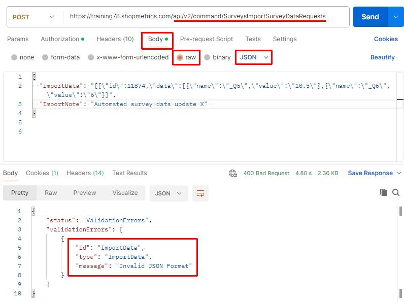

## Handling Partial Failure During Survey Data Import

**NOTE: The behavior described in this section does not apply when all of the following are true:**

- **IsAllowIncompleteImport = 1**
- **IsAllowIncompleteImportIfOkForClientAccess is 0 or not provided**
- **The request includes at least one survey instance the is “OK for Client View” and has validation errors**

**As a result, no survey instance data is imported for any survey instance in the request.**

When importing data into multiple surveys using a single Command Request to the endpoint **/api/v2/command/SurveysImportSurveyDataRequests**, it is possible to encounter *partial failures*. In other words, the request may still be accepted and a Request ID generated - even if the ImportData payload contains invalid information for one or more surveys.

**How Partial Failures Appear:**

1. **Request Accepted, ID Generated**  
   Despite having invalid survey data, the Command Request is often considered “executed successfully” in the sense that it generates a valid Request ID.
2. **Status Shows as Failed**When you later query the workflow execution status via **/Apps/SM/APIv2/Query/DomainModel/WorkflowExecutions**, you may see an overall status of **Failed**. However, the failure details will specifically list the problematic survey instance(s) and the reasons they failed.
3. **Valid Surveys Are Still Imported**  
   The failed surveys are skipped, but any surveys with valid data are imported successfully—ensuring that invalid fields or format issues in one survey do not block all imports.

**Recommended Actions for Handling Partial Failures:**

1. Check the Failure Details  
   Use the **/Apps/SM/APIv2/Query/DomainModel/WorkflowExecutions****response** to identify which surveys failed. Review the error messages to see why they were rejected.
2. Correct the Invalid Data  
   Based on the errors, fix any invalid fields or format problems in your payload.
3. Reimport Only the Failed Surveys  
   Once you have corrected the data, resend a new Command Request to **/api/v2/command/SurveysImportSurveyDataRequests**targeting only the previously failed surveys.

By following these steps, you can handle partial failures gracefully and ensure that valid data is imported, while quickly resolving any issues with invalid survey payloads.

### Postman Example

In the example below, data is imported into multiple survey instances in a single operation. One survey includes invalid data in the import payload, while all others contain valid data.

**Step 1** – executing the Import Command Request. The request is sent to the **following API endpoint**: **/api/v2/command/SurveysImportSurveyDataRequests**.

In this scenario, *survey instance 15144 contains invalid data*.

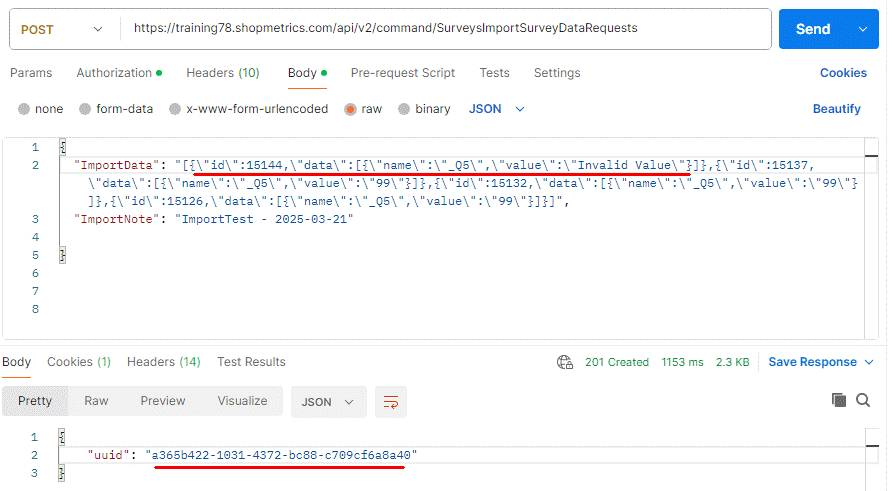

**Step 2** – copying the generated Request ID and using the **/Apps/SM/APIv2/Query/DomainModel/WorkflowExecutions**to check the status of the request.

The response shows the overall request status as **Failed**, and it specifically identifies survey instance **15144**as the one that failed - along with an error reason and descriptive message.

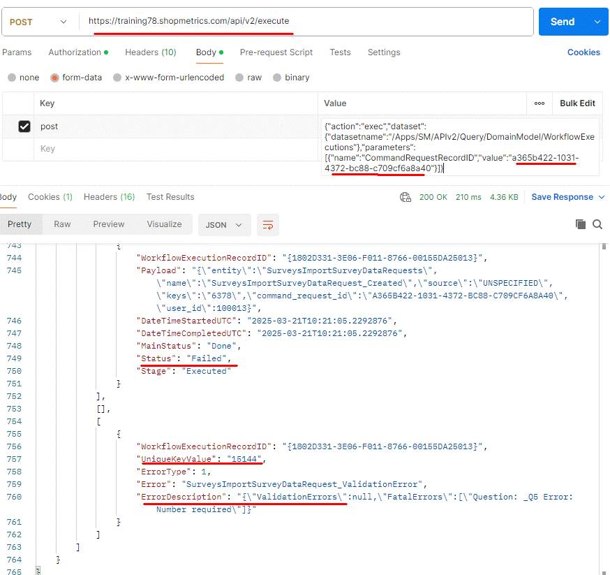

**As a result, the survey with invalid data is not updated, while all other surveys receive the imported data successfully.**

The value “99” imported into survey with no validation issues:

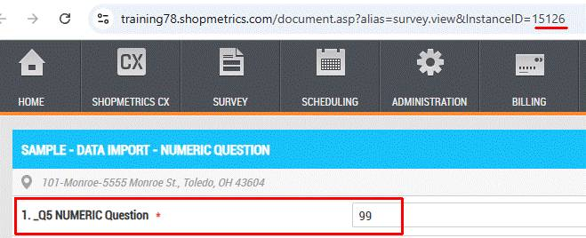

The invalid value (“Invalid Value”) for survey 15144 was not imported:

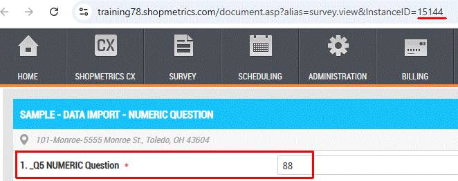

## Incomplete Survey Data Import

The example below demonstrates an incomplete survey data import using the IsAllowIncompleteImport and IsAllowIncompleteImportIfOkForClientAccess fields. The survey form used in this example has the following validation rules, as shown in “Extended Survey View”:

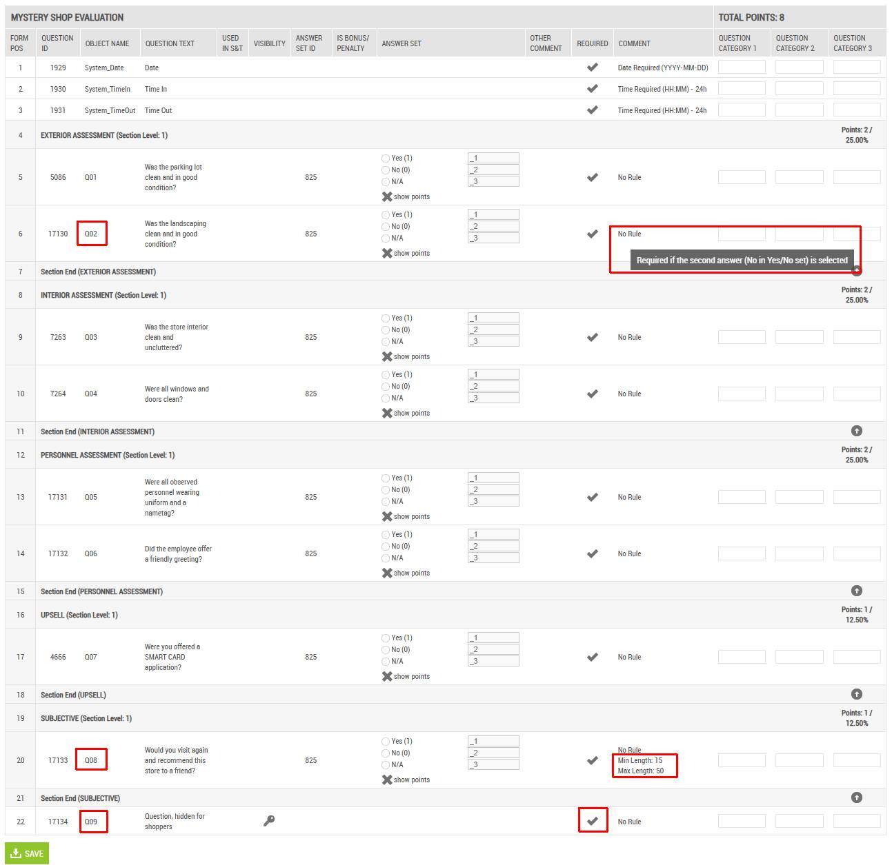

### Postman Example

In the example below, data is imported into multiple survey instances in a single operation. The import payload includes:

- Survey instance that is "OK for Client View" and incomplete survey data - ID:  74847
- Survey instance that is NOT "OK for Client View" and incomplete survey data - ID: 74848
- Survey instance with valid survey data - ID: 74846

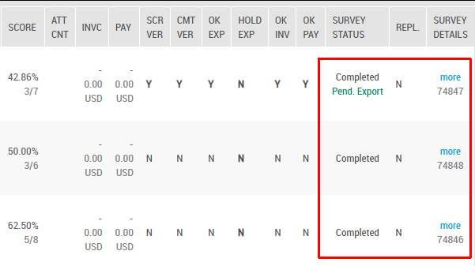

The payload for survey instance **74847** includes incomplete data for the following questions:

- Q02 - the second answer is selected, but the required comment is missing
- Q08 - the comment is shorter than the required minimum of 15 characters

The payload for survey instance **74848** includes incomplete data for the following questions:

- Q08 - comment length is greater than the maximum (50 characters)
- Q09 - the question is required but not answered and the payload contains no data for it

The content of the JSON formatted request:

{

  "ImportData": "[{\"id\":74847,\"data\":[{\"name\":\"Q02.\_2\",\"value\":true},{\"name\":\"Q08\",\"value\":\"Lorem ipsum\"}]},{\"id\":74848,\"data\":[{\"name\":\"Q08\",\"value\":\"Lorem ipsum dolor sit amet, consectetur adipiscing elit, sed do eiusmod tempor incididunt ut labore et dolore magna aliqua.\"}]},{\"id\":74846,\"data\":[{\"name\":\"Q08\",\"value\":\"Lorem ipsum dolor sit amet...\"},{\"name\":\"Q09\",\"value\":\"API imported comment\"}]}]",

  "IsAllowIncompleteImport": 1,

  "IsAllowIncompleteImportIfOkForClientAccess": 1,

  "ImportNote": "Automated survey data update X"

}

**Step 1** – executing the Import Command Request. The request is sent to the **following API endpoint: /api/v2/command/SurveysImportSurveyDataRequests**

The Import Command Request generates a unique Request ID which will be used in Step 2:

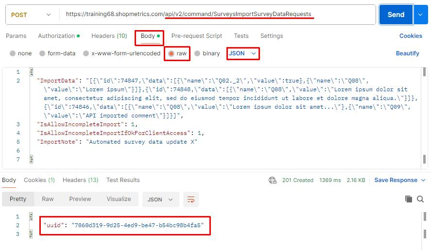

**Step 2** – using the generated Request ID and the **/Apps/SM/APIv2/Query/DomainModel/WorkflowExecutions** to check the status of the request.

The content for the “post” parameter in Body:

{"action":"exec","dataset":{"datasetname":"/Apps/SM/APIv2/Query/DomainModel/WorkflowExecutions"},"parameters":[{"name":"CommandRequestRecordID","value":"**7060d319-9d25-4ed9-be47-b54bc98b4fa5**"}]}

The overall status of the request is "Success" but any validation errors are still listed in the response:

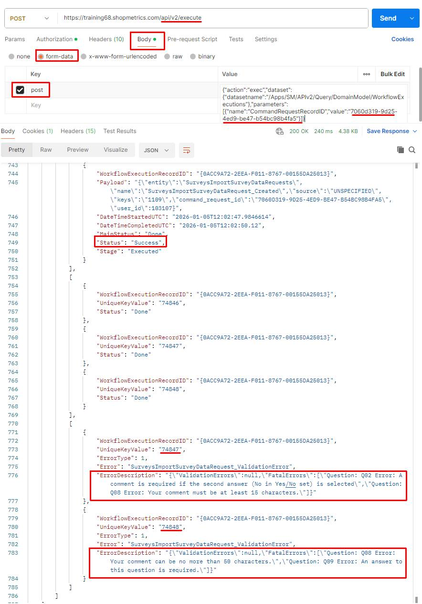

The data is successfully imported despite the validation errors:

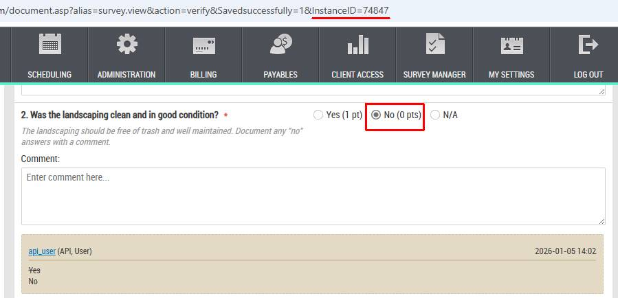

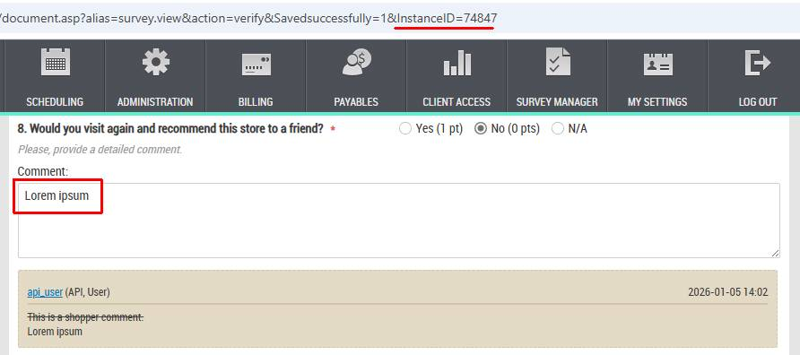

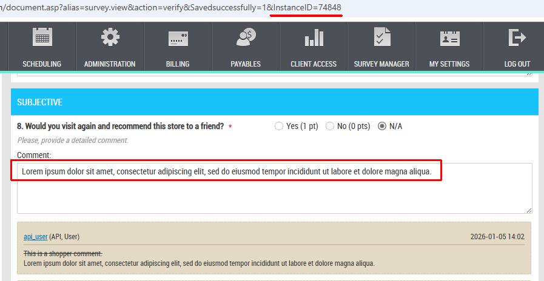
