# Use Case: Set Quality Control Attributes for Completed Jobs via Command API Request

Last Modified: 2026-04-14 | Code: APIQCRC

**NOTE: The Shopmetrics Command API outlined in this document is applicable only to survey instances that are in a "Completed"** **status and were created using V3 survey forms.**

This article explains how to use the Shopmetrics Command API to automate changes to key Quality Control (QC) job (survey instance) attributes through an asynchronous operation triggered by a Command Request.

Command Requests are submitted to a Command API endpoint, which returns only a Request ID. This ID can then be used with a Query API resource to check the request's status.

The command described here enables users to streamline the finalization and validation of completed jobs (survey instances). It can be used to marking jobs as ready for payment or billing, confirming the validation of score and comments, and routing jobs to the appropriate mailboxes for further review or processing.

## User Access Setup

To successfully use the command for modifying Quality Control attributes of completed jobs, the user must have the following security settings in the Shopmetrics system:

1. Be a member of the "Administrator - Restricted" security role.
2. Have access to the jobs (survey instances) whose quality control attributes will be modified.
3. Possess valid Client Credentials for API authorization

For more information about granting restricted access to the system refer to the article "Grant Restricted Access to the System" (short code: **GRAS**).

For more information about the Client Credentials and API Authorization you can refer to the article “API Authorization” (short code: **APIAUT**).

## Command Request Format

You can set Quality Control attributes by executing a command request to the **f****ollowing API endpoint**:

**/api/v2/command/JobSetJobQualityControlAttributesRequests**

The request should be written in the following JSON format:

{

  "ImportData": "*The data for the job(s) whose attributes need to be set or modified. The data should be formatted in a tab-separated format (for more information see the section “Import Data Format”)*",

  "ImportNote": "*A text, containing information for troubleshooting, tracing, or any additional details related to the command request.*"

}

### "ImportNote" field

The "ImportNote" field is a required component of the command request. It allows you to add troubleshooting, tracing, debugging, or other contextual information related to setting or modifying Quality Control attributes for completed jobs.

**Note that the value of the "ImportNote" field is restricted to 32 characters.**

When a request to set Quality Control attributes is successfully executed, a history event is created for each survey instance included in the "ImportData" field. This history event captures the "ImportNote" content, ensuring that all contextual information is logged and can be referenced later.

## Import Data Format

The job data for setting or modifying Quality Control attributes via the Command API Request should be formatted in a tab-separated format. The following separators should be used:

- A “new line” should be represented with **\n**.
- A “tab” should be represented with **\t**.

Below is an example of how job data might appear in an Excel worksheet, and how the same data would be formatted in a tab-separated format:

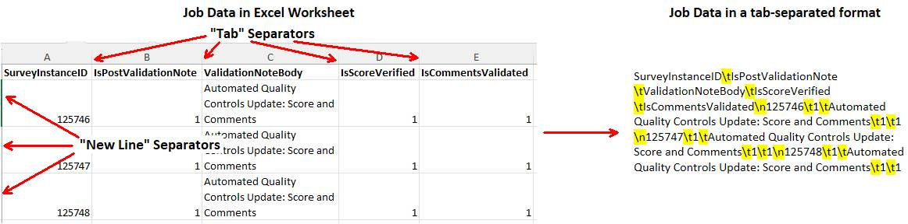

## Quality Control Attributes ImportData Fields

In the table below, you can find the object names and short descriptions of all Quality Control Attributes ImportData Fields that can be used when setting or modifying attributes for completed jobs:

| Field Object Name | Description | Is Required |
| --- | --- | --- |
| SurveyInstanceID | A **required**numeric identifier that uniquely identifies a job (survey instance). | **Yes** |
| IsPostValidationNote | A **required** field that specifies whether a post-validation note is included for the survey instance. You can specify one of the following values:   - 0 - no post-validation note is included. - 1 - a post-validation note is included. | **Yes** |
| ValidationNoteBody | Specifies the content of the validation note for the survey instance. You can specify one of the following values:   - **No value** (leave blank)   - **Should be used only when IsPostValidationNote is set to "0"** - **A text for the validation note**   - **Should be used only when IsPostValidationNote is set to "1"** | **Yes, only if IsPostValidationNote is set to 1** |
| Mailbox | A valid mailbox (shared or personal) existing in the system | No |
| IsScoreVerified | Controls the **Score Verified** attribute. You can specify one of the following values:   - 0 - Score Verified will be set to 'No' - 1 - Score Verified will be set to 'Yes'   If no value is provided, the QC attribute will not be modified. | No |
| IsCommentsValidated | Controls the **Comments Validated** attribute. You can specify one of the following values:   - 0 - Comments Validated will be set to 'No' - 1 - Comments Validated will be set to 'Yes'   If no value is provided, the QC attribute will not be modified. | No |
| IsHoldExport | Controls the **Hold Export** attribute. You can specify one of the following values:   - 0 - Hold Export will be set to 'No' - 1 - Hold Export will be set to 'Yes'   If no value is provided, the QC attribute will not be modified. | No |
| HoldExportStatus | Specifies a status when **Hold Export** **is** **set to "Yes"**.  When setting a value for **HoldExportStatus** the following conditions apply:   - **No value** (leave blank):   - If the **Hold Export** attribute is set to "**No**" no Hold Export status will be set.   - If the **Hold Export** attribute is set to "**Yes**" the default Hold Export status will be applied. - **A valid SurveyStatusIdentifier** (e.g. HOLD.GENERAL):   - **Can be used only** when the **Hold Export** attribute is set to "**Yes**". | No |
| IsOkForInvoice | Controls the **OK for Invoice** attribute. You can specify one of the following values:   - 0 - OK for Invoice will be set to 'No' **NOTE: This value can be used only for Survey Instances not already on an Invoice (Billing Statement).** - 1 - OK for Invoice will be set to 'Yes'   If no value is provided, the QC attribute will not be modified. | No |
| IsHoldInvoice | Controls the **Hold Invoice** attribute. You can specify one of the following values:   - 0 - Hold Invoice will be set to 'No' - 1 - Hold Invoice will be set to 'Yes' **NOTE: This value can be used only for Survey Instances not already on an Invoice (Billing Statement).**   If no value is provided, the QC attribute will not be modified. | No |
| IsOkForPay | Controls the **OK for Payroll** attribute. You can specify one of the following values:   - 0 - OK for Payroll will be set to 'No' **NOTE: This value can be used only for Survey Instances not already on a Pay Statement.** - 1 - OK for Payroll will be set to 'Yes'   If no value is provided, the QC attribute will not be modified. | No |
| IsHoldPay | Controls the **Hold Payroll** attribute. You can specify one of the following values:   - 0 - Hold Payroll will be set to 'No' - 1 - Hold Payroll will be set to 'Yes' **NOTE: This value can be used only for Survey Instances not already on a Pay Statement**.   If no value is provided, the QC attribute will not be modified. | No |
| IsSkipValidationRoutingAndMoveToClientOK | Determines whether validation routing should be skipped in multi-step validation scenarios for a survey instance. You can specify one of the following values:   - 0 - validation routing will **not** be skipped - 1 - validation routing **will** be skipped **NOTE: This value is applicable only for Survey Instances with the following quality control attributes configuration:**   - **IsScoreVerified = 1**   - **IsCommentsValidated = 1**   - **IsHoldExport = 0** | No |
| ClientAccessStatus | Specifies the client access status for the survey instance. You can set one of the following values:   - Hide from Reports; Hide from Client Survey Explorer - Hide from Reports; OK for Client Survey Explorer - OK for Client Access - OK for Reports; Hide from Client Survey Explorer | No |

## 

## Set Quality Control Attributes

The process of setting Quality Control Attributes includes the following steps:

1. Executing the Shopmetrics Command Request which generates a Request ID
2. Using the generated Request ID to check the status of the request. This is done via the  /Apps/SM/APIv2/Query/DomainModel/WorkflowExecutions query API resource

### Postman Example

In the example below the Shopmetrics Command API Request will be used for setting the following Quality Control attributes of completed jobs (survey instances):

- Score Verified
- Comments Validated
- Validation Note
- Validation Note Text

The following jobs are in a "**Completed**" status with "**Score Verified**" and "**Comments Validated**" set to "**No**":

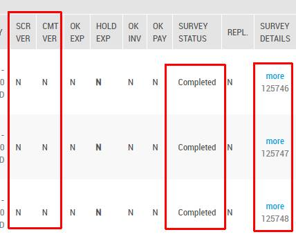

The content of the JSON formatted request:

{

 "ImportData":"SurveyInstanceID\tIsPostValidationNote\tValidationNoteBody\tIsScoreVerified\tIsCommentsValidated\n125746\t1\tAutomated Quality Controls Update: Score and Comments\t1\t1\n125747\t1\tAutomated Quality Controls Update: Score and Comments\t1\t1\n125748\t1\tAutomated Quality Controls Update: Score and Comments\t1\t1",  
"ImportNote": "Automated Quality Control"

}

**Step 1** – execute the Command API Request. The request should be sent to the **following API endpoint**:  
**/api/v2/command/JobSetJobQualityControlAttributesRequests**

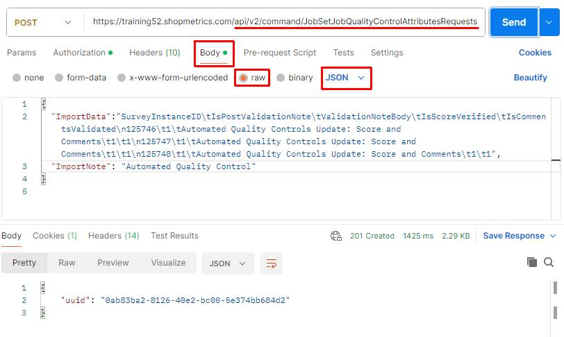

The Command API Request generates a unique Request ID which will be used in Step 2:

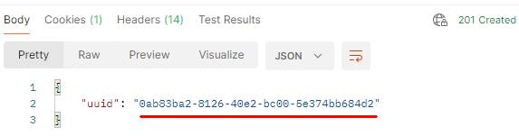

**Step 2** – copy the generated Request ID and use the **/Apps/SM/APIv2/Query/DomainModel/WorkflowExecutions** API query resource to check the status of the request.

The content for the “post” parameter in Body:

{"action":"exec","dataset":{"datasetname":"/Apps/SM/APIv2/Query/DomainModel/WorkflowExecutions"},"parameters":[{"name":"CommandRequestRecordID","value":"**0ab83ba2-8126-40e2-bc00-5e374bb684d2**"}]}

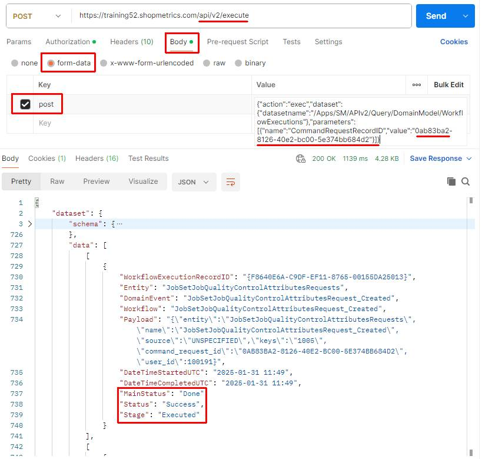

The result in Survey Explorer:

- "Score Verified" is set to "Yes" for all jobs specified in the Command API Request
- "Comments Validated" is set to "Yes" for all jobs specified in the Command API Request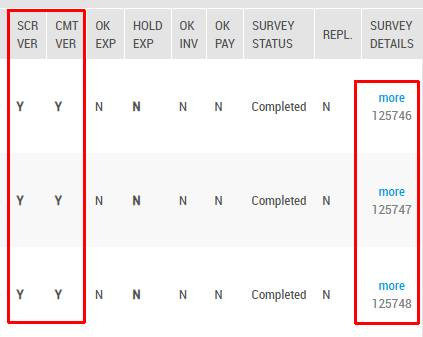

A **Validation Note** **is added to each job** (survey instance) specified in the Command API Request (*for more information about the Validation Notes you can refer to the article “Validation History” (short code: **VALH**)*):

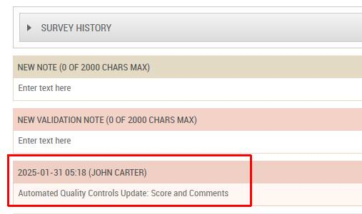

## Validation Errors Overview

In the following table, you will find a list of possible validation errors that may occur when using the Shopmetrics Command API to set Quality Control attributes, along with their corresponding descriptions and guidance for resolution.

The placeholder *{RowNumber}* indicates the position of a specific row in "ImportData" that contains an error. If errors are detected when you submit a request, it is replaced with the actual row number, allowing you to quickly identify the problematic entry. The Command Request returns validation errors for each affected row, helping you efficiently locate and correct any invalid or conflicting data.

| Validation Error ID | Validation Message | Description |
| --- | --- | --- |
| HoldExportStatus | *{RowNumber}* - Survey instance status does not exist | The specified HoldExportStatus is not recognized in the system. Verify that a correct status value is being provided. |
| ValidationNoteBody | *{RowNumber}* - Missing ValidationNoteBody | A ValidationNoteBody is required when IsPostValidationNote is set to 1. Ensure that a valid note is provided before proceeding. |
| SurveyInstanceID | *{RowNumber}* - No Access to SurveyInstanceID | The user executing the request does not have the necessary security permissions in the Shopmetrics system to access the specified SurveyInstanceID. (*For more details on user access setup, refer to the 'User Access Setup' section.*) |
| SurveyInstanceID | *{RowNumber}* - Survey Instance is already in Billing Statement | This error occurs when the  job is part of a Billing Statement and the Command Request attempts to set IsOkForInvoice to 0 and/or isHoldInvoice to 1.  These specific modifications are not allowed for jobs (survey instances) already included in a Billing Statement. |
| SurveyInstanceID | *{RowNumber}* - Survey Instance is already in Pay Statement | This error occurs when the job is part of a Pay Statement and the Command Request attempts to set IsOkForPay to 0 and/or IsHoldPay to 1.  These specific modifications are not allowed for jobs (survey instances) already included in a Pay Statement. |
| Status | *{RowNumber}* - Invalid Survey Status. Survey Instance should be in "Completed" status | The job (survey instance) is in a status other than "Completed", which prevents the Command Request execution. |

## 

## Example: Import Multiline Validation Note

In you need to import a validation note text that contains multiple lines, each new line should be denoted with **\\n**.

### Postman Example

The following example demonstrates how to import a validation note that includes multiline text.

The content of the JSON formatted request:

{

  "ImportData":"SurveyInstanceID\t**ValidationNoteBody**\tIsPostValidationNote\n125737\t**Validation Note Line 1\\nValidation Note Line 2\\nValidation Note Line 3**\t1",

 "ImportNote": "Multiline ValidationNote Example"

}

**Step 1** – execute the Command API Request. The request should be sent to the **following API endpoint**:

**/api/v2/command/JobSetJobQualityControlAttributesRequests**

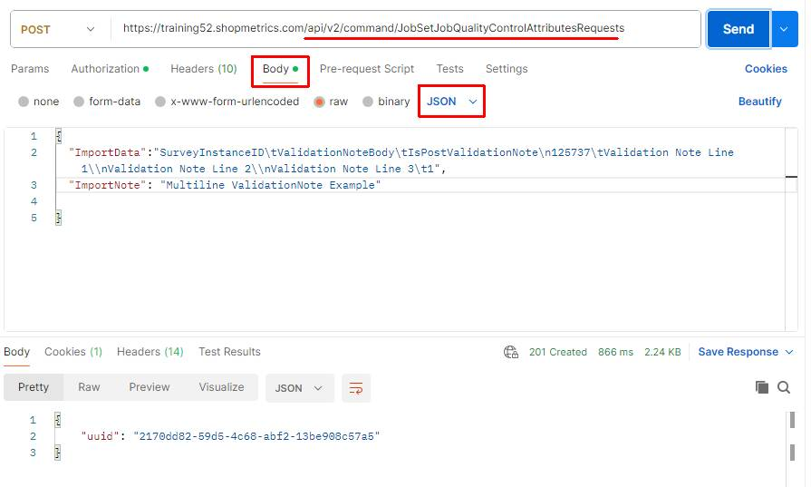

The Command API Request generates a unique Request ID which will be used in Step 2:

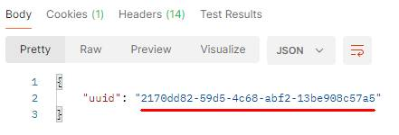

**Step 2** – copy the generated Request ID and use the **/Apps/SM/APIv2/Query/DomainModel/WorkflowExecutions** API query resource to check the status of the request.

The content for the “post” parameter in Body:

{"action":"exec","dataset":{"datasetname":"/Apps/SM/APIv2/Query/DomainModel/WorkflowExecutions"},"parameters":[{"name":"CommandRequestRecordID","value":"**2170dd82-59d5-4c68-abf2-13be908c57a5**"}]}

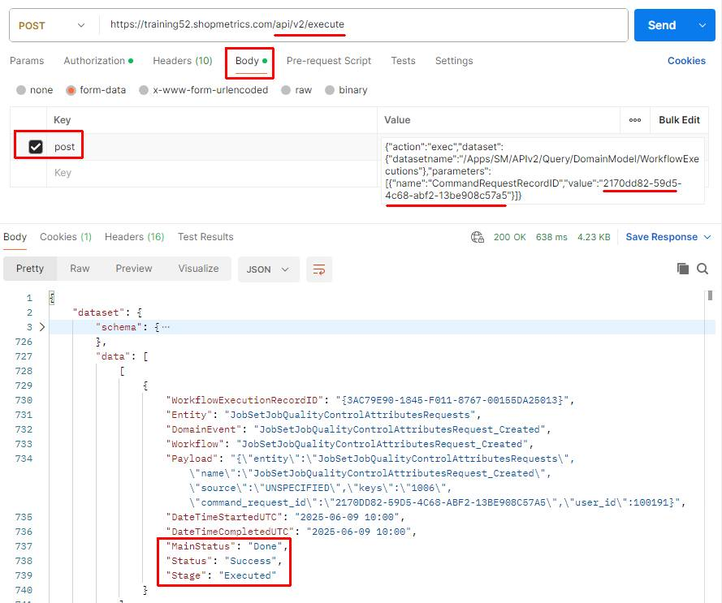

The result validation note with multiline text:

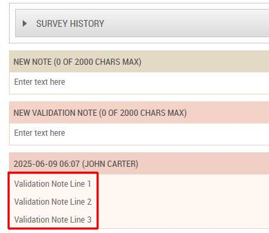
