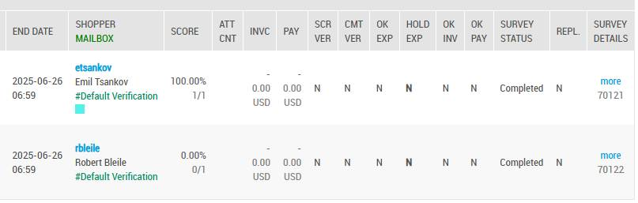
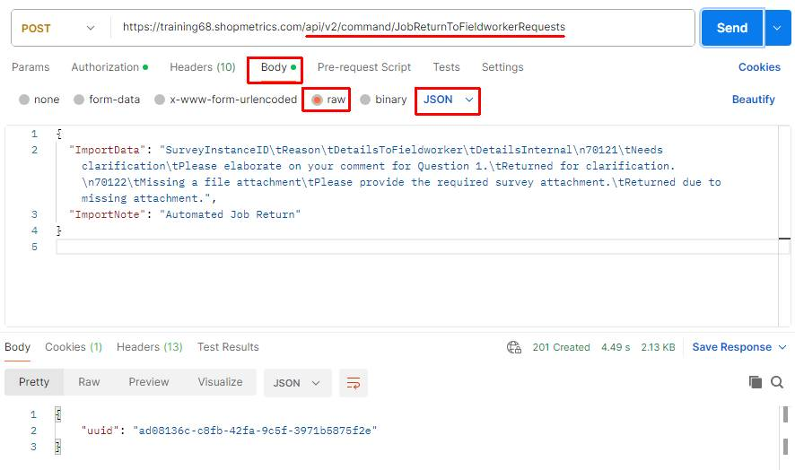
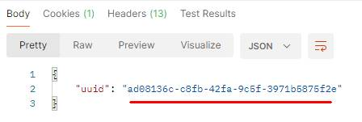
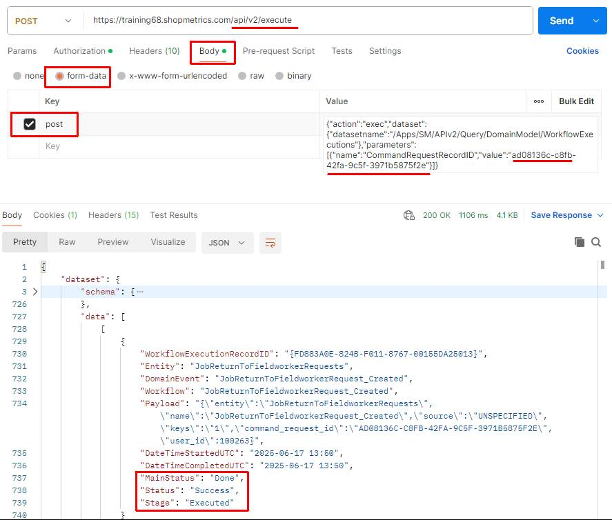
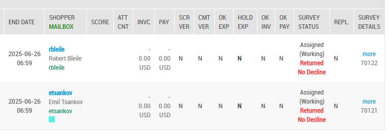

# Use Case: Return Jobs to Fieldworkers via Command API Request

Last Modified: 2025-06-17 | Code: APIRJCR

**NOTE: The Shopmetrics Command API described in this document is applicable only to survey instances (jobs) created with V3 survey forms that are in a "Completed" status.**

This article explains how to use the Shopmetrics Command API to automate returning jobs (survey instances) to fieldworkers. The process is initiated by submitting a Command Request, which triggers an asynchronous operation.

Command Requests are submitted to a Command API endpoint, which returns only a Request ID. This ID can then be used with a Query API resource to check the request status.

The command described in this article makes it easy to return completed jobs to fieldworkers, reducing manual effort and keeping rework consistent across projects.

## User Access Setup

To successfully use the command for returning jobs to fieldworkers, the user must have the following security settings in the Shopmetrics system:

1. Be a member of the "**Administrator - Restricted**" security role.
2. Have access to the survey instances that need to be returned.
3. Possess valid **Client Credentials** for API authorization.

For more information about granting restricted access to the system refer to the article "Grant Restricted Access to the System" (short code: **GRAS**).

For more information about the Client Credentials and API Authorization you can refer to the article “API Authorization” (short code: **APIAUT**).

## Command Request Format

You can return jobs to fieldworkers by executing a command request to the following API endpoint:

**/api/v2/command/JobReturnToFieldworkerRequests**

The request should be written in the following JSON format:

{  
  "ImportData": "*The data for the job(s) that need to be returned to their fieldworkers. The data should be formatted in a tab-separated format (for more information see the section “Import Data Format”*)",

  "ImportNote": "*A text containing information for troubleshooting, tracing, or any additional details related to the return request.*"  
}

### "ImportNote" field

**NOTE: This filed is a required component of the command request**.

The "ImportNote" field is a required component of the command request. It allows you to add troubleshooting, tracing, debugging, or other contextual information related to returning jobs to fieldworkers.

**Note that the value of the "ImportNote" field is restricted to 32 characters.**

When a request to return jobs to fieldworkers is successfully executed, a history event is created for each survey instance included in the "ImportData" field. This history event captures the "ImportNote" content, ensuring that all contextual information is logged and can be referenced later.

## Import Data Format

The data for returning jobs to fieldworkers via the Command API Request should be formatted in a tab-separated format. The following separators should be used:

- A “**new line**” should be represented with **\n**.
- A “**tab**” should be represented with **\t**.

## Return Jobs to Fieldworkers Import Data Fields

In the table below, you can find the object names and short descriptions of all Import Data Fields that can be used when returning jobs to fieldworkers:

| Field Object Name | Description | Is Required |
| --- | --- | --- |
| SurveyInstanceID | A **required** numeric identifier that uniquely identifies a survey instance. | **Yes** |
| Reason | A **required** field for specifying the reason for the job return. | **Yes** |
| DetailsToFieldworker | A comment for the job return. The value provided for this field will be visible to the shopper and the validators. **This field is required**. | **Yes** |
| DetailsInternal | A comment for the job return that will be visible to the validators with  access to the returned survey. **This field is required.** | **Yes** |
| IsMoveToLastValidatorOnSubmit | Specifies if the job should to be moved to the last Validator Mailbox on re-submit. You can set one of the following values:   - 0 - the job will be processed as normal on re-submit - 1 - the job will be moved to the last Validator mailbox on re-submit   If not provided the default value for this field is '0'. | No |
| DueDateTimeUTC | New due date/time for the survey instance. ISO format is expected in either of the following formats:   - A date-only (YYYY-MM-DD) format - A date-time format (YYYY-MM-DD HH:MM) | No |
| EndDateTimeUTC | New end date/time for the survey instance. ISO format is expected in either of the following formats:   - A date-only (YYYY-MM-DD) format - A date-time format (YYYY-MM-DD HH:MM) | No |

## Return Jobs to Fieldworkers

The process of returning jobs to fieldworkers includes the following steps:

1. Executing the Shopmetrics Command Request which generates a Request ID
2. Using the generated Request ID to check the status of the request. This is done via the **/Apps/SM/APIv2/Query/DomainModel/WorkflowExecutions** query API resource

### Postman Example

The example below demonstrates the process of returning jobs to fieldworkers using the Shopmetrics Command API.

The following jobs are submitted by fieldworkers:



The content of the JSON formatted request:

```
{
  "ImportData": "SurveyInstanceID\tReason\tDetailsToFieldworker\tDetailsInternal\n70121\tNeeds clarification\tPlease elaborate on your comment for Question 1.\tReturned for clarification.\n70122\tMissing a file attachment\tPlease provide the required survey attachment.\tReturned due to missing attachment.",
  "ImportNote": "Automated Job Return"
}
```

**Step 1** – execute the Import Command Request. The request should be sent to the following API endpoint:

**/api/v2/command/JobReturnToFieldworkerRequests**



The Import Command Request generates a unique Request ID which will be used in Step 2:



**Step 2** – copy the generated Request ID and use the /Apps/SM/APIv2/Query/DomainModel/WorkflowExecutions API query resource to check the status of the request.

The content for the “post” parameter in Body:

{"action":"exec","dataset":{"datasetname":"/Apps/SM/APIv2/Query/DomainModel/WorkflowExecutions"},"parameters":[{"name":"CommandRequestRecordID","value":"**ad08136c-c8fb-42fa-9c5f-3971b5875f2e**"}]}



The jobs are successfully returned to the fieldworkers:


